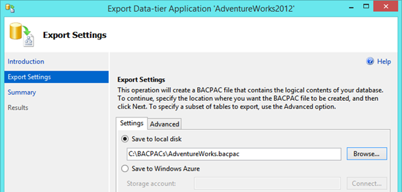

<properties
    pageTitle="SSMS：将数据库导出到 BACPAC 文件 (Azure) | Azure"
    description="本文说明如何使用 SQL Server Management Studio 中的“导出数据层应用程序”向导将 SQL Server 数据库导出到 BACPAC 文件。"
    keywords="Azure SQL 数据库, 数据库迁移, 导出数据库, 导出 BACPAC 文件, 导出数据层应用程序向导"
    services="sql-database"
    documentationcenter=""
    author="CarlRabeler"
    manager="jhubbard"
    editor="" />
<tags
    ms.assetid="19c2dab4-81a6-411d-b08a-0ef79b90fbce"
    ms.service="sql-database"
    ms.custom="migrate and move"
    ms.devlang="NA"
    ms.topic="article"
    ms.tgt_pltfrm="NA"
    ms.workload="sqldb-migrate"
    ms.date="02/07/2017"
    wacn.date="03/24/2017"
    ms.author="carlrab" />  

# 使用 SQL Server Management Studio 将 Azure SQL 数据库或 SQL Server 数据库导出到 BACPAC 文件		
		
本文说明如何使用 SQL Server Management Studio 中的“导出数据层应用程序”向导将 Azure SQL 数据库或 SQL Server 数据库导出到 [BACPAC](https://msdn.microsoft.com/zh-cn/library/ee210546.aspx#Anchor_4) 文件。如需大致了解如何导出到 BACPAC 文件，请参阅[导出到 BACPAC](/documentation/articles/sql-database-export/)。
		
1. 确认你安装了最新版本的 SQL Server Management Studio。Management Studio 的新版本将每月更新一次，以与 Azure 门户的更新保持同步。
   		
    > [AZURE.IMPORTANT]		
    >建议始终使用最新版本的 Management Studio 以与 Azure 和 SQL 数据库的更新保持同步。[最新版本的 SSMS](https://msdn.microsoft.com/zh-cn/library/mt238290.aspx)。
    > 		
 		
2. 打开 Management Studio 并连接到你在对象资源管理器中的源数据库。
    		
     
3. 右键单击对象资源管理器中的源数据库、指向“任务”，然后单击“导出数据层应用程序...”
    		
     
4. 在导出向导中，配置导出以将 BACPAC 文件保存到本地磁盘位置或 Azure Blob。导出的 BACPAC 始终包括完整的数据库架构，默认情况下还包括所有表中的数据。若要排除部分或全部表中的数据，请使用“高级”选项卡。例如，你可以选择仅导出引用表的数据，而不是导出所有表中的数据。
 		
       

 		
    > [AZURE.IMPORTANT]		
    >将 BACPAC 导出到 Azure Blob 存储时，请使用标准存储。不支持从高级存储导入 BACPAC。
    >		
    		
## 后续步骤		
* [最新版本的 SSMS](https://msdn.microsoft.com/zh-cn/library/mt238290.aspx)
* 若要了解如何将 BACPAC 导入到 SQL Server 数据库，请参阅[将 BACPCAC 导入 SQL Server 数据库](https://msdn.microsoft.com/zh-cn/library/hh710052.aspx)
* 如需 SQL Server 数据库完整迁移过程的介绍（包括性能建议），请参阅[将 SQL Server 数据库迁移到 Azure SQL 数据库](/documentation/articles/sql-database-cloud-migrate/)。

	

<!---HONumber=Mooncake_0320_2017-->