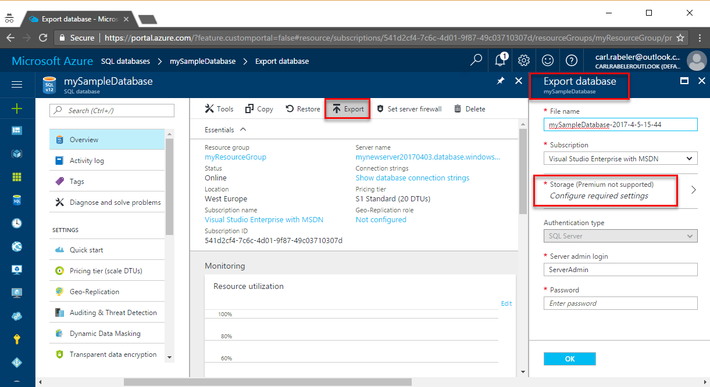

<properties
    pageTitle="将 Azure SQL 数据库导出到 BACPAC 文件 | Azure"
    description="使用 Azure 门户将 Azure SQL 数据库导出到 BACPAC 文件"
    services="sql-database"
    documentationcenter=""
    author="CarlRabeler"
    manager="jhubbard"
    editor="" />
<tags
    ms.assetid="41d63a97-37db-4e40-b652-77c2fd1c09b7"
    ms.service="sql-database"
    ms.custom="move data"
    ms.devlang="NA"
    ms.date="04/05/2017"
    wacn.date="05/22/2017"
    ms.author="carlrab"
    ms.workload="data-management"
    ms.topic="article"
    ms.tgt_pltfrm="NA"
    ms.translationtype="Human Translation"
    ms.sourcegitcommit="8fd60f0e1095add1bff99de28a0b65a8662ce661"
    ms.openlocfilehash="9a9db93ba77884ad015414839a2a9f74c7f2b9c5"
    ms.contentlocale="zh-cn"
    ms.lasthandoff="05/12/2017" />

# 将 Azure SQL 数据库导出到 BACPAC 文件

本文讨论如何将 Azure SQL 数据库导出到 [BACPAC](https://msdn.microsoft.com/zh-cn/library/ee210546.aspx#Anchor_4) 文件。 本文讨论如何使用以下方法进行导出：

- [Azure 门户](https://portal.azure.cn)
- [SqlPackage](https://msdn.microsoft.com/zh-cn/library/hh550080.aspx) 命令行实用工具
- [New-AzureRmSqlDatabaseExport](https://docs.microsoft.com/zh-cn/powershell/resourcemanager/azurerm.sql/v2.7.0/new-azurermsqldatabaseexport) cmdlet
- [SQL Server Management Studio](https://msdn.microsoft.com/zh-cn/library/ms174173.aspx) 中的[导出数据层应用程序](https://docs.microsoft.com/sql/relational-databases/data-tier-applications/export-a-data-tier-application)向导。

## 概述

需要导出数据库以便将其存档或移至其他平台时，可以将数据库架构和数据导出到 BACPAC 文件。 BACPAC 文件是一个扩展名为 BACPAC 的 ZIP 文件，它包含来自 SQL Server 数据库的元数据和数据。 可将 BACPAC 文件存储在 Azure blob 存储中或存储在本地位置的本地存储中，之后可以导入回 Azure SQL 数据库或 SQL Server 本地安装。 

> [AZURE.IMPORTANT]
> 如果将从 SQL Server 中导出作为迁移到 Azure SQL 数据库的准备，请参阅[将 SQL Server 数据库迁移到 Azure SQL 数据库](/documentation/articles/sql-database-cloud-migrate/)。
> 

## 注意事项

* 为保证导出的事务处理方式一致，必须确保导出期间未发生写入活动，或者正在从 Azure SQL 数据库的[事务处理方式一致性副本](/documentation/articles/sql-database-copy/)中导出。
* 如果是导出到 Blob 存储，则 BACPAC 文件的最大大小为 200 GB。 若要存档更大的 BACPAC 文件，请导出到本地存储。
* 不支持使用本文所述方法将 BACPAC 文件导出到 Azure 高级存储。
* 如果从 Azure SQL 数据库进行的导出操作超过 20 个小时，系统可能会取消该操作。 为提高导出过程中的性能，你可以进行如下操作：
  * 暂时提高服务级别。
  * 在导出期间终止所有读取和写入活动。
  * 对所有大型表上的非 null 值使用[聚集索引](https://msdn.microsoft.com/zh-cn/library/ms190457.aspx)。 如果不使用聚集索引，当时间超过 6-12 个小时时，导出可能会失败。 这是因为导出服务需要完成表格扫描，才能尝试导出整个表格。 确认表是否针对导出进行优化的一个好方法是，运行 **DBCC SHOW_STATISTICS** 并确保 *RANGE_HI_KEY* 不是 null 并且值分布良好。 有关详细信息，请参阅 [DBCC SHOW_STATISTICS](https://msdn.microsoft.com/zh-cn/library/ms174384.aspx)。

> [AZURE.NOTE]
> BACPAC 不能用于备份和还原操作。 Azure SQL 数据库会自动为每个用户数据库创建备份。 有关详细信息，请参阅[业务连续性概述](/documentation/articles/sql-database-business-continuity/)和 [SQL 数据库备份](/documentation/articles/sql-database-automated-backups/)。  
> 

## Azure 门户

若要使用 Azure 门户导出数据库，请打开数据库页，并在工具栏上单击“导出”。 指定 *.bacpac 文件名，为导出提供 Azure 存储帐户和容器，并提供用于连接到源数据库的凭据。  

   

若要监视导出操作的进度，请打开包含所导出数据库的逻辑服务器的相应页面。 向下滚动到“操作”，然后单击“导入/导出”历史记录。

## SQLPackage 实用程序

若要使用 [SqlPackage](https://msdn.microsoft.com/zh-cn/library/hh550080.aspx) 命令行实用工具导出 SQL 数据库，请参阅[导出参数和属性](https://msdn.microsoft.com/zh-cn/library/hh550080.aspx)。 SQLPackage 实用工具附带最新版本的 [SQL Server Management Studio](https://msdn.microsoft.com/zh-cn/library/mt238290.aspx) 和[用于 Visual Studio 的 SQL Server Data Tools](https://msdn.microsoft.com/zh-cn/library/mt204009.aspx)，也可以直接从 Microsoft 下载中心下载最新版本的 [SqlPackage](https://www.microsoft.com/download/details.aspx?id=53876)。

在大多数生产环境中，建议使用 SQLPackage 实用工具来实现缩放和性能。 如需 SQL Server 客户顾问团队编写的有关使用 BACPAC 文件进行迁移的博客，请参阅 [使用 BACPAC 文件从 SQL Server 迁移到 Azure SQL 数据库](https://blogs.msdn.microsoft.com/sqlcat/2016/10/20/migrating-from-sql-server-to-azure-sql-database-using-bacpac-files/)。

## SQL Server Management Studio

SQL Server Management Studio 的最新版本也提供一个向导，可将 Azure SQL 数据库导出到 bacpac 文件。 请参阅[导出数据层应用程序](https://docs.microsoft.com/sql/relational-databases/data-tier-applications/export-a-data-tier-application)。

## PowerShell

使用 [New-AzureRmSqlDatabaseImport](https://docs.microsoft.com/zh-cn/powershell/resourcemanager/azurerm.sql/v2.7.0/new-azurermsqldatabaseexport) cmdlet 向 Azure SQL 数据库服务提交导出数据库请求。 根据数据库的大小，导出操作可能需要一些时间才能完成。

     $exportRequest = New-AzureRmSqlDatabaseExport -ResourceGroupName $ResourceGroupName -ServerName $ServerName `
       -DatabaseName $DatabaseName -StorageKeytype $StorageKeytype -StorageKey $StorageKey -StorageUri $BacpacUri `
       -AdministratorLogin $creds.UserName -AdministratorLoginPassword $creds.Password

若要检查导出请求的状态，请使用 [Get-AzureRmSqlDatabaseImportExportStatus](https://docs.microsoft.com/zh-cn/powershell/resourcemanager/azurerm.sql/v2.7.0/get-azurermsqldatabaseimportexportstatus) cmdlet。 如果在提交请求后立即运行此命令，通常会返回“状态: 正在进行”。 显示“状态: 成功”  时，表示导出完毕。

    $importStatus = Get-AzureRmSqlDatabaseImportExportStatus -OperationStatusLink $importRequest.OperationStatusLink
    [Console]::Write("Exporting")
    while ($importStatus.Status -eq "InProgress")
    {
        $importStatus = Get-AzureRmSqlDatabaseImportExportStatus -OperationStatusLink $importRequest.OperationStatusLink
        [Console]::Write(".")
        Start-Sleep -s 10
    }
    [Console]::WriteLine("")
    $importStatus

### 导出 SQL 数据库示例
下面的示例将现有 Azure SQL 数据库导出到 BACPAC，然后说明如何查看导出操作的状态。

若要运行示例，需将几个变量替换为数据库和存储帐户中的特定值。 在 [Azure 门户](https://portal.azure.cn)中，浏览存储帐户，以获取存储帐户名称、blob 容器名称和密钥值。 可单击存储帐户边栏选项卡上的“访问密钥”  查找密钥。

将以下 `VARIABLE-VALUES` 替换为特定 Azure 资源中的值。 数据库名称就是要导出的现有数据库。

    $subscriptionId = "YOUR AZURE SUBSCRIPTION ID"

    Login-AzureRmAccount -EnvironmentName AzureChinaCloud
    Set-AzureRmContext -SubscriptionId $subscriptionId

    # Database to export
    $DatabaseName = "DATABASE-NAME"
    $ResourceGroupName = "RESOURCE-GROUP-NAME"
    $ServerName = "SERVER-NAME
    $serverAdmin = "ADMIN-NAME"
    $serverPassword = "ADMIN-PASSWORD" 
    $securePassword = ConvertTo-SecureString -String $serverPassword -AsPlainText -Force
    $creds = New-Object -TypeName System.Management.Automation.PSCredential -ArgumentList $serverAdmin, $securePassword

    # Generate a unique filename for the BACPAC
    $bacpacFilename = $DatabaseName + (Get-Date).ToString("yyyyMMddHHmm") + ".bacpac"

    # Storage account info for the BACPAC
    $BaseStorageUri = "https://STORAGE-NAME.blob.core.chinacloudapi.cn/BLOB-CONTAINER-NAME/"
    $BacpacUri = $BaseStorageUri + $bacpacFilename
    $StorageKeytype = "StorageAccessKey"
    $StorageKey = "YOUR STORAGE KEY"

    $exportRequest = New-AzureRmSqlDatabaseExport -ResourceGroupName $ResourceGroupName -ServerName $ServerName `
      -DatabaseName $DatabaseName -StorageKeytype $StorageKeytype -StorageKey $StorageKey -StorageUri $BacpacUri `
      -AdministratorLogin $creds.UserName -AdministratorLoginPassword $creds.Password

    $exportRequest

    # Check status of the export
    Get-AzureRmSqlDatabaseImportExportStatus -OperationStatusLink $exportRequest.OperationStatusLink

## 后续步骤

* 如需 SQL Server 客户顾问团队编写的有关使用 BACPAC 文件进行迁移的博客，请参阅 [使用 BACPAC 文件从 SQL Server 迁移到 Azure SQL 数据库](https://blogs.msdn.microsoft.com/sqlcat/2016/10/20/migrating-from-sql-server-to-azure-sql-database-using-bacpac-files/)。
* 若要了解如何将 BACPAC 导入到 SQL Server 数据库，请参阅[将 BACPCAC 导入到 SQL Server 数据库](https://msdn.microsoft.com/zh-cn/library/hh710052.aspx)。
* 若要了解如何从 SQL Server 数据库导出 BACPAC，请参阅[导出数据层应用程序](https://docs.microsoft.com/sql/relational-databases/data-tier-applications/export-a-data-tier-application)和[迁移第一个数据库](/documentation/articles/sql-database-migrate-your-sql-server-database/)。
<!--Update_Description:move selector to the beginning;add detailed sample for exporting a database;add anchors to subtitles-->