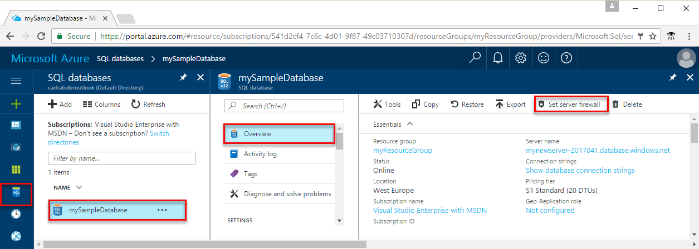
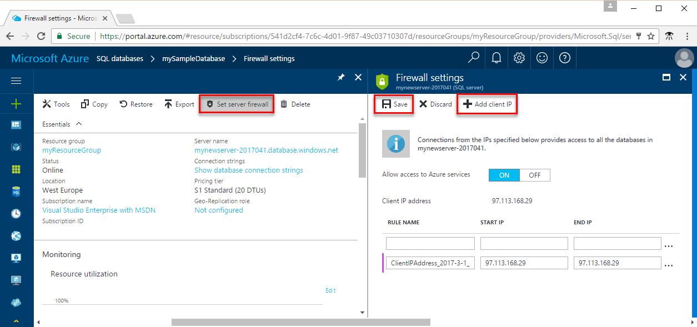

<properties
    pageTitle="Azure SQL 数据库防火墙规则 | Azure"
    description="了解如何配置使用服务器级和数据库级防火墙规则的 SQL 数据库防火墙以管理访问权限。"
    keywords="数据库防火墙"
    services="sql-database"
    documentationcenter=""
    author="BYHAM"
    manager="jhubbard"
    editor="cgronlun"
    tags="" />
<tags
    ms.assetid="ac57f84c-35c3-4975-9903-241c8059011e"
    ms.service="sql-database"
    ms.custom="security-access"
    ms.devlang="na"
    ms.topic="article"
    ms.tgt_pltfrm="na"
    ms.workload="data-management"
    ms.date="04/10/2017"
    wacn.date="05/22/2017"
    ms.author="rickbyh"
    ms.translationtype="Human Translation"
    ms.sourcegitcommit="8fd60f0e1095add1bff99de28a0b65a8662ce661"
    ms.openlocfilehash="cef5687c5948e3e3332ae874b6e2cba7d6042943"
    ms.contentlocale="zh-cn"
    ms.lasthandoff="05/12/2017" />

# Azure SQL 数据库服务器级和数据库级防火墙规则 

Azure SQL 数据库为 Azure 和其他基于 Internet 的应用程序提供关系数据库服务。 为了保护你的数据，在你指定哪些计算机具有访问权限之前，防火墙将禁止所有对数据库服务器的访问。 防火墙基于每个请求的起始 IP 地址授予数据库访问权限。

## 概述

最初，防火墙会阻止对 Azure SQL Server 的所有 Transact-SQL 访问。 若要开始使用 Azure SQL Server，必须指定允许访问 Azure SQL Server 的一个或多个服务器级防火墙规则。 使用防火墙规则可以指定允许的 Internet 上的 IP 地址范围，以及 Azure 应用程序是否可以尝试连接到 Azure SQL Server。

若要有选择地授予对 Azure SQL Server 中的一个数据库的访问权限，必须针对所需的数据库创建数据库级规则。 针对超出服务器级防火墙规则中指定的 IP 地址范围的数据库防火墙规则指定一个 IP 地址范围，并确保客户端的 IP 地址位于数据库级规则中指定的范围内。

来自 Internet 和 Azure 的连接尝试必须首先通过防火墙，然后才能访问 Azure SQL Server 或 SQL 数据库，如下图中所示：

   ![描述防火墙配置的示意图。][1]

* **服务器级防火墙规则** ：这些规则允许客户端访问整个 Azure SQL Server，即同一逻辑服务器内的所有数据库。 这些规则存储在 **master** 数据库中。 可以通过使用门户或 Transact-SQL 语句配置服务器级防火墙规则。 若要使用 Azure 门户预览或 PowerShell 创建服务器级防火墙规则，你必须是订阅所有者或订阅参与者。 若要使用 Transact-SQL 创建服务器级防火墙规则，你必须以服务器级主体登录用户或 Azure Active Directory 管理员身份连接到 SQL 数据库实例（这意味着，必须先由具有 Azure 级权限的用户创建服务器级防火墙规则）。
* **数据库级防火墙规则**：这些规则允许客户端访问同一逻辑服务器内的某个（安全）数据库。 可以为每个数据库创建这些规则（包括 **master** 数据库 0），它们将存储在单独的数据库中。 数据库级防火墙规则只能通过使用 Transact-SQL 语句进行配置，而且只能在配置了第一个服务器级防火墙后才能配置。 如果你在数据库级防火墙规则中指定的 IP 地址范围超出了在服务器级防火墙规则中指定的范围，则客户端若要访问数据库，其 IP 地址必须处于数据库级范围内。 对于每个数据库，最多可以有 128 个数据库级防火墙规则。 只能通过 Transact-SQL 创建和管理 master 数据库和用户数据库的数据库级防火墙规则。 有关配置数据库级防火墙规则的详细信息，请参阅本文后面部分的示例以及 [sp_set_database_firewall_rule（Azure SQL 数据库）](https://msdn.microsoft.com/zh-cn/library/dn270010.aspx)。

**建议：** Azure 建议尽量使用数据库级防火墙规则，以增强安全性并提高数据库的可移植性。 如果你的多个数据库具有相同的访问要求，并且你不想花时间分别配置每个数据库，则使用管理员的服务器级防火墙规则。

> [AZURE.NOTE]
> 有关业务连续性上下文中的可移植数据库的信息，请参阅[灾难恢复的身份验证要求](/documentation/articles/sql-database-geo-replication-security-config/)。
>

### 从 Internet 连接

在计算机尝试从 Internet 连接到数据库服务器时，防火墙将针对连接所请求的数据库，根据数据库级防火墙规则先检查该请求的发起 IP 地址：

* 如果该请求的 IP 地址位于数据库级防火墙规则中指定的某个范围内，则允许连接到包含该规则的 SQL 数据库。
* 如果该请求的 IP 地址不位于数据库级防火墙规则中指定的某个范围内，则检查服务器级防火墙规则。 如果该请求的 IP 地址位于服务器级防火墙规则中指定的某个范围内，则允许进行连接。 服务器级防火墙规则适用于 Azure SQL Server 上的所有 SQL 数据库。  
* 如果该请求的 IP 地址不位于任何数据库级或服务器级防火墙规则中指定的范围内，则连接请求失败。

> [AZURE.NOTE]
> 若要从你的本地计算机访问 Azure SQL 数据库，请确保你的网络和本地计算机上的防火墙允许在 TCP 端口 1433 上的传出通信。
> 

### 从 Azure 连接
若要允许来自 Azure 的应用程序连接到 Azure SQL Server，则必须启用 Azure 连接。 在应用程序尝试从 Azure 连接到你的数据库服务器时，防火墙将验证是否允许 Azure 连接。 如果防火墙设置的开始地址和结束地址都等于 0.0.0.0，则表示允许这些连接。 如果不允许该连接尝试，则该请求将不会访问 Azure SQL 数据库服务器。

> [AZURE.IMPORTANT]
> 该选项将防火墙配置为允许来自 Azure 的所有连接，包括来自其他客户的订阅的连接。 选择该选项时，请确保你的登录名和用户权限将访问权限限制为仅已授权用户使用。
> 

## 创建和管理防火墙规则
第一个服务器级防火墙设置可以使用 [Azure 门户预览](https://portal.azure.cn/)创建，也可以使用 [Azure PowerShell](https://msdn.microsoft.com/zh-cn/library/azure/dn546724.aspx)、[Azure CLI](https://docs.microsoft.com/zh-cn/cli/azure/sql/server/firewall-rule#create) 或 [REST API](https://msdn.microsoft.com/zh-cn/library/azure/dn505712.aspx) 通过编程方式创建。 后续的服务器级防火墙规则可以使用这些方法和通过 Transact-SQL 创建和管理。 
> [AZURE.IMPORTANT]
> 只能使用 Transact-SQL 创建和管理数据库级防火墙规则。 
>

为了提高性能，会暂时在数据库级别缓存服务器级防火墙规则。 若要刷新高速缓存，请参阅 [DBCC FLUSHAUTHCACHE](https://msdn.microsoft.com/zh-cn/library/mt627793.aspx)。 

### Azure 门户预览

若要在 Azure 门户预览中设置服务器级防火墙规则，可以转到 Azure SQL 数据库的“概览”页面或 Azure 数据库逻辑服务器的“概览”页面。

> [AZURE.TIP]
> 有关教程，请参阅[使用 Azure 门户预览创建 DB](/documentation/articles/sql-database-get-started-portal/)。
>

**从数据库概览页**

1. 若要从数据库概览页设置服务器级防火墙规则，请单击工具栏上的“设置服务器防火墙”，如下图所示：SQL 数据库服务器的“防火墙设置”页随即打开。

       

2. 单击工具栏上的“添加客户端 IP”以添加当前使用的计算机的 IP 地址，然后单击“保存”。 此时会针对当前的 IP 地址创建服务器级防火墙规则。

       

**从服务器概览页面**

此时将打开服务器的概览页，其中显示了完全限定的服务器名称（例如 **mynewserver20170403.database.chinacloudapi.cn**），并提供了其他配置的选项。

1. 若要从服务器概览页设置服务器级规则，请在“设置”下方单击左侧菜单中的“防火墙”，如下图所示： 

     

2. 单击工具栏上的“添加客户端 IP”以添加当前使用的计算机的 IP 地址，然后单击“保存”。 此时会针对当前的 IP 地址创建服务器级防火墙规则。

     

### Transact-SQL
| 目录视图或存储过程 | 级别 | 说明 |
| --- | --- | --- |
| [sys.firewall_rules](https://msdn.microsoft.com/zh-cn/library/dn269980.aspx) |服务器 |显示当前的服务器级防火墙规则 |
| [sp_set_firewall_rule](https://msdn.microsoft.com/zh-cn/library/dn270017.aspx) |服务器 |创建或更新服务器级防火墙规则 |
| [sp_delete_firewall_rule](https://msdn.microsoft.com/zh-cn/library/dn270024.aspx) |服务器 |删除服务器级防火墙规则 |
| [sys.database_firewall_rules](https://msdn.microsoft.com/zh-cn/library/dn269982.aspx) |数据库 |显示当前的数据库级防火墙规则 |
| [sp_set_database_firewall_rule](https://msdn.microsoft.com/zh-cn/library/dn270010.aspx) |数据库 |创建或更新数据库级防火墙规则 |
| [sp_delete_database_firewall_rule](https://msdn.microsoft.com/zh-cn/library/dn270030.aspx) |数据库 |删除数据库级防火墙规则 |

以下示例将检查现有规则，在服务器 Contoso 上启用一系列 IP 地址，并删除防火墙规则：

    SELECT * FROM sys.firewall_rules ORDER BY name;

  
其次，添加防火墙规则。

    EXECUTE sp_set_firewall_rule @name = N'ContosoFirewallRule',
       @start_ip_address = '192.168.1.1', @end_ip_address = '192.168.1.10'

若要删除服务器级防火墙规则，请执行 sp_delete_firewall_rule 存储过程。 以下示例删除名为 ContosoFirewallRule 的规则：

    EXECUTE sp_delete_firewall_rule @name = N'ContosoFirewallRule'

### Azure PowerShell
| Cmdlet | 级别 | 说明 |
| --- | --- | --- |
| [Get-AzureSqlDatabaseServerFirewallRule](https://msdn.microsoft.com/zh-cn/library/azure/dn546731.aspx) |服务器 |返回当前的服务器级防火墙规则 |
| [New-AzureSqlDatabaseServerFirewallRule](https://msdn.microsoft.com/zh-cn/library/azure/dn546724.aspx) |服务器 |新建服务器级防火墙规则 |
| [Set-AzureSqlDatabaseServerFirewallRule](https://msdn.microsoft.com/zh-cn/library/azure/dn546739.aspx) |服务器 |更新现有服务器级防火墙规则的属性 |
| [Remove-AzureSqlDatabaseServerFirewallRule](https://msdn.microsoft.com/zh-cn/library/azure/dn546727.aspx) |服务器 |删除服务器级防火墙规则 |

以下示例使用 PowerShell 设置服务器级防火墙规则：

    New-AzureRmSqlServerFirewallRule -ResourceGroupName "myResourceGroup" `
        -ServerName $servername `
        -FirewallRuleName "AllowSome" -StartIpAddress "0.0.0.0" -EndIpAddress "0.0.0.1"

> [AZURE.TIP]
> 对于快速入门上下文中的 PowerShell 示例，请参阅[创建 DB - PowerShell](/documentation/articles/sql-database-get-started-powershell/) 和[使用 PowerShell 创建单一数据库并配置防火墙规则](/documentation/articles/sql-database-create-and-configure-database-powershell/)
>

### Azure CLI
| Cmdlet | 级别 | 说明 |
| --- | --- | --- |
| [az sql server firewall create](https://docs.microsoft.com/zh-cn/cli/azure/sql/server/firewall-rule#create) | 创建一个防火墙规则，以允许从输入的 IP 地址范围访问服务器上的所有 SQL 数据库。|
| [az sql server firewall delete](https://docs.microsoft.com/zh-cn/cli/azure/sql/server/firewall-rule#delete)| 删除防火墙规则。|
| [az sql server firewall list](https://docs.microsoft.com/zh-cn/cli/azure/sql/server/firewall-rule#list)| 列出防火墙规则。|
| [az sql server firewall rule show](https://docs.microsoft.com/zh-cn/cli/azure/sql/server/firewall-rule#show)| 显示防火墙规则的详细信息。|
| [ax sql server firewall rule update](https://docs.microsoft.com/zh-cn/cli/azure/sql/server/firewall-rule#update)| 更新防火墙规则。

以下示例使用 Azure CLI 设置服务器级防火墙规则： 

    az sql server firewall-rule create --resource-group myResourceGroup --server $servername \
        -n AllowYourIp --start-ip-address 0.0.0.0 --end-ip-address 0.0.0.1

> [AZURE.TIP]
> 对于快速入门上下文中的 Azure CLI 示例，请参阅[创建 DDB - Azure CLI](/documentation/articles/sql-database-get-started-cli/) 和[使用 Azure CLI 创建单一数据库并配置防火墙规则](/documentation/articles/sql-database-create-and-configure-database-cli/)
>

### REST API
| API | 级别 | 说明 |
| --- | --- | --- |
| [列出防火墙规则](https://msdn.microsoft.com/zh-cn/library/azure/dn505715.aspx) |服务器 |显示当前的服务器级防火墙规则 |
| [创建防火墙规则](https://msdn.microsoft.com/zh-cn/library/azure/dn505712.aspx) |服务器 |创建或更新服务器级防火墙规则 |
| [设置防火墙规则](https://msdn.microsoft.com/zh-cn/library/azure/dn505707.aspx) |服务器 |更新现有服务器级防火墙规则的属性 |
| [删除防火墙规则](https://msdn.microsoft.com/zh-cn/library/azure/dn505706.aspx) |服务器 |删除服务器级防火墙规则 |

## 服务器级防火墙规则与数据库级防火墙规则
问： 是否应将一个数据库的用户与另一个数据库完全隔离？   
  如果是，则使用数据库级防火墙规则授予访问权限。 这样可以避免使用服务器级防火墙规则（此规则允许通过防火墙访问所有数据库，从而降低防御程度）。   
 
问： IP 地址用户是否需要访问所有数据库？   
  使用服务器级防火墙规则可减少必须配置防火墙规则的次数。   

问： 配置防火墙规则的个人或团队是否只能通过 Azure 门户预览、PowerShell 或 REST API 进行访问？   
  必须使用服务器级防火墙规则。 只能使用 Transact-SQL 配置数据库级防火墙规则。  

问： 是否禁止配置防火墙规则的个人或团队拥有数据库级别的高级权限？   
  使用服务器级防火墙规则。 如果使用 Transact-SQL 配置数据库级防火墙规则，至少需要数据库级别的 `CONTROL DATABASE` 权限。  

问： 配置或审核防火墙规则的个人或团队是否集中管理多个（可能几百个）数据库的防火墙规则？   
  此选择取决于你的需求和环境。 服务器级防火墙规则可能较容易配置，但脚本可以在数据库级别配置规则。 即使使用服务器级防火墙规则，也可能需要审核数据库防火墙规则，以查看对数据库具有 `CONTROL` 权限的用户是否已创建数据库级防火墙规则。   

问： 是否可以同时使用服务器级和数据库级防火墙规则？   
  是的。 某些用户（如管理员）可能需要服务器级防火墙规则。 其他用户（如数据库应用程序的用户）可能需要数据库级防火墙规则。   

## 数据库防火墙故障排除
在对 Azure SQL 数据库服务的访问与你的期望不符时，请考虑以下几点：

* **本地防火墙配置：** 在你的计算机可以访问 Azure SQL 数据库之前，可能需要在你的计算机上创建针对 TCP 端口 1433 的防火墙例外。 如果要在 Azure 云边界内部建立连接，可能需要打开其他端口。 有关详细信息，请参阅[用于 ADO.NET 4.5 和 SQL 数据库的非 1433 端口](/documentation/articles/sql-database-develop-direct-route-ports-adonet-v12/)中的 **SQL 数据库：外部与内部**部分。
* **网络地址转换 (NAT)：**由于 NAT 的原因，计算机用来连接到 Azure SQL 数据库的 IP 地址可能不同于计算机 IP 配置设置中显示的 IP 地址。 若要查看计算机用于连接到 Azure 的 IP 地址，请登录门户并导航到托管数据库的服务器上的“**配置**”选项卡。 在“**允许的 IP 地址**”部分下，显示了“**当前客户端 IP 地址**”。 单击“**添加**”即可添加到“**允许的 IP 地址**”，以允许此计算机访问服务器。
* **对允许列表的更改尚未生效：**对 Azure SQL 数据库防火墙配置所做的更改可能最多需要 5 分钟的延迟才可生效。
* **登录名未授权或使用了错误的密码：** 如果某个登录名对 Azure SQL 数据库服务器没有权限或者使用的密码不正确，则与 Azure SQL 数据库服务器的连接将被拒绝。 创建防火墙设置仅向客户端提供尝试连接到你的服务器的机会；每个客户端必须提供必需的安全凭据。 有关准备登录名的详细信息，请参阅在 Azure SQL 数据库中管理数据库、登录名和用户。
* **动态 IP 地址：**如果你的 Internet 连接使用动态 IP 寻址，并且在通过防火墙时遇到问题，则可以尝试以下解决方法之一：
  
  * 向 Internet 服务提供商 (ISP) 询问分配给客户端计算机的将用来访问 Azure SQL 数据库服务器的 IP 地址范围，然后将该 IP 地址范围作为防火墙规则添加。
  * 改为获取你的客户端计算机的静态 IP 地址，然后将该 IP 地址作为防火墙规则添加。

## 后续步骤

- 有关创建数据库级和服务器级防火墙规则的快速入门，请参阅[创建 Azure SQL 数据库](/documentation/articles/sql-database-get-started-portal/)。
- 有关从开放源或第三方应用程序连接到 Azure SQL 数据库的帮助，请参阅 [SQL 数据库的客户端快速入门代码示例](https://msdn.microsoft.com/zh-cn/library/azure/ee336282.aspx)。
- 有关可能需要打开的其他端口的信息，请参阅[用于 ADO.NET 4.5 和 SQL 数据库的非 1433 端口](/documentation/articles/sql-database-develop-direct-route-ports-adonet-v12/)中的 **SQL 数据库：外部与内部**部分
- 有关 Azure SQL 数据库安全概述，请参阅[保护数据库](/documentation/articles/sql-database-security-overview/)

<!--Image references-->
[1]: ./media/sql-database-firewall-configure/sqldb-firewall-1.png
<!--Update_Description:add "概述";add details for "创建和管理防火墙规则" with Azure portal,PowerShell,Rest API;simplify next steps references-->
