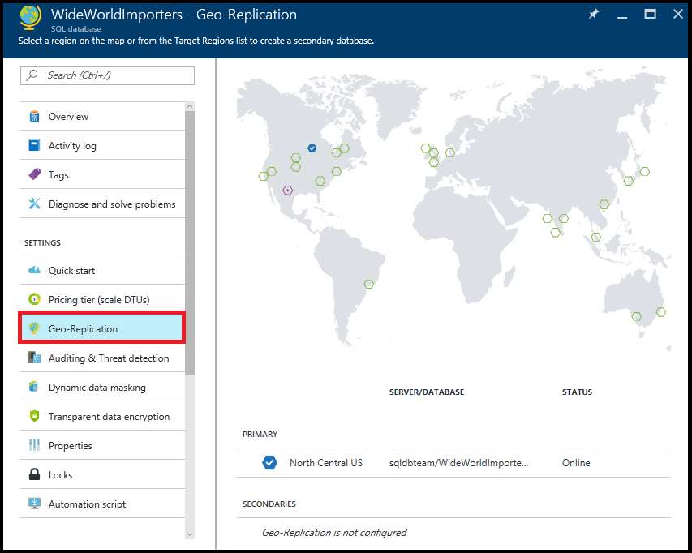
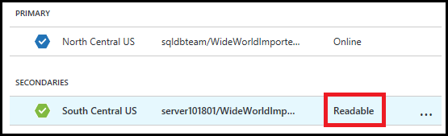

<properties
    pageTitle="使用 Azure 门户预览为 Azure SQL 数据库配置异地复制 | Azure"
    description="使用 Azure 门户预览为 Azure SQL 数据库配置异地复制"
    services="sql-database"
    documentationcenter=""
    author="stevestein"
    manager="jhubbard"
    editor="" />
<tags
    ms.assetid="d0b29822-714f-4633-a5ab-fb1a09d43ced"
    ms.service="sql-database"
    ms.devlang="NA"
    ms.topic="article"
    ms.tgt_pltfrm="NA"
    ms.workload="NA"
    ms.date="10/18/2016"
    wacn.date="12/19/2016"
    ms.author="sstein" />

# 使用 Azure 门户预览为 Azure SQL 数据库配置异地复制

> [AZURE.SELECTOR]
- [概述](/documentation/articles/sql-database-geo-replication-overview/)
- [Azure 门户预览](/documentation/articles/sql-database-geo-replication-portal/)
- [PowerShell](/documentation/articles/sql-database-geo-replication-powershell/)
- [T-SQL](/documentation/articles/sql-database-geo-replication-transact-sql/)

本文说明如何使用 [Azure 门户预览](http://portal.azure.cn)为 SQL 数据库配置活动异地复制。

若要使用 Azure 门户预览启动故障转移，请参阅[使用 Azure 门户预览为 Azure SQL 数据库启动计划内或计划外故障转移](/documentation/articles/sql-database-geo-replication-failover-portal/)。

>[AZURE.NOTE] 活动异地复制（可读辅助数据库）现在可供所有服务层中的所有数据库使用。非可读辅助数据库类型将于 2017 年 4 月停用，现有的非可读数据库将自动升级到可读辅助数据库。

若要使用 Azure 门户预览配置异地复制，需要以下资源：

* Azure SQL 数据库：要复制到其他地理区域的主数据库。

## 添加辅助数据库
以下步骤在异地复制合作关系中创建新的辅助数据库。

只有订阅所有者或共有者才能添加辅助数据库。

辅助数据库具有与主数据库相同的名称，并默认使用相同的服务级别。辅助数据库可以是单一数据库，也可以是弹性数据库。有关详细信息，请参阅[服务层](/documentation/articles/sql-database-service-tiers/)。创建辅助数据库并设定种子后，会开始将数据从主数据库复制到新的辅助数据库。

> [AZURE.NOTE] 如果合作伙伴数据库已存在（例如，在终止之前的异地复制关系的情况下），命令会失败。

### 添加辅助数据库
1. 在 [Azure 门户预览](http://portal.azure.cn)中，浏览到需要设置以便进行异地复制的数据库。
2. 在 SQL 数据库页上，选择“异地复制”，然后选择要创建辅助数据库的区域。
   
      

3. 选择或配置辅助数据库的服务器和定价层。
   
      

4. 可以选择性地将辅助数据库添加到弹性数据库池。若要在池中创建辅助数据库，单击“弹性数据库池”，然后在目标服务器上选择池。池必须已在目标服务器上存在。此工作流不会创建一个池。
5. 单击“创建”添加辅助数据库。
6. 此时会创建辅助数据库，并开始种子设定过程。
   
      

7. 完成种子设定过程时，辅助数据库会显示其状态。
   
      

## 删除辅助数据库

此操作会永久终止到辅助数据库的复制，并会将辅助数据库的角色更改为常规的读写数据库。如果与辅助数据库的连接断开，命令会成功，但辅助数据库必须等到连接恢复后才会变为可读写。

1. 在 [Azure 门户预览](http://portal.azure.cn)中浏览到异地复制合作关系中的主数据库。
2. 在 SQL 数据库页上，选择“异地复制”。
3. 在“辅助数据库”列表中选择想要从异地复制合作关系中删除的数据库。
4. 单击“停止复制”。
   
      

5. 系统会打开确认窗口。单击“是”从异地复制合作关系中删除数据库。（将其设置为读写数据库不是任何复制操作的一部分。）

## 后续步骤
- 若要详细了解活动异地复制，请参阅[活动异地复制](/documentation/articles/sql-database-geo-replication-overview/)
- 有关业务连续性概述和应用场景，请参阅[业务连续性概述](/documentation/articles/sql-database-business-continuity/)

<!---HONumber=Mooncake_1212_2016-->