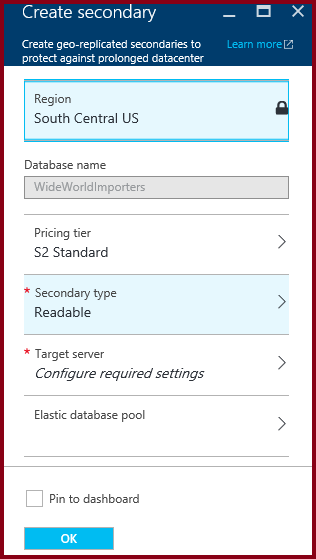

<properties
    pageTitle="Azure 门户：SQL 数据库异地复制 | Azure"
    description="在 Azure 门户中为 Azure SQL 数据库配置异地复制，并启动故障转移"
    services="sql-database"
    documentationcenter=""
    author="CarlRabeler"
    manager="jhubbard"
    editor=""
    translationtype="Human Translation" />
<tags
    ms.assetid="d0b29822-714f-4633-a5ab-fb1a09d43ced"
    ms.service="sql-database"
    ms.custom="business continuity"
    ms.devlang="NA"
    ms.topic="article"
    ms.tgt_pltfrm="NA"
    ms.workload="NA"
    ms.date="03/062/2016"
    wacn.date="04/17/2017"
    ms.author="carlrab"
    ms.sourcegitcommit="7cc8d7b9c616d399509cd9dbdd155b0e9a7987a8"
    ms.openlocfilehash="72fba91abe28d36fb92527e506cb7bdb1d83288f"
    ms.lasthandoff="04/07/2017" />

# 在 Azure 门户中为 Azure SQL 数据库配置活动异地复制，并启动故障转移

本文说明如何在 [Azure 门户](http://portal.azure.cn)中为 SQL 数据库配置活动异地复制，以及如何启动故障转移。

若要使用 Azure 门户启动故障转移，请参阅[使用 Azure 门户为 Azure SQL 数据库启动计划内或计划外故障转移](/documentation/articles/sql-database-geo-replication-failover-portal/)。

>[AZURE.NOTE]
> 活动异地复制（可读辅助数据库）现在可供所有服务层中的所有数据库使用。 非可读辅助类型将在 2017 年 4 月停用，现有的非可读数据库将自动升级到可读辅助数据库。
> 
> 

若要使用 Azure 门户配置活动异地复制，需要以下资源：

* Azure SQL 数据库：要复制到其他地理区域的主数据库。

> [AZURE.NOTE]
活动异地复制必须在同一订阅中的数据库之间进行。

## 添加辅助数据库
以下步骤在异地复制合作关系中创建新的辅助数据库。  

只有订阅所有者或共有者才能添加辅助数据库。

辅助数据库具有与主数据库相同的名称，并默认使用相同的服务级别。 辅助数据库可以是单一数据库，也可以是弹性池中的数据库。 有关详细信息，请参阅[服务层](/documentation/articles/sql-database-service-tiers/)。
创建辅助数据库并设定种子后，会开始将数据从主数据库复制到新的辅助数据库。

> [AZURE.NOTE]
> 如果合作伙伴数据库已存在（例如，在终止之前的异地复制关系的情况下），命令会失败。
> 

1. 在 [Azure 门户](http://portal.azure.cn)中，浏览到需要设置以便进行异地复制的数据库。
2. 在 SQL 数据库页上，选择“异地复制” ，然后选择要创建辅助数据库的区域。 
   
    
3. 选择或配置辅助数据库的服务器和定价层。

    
4. 可以选择性地将辅助数据库添加到弹性池。 若要在池中创建辅助数据库，请单击“弹性池”  ，然后在目标服务器上选择池。 池必须已在目标服务器上存在。 此工作流不会创建池。
5. 单击“创建”添加辅助数据库。
6. 此时会创建辅助数据库，种子设定过程开始。

    
7. 完成种子设定过程时，辅助数据库会显示其状态。

    

## 启动故障转移

辅助数据库可以通过切换变为主数据库。  

1. 在 [Azure 门户](http://portal.azure.cn)中浏览到异地复制合作关系中的主数据库。
2. 在 SQL 数据库边栏选项卡中，选择“所有设置” > “异地复制”。
3. 在“辅助数据库”列表中，选择想要其成为新的主数据库的数据库并单击“故障转移”。
   
    
4. 单击“是”开始故障转移。

该命令会立即将辅助数据库切换为主数据库角色。 

切换角色时，有一小段时间无法使用这两个数据库（大约为 0 到 25 秒）。 如果主数据库具有多个辅助数据库，则该命令将自动重新配置其他辅助数据库以连接到新的主数据库。 在正常情况下，完成整个操作所需的时间应该少于一分钟。 

> [AZURE.NOTE]
> 如果发出命令时主数据库处于在线状态且正在提交事务，则可能会丢失某些数据。
> 
> 

## 删除辅助数据库
此操作会永久终止到辅助数据库的复制，并会将辅助数据库的角色更改为常规的读写数据库。 如果与辅助数据库的连接断开，命令会成功，但辅助数据库必须等到连接恢复后才会变为可读写。  

1. 在 [Azure 门户](http://portal.azure.cn)中浏览到异地复制合作关系中的主数据库。
2. 在 SQL 数据库页上，选择“异地复制” 。
3. 在“辅助数据库”列表中，选择需要从异地复制合作关系中删除的数据库。
4. 单击“停止复制”。
   
    
5. 确认窗口随即打开。 单击“是”从异地复制合作关系中删除数据库。 （将其设置为不属于任何复制的读写数据库。）

## 后续步骤
* 若要深入了解活动异地复制，请参阅[活动异地复制](/documentation/articles/sql-database-geo-replication-overview/)。
* 有关业务连续性概述和应用场景，请参阅[业务连续性概述](/documentation/articles/sql-database-business-continuity/)。
<!--Update_Description: add initiate failover via portal-->