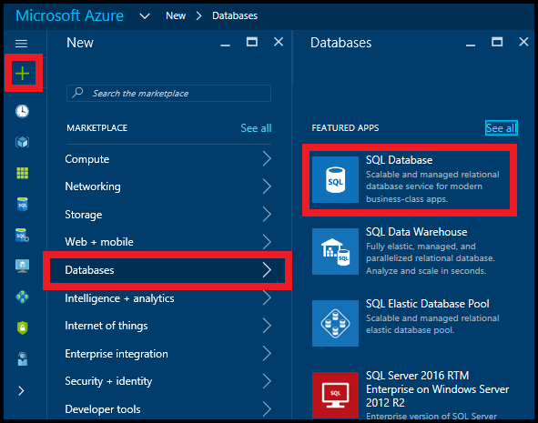

<properties
    pageTitle="Azure 门户：从异地冗余备份还原 SQL 数据库 | Azure"
    description="使用 Azure 门户预览从异地冗余备份中将 Azure SQL 数据库还原到新的服务器中"
    services="sql-database"
    documentationcenter=""
    author="stevestein"
    manager="jhubbard"
    editor="" />
<tags
    ms.service="sql-database"
    ms.custom="business continuity"
    ms.devlang="NA"
    ms.topic="article"
    ms.tgt_pltfrm="powershell"
    ms.workload="NA"
    ms.date="12/19/2016"
    wacn.date="03/24/2017"
    ms.author="sstein; carlrab" />  

# 使用 Azure 门户预览从异地冗余备份中还原 Azure SQL 数据库

本文演示了如何使用 Azure 门户预览通过异地还原将数据库还原到新服务器中。也可以[使用 PowerShell](/documentation/articles/sql-database-geo-restore-powershell/) 执行此任务。

## 使用 Azure 门户预览从异地冗余备份中还原 Azure SQL 数据库

若要在 Azure 门户预览中异地还原数据库，请执行以下步骤：

1. 转到 [Azure 门户预览](https://portal.azure.cn)。
2. 在屏幕左侧选择“+新建”>“数据库”>“SQL 数据库”：
   
     

3. 选择“备份”作为源，然后选择要还原的备份。指定数据库名称、要将数据库还原到其中的服务器，然后单击“创建”：
   
     

4. 单击页面右上方的通知图标，监视还原操作的状态。

## 后续步骤
- 有关业务连续性概述和应用场景，请参阅[业务连续性概述](/documentation/articles/sql-database-business-continuity/)
- 若要了解 Azure SQL 数据库的自动备份，请参阅 [SQL 数据库自动备份](/documentation/articles/sql-database-automated-backups/)
- 若要了解如何使用自动备份进行恢复，请参阅[从服务启动的备份中还原数据库](/documentation/articles/sql-database-recovery-using-backups/)
- 若要了解更快的恢复选项，请参阅[活动异地复制](/documentation/articles/sql-database-geo-replication-overview/)
- 若要了解如何使用自动备份进行存档，请参阅[数据库复制](/documentation/articles/sql-database-copy/)

<!---HONumber=Mooncake_0320_2017-->
<!--Update_Description: wording update-->