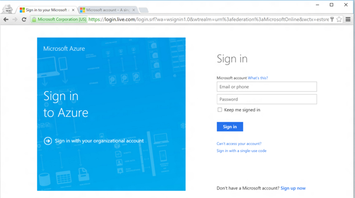
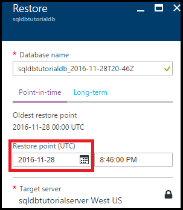
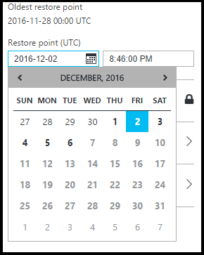
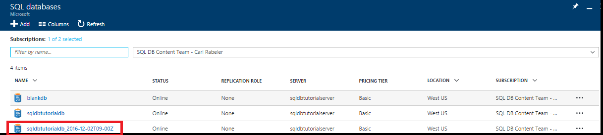

<properties
    pageTitle="开始使用 Azure SQL 数据库的备份和还原进行数据保护和恢复 | Azure"
    description="本教程介绍如何从自动化备份还原到某个时间点、如何将自动化备份存储在 Azure 恢复服务保管库中，以及如何从 Azure 恢复服务保管库还原"
    keywords="sql 数据库教程"
    services="sql-database"
    documentationcenter=""
    author="CarlRabeler"
    manager="jhubbard"
    editor="" />
<tags
    ms.assetid="aeb8c4c3-6ae2-45f7-b2c3-fa13e3752eed"
    ms.service="sql-database"
    ms.custom="business continuity"
    ms.workload="data-management"
    ms.tgt_pltfrm="na"
    ms.devlang="na"
    ms.topic="hero-article"
    ms.date="12/08/2016"
    wacn.date="01/20/2017"
    ms.author="carlrab" />

# 开始使用备份和还原进行数据保护和恢复

本入门教程介绍如何使用 Azure 门户预览完成以下任务：

- 查看数据库的现有备份
- 将数据库还原到以前的时间点
- 在 Azure 恢复服务保管库中配置数据库备份文件的长期保留
- 从 Azure 恢复服务保管库还原数据库

**时间估计**：本教程大约需要 30 分钟才能完成（假定用户已满足先决条件）。

## 先决条件

* 需要一个 Azure 帐户。可以[注册 Azure 1 元试用帐户](/pricing/1rmb-trial/?WT.mc_id=A261C142F)。

* 必须能够使用帐户连接到 Azure 门户预览，该帐户是订阅所有者或参与者角色的成员。有关基于角色的访问控制 (RBAC) 的详细信息，请参阅[开始在 Azure 门户预览中进行访问管理](/documentation/articles/role-based-access-control-what-is/)。

* 你已完成本教程的[开始使用 Azure 门户预览和 SQL Server Management Studio 了解 Azure SQL 数据库服务器、数据库和防火墙规则](/documentation/articles/sql-database-get-started/)部分或与之类似的 [PowerShell 版本](/documentation/articles/sql-database-get-started-powershell/)部分。请完成此必学教程或在完成本教程的 [PowerShell 版本](/documentation/articles/sql-database-get-started-powershell/)部分时执行 PowerShell 脚本（如果尚未进行），然后再继续。

## 使用现有帐户登录
使用[现有订阅](https://account.windowsazure.cn/Home/Index)，按照以下步骤连接到 Azure 门户预览。

1. 打开所选浏览器并连接到 [Azure 门户预览](https://portal.azure.cn/)。
2. 登录到 [Azure 门户预览](https://portal.azure.cn/)。
3. 在“登录”页上，提供订阅的凭据。
   
     

<a name="create-logical-server-bk">

## 查看服务生成的数据库备份的最早还原点

本教程的此部分介绍最早还原点，该还原点源自针对数据库的、[服务生成的自动化备份](/documentation/articles/sql-database-automated-backups/)。

1. 打开数据库 **sqldbtutorialdb** 的“SQL 数据库”边栏选项卡。

      

2. 在工具栏上，单击“还原”。

      

3. 在“还原”边栏选项卡上，查看最早还原点。

      

## 将数据库还原到以前的时间点

在本教程的此部分，需将数据库还原到特定时间点的新数据库。

1. 在数据库的“还原”边栏选项卡上，查看要还原到的新数据库的默认名称（此名称是附加了时间戳的现有数据库名称），以便将数据库还原到较早的时间点。此名称会随后续步骤中指定的时间而变化。

      

2. 单击“还原点(UTC)”输入框中的“日历”图标。

      

2. 在日历上，选择保持期内的一个日期

      

3. 在“还原点(UTC)”输入框中，指定所选日期的一个时间，以便将数据库中的数据从自动化数据库备份还原到该时间点。

      

	>[AZURE.NOTE]
	请注意，数据库名称已随所选日期和时间而变化。另请注意，不能更改要在特定时间点还原到其上的服务器。若要还原到其他服务器，请使用[异地还原](/documentation/articles/sql-database-disaster-recovery/#recover-using-geo-restore)。
    >

4. 单击“确定”将数据库还原到以前的某个时间点的新数据库。

5. 在工具栏上，单击通知图标可查看还原作业的状态。

      

6. 在还原作业完成后，打开“SQL 数据库”边栏选项卡可查看新还原的数据库。

      

   > [AZURE.NOTE]
   可以在此处使用 SQL Server Management Studio 连接到还原的数据库以执行所需的任务，例如[从还原的数据库提取一些数据，以便将其复制到现有的数据库中；或者删除现有的数据库，然后将还原的数据库重命名为现有的数据库名称](/documentation/articles/sql-database-recovery-using-backups/#point-in-time-restore)。
   >

## 后续步骤

- 若要了解服务生成的自动备份，请参阅[自动备份](/documentation/articles/sql-database-automated-backups/)
- 若要了解如何从备份还原，请参阅[从备份还原](/documentation/articles/sql-database-recovery-using-backups/)

<!---HONumber=Mooncake_0116_2017-->