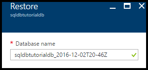
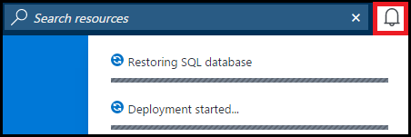

<properties
    pageTitle="开始使用 Azure SQL 数据库的备份和还原进行数据保护和恢复 | Azure"
    description="本教程介绍如何从自动化备份还原到某个时间点、如何将自动化备份存储在 Azure 恢复服务保管库中，以及如何从 Azure 恢复服务保管库还原"
    keywords="sql 数据库教程"
    services="sql-database"
    documentationcenter=""
    author="CarlRabeler"
    manager="jhubbard"
    editor="" />
<tags
    ms.assetid="aeb8c4c3-6ae2-45f7-b2c3-fa13e3752eed"
    ms.service="sql-database"
    ms.custom="business continuity"
    ms.workload="data-management"
    ms.tgt_pltfrm="na"
    ms.devlang="na"
    ms.topic="hero-article"
    ms.date="12/08/2016"
    wacn.date="01/20/2017"
    ms.author="carlrab" />

<!------------------
This topic is annotated with TEMPLATE guidelines for TUTORIAL TOPICS.

Metadata guidelines

title
	60 characters or less. Tells users clearly what they will do (deploy an ASP.NET web app to App Service). Not the same as H1. It's 60 characters or fewer including all characters between the quotes and the Microsoft Docs site identifier.

description
	115-145 characters. Duplicate of the first sentence in the introduction. This is the abstract of the article that displays under the title when searching in Bing or Google. 

	Example: "This tutorial shows how to deploy an ASP.NET web application to a web app in Azure App Service by using Visual Studio 2015."
------------------>

<!----------------

TEMPLATE GUIDELINES for tutorial topics

The tutorial topic shows users how to solve a problem using a product or service. It includes the prerequisites and steps users need to be successful.  

It is a "solve a problem" topic, not a "learn concepts" topic.

DO include this:
	• What users will do
	• What they will create or accomplish by the end of the tutorial
	• Time estimate
	• Optional but useful: Include a diagram or video. Diagrams help users see the big picture of what they are doing. A video of the steps can be used by customers as an alternative to following the steps in the topic.
	• Prerequisites: Technical expertise and software requirements
	• End-to-end steps. At the end, include next steps to deeper or related tutorials so users can learn more about the service

DON'T include this:
	• Conceptual info about the service. This info is in overview topics that you can link to in the prerequisites section if necessary

------------------->

<!------------------
GUIDELINES for the H1 
	
	The H1 should answer the question "What will I do in this topic?" Write the H1 heading in conversational language and use search keywords as much as possible. Since this is a "solve a problem" topic, make sure the title indicates that. Use a strong, specific verb like "Deploy."  
		
	Heading must use an industry standard term. If your feature is a proprietary name like "elastic pools", use a synonym. For example: "Learn about elastic pools for multi-tenant databases." In this case multi-tenant database is the industry-standard term that will be an anchor for finding the topic.

-------------------->

# 开始使用备份和还原进行数据保护和恢复

<!------------------
	GUIDELINES for introduction
	
	The introduction is 1-2 sentences.  It is optimized for search and sets proper expectations about what to expect in the article. It should contain the top keywords that you are using throughout the article.The introduction should be brief and to the point of what users will do and what they will accomplish. 

	In this example:
	 

Sentence #1 Explains what the user will do. This is also the metadata description. 
	This tutorial shows how to deploy an ASP.NET web application to a web app in Azure App Service by using Visual Studio 2015. 

Sentence #2 Explains what users will learn and the benefit.  
	When you’re finished, you’ll have a simple web application up and running in the cloud.

-------------------->

本入门教程介绍如何使用 Azure 门户预览完成以下任务：

- 查看数据库的现有备份
- 将数据库还原到以前的时间点
- 在 Azure 恢复服务保管库中配置数据库备份文件的长期保留
- 从 Azure 恢复服务保管库还原数据库

**时间估计**：本教程大约需要 30 分钟才能完成（假定用户已满足先决条件）。

## 先决条件

* 需要一个 Azure 帐户。可以[注册 Azure 1 元试用帐户](/pricing/1rmb-trial/?WT.mc_id=A261C142F)。

* 必须能够使用帐户连接到 Azure 门户预览，该帐户是订阅所有者或参与者角色的成员。有关基于角色的访问控制 (RBAC) 的详细信息，请参阅[开始在 Azure 门户预览中进行访问管理](/documentation/articles/role-based-access-control-what-is/)。

* 你已完成本教程的[开始使用 Azure 门户预览和 SQL Server Management Studio 了解 Azure SQL 数据库服务器、数据库和防火墙规则](/documentation/articles/sql-database-get-started/)部分或与之类似的 [PowerShell 版本](/documentation/articles/sql-database-get-started-powershell/)部分。请完成此必学教程或在完成本教程的 [PowerShell 版本](/documentation/articles/sql-database-get-started-powershell/)部分时执行 PowerShell 脚本（如果尚未进行），然后再继续。

<!------------------
> [AZURE.TIP]
> You can perform these same tasks in a getting started tutorial by using either [C#](/documentation/articles/sql-database-get-started-csharp/) or [PowerShell](/documentation/articles/sql-database-get-started-powershell/).
>
-------------------->

## 使用现有帐户登录
使用[现有订阅](https://account.windowsazure.cn/Home/Index)，按照以下步骤连接到 Azure 门户预览。

1. 打开所选浏览器并连接到 [Azure 门户预览](https://portal.azure.cn/)。
2. 登录到 [Azure 门户预览](https://portal.azure.cn/)。
3. 在“登录”页上，提供订阅的凭据。
   
     

<a name="create-logical-server-bk">

## 查看服务生成的数据库备份的最早还原点

本教程的此部分介绍最早还原点，该还原点源自针对数据库的、[服务生成的自动化备份](/documentation/articles/sql-database-automated-backups/)。

1. 打开数据库 **sqldbtutorialdb** 的“SQL 数据库”边栏选项卡。

      

2. 在工具栏上，单击“还原”。

      

3. 在“还原”边栏选项卡上，查看最早还原点。

      

## 将数据库还原到以前的时间点

在本教程的此部分，需将数据库还原到特定时间点的新数据库。

1. 在数据库的“还原”边栏选项卡上，查看要还原到的新数据库的默认名称（此名称是附加了时间戳的现有数据库名称），以便将数据库还原到较早的时间点。此名称会随后续步骤中指定的时间而变化。

      

2. 单击“还原点(UTC)”输入框中的“日历”图标。

      

2. 在日历上，选择保持期内的一个日期

      

3. 在“还原点(UTC)”输入框中，指定所选日期的一个时间，以便将数据库中的数据从自动化数据库备份还原到该时间点。

      

	>[AZURE.NOTE]
	请注意，数据库名称已随所选日期和时间而变化。另请注意，不能更改要在特定时间点还原到其上的服务器。若要还原到其他服务器，请使用[异地还原](/documentation/articles/sql-database-disaster-recovery/#recover-using-geo-restore)。
    >

4. 单击“确定”将数据库还原到以前的某个时间点的新数据库。

5. 在工具栏上，单击通知图标可查看还原作业的状态。

      

6. 在还原作业完成后，打开“SQL 数据库”边栏选项卡可查看新还原的数据库。

      

   > [AZURE.NOTE]
   可以在此处使用 SQL Server Management Studio 连接到还原的数据库以执行所需的任务，例如[从还原的数据库提取一些数据，以便将其复制到现有的数据库中；或者删除现有的数据库，然后将还原的数据库重命名为现有的数据库名称](/documentation/articles/sql-database-recovery-using-backups/#point-in-time-restore)。
   >

<!--**Next steps**: *Reiterate what users have done, and give them interesting and useful next steps so they want to go on.*-->

## 后续步骤

- 若要了解服务生成的自动备份，请参阅[自动备份](/documentation/articles/sql-database-automated-backups/)
- 若要了解如何从备份还原，请参阅[从备份还原](/documentation/articles/sql-database-recovery-using-backups/)

<!---HONumber=Mooncake_0116_2017-->