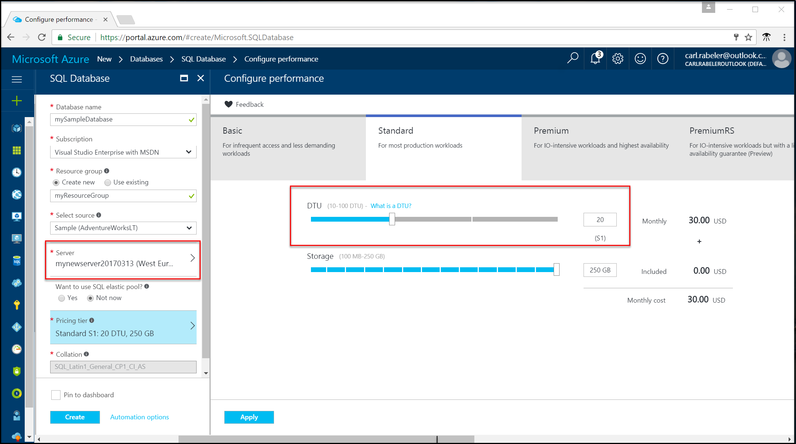
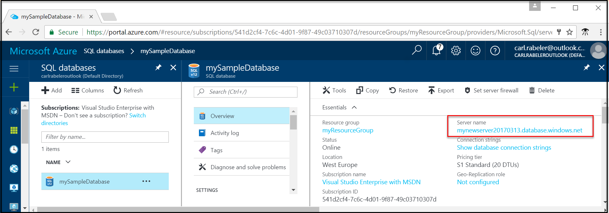
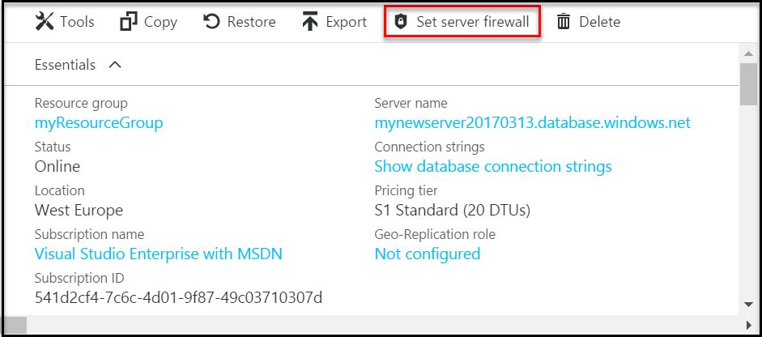
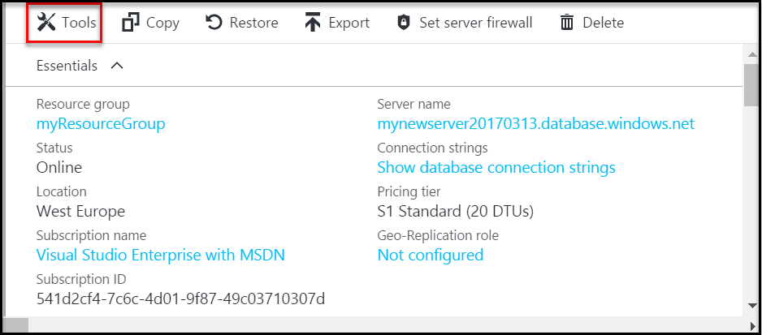
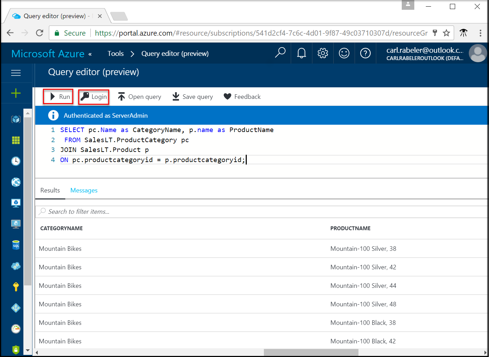

<properties
    pageTitle="Azure 门户预览：创建 SQL 数据库 | Azure"
    description="了解如何在 Azure 门户预览中创建 SQL 数据库逻辑服务器、服务器级防火墙规则和数据库。 同时了解如何使用 Azure 门户预览查询 Azure SQL 数据库。"
    keywords="SQL 数据库教程：创建 SQL 数据库"
    services="sql-database"
    documentationcenter=""
    author="CarlRabeler"
    manager="jhubbard"
    editor=""
    translationtype="Human Translation" />
<tags
    ms.assetid="aeb8c4c3-6ae2-45f7-b2c3-fa13e3752eed"
    ms.service="sql-database"
    ms.custom="quick start"
    ms.workload="data-management"
    ms.tgt_pltfrm="portal"
    ms.devlang="na"
    ms.topic="hero-article"
    ms.date="03/13/2017"
    wacn.date="04/17/2017"
    ms.author="carlrab"
    ms.sourcegitcommit="7cc8d7b9c616d399509cd9dbdd155b0e9a7987a8"
    ms.openlocfilehash="efa4e79f983fa4df2a2ea9fc0b657f90f7bab706"
    ms.lasthandoff="04/07/2017" />

# 在 Azure 门户预览中创建和查询单一 Azure SQL 数据库

Azure SQL 数据库可以通过 Azure 门户预览创建。 此方法提供一个基于浏览器的用户界面，用于创建和配置 Azure SQL 数据库和所有相关的 Azure 资源。

## 登录到 Azure 门户预览

登录到 [Azure 门户预览](https://portal.azure.cn/)。

## 创建 SQL 数据库

创建 Azure SQL 数据库时，会使用定义好的一组[计算和存储资源](/documentation/articles/sql-database-service-tiers/)。 数据库在 [Azure 资源组](/documentation/articles/resource-group-overview/)和 [Azure SQL 数据库逻辑服务器](/documentation/articles/sql-database-features/)中创建。 

请按以下步骤创建包含 Adventure Works LT 示例数据的 SQL 数据库。 

1. 单击 Azure 门户预览左上角的“新建”按钮。

2. 从“新建”页中选择“数据库”，然后从“数据库”页中选择“SQL 数据库”。

3. 使用必需信息填充 SQL 数据库窗体： 
   - 数据库名称：提供数据库名称
   - 订阅：选择订阅
   - 资源组：选择新的或现有的
   - 源：选择“示例(AdventureWorksLT)”
   - 服务器：创建一个新服务器（**服务器**名称必须全局唯一）
   - 弹性池：对于此快速入门，选择“现在不”
   - 定价层：选择“20 DTU”和 **250** GB 的存储
   - 排序规则：无法在导入示例数据库时更改此值 
   - 固定到仪表板：选择此复选框

      

4. 完成后，单击“创建”。 预配需要数分钟。
5. SQL 数据库部署完成以后，在仪表板上选择“SQL 数据库”，或者从左侧菜单中选择“SQL 数据库”，然后单击“SQL 数据库”页上的新数据库。 此时会打开数据库的概览页，显示完全限定的服务器名称（例如 **mynewserver20170313.database.chinacloudapi.cn**），并且会提供进行进一步配置所需的选项。

       

## 创建服务器级防火墙规则

SQL 数据库服务会创建一个防火墙，阻止外部应用程序和工具连接到服务器和数据库。 按照以下步骤为 IP 地址创建 [SQL 数据库服务器级防火墙规则](/documentation/articles/sql-database-firewall-configure/)，以便通过 SQL 数据库防火墙进行外部连接。 

1. 单击数据库工具栏上的“设置服务器防火墙”。 此时会打开 SQL 数据库服务器的“防火墙设置”页。 

       

2. 在工具栏上单击“添加客户端 IP”，然后单击“保存”。 此时会针对当前的 IP 地址创建服务器级防火墙规则。

3. 单击“确定”，然后单击“X”关闭“防火墙设置”页。

现在可以使用 SQL Server Management Studio 或其他所选工具连接到数据库及其服务器。

## 查询 SQL 数据库

在 Azure 门户预览中使用查询编辑器，按照以下步骤查询数据库。 

1. 在数据库的“SQL 数据库”页上，单击工具栏上的“工具”。 此时会打开“查询编辑器”预览页。

      

2. 依次单击“查询编辑器(预览版)”、“预览条款”复选框、“确定”。 此时会打开查询编辑器。

3. 单击“登录”，然后在出现提示时选择“SQL Server 身份验证”，然后提供服务器管理员登录名和密码。
4. 单击“确定”登录。

5. 完成身份验证后，在查询窗口中键入所选查询，例如以下查询：

        SELECT pc.Name as CategoryName, p.name as ProductName
        FROM SalesLT.ProductCategory pc
        JOIN SalesLT.Product p
        ON pc.productcategoryid = p.productcategoryid;

6. 单击“运行”，然后在“结果”窗格中查看查询结果。

    

7. 单击“X”关闭“查询编辑器”页。

## 清理资源

此集合中的“连接方式”快速入门以及教程集合中的教程以此快速入门为基础。 如果计划继续使用后续的快速入门或相关教程，请勿清除在本快速入门中创建的资源。 如果不打算继续，请在 Azure 门户预览中执行以下步骤，删除通过此快速入门创建的所有资源。

1. 在 Azure 门户预览的左侧菜单中，单击“资源组”，然后单击“myResourceGroup”。 
2. 在资源组页上单击“删除”，在文本框中键入 **myResourceGroup**，然后单击“删除”。

## 后续步骤

- 若要使用 SQL Server Management Studio 进行连接和查询，请参阅[使用 SSMS 进行连接和查询](/documentation/articles/sql-database-connect-query-ssms/)
- 若要使用 Visual Studio 进行连接，请参阅[使用 Visual Studio 进行连接和查询](/documentation/articles/sql-database-connect-query/)。
- 有关 SQL 数据库的技术概述，请参阅[关于 SQL 数据库服务](/documentation/articles/sql-database-technical-overview/)。