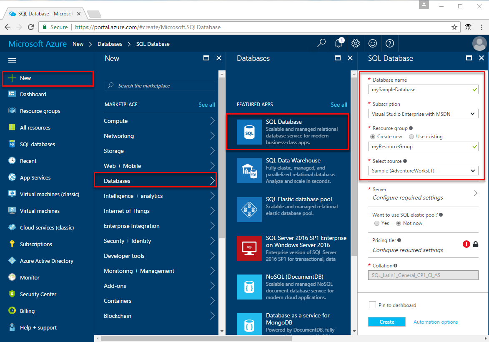
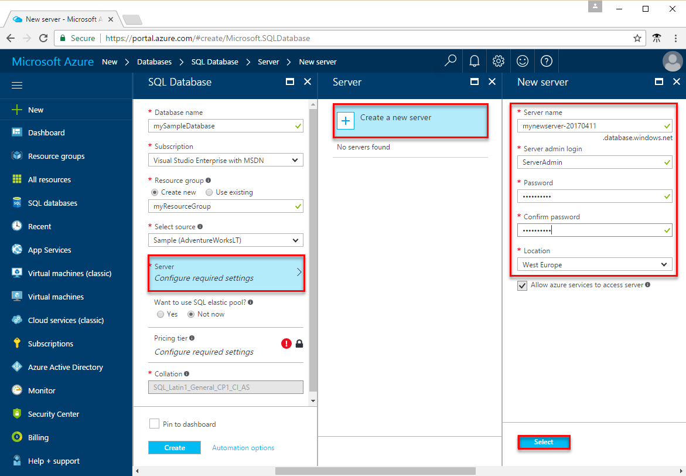
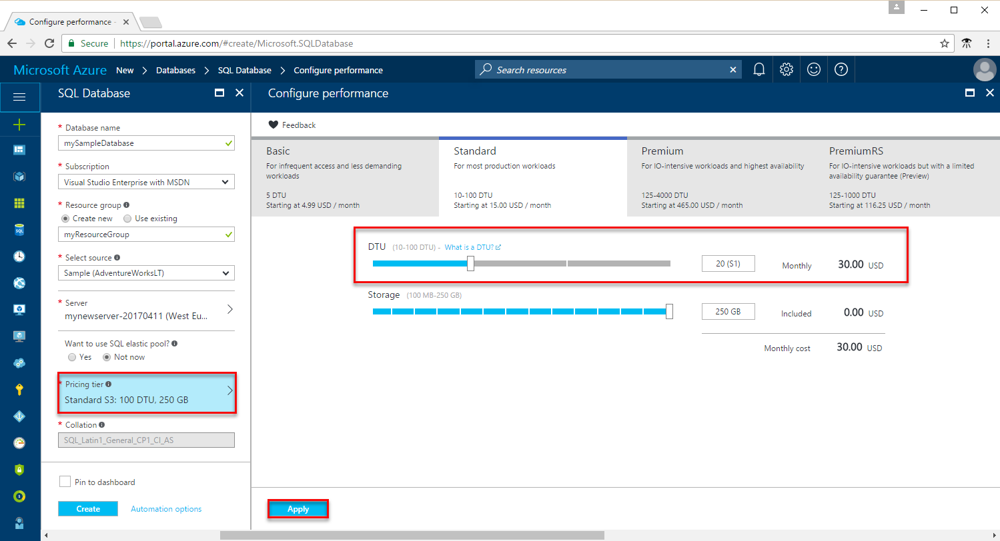
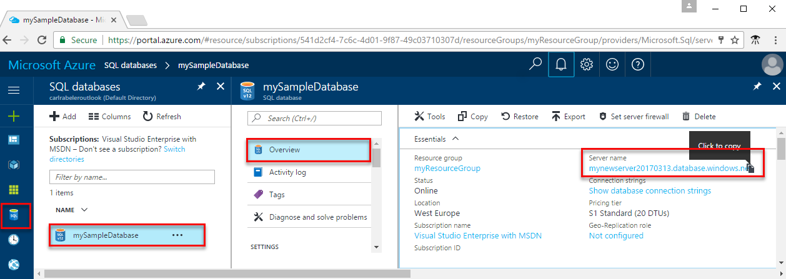
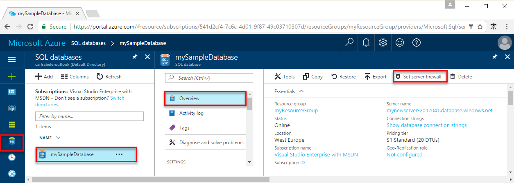
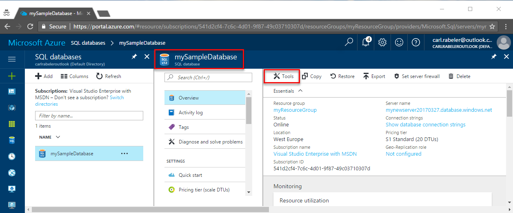
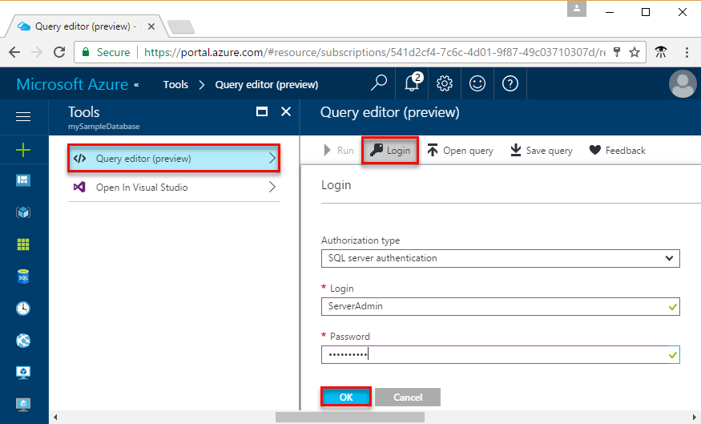
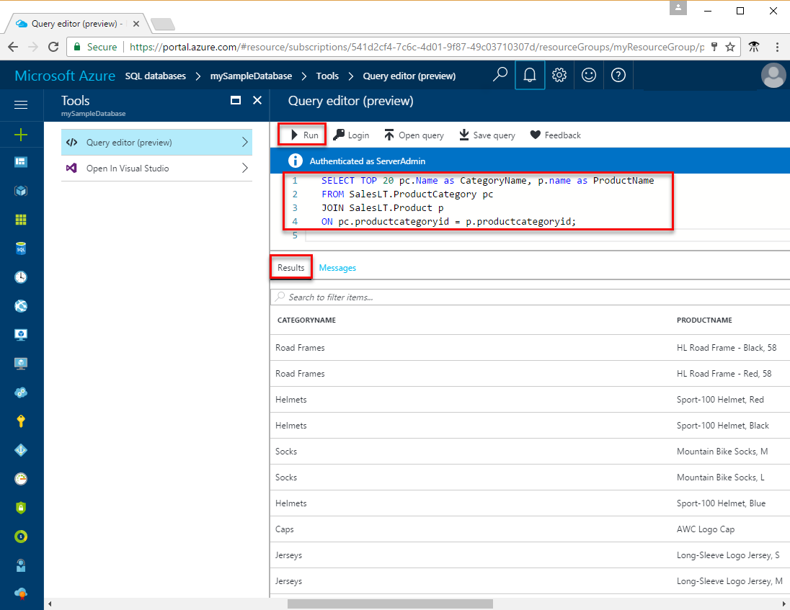

<properties
    pageTitle="Azure 门户预览：创建 SQL 数据库 | Azure"
    description="了解如何在 Azure 门户预览中创建 SQL 数据库逻辑服务器、服务器级防火墙规则和数据库。 同时了解如何使用 Azure 门户预览查询 Azure SQL 数据库。"
    keywords="SQL 数据库教程：创建 SQL 数据库"
    services="sql-database"
    documentationcenter=""
    author="CarlRabeler"
    manager="jhubbard"
    editor="" />
<tags
    ms.assetid="aeb8c4c3-6ae2-45f7-b2c3-fa13e3752eed"
    ms.service="sql-database"
    ms.custom="quick start create"
    ms.workload="data-management"
    ms.tgt_pltfrm="portal"
    ms.devlang="na"
    ms.topic="hero-article"
    ms.date="04/17/2017"
    wacn.date="05/22/2017"
    ms.author="carlrab"
    ms.translationtype="Human Translation"
    ms.sourcegitcommit="8fd60f0e1095add1bff99de28a0b65a8662ce661"
    ms.openlocfilehash="bd2c960d63c334a40092c9a55215d52e8e383c17"
    ms.contentlocale="zh-cn"
    ms.lasthandoff="05/12/2017" />

# 在 Azure 门户预览中创建 Azure SQL 数据库

本快速入门教程逐步讲解如何在 Azure 中创建 SQL 数据库。 Azure SQL 数据库是一种“数据库即服务”产品，可用于在云中运行和缩放高可用性 SQL Server 数据库。 本快速入门教程介绍如何开始使用 Azure 门户预览创建 SQL 数据库。

如果没有 Azure 订阅，请在开始前创建一个[试用帐户](/pricing/1rmb-trial/)。

## 登录到 Azure 门户预览

登录到 [Azure 门户预览](https://portal.azure.cn/)。

## 创建 SQL 数据库

创建 Azure SQL 数据库时，会使用定义好的一组[计算和存储资源](/documentation/articles/sql-database-service-tiers/)。 数据库在 [Azure 资源组](/documentation/articles/resource-group-overview/)和 [Azure SQL 数据库逻辑服务器](/documentation/articles/sql-database-features/)中创建。 

请按以下步骤创建包含 Adventure Works LT 示例数据的 SQL 数据库。 

1. 单击 Azure 门户预览左上角的“新建”按钮。

2. 从“新建”页中选择“数据库”，然后从“数据库”页中选择“SQL 数据库”。

    

3. 如上图所示，在“SQL 数据库”窗体中填写以下信息：     
   - 数据库名称：**mySampleDatabase**
   - 资源组：**myResourceGroup**
   - 源：**示例(AdventureWorksLT)**

   > [AZURE.IMPORTANT]
   > 必须选择此表单中的示例数据库，因为本快速入门中的其余部分会用到它。
   > 

4. 单击“服务器”，然后填写“新建服务器”表单，指定全局唯一的服务器名称，提供服务器管理员登录名，然后指定所选的密码。 

   > [AZURE.IMPORTANT]
   > 在此处指定的服务器管理员登录名和密码是以后在本快速入门中登录到服务器及其数据库所必需的。 请牢记或记录此信息，以后会使用到它。 
   >  

    
5. 完成表单操作后，单击“选择”。

6. 单击“定价层”为新数据库指定服务层和性能级别。 使用滑块选择“20 DTU”和 **250** GB 的存储。 有关 DTU 的详细信息，请参阅[什么是 DTU？](/documentation/articles/sql-database-what-is-a-dtu/)。

    

7. 选择 DTU 的量之后，单击“应用”。  

8. 完成 SQL 数据库表单后，即可单击“创建”对数据库进行预配。 预配需要数分钟。 

9. 在工具栏上，单击“通知”可监视部署过程。

    

## 创建服务器级防火墙规则

SQL 数据库服务在服务器级别创建一个防火墙。除非创建了防火墙规则来为特定的 IP 地址打开防火墙，否则会阻止外部应用程序和工具连接到服务器或服务器上的任何数据库。 按照以下步骤为客户端 IP 地址创建 [SQL 数据库服务器级防火墙规则](/documentation/articles/sql-database-firewall-configure/)，只允许通过 SQL 数据库防火墙进行外部连接，而该防火墙只对你的 IP 地址开放。 

> [AZURE.NOTE]
> 通过端口 1433 进行的 SQL 数据库通信。 如果尝试从企业网络内部进行连接，则该网络的防火墙可能不允许经端口 1433 的出站流量。 如果是这样，则无法连接到 Azure SQL 数据库服务器，除非 IT 部门打开了端口 1433。
>

1. 部署完成后，在左侧菜单中单击“SQL 数据库”，然后在“SQL 数据库”页上单击“mySampleDatabase”。 此时会打开数据库的概览页，显示完全限定的服务器名称（例如 **mynewserver20170411.database.chinacloudapi.cn**），并且会提供进行进一步配置所需的选项。

   > [AZURE.IMPORTANT]
   > 在后续的快速入门中，需提供此完全限定的服务器名称才能连接到服务器及其数据库。
   > 

       

2. 如上图所示，在工具栏上单击“设置服务器防火墙”。 此时会打开 SQL 数据库服务器的“防火墙设置”页。 

       

3. 在工具栏上单击“添加客户端 IP”，将当前的 IP 地址添加到新的防火墙规则。 防火墙规则可以针对单个 IP 地址或一系列 IP 地址打开端口 1433。

4. 单击“保存” 。 此时会针对当前的 IP 地址创建服务器级防火墙规则，在逻辑服务器上打开 端口 1433。

       

4. 单击“确定”，然后关闭“防火墙设置”页。

现在可以使用之前创建的服务器管理员帐户通过 SQL Server Management Studio 或其他所选工具从此 IP 地址连接到 SQL 数据库服务器及其数据库。

> [AZURE.IMPORTANT]
> 默认情况下，所有 Azure 服务都允许通过 SQL 数据库防火墙进行访问。 在此页上单击“关”即可对所有 Azure 服务执行禁用操作。

## 查询 SQL 数据库

在 Azure 中创建示例数据库以后，即可使用 Azure 门户中的内置查询工具确认是否能够连接到数据库并查询数据。 

1. 在数据库的“SQL 数据库”页上，单击工具栏上的“工具”。 此时会打开“工具”页。

      

2. 依次单击“查询编辑器(预览版)”、“预览条款”复选框、“确定”。 此时会打开“查询编辑器”页。

3. 单击“登录”，然后在出现提示时选择“SQL Server 身份验证”，然后提供前面创建的服务器管理员登录名和密码。

     

4. 单击“确定”登录。

5. 完成身份验证后，在查询编辑器窗格中键入以下查询。

       SELECT TOP 20 pc.Name as CategoryName, p.name as ProductName
       FROM SalesLT.ProductCategory pc
       JOIN SalesLT.Product p
       ON pc.productcategoryid = p.productcategoryid;

6. 单击“运行”，然后在“结果”窗格中查看查询结果。

    

7. 关闭“查询编辑器”页和“工具”页。

## 清理资源

本教程系列中的其他快速入门教程是在本文的基础上制作的。 如果计划继续使用后续的快速入门，请勿清除在本快速入门中创建的资源。 如果不打算继续，请在 Azure 门户中执行以下步骤，删除通过此快速入门创建的所有资源。

1. 在 Azure 门户预览的左侧菜单中，单击“资源组”，然后单击“myResourceGroup”。 
2. 在资源组页上单击“删除”，在文本框中键入 **myResourceGroup**，然后单击“删除”。

## 后续步骤

- 若要使用 SQL Server Management Studio 进行连接和查询，请参阅[使用 SSMS 进行连接和查询](/documentation/articles/sql-database-connect-query-ssms/)
- 若要使用 Visual Studio Code 进行连接和查询，请参阅[使用 Visual Studio Code 进行连接和查询](/documentation/articles/sql-database-connect-query-vscode/)。
- 若要使用 .NET 进行连接和查询，请参阅[使用 .NET 进行连接和查询](/documentation/articles/sql-database-connect-query-dotnet/)。
- 若要使用 PHP 进行连接和查询，请参阅[使用 PHP 进行连接和查询](/documentation/articles/sql-database-connect-query-php/)。
- 若要使用 Node.js 进行连接和查询，请参阅[使用 Node.js 进行连接和查询](/documentation/articles/sql-database-connect-query-nodejs/)。
- 若要使用 Java 进行连接和查询，请参阅[使用 Java 进行连接和查询](/documentation/articles/sql-database-connect-query-java/)。
- 若要使用 Python 进行连接和查询，请参阅[使用 Python 进行连接和查询](/documentation/articles/sql-database-connect-query-python/)。
- 若要使用 Ruby 进行连接和查询，请参阅[使用 Ruby 进行连接和查询](/documentation/articles/sql-database-connect-query-ruby/)。
<!--Update_Description:update azure portal steps for creating database and configuring file rule;add several next steps reference links-->