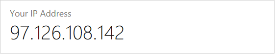
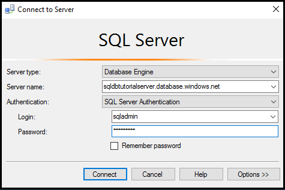
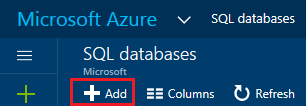
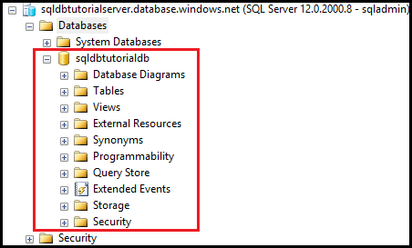

<properties
    pageTitle="SQL 数据库教程：创建服务器、服务器级防火墙规则、示例数据库、数据库级防火墙规则并使用 SQL Server Management Studio 进行连接 | Azure"
    description="了解如何设置 SQL 数据库逻辑服务器、服务器防火墙规则、SQL 数据库和示例数据。此外，了解如何使用客户端工具进行连接、配置用户，以及设置数据库防火墙规则。"
    keywords="SQL 数据库教程：创建 SQL 数据库"
    services="sql-database"
    documentationcenter=""
    author="CarlRabeler"
    manager="jhubbard"
    editor="" />
<tags
    ms.assetid="aeb8c4c3-6ae2-45f7-b2c3-fa13e3752eed"
    ms.service="sql-database"
    ms.custom="single databases"
    ms.workload="data-management"
    ms.tgt_pltfrm="na"
    ms.devlang="na"
    ms.topic="hero-article"
    ms.date="11/23/2016"
    wacn.date="01/20/2017"
    ms.author="carlrab" />  

# 开始使用 Azure 门户预览和 SQL Server Management Studio 了解 Azure SQL 数据库服务器、数据库和防火墙规则

本入门教程介绍如何使用 Azure 门户预览完成以下任务：

* 创建新的 Azure 资源组
* 创建 Aure SQL 逻辑服务器
* 查看 Azure SQL 逻辑服务器属性
* 创建服务器级防火墙规则
* 将 Adventure Works LT 示例数据库创建为单一数据库
* 在 Azure 中查看 Adventure Works LT 示例数据库属性

在本教程中，用户还可以使用最新版 SQL Server Management Studio 执行以下操作：

* 连接到逻辑服务器及其 master 数据库
* 查询 master 数据库
* 连接到示例数据库
* 查询示例数据库

完成本教程后，用户会有一个示例数据库和一个空的数据库在 Azure 资源组中运行并连接到逻辑服务器。此外还会配置一项服务器级防火墙规则，目的是让服务器级主体从指定 IP 地址（或 IP 地址范围）登录到服务器。

**时间估计**：本教程大约需要 30 分钟（假定用户已满足先决条件）。

## 先决条件

* 需要一个 Azure 帐户。可以[注册 Azure 1 元试用帐户](/pricing/1rmb-trial/?WT.mc_id=A261C142F)。

* 必须能够使用帐户连接到 Azure 门户，该帐户是订阅所有者或参与者角色的成员。有关基于角色的访问控制 (RBAC) 的详细信息，请参阅[开始在 Azure 门户预览中进行访问管理](/documentation/articles/role-based-access-control-what-is/)。

> [AZURE.TIP]
也可以使用 [C#](/documentation/articles/sql-database-get-started-csharp/) 或 [PowerShell](/documentation/articles/sql-database-get-started-powershell/) 执行入门教程中的上述相同任务。
>

### 使用现有帐户登录
使用[现有订阅](https://account.windowsazure.cn/Home/Index)，按照以下步骤连接到 Azure 门户预览。

1. 打开所选浏览器并连接到 [Azure 门户预览](https://portal.azure.cn/)。
2. 登录到 [Azure 门户预览](https://portal.azure.cn/)。
3. 在“登录”页上，提供订阅的凭据。
   
     

<a name="create-logical-server-bk">

## 在 Azure 门户中创建新的逻辑 SQL Server

1. 单击“新建”，键入 **sql server**，然后单击 **ENTER**。

      

2. 单击“SQL Server (逻辑服务器)”。
   
      

3. 单击“创建”打开新的“SQL Server (逻辑服务器)”边栏选项卡。

      

3. 在“服务器名称”文本框中，提供新逻辑服务器的有效名称。绿色复选标记表示提供的名称有效。
    
      

    > [AZURE.IMPORTANT]
    新服务器的完全限定名称将为 <your\_server\_name>.database.chinacloudapi.cn。
    >
    
4. 在“服务器管理员登录名”文本框中，提供该服务器进行 SQL 身份验证登录的用户名。此登录名称为服务器主体登录名。绿色复选标记表示提供的名称有效。
    
      

5. 在“密码”和“确认密码”文本框中，提供服务器主体登录帐户的密码。绿色复选标记表示提供的密码有效。
    
      

6. 选择有权在其中创建对象的订阅。

      

7. 在“资源组”文本框中选择“新建”，然后提供新资源组的有效名称（也可以使用现有的资源组，前提是你已为自己创建了一个）。绿色复选标记表示提供的名称有效。

      

8. 在“位置”文本框中，选择适用于所在位置的数据中心 - 例如“中国东部”。
    
      

    
    > [AZURE.TIP]
    “允许 Azure 服务访问服务器”复选框无法在此边栏选项卡上更改。可以在服务器防火墙边栏选项卡上更改此设置。有关详细信息，请参阅[安全入门](/documentation/articles/sql-database-get-started-security/)。
    >
    
9. 单击“创建”。

      

## 在 Azure 门户预览中查看逻辑 SQL Server 属性

1. 在 Azure 门户预览中，单击“更多服务”。

      

2. 在“筛选器”文本框中，键入 **SQL**，然后单击对应于 SQL Server 的星号，将 SQL Server 指定为 Azure 中的最常用服务器。

      

3. 在默认边栏选项卡中单击“SQL Server”，打开 Azure 订阅中的 SQL Server 的列表。

      

4. 单击新的 SQL Server，在 Azure 门户预览中查看其属性。可以通过后续教程了解此边栏选项卡上的可用选项。

      

5. 在“设置”下单击“属性”，查看逻辑 SQL Server 的各种属性。

      

6. 将完全限定的服务器名称复制到剪贴板中，以便稍后在本教程中使用。

      

## 在 Azure 门户预览中创建服务器级防火墙规则

1. 在“SQL Server”边栏选项卡中，单击“设置”下面的“防火墙”以打开 SQL Server 的“防火墙”边栏选项卡。

      

2. 使用所选浏览器查看显示的客户端 IP 地址，并验证该地址是否为你在 Internet 上的 IP 地址（询问“我的 IP 地址是什么”）。有时出于各种原因这两个地址并不相符。

      

3. 假设 IP 地址一致，则单击工具栏上的“添加客户端 IP”。

      

    > [AZURE.NOTE]
    可以针对一个 IP 地址或整个地址范围打开服务器上的 SQL 数据库防火墙。打开防火墙后，SQL 管理员和用户就能够登录到他们具有有效凭据的服务器上的任何数据库。
    >

4. 单击工具栏上的“保存”以保存此服务器级防火墙规则，然后单击“确定”。

      

## 使用 SQL Server Management Studio (SSMS) 连接到 SQL Server

1. 请在[下载 SQL Server Management Studio](https://msdn.microsoft.com/zh-cn/library/mt238290.aspx) 中下载并安装最新版 SSMS（如果尚未这样做）。为了保持版本最新，当有新版本可供下载时 SSMS 最新版本会提示你。

2. 安装后，在 Windows 搜索框中键入“Microsoft SQL Server Management Studio”，并单击 **Enter** 打开 SSMS：

      

3. 在“连接到服务器”对话框中，输入使用 SQL Server 身份验证连接到 SQL Server 的必要信息。

      

4. 单击“连接”。

      

5. 在“对象资源管理器”中，依次展开“数据库”、“系统数据库”、“master”，在 master 数据库中查看对象。

      

6. 右键单击“master”，然后单击“新建查询”。

      

8. 在查询窗口中，键入以下查询：

   	select * from sys.objects

9.  在工具栏上，单击“执行”返回 master 数据库中所有系统对象的列表。

      

    > [AZURE.NOTE]
    若要了解 SQL 安全性，请参阅 [SQL 安全性入门](/documentation/articles/sql-database-get-started-security/)
    >

## 在 Azure 门户预览中使用 Adventure Works LT 示例创建新的数据库

1. 在 Azure 门户预览的默认边栏选项卡中，单击“SQL 数据库”。

      

2. 在“SQL 数据库”边栏选项卡上，单击“添加”。

      

3. 在“SQL 数据库”边栏选项卡上，查看已为你完成的信息。

      

4. 提供有效的数据库名称。

      

5. 在“选择源”下单击“示例”，然后在“选择示例”下单击“AdventureWorksLT [V12]”。
   
      

6. 在“服务器”下，提供服务器管理员登录用户名和密码。

      

    > [AZURE.NOTE]
    将数据库添加到服务器时，可以将其添加为单一数据库（默认设置），也可将其添加到弹性池中。有关弹性池的详细信息，请参阅[弹性池](/documentation/articles/sql-database-elastic-pool/)。
    >

7. 在“定价层”下，将定价层更改为“基本”，（可以根据需要在以后提高定价层，但出于学习目的，建议使用最低的成本层）。

      

8. 单击“创建”。

      

## 在 Azure 门户预览中查看数据库属性

1. 在“SQL 数据库”边栏选项卡上，单击要在 Azure 门户预览中查看其属性的新数据库。可以通过后续教程了解此边栏选项卡上的可用选项。

      

2. 单击“属性”查看数据库的更多信息。

      

3. 单击“显示数据库连接字符串”。

      

4. 单击“概览”，然后单击“基本信息”窗格中的服务器名称。
    
      

5. 在服务器的“基本信息”窗格中，查看新添加的数据库。

      

## 使用 SQL Server Management Studio 连接和查询示例数据库

1. 切换到 SQL Server Management Studio，在“对象资源管理器”中单击“数据库”，然后在工具栏上单击“刷新”以查看示例数据库。

      

2. 在“对象资源管理器”中展开新数据库，以查看其对象。

      

3. 右键单击示例数据库，然后单击“新建查询”。

      

4. 在查询窗口中，键入以下查询：

   	select * from sys.objects
   
9.  在工具栏上，单击“执行”返回示例数据库中所有系统对象的列表。

      

## 使用 SQL Server Management Studio 创建新的空数据库

1. 在“对象资源管理器”中，右键单击“数据库”，然后单击“新建数据库”。

      

    > [AZURE.NOTE]
    也可以让 SSMS 为你创建一个“创建数据库”脚本，以便使用 Transact-SQL 创建新的数据库。
    >

2. 在“新建数据库”对话框的“数据库名称”文本框中，提供数据库名称。

      

3. 在“新建数据库”对话框中单击“选项”，然后将“版本”更改为“基本”。

      

    > [AZURE.TIP]
    查看此对话框中的其他选项，这些选项可以针对 Azure SQL 数据库进行修改。有关这些选项的详细信息，请参阅 [Create Database](https://msdn.microsoft.com/zh-cn/library/dn268335.aspx)（创建数据库）。
    >

4. 单击“确定”创建空数据库。
5. 完成后，刷新“对象资源管理器”中的“数据库”节点，查看新创建的空数据库。

      

> [AZURE.TIP]
可以删除不使用的数据库，这样可以节省一些学习费用。“基本”版数据库可以在七天内还原。但是，请勿删除服务器。如果这样做，则无法恢复服务器或其已删除的数据库。
>

## 后续步骤
完成本教程以后，还可以查看很多其他的教程，这些教程介绍如何构建你在本教程中学习到的内容。

* 若要开始了解 Azure SQL 数据库安全性，请参阅[安全入门](/documentation/articles/sql-database-get-started-security/)。
* 如果熟悉 Excel，请学习如何[使用 Excel 连接到 Azure 中的 SQL 数据库](/documentation/articles/sql-database-connect-excel/)。
* 如果已准备好开始编写代码，请在[用于 SQL 数据库和 SQL Server 的连接库](/documentation/articles/sql-database-libraries/)中选择编程语言。
* 若要将本地 SQL Server 数据库移到 Azure，请参阅[将数据库迁移到 SQL 数据库](/documentation/articles/sql-database-cloud-migrate/)。
* 若要使用 BCP 命令行工具将 CSV 文件中的某些数据载入新表，请参阅[使用 BCP 将 CSV 文件中的数据载入 SQL 数据库](/documentation/articles/sql-database-load-from-csv-with-bcp/)。
* 若要开始创建表和其他对象，请参阅[创建表](https://msdn.microsoft.com/zh-cn/library/ms365315.aspx)中的“创建表”主题。

## 其他资源
[什么是 SQL 数据库？](/documentation/articles/sql-database-technical-overview/)

<!---HONumber=Mooncake_0116_2017-->
<!--update: whole content update, update to create and manage azure sql database by using Ibiza portal-->