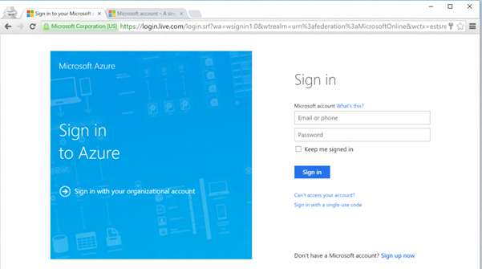
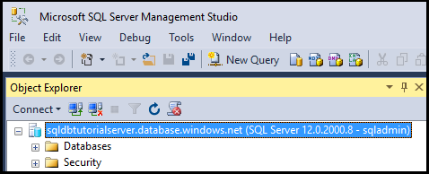
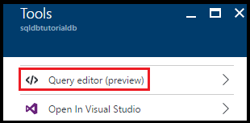
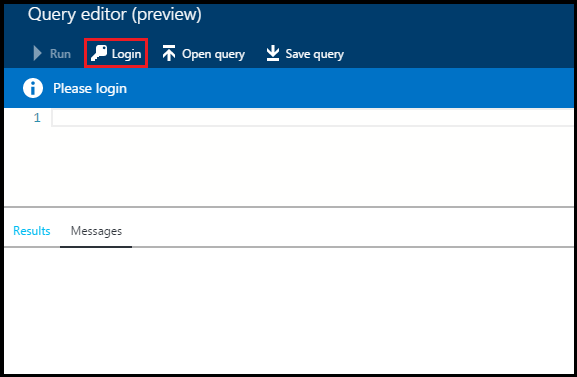
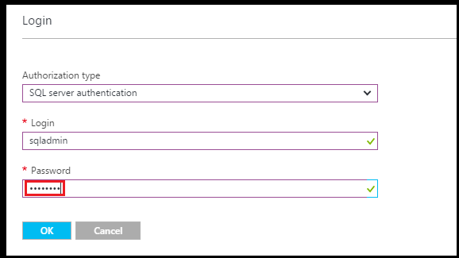
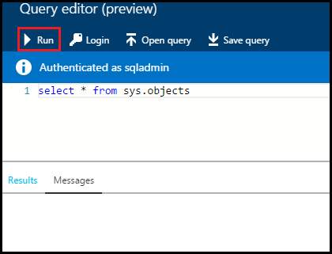
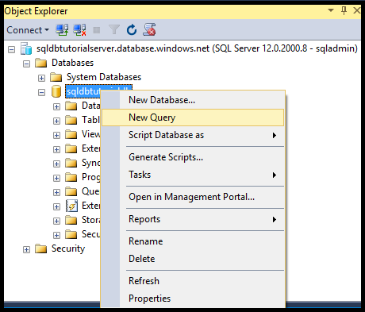
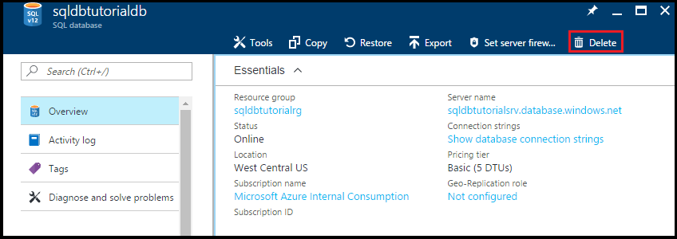
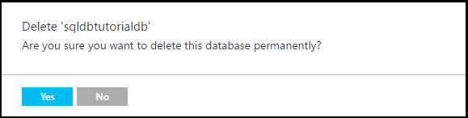

<properties
    pageTitle="快速入门：第一个 Azure SQL 数据库 | Azure"
    description="了解如何在 Azure 门户中创建 SQL 数据库逻辑服务器、服务器级防火墙规则和数据库，以及如何对 Azure SQL 数据库使用 SQL Server Management Studio。"
    keywords="SQL 数据库教程：创建 SQL 数据库"
    services="sql-database"
    documentationcenter=""
    author="CarlRabeler"
    manager="jhubbard"
    editor="" />
<tags
    ms.assetid="aeb8c4c3-6ae2-45f7-b2c3-fa13e3752eed"
    ms.service="sql-database"
    ms.custom="single databases"
    ms.workload="data-management"
    ms.tgt_pltfrm="na"
    ms.devlang="na"
    ms.topic="hero-article"
    ms.date="02/17/2017"
    wacn.date="03/24/2017"
    ms.author="carlrab" />  

# 使用 Azure 门户与 SSMS 创建、连接和查询第一个 Azure SQL 数据库

本教程介绍如何使用 Azure 门户与 SQL Server Management Studio 创建、连接和查询 Azure SQL 数据库。完成本教程后，你将：

* 创建一个包含逻辑服务器、服务器级防火墙规则和两个数据库的资源组。
* 知道如何使用 Azure 门户与 SQL Server Management Studio 查看服务器和数据库属性。
* 知道如何使用 Azure 门户与 SQL Server Management Studio 查询数据库。

**用时估计**：完成本教程大约需要 30 分钟（假设满足先决条件）。

> [AZURE.TIP]
>本文还将介绍如何使用 [PowerShell](/documentation/articles/sql-database-get-started-powershell/) 或 [C#](/documentation/articles/sql-database-get-started-csharp/) 创建、连接和查询 Azure SQL 数据库。
>

> [AZURE.NOTE]
>本教程帮助你了解以下学习主题的内容：[SQL 数据库服务器概述](/documentation/articles/sql-database-server-overview/)、[SQL 数据库概述](/documentation/articles/sql-database-overview/)和 [Azure SQL 数据库防火墙规则概述](/documentation/articles/sql-database-firewall-configure/)。有关 SQL 数据库服务的概述，请参阅[什么是 SQL 数据库？](/documentation/articles/sql-database-technical-overview/)
>  

## 先决条件

* **一个 Azure 帐户**。可以[注册 Azure 1 元试用帐户](/pricing/1rmb-trial/)。

* **Azure create 权限**。必须能够使用帐户连接到 Azure 门户，该帐户是订阅所有者或参与者角色的成员。有关基于角色的访问控制 (RBAC) 的详细信息，请参阅[开始在 Azure 门户中进行访问管理](/documentation/articles/role-based-access-control-what-is/)。

* **SQL Server Management Studio**。可以通过[下载 SQL Server Management Studio](https://msdn.microsoft.com/zh-cn/library/mt238290.aspx) 下载并安装最新版本的 SQL Server Management Studio (SSMS)。连接到 Azure SQL 数据库时，请始终使用最新版本的 SSMS，因为其中会不断地发布新功能。

### 登录到 Azure 门户

本过程中的步骤说明如何使用 [Azure 帐户](https://account.windowsazure.cn/Home/Index)连接到 Azure 门户。

1. 打开所选浏览器并连接到 [Azure 门户](https://portal.azure.cn/)。
2. 登录到 [Azure 门户](https://portal.azure.cn/)。
3. 在“登录”页上，提供订阅的凭据。
   
     

## 新建 SQL 逻辑服务器

本过程中的步骤说明如何在所选区域中的 Azure 门户上创建逻辑服务器。逻辑服务器是可在其中创建 SQL 数据库的对象，也是可在其中创建防火墙规则，使用户能够通过 Azure SQL 数据库防火墙进行连接的对象。

1. 单击“新建”，键入 **sql server**，然后单击 **ENTER**。

      

2. 单击“SQL Server (逻辑服务器)”。
   
      

3. 单击“创建”打开“新建 SQL 服务器(逻辑服务器)”边栏选项卡。

    

4. 在“服务器名称”文本框中，提供新逻辑服务器的有效名称。绿色复选标记表示提供的名称有效。
    
    

    > [AZURE.IMPORTANT]
    >新服务器的完全限定名称必须唯一，格式为：**<服务器名称>.database.chinacloudapi.cn**。在本教程稍后的步骤中，需要使用此完全限定的服务器名称连接到服务器和数据库。
    
4. 在“服务器管理员登录名”文本框中，提供此服务器的 SQL 身份验证登录名的用户名。此登录名也称为服务器主体登录名。绿色复选标记表示提供的名称有效。
    
      

5. 在“密码”和“确认密码”文本框中，提供服务器主体登录帐户的密码。绿色复选标记表示提供的密码有效。
    
      

6. 在“订阅”下拉框中，选择你有权在其中创建对象的订阅。

      

7. 在“资源组”文本框中选择“新建”，然后提供新资源组的有效名称。绿色复选标记表示提供的名称有效。

      

8. 在“位置”文本框中，选择要在其中创建逻辑服务器的数据中心。
    
      

    
    > [AZURE.TIP]
    >“允许 Azure 服务访问服务器”复选框无法在此边栏选项卡上更改。可以在服务器防火墙边栏选项卡上更改此设置。有关详细信息，请参阅[安全入门](/documentation/articles/sql-database-control-access-sql-authentication-get-started/)。
    >
    
9. 选中“固定到仪表板”复选框。

10. 单击“创建”，将此脚本部署到 Azure 以创建逻辑服务器。

      

11. 创建服务器后，请检查默认显示的服务器属性。

      

12. 单击“属性”查看逻辑 SQL 服务器的其他属性。

      

13. 将完全限定的服务器名称复制到剪贴板中，以便稍后在本教程中使用。

      

## 创建服务器级防火墙规则

本过程中的步骤说明如何在 Azure 门户中创建服务器级防火墙规则。默认情况下，Azure SQL 数据库防火墙会阻止从外部连接到逻辑服务器及其数据库。若要连接到服务器，需要为执行下一过程时要从中连接的计算机的 IP 地址创建防火墙规则。有关详细信息，请参阅 [Azure SQL 数据库防火墙规则概述](/documentation/articles/sql-database-firewall-configure/)。

1. 在“SQL 服务器”边栏选项卡，单击“防火墙”打开服务器的“防火墙”边栏选项卡。请注意，显示的 IP 地址是客户端计算机的地址。

      

2. 在工具栏上单击“添加客户端 IP”，为当前的 IP 地址创建防火墙规则。

      

    > [AZURE.NOTE]
    >可为单个 IP 地址或整个 IP 地址范围创建防火墙规则。打开防火墙可让 SQL 管理员和用户登录到服务器上他们拥有有效凭据的任何数据库。
    >

4. 在工具栏上单击“保存”保存此服务器级防火墙规则，然后单击“确定”关闭“成功”对话框。

      

## 使用 SSMS 连接到服务器

本过程中的步骤说明如何使用 SQL Server Management Studio 连接到 SQL 逻辑服务器。SSMS 是 DBA 用来管理 SQL 服务器和数据库的主要工具。

1. 打开 SQL Server Management Studio（在 Windows 搜索框中键入 **Microsoft SQL Server Management Studio**，然后单击 **Enter** 打开 SSMS）。

      

3. 在“连接到服务器”对话框中，输入在上一过程中获取的完全限定的服务器名称，选择“SQL Server 身份验证”，然后提供预配服务器期间指定的登录名和密码。

      

4. 单击“连接”启动连接并打开 SSMS 中的对象资源管理器。

      

5. 在“对象资源管理器”中，依次展开“数据库”、“系统数据库”、“master”，在 master 数据库中查看对象。

      

6. 右键单击“master”，然后单击“新建查询”。

      

8. 在查询窗口中，键入以下查询：

   	select * from sys.objects

9.  在工具栏上，单击“执行”返回 master 数据库中所有系统对象的列表。

      

    > [AZURE.NOTE]
    >若要开始使用 SQL 安全性，请参阅 [SQL 身份验证入门](/documentation/articles/sql-database-control-access-sql-authentication-get-started/)
    >

## 创建包含示例数据的数据库

本过程中的步骤说明如何在 Azure 门户中使用与前面创建的逻辑服务器关联的示例数据创建数据库。

1. 在 Azure 门户的默认边栏选项卡中，单击“SQL 数据库”。

      

2. 在“SQL 数据库”边栏选项卡上，单击“添加”。

      

      

3. 在“数据库名称”文本框中，提供有效的数据库名称。

      

4. 在“选择源”下面，选择“示例(AdventureWorksLT)”。
   
      

5. 在“服务器”下面，检查是否已选择你的服务器。另请注意，将某个数据库添加到服务器时，可将它添加为单一数据库（默认设置），或将其添加到弹性池。有关弹性池的详细信息，请参阅[弹性池](/documentation/articles/sql-database-elastic-pool/)。

6. 在“定价层”下面，将定价层更改为“基本”，然后单击“选择”。以后可以根据需要提高定价层，但在学习过程中，我们建议使用最低的定价层。

      

7. 选中“固定到仪表板”复选框，然后单击“创建”。

      

8. 创建数据库后，请在 Azure 门户中查看其属性。可以通过后续教程了解此边栏选项卡上的可用选项。

      

## 在 Azure 门户中查询数据库

本过程中的步骤说明如何在 Azure 门户中直接查询数据库。

1. 在“SQL 数据库”边栏选项卡中，单击工具栏上的“工具”。

      

2. 在“工具”边栏选项卡中，单击“查询编辑器(预览版)”。

      

3. 单击相应的复选框确认查询编辑器是一项预览版功能，然后单击“确定”。
4. 在“查询编辑器”边栏选项卡中，单击“登录”。

      

5. 检查授权类型和登录名，然后提供此登录名的密码。

      

6. 单击“确定”尝试登录。
7. 完成身份验证后，在查询窗口中键入以下查询，然后单击“运行”。

		select * from sys.objects

      

8. 在“结果”窗格中查看查询结果。

      

## 使用 SSMS 查询数据库

本过程中的步骤说明如何使用 SQL Server Management Studio 连接到数据库，然后查询示例数据，以查看数据库中的对象。

1. 切换到 SQL Server Management Studio，在“对象资源管理器”中单击“数据库”，然后在工具栏上单击“刷新”以查看示例数据库。

      

2. 在“对象资源管理器”中展开新数据库，以查看其对象。

      

3. 右键单击示例数据库，然后单击“新建查询”。

      

4. 在查询窗口中，键入以下查询：

   	select * from sys.objects
   
9.  在工具栏上，单击“执行”返回示例数据库中所有系统对象的列表。

      

## 使用 SSMS 创建空白数据库

本过程中的步骤说明如何使用 SQL Server Management Studio 创建新数据库。

1. 在“对象资源管理器”中，右键单击“数据库”，然后单击“新建数据库”。

      

2. 在“新建数据库”对话框中的“数据库名称”文本框内提供数据库的名称。

      

3. 在“新建数据库”对话框中单击“选项”，然后将“版本”更改为“基本”。

      

    > [AZURE.TIP]
    查看此对话框中的其他选项，这些选项可以针对 Azure SQL 数据库进行修改。有关这些选项的详细信息，请参阅 [Create Database](https://msdn.microsoft.com/zh-cn/library/dn268335.aspx)（创建数据库）。
    >

4. 单击“确定”创建空数据库。
5. 完成后，刷新“对象资源管理器”中的“数据库”节点，查看新创建的空数据库。

      

## 排查连接问题

与 Azure SQL 数据库连接失败时，会出现错误消息。连接问题可能是 SQL Azure 数据库重新配置、防火墙设置、连接超时或不正确的登录信息造成的。有关连接故障排除工具，请参阅 [排查 Azure SQL 数据库连接问题](https://support.microsoft.com/help/10085/troubleshooting-connectivity-issues-with-microsoft-azure-sql-database)。

## 在 Azure 门户中删除单一数据库

本过程中的步骤说明如何使用 Azure 门户删除单一数据库。

1. 在 Azure 门户中的 SQL 数据库边栏选项卡上，单击想要删除的数据库。
2.  单击与该 SQL 数据库对应的“删除”。

      

2. 单击“是”确认要永久删除此数据库。

      

> [AZURE.TIP]
在数据库的保留期内，可将数据库从服务启动的自动备份还原（前提是未删除服务器本身）。“基本”版数据库可以在七天内还原。使用其他所有版本时，在 35 天内可以还原。如果删除了服务器本身，则无法恢复该服务器或在其中删除的任何数据库。有关数据库备份的详细信息，请参阅[了解 SQL 数据库备份](/documentation/articles/sql-database-automated-backups/)；有关从备份还原数据库的信息，请参阅[数据库恢复](/documentation/articles/sql-database-recovery-using-backups/)。有关还原已删除的数据库的操作指南文章，请参阅[还原已删除的 Azure SQL 数据库 - Azure 门户](/documentation/articles/sql-database-restore-deleted-database-portal/)。
>

## 后续步骤
完成本教程以后，还可以查看很多其他的教程，这些教程以你在本教程中学到的内容为基础进行扩展。

- 有关 SQL Server 身份验证的入门教程，请参阅 [SQL 身份验证和授权](/documentation/articles/sql-database-control-access-sql-authentication-get-started/)
- 有关 Azure Active Directory 身份验证的入门教程，请参阅 [AAD 身份验证和授权](/documentation/articles/sql-database-control-access-aad-authentication-get-started/)
* 如果熟悉 Excel，请学习如何[使用 Excel 连接到 Azure 中的 SQL 数据库](/documentation/articles/sql-database-connect-excel/)。
* 如果已准备好开始编写代码，请在[用于 SQL 数据库和 SQL Server 的连接库](/documentation/articles/sql-database-libraries/)中选择编程语言。
* 若要将本地 SQL Server 数据库移到 Azure，请参阅[将数据库迁移到 SQL 数据库](/documentation/articles/sql-database-cloud-migrate/)。
* 若要使用 BCP 命令行工具将 CSV 文件中的某些数据载入新表，请参阅[使用 BCP 将 CSV 文件中的数据载入 SQL 数据库](/documentation/articles/sql-database-load-from-csv-with-bcp/)。
* 若要开始创建表和其他对象，请参阅[创建表](https://msdn.microsoft.com/zh-cn/library/ms365315.aspx)中的“创建表”主题。

## 其他资源
- 有关技术概述，请参阅[什么是 SQL 数据库？](/documentation/articles/sql-database-technical-overview/)
- 有关定价信息，请参阅 [Azure SQL 数据库定价](/pricing/details/sql-database/)。

<!---HONumber=Mooncake_0320_2017-->
<!--Update_Description: content refine; introduce query edit feature; introduce how to troubleshoot connection problems-->