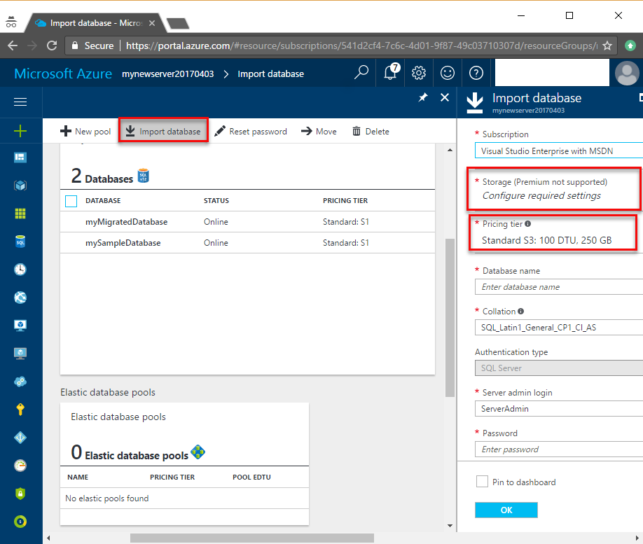
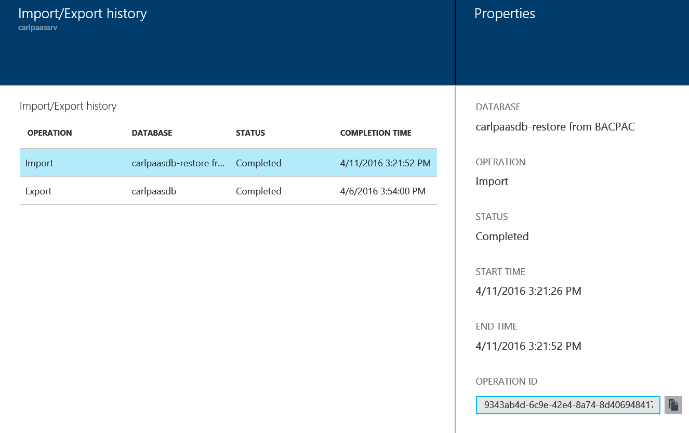

<properties
    pageTitle="导入 BACPAC 文件以创建 Azure SQL 数据库 | Azure"
    description="通过导入 BACPAC 文件创建一个新的 Azure SQL 数据库。"
    services="sql-database"
    documentationcenter=""
    author="CarlRabeler"
    manager="jhubbard"
    editor="" />
<tags
    ms.assetid="cf9a9631-56aa-4985-a565-1cacc297871d"
    ms.service="sql-database"
    ms.custom="move data"
    ms.devlang="NA"
    ms.date="04/07/2017"
    wacn.date="05/22/2017"
    ms.author="carlrab"
    ms.workload="data-management"
    ms.topic="article"
    ms.tgt_pltfrm="NA"
    ms.translationtype="Human Translation"
    ms.sourcegitcommit="8fd60f0e1095add1bff99de28a0b65a8662ce661"
    ms.openlocfilehash="67dc7660f8c670a5e92d4a8c8d009c7fd8b44f3e"
    ms.contentlocale="zh-cn"
    ms.lasthandoff="05/12/2017" />

# 将 BACPAC 文件导入到新的 Azure SQL 数据库

本文讨论如何将 [BACPAC](https://msdn.microsoft.com/zh-cn/library/ee210546.aspx#Anchor_4) 文件导入到新的 Azure SQL 数据库。 本文讨论如何使用以下方法：
- [Azure 门户预览](https://portal.azure.cn)
- [SqlPackage](https://msdn.microsoft.com/zh-cn/library/hh550080.aspx) 命令行实用工具
- [New-AzureRmSqlDatabaseImport](https://docs.microsoft.com/zh-cn/powershell/module/azurerm.sql/new-azurermsqldatabaseimport?view=azurermps-3.7.0) cmdlet

## 概述

当需要从存档中导入数据库或从另一个平台进行迁移时，可以从 BACPAC 文件导入数据库架构和数据。 BACPAC 文件是一个扩展名为 BACPAC 的 ZIP 文件，它包含来自 SQL Server 数据库的元数据和数据。 可以从 Azure Blob 存储（仅限标准存储）或本地位置中的本地存储导入 BACPAC 文件。 若要最大程度提高导入速度，建议指定较高的服务层和性能级别（例如 P6），然后在成功导入后根据需要向下缩放。 此外，导入后的数据库兼容性级别基于源数据库的兼容性级别。 

> [AZURE.IMPORTANT] 
> 将数据库迁移到 Azure SQL 数据库后，可以选择在数据库当前的兼容性级别（对于 AdventureWorks2008R2 数据库为级别 100）或更高的级别运行数据库。 有关在特定兼容级别操作数据库的影响和选项的详细信息，请参阅 [ALTER DATABASE Compatibility Level](https://docs.microsoft.com/sql/t-sql/statements/alter-database-transact-sql-compatibility-level)（更改数据库兼容级别）。 有关与兼容级别相关的其他数据库级别设置的信息，另请参阅 [ALTER DATABASE SCOPED CONFIGURATION](https://docs.microsoft.com/sql/t-sql/statements/alter-database-scoped-configuration-transact-sql)（更改数据库范围的配置）。   >

> [AZURE.NOTE]
> 若要将 BACPAC 导入到新的数据库，首先必须创建一个 Azure SQL 数据库逻辑服务器。 有关演示如何使用 SQLPackage 将 SQL Server 数据库迁移到 Azure SQL 数据库的教程，请参阅[迁移 SQL Server 数据库](/documentation/articles/sql-database-migrate-your-sql-server-database/)
>

## Azure 门户预览

本文介绍如何使用 [Azure 门户预览](https://portal.azure.cn)根据存于 Azure blob 存储中的 BACPAC 文件创建 Azure SQL 数据库。 使用 Azure 门户预览进行的导入操作仅支持从 Azure Blob 存储导入 BACPAC 文件。

若要使用 Azure 门户预览导入数据库，请打开数据库页，并在工具栏上单击“导入”。 指定 *.bacpac 文件名，为 bacpac 提供 Azure 存储帐户和容器，并提供用于连接到源数据库的凭据。  

   

若要监视导入操作的进度，请打开包含待导入数据库的逻辑服务器的相应页面。 向下滚动到“操作”，然后单击“导入/导出”历史记录。

### 监视导入操作的进度
1. 单击“SQL Server” 。
2. 单击要还原到的服务器。
3. 在 SQL Server 边栏选项卡的操作区域中，单击“导入/导出历史记录” ：
   
   
   

4. 若要验证数据库在服务器上是否处于活动状态，请单击“SQL 数据库”并验证新数据库是否“联机”。

## SQLPackage

若要使用 [SqlPackage](https://msdn.microsoft.com/zh-cn/library/hh550080.aspx) 命令行实用工具导入 SQL 数据库，请参阅[导入参数和属性](https://msdn.microsoft.com/zh-cn/library/hh550080.aspx#Import Parameters and Properties)。 可以使用 SQLPackage 实用工具附带的最新版本的 [SQL Server Management Studio](https://msdn.microsoft.com/zh-cn/library/mt238290.aspx) 和 [SQL Server Data Tools for Visual Studio](https://msdn.microsoft.com/zh-cn/library/mt204009.aspx)，也可以直接从 Microsoft 下载中心下载最新版本的 [SqlPackage](https://www.microsoft.com/download/details.aspx?id=53876)。

在大多数生产环境中，建议使用 SQLPackage 实用工具来实现缩放和性能。 如需 SQL Server 客户顾问团队编写的有关使用 BACPAC 文件进行迁移的博客，请参阅 [Migrating from SQL Server to Azure SQL Database using BACPAC Files](https://blogs.msdn.microsoft.com/sqlcat/2016/10/20/migrating-from-sql-server-to-azure-sql-database-using-bacpac-files/)（使用 BACPAC 文件从 SQL Server 迁移到 Azure SQL 数据库）。

请参阅脚本示例中的以下 SQLPackage 命令，了解如何将 **AdventureWorks2008R2** 数据库从本地存储导入到 Azure SQL 数据库逻辑服务器（在此示例中名为 **mynewserver20170403**）。 此脚本演示如何创建名为 **myMigratedDatabase** 的新数据库，该数据库的服务层为“高级”，服务目标为“P6”。 根据环境更改这些值。

    SqlPackage.exe /a:import /tcs:"Data Source=mynewserver20170403.database.chinacloudapi.cn;Initial Catalog=myMigratedDatabase;User Id=ServerAdmin;Password=<change_to_your_password>" /sf:AdventureWorks2008R2.bacpac /p:DatabaseEdition=Premium /p:DatabaseServiceObjective=P6

   

> [AZURE.IMPORTANT]
> Azure SQL 数据库逻辑服务器在端口 1433 上进行侦听。 如果尝试在企业防火墙内连接到 Azure SQL 数据库逻辑服务器，则必须在企业防火墙中打开此端口，否则无法成功进行连接。
>

## PowerShell

使用 [New-AzureRmSqlDatabaseImport](https://docs.microsoft.com/zh-cn/powershell/module/azurerm.sql/new-azurermsqldatabaseimport?view=azurermps-3.7.0) cmdlet 向 Azure SQL 数据库服务提交导入数据库请求。 根据数据库的大小，导入操作可能需要一些时间才能完成。

     $importRequest = New-AzureRmSqlDatabaseImport -ResourceGroupName "myResourceGroup" `
        -ServerName $servername `
        -DatabaseName "MyImportSample" `
        -DatabaseMaxSizeBytes "262144000" `
        -StorageKeyType "StorageAccessKey" `
        -StorageKey $(Get-AzureRmStorageAccountKey -ResourceGroupName "myResourceGroup" -StorageAccountName $storageaccountname).Value[0] `
        -StorageUri "http://$storageaccountname.blob.core.chinacloudapi.cn/importsample/sample.bacpac" `
        -Edition "Standard" `
        -ServiceObjectiveName "P6" `
        -AdministratorLogin "ServerAdmin" `
        -AdministratorLoginPassword $(ConvertTo-SecureString -String "ASecureP@assw0rd" -AsPlainText -Force)

若要检查导入请求的状态，请使用 [Get-AzureRmSqlDatabaseImportExportStatus](https://docs.microsoft.com/zh-cn/powershell/resourcemanager/azurerm.sql/v2.7.0/get-azurermsqldatabaseimportexportstatus) cmdlet。 如果在提交请求后立即运行此命令，通常会返回“状态: 正在进行”。 显示“状态: 成功”时，表示导入完毕。

    $importStatus = Get-AzureRmSqlDatabaseImportExportStatus -OperationStatusLink $importRequest.OperationStatusLink
    [Console]::Write("Importing")
    while ($importStatus.Status -eq "InProgress")
    {
        $importStatus = Get-AzureRmSqlDatabaseImportExportStatus -OperationStatusLink $importRequest.OperationStatusLink
        [Console]::Write(".")
        Start-Sleep -s 10
    }
    [Console]::WriteLine("")
    $importStatus

## 后续步骤
* 若要了解如何连接到导入的 SQL 数据库并对其进行查询，请参阅[使用 SQL Server Management Studio 连接到 SQL 数据库并执行示例 T-SQL 查询](/documentation/articles/sql-database-connect-query-ssms/)。
* 如需 SQL Server 客户顾问团队编写的有关使用 BACPAC 文件进行迁移的博客，请参阅 [Migrating from SQL Server to Azure SQL Database using BACPAC Files](https://blogs.msdn.microsoft.com/sqlcat/2016/10/20/migrating-from-sql-server-to-azure-sql-database-using-bacpac-files/)（使用 BACPAC 文件从 SQL Server 迁移到 Azure SQL 数据库）。
* 如需 SQL Server 数据库完整迁移过程的介绍（包括性能建议），请参阅[将 SQL Server 数据库迁移到 Azure SQL 数据库](/documentation/articles/sql-database-cloud-migrate/)。
<!--Update_Description: whole content refine with detailed steps-->