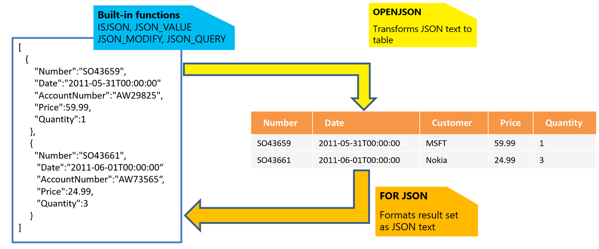

# Azure SQL 数据库中的 JSON 功能入门
使用 Azure SQL 数据库可以分析和查询以 JavaScript 对象表示法 [(JSON)](http://www.json.org/) 格式表示的数据，然后将关系数据导出为 JSON 文本。

JSON 是用于在新式 Web 与移动应用程序中交换数据的流行数据格式。JSON 还用于将半结构化数据存储在日志文件或 NoSQL 数据库（例如 [Azure DocumentDB](/home/features/documentdb/)）中。许多 REST Web 服务返回采用 JSON 文本格式的结果，或接受采用 JSON 格式的数据。大多数 Azure 服务（例如 [Azure 存储](/home/features/storage/)和 [Azure DocumentDB](/home/features/documentdb/)）都具有可返回或使用 JSON 的 REST 终结点。

使用 Azure SQL 数据库可以轻松处理 JSON 数据，将数据库与新式服务集成。

## 概述
Azure SQL 数据库提供以下函数用于处理 JSON 数据：

  

对于 JSON 文本，可以使用内置函数 [JSON\_VALUE](https://msdn.microsoft.com/zh-cn/library/dn921898.aspx)、[JSON\_QUERY](https://msdn.microsoft.com/zh-cn/library/dn921884.aspx) 和 [ISJSON](https://msdn.microsoft.com/zh-cn/library/dn921896.aspx)，从 JSON 中提取数据，或者验证 JSON 的格式是否正确。使用 [JSON\_MODIFY](https://msdn.microsoft.com/zh-cn/library/dn921892.aspx) 函数可以更新 JSON 文本中的值。对于更高级的查询和分析，[OPENJSON](https://msdn.microsoft.com/zh-cn/library/dn921885.aspx) 函数可将 JSON 对象数组转换成行集。可对返回的结果集执行任何 SQL 查询。最后，使用 [FOR JSON](https://msdn.microsoft.com/zh-cn/library/dn921882.aspx) 可将存储在关系表中的数据格式化为 JSON 文本。

## 将关系数据设置为 JSON 格式
如果 Web 服务从数据库层提取数据并以 JSON 格式提供响应，或者客户端 JavaScript 框架或库接受 JSON 格式的数据，则可以直接在 SQL 查询中将数据库内容格式化为 JSON。不再需要编写应用程序代码将 Azure SQL 数据库中的结果格式化为 JSON，也不再需要包含一些 JSON 序列化库来转换表格查询结果，然后将对象序列化为 JSON 格式。可以使用 FOR JSON 子句将 Azure SQL 数据库中的 SQL 查询结果格式化为 JSON，然后直接在应用程序中使用这种格式。

以下示例使用 FOR JSON 子句，将 Sales.Customer 表中的行格式化为 JSON：

	select CustomerName, PhoneNumber, FaxNumber
	from Sales.Customers
	FOR JSON PATH

FOR JSON PATH 子句将查询结果格式化为 JSON 文本。列名用作键，单元格值以 JSON 值的形式生成：

	[
	{"CustomerName":"Eric Torres","PhoneNumber":"(307) 555-0100","FaxNumber":"(307) 555-0101"},
	{"CustomerName":"Cosmina Vlad","PhoneNumber":"(505) 555-0100","FaxNumber":"(505) 555-0101"},
	{"CustomerName":"Bala Dixit","PhoneNumber":"(209) 555-0100","FaxNumber":"(209) 555-0101"}
	]

结果集已格式化为 JSON 数组格式，其中每行已格式化为单独的 JSON 对象。

PATH 表示可以在列别名中使用点表示法自定义 JSON 结果的输出格式。以下查询更改输出 JSON 格式中“CustomerName”键的名称，然后将电话和传真号码放入“Contact”子对象：

	select CustomerName as Name, PhoneNumber as [Contact.Phone], FaxNumber as [Contact.Fax]
	from Sales.Customers
	where CustomerID = 931
	FOR JSON PATH, WITHOUT_ARRAY_WRAPPER

此查询的输出如下所示：

	{
	    "Name":"Nada Jovanovic",
	    "Contact":{
	           "Phone":"(215) 555-0100",
	           "Fax":"(215) 555-0101"
	    }
	}

在本示例中，通过指定 [WITHOUT\_ARRAY\_WRAPPER](https://msdn.microsoft.com/zh-cn/library/mt631354.aspx) 选项返回了单个 JSON 对象而不是数组。如果确定要返回单个对象作为查询结果，可以使用此选项。

FOR JSON 子句的主要作用是从数据库返回格式化为嵌套 JSON 对象或数组的复杂分层数据。以下示例演示如何将属于 Customer 的 Orders 包含为嵌套的 Orders 数组：

	select CustomerName as Name, PhoneNumber as Phone, FaxNumber as Fax,
			Orders.OrderID, Orders.OrderDate, Orders.ExpectedDeliveryDate
	from Sales.Customers Customer
		join Sales.Orders Orders
			on Customer.CustomerID = Orders.CustomerID
	where Customer.CustomerID = 931
	FOR JSON AUTO, WITHOUT_ARRAY_WRAPPER

无需单独发送查询来获取 Customer 数据，然后再提取相关 Orders 列表，而可以通过一个查询来获取全部所需的数据，如以下示例输出中所示：

	{
	  "Name":"Nada Jovanovic",
	  "Phone":"(215) 555-0100",
	  "Fax":"(215) 555-0101",
	  "Orders":[
	    {"OrderID":382,"OrderDate":"2013-01-07","ExpectedDeliveryDate":"2013-01-08"},
	    {"OrderID":395,"OrderDate":"2013-01-07","ExpectedDeliveryDate":"2013-01-08"},
	    {"OrderID":1657,"OrderDate":"2013-01-31","ExpectedDeliveryDate":"2013-02-01"}
	]
	}

## 处理 JSON 数据
如果没有严格结构化的数据、有复杂的子对象、数组或分层数据，或者数据结构随时间演变，则可以借助 JSON 来表示任何复杂数据结构。

JSON 是一种文本格式，与其他任何字符串类型一样，可以在 Azure SQL 数据库中使用。可以将 JSON 数据作为标准 NVARCHAR 来发送或存储：

	CREATE TABLE Products (
	  Id int identity primary key,
	  Title nvarchar(200),
	  Data nvarchar(max)
	)
	go
	CREATE PROCEDURE InsertProduct(@title nvarchar(200), @json nvarchar(max))
	AS BEGIN
		insert into Products(Title, Data)
		values(@title, @json)
	END

本示例中的 JSON 数据是使用 NVARCHAR(MAX) 类型表示的。可以使用标准 Transact-SQL 语法将 JSON 插入此表，或将其用作存储过程的参数，如以下示例所示：

	EXEC InsertProduct 'Toy car', '{"Price":50,"Color":"White","tags":["toy","children","games"]}'

可以处理 Azure SQL 数据库中字符串数据的任何客户端语言或库同样也可以处理 JSON 数据。JSON 可存储在任何支持 NVARCHAR 类型的表中，例如内存优化表或者版本由系统控制的表。JSON 不会在客户端代码或数据库层中引入任何约束。

## 查询 JSON 数据
如果格式化为 JSON 的数据已存储在 Azure SQL 表中，可以通过 JSON 函数在任何 SQL 查询中使用此数据。

通过可在 Azure SQL 数据库中使用的 JSON 函数，可将格式化为 JSON 的数据视为其他任何 SQL 数据类型。可以轻松地从 JSON 文本中提取值，然后在任何查询中使用 JSON 数据：

	select Id, Title, JSON_VALUE(Data, '$.Color'), JSON_QUERY(Data, '$.tags')
	from Products
	where JSON_VALUE(Data, '$.Color') = 'White'

	update Products
	set Data = JSON_MODIFY(Data, '$.Price', 60)
	where Id = 1

JSON\_VALUE 函数从 Data 列中存储的 JSON 文本提取值。此函数使用类似于 JavaScript 的路径来引用要提取的 JSON 文本中的值。提取的值可以在 SQL 查询的任何部分中使用。

JSON\_QUERY 函数类似于 JSON\_VALUE。与 JSON\_VALUE 不同的是，此函数提取复杂的子对象，例如放置在 JSON 文本中的数组或对象。

JSON\_MODIFY 函数允许指定 JSON 文本中应该更新的值的路径，以及用于覆盖旧值的新值。这样，便可以轻松更新 JSON 文本，而无需重新分析整个结构。

由于 JSON 以标准文本存储，因此无法保证存储在文本列中的值格式正确。可以使用标准的 Azure SQL 数据库检查约束和 ISJSON 函数，来验证 JSON 列中存储的文本是否格式正确：

	ALTER TABLE Products
	    ADD CONSTRAINT [Data should be formatted as JSON]
			CHECK (ISJSON(Data) > 0)

如果输入的文本是格式正确的 JSON，ISJSON 函数将返回值 1。在每次插入或更新 JSON 列时，此约束都会验证新文本值是否为格式正确的 JSON。

## 将 JSON 转换为表格格式
Azure SQL 数据库还允许将 JSON 集合转换为表格格式，然后加载或查询 JSON 数据。

OPENJSON 是一个表值函数，可分析 JSON 文本、查找 JSON 对象数组、迭代数组的元素，然后在输出结果中针对每个数组元素返回一行。

  

在以上示例中，可以指定要在何处查找应打开的 JSON 数组（在 $.Orders 路径中）、应返回哪些列作为结果，以及要在何处查找将以单元格形式返回的 JSON 值。

可以将 @orders 变量中的 JSON 数组转换为行集、分析此结果集，或将行插入标准表中：

	CREATE PROCEDURE InsertOrders(@orders nvarchar(max))
	AS BEGIN

		insert into Orders(Number, Date, Customer, Quantity)
		select Number, Date, Customer, Quantity
		OPENJSON (@orders)
		 WITH (
				Number varchar(200),
				Date datetime,
				Customer varchar(200),
				Quantity int
		 )

	END

可以分析采用 JSON 数组格式并作为参数提供给存储过程的订单集合，然后将它插入 Orders 表。

## 后续步骤
若要了解如何将 JSON 集成到应用程序中，请参阅以下资源：

- [TechNet 博客](https://blogs.technet.microsoft.com/dataplatforminsider/2016/01/05/json-in-sql-server-2016-part-1-of-4/)
- [MSDN 文档](https://msdn.microsoft.com/zh-cn/library/dn921897.aspx)
- [第 9 频道视频](https://channel9.msdn.com/Shows/Data-Exposed/SQL-Server-2016-and-JSON-Support)

若要了解将 JSON 集成到应用程序中的各种方案，请参阅这部[第 9 频道视频](https://channel9.msdn.com/Events/DataDriven/SQLServer2016/JSON-as-a-bridge-betwen-NoSQL-and-relational-worlds)中的演示，或者在 [JSON 博客文章](http://blogs.msdn.com/b/sqlserverstorageengine/archive/tags/json/)中查找与应用场合相符的方案。

<!---HONumber=Mooncake_1212_2016-->