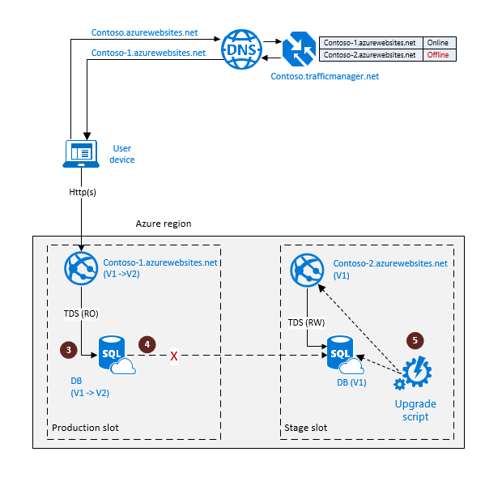

<properties
   pageTitle="云灾难恢复解决方案 - SQL 数据库活动异地复制 | Azure"
   description="了解如何使用 Azure SQL 数据库异地复制来支持云应用程序的在线升级。"
   services="sql-database"
   documentationCenter=""
   authors="anosov1960"
   manager="jhubbard"
   editor="monicar"/>

<tags
   ms.service="sql-database"
   ms.devlang="NA"
   ms.topic="article"
   ms.tgt_pltfrm="NA"
   ms.workload="NA"
   ms.date="07/16/2016"
   wacn.date="12/26/2016"
   ms.author="sashan"/>

# 使用 SQL 数据库活动异地复制管理云应用程序的滚动升级

> [AZURE.NOTE] [活动异地复制](/documentation/articles/sql-database-geo-replication-overview/) 现在可用于所有层中的所有数据库。

了解如何使用 SQL 数据库中的[异地复制](/documentation/articles/sql-database-geo-replication-overview/)来启用云应用程序的滚动升级。由于升级是中断性操作，所以它应成为业务连续性规划和设计的一部分。本文介绍了编排升级过程的两种不同方法，并讨论了每种方法的优点和缺点。针对本文的目的，我们将使用一个简单的应用程序，该应用程序包含一个连接到作为其数据层的单一数据库的网站。我们的目标是在不对最终用户体验产生任何显著影响的情况下将版本 1 的应用程序升级到版本 2。

评估升级选项时应考虑以下因素：

+ 升级过程中对应用程序可用性的影响。应用程序的功能可能受限或降级的时长。
+ 升级失败时回滚的能力。
+ 升级过程中发生灾难性错误时应用程序的漏洞问题。
+ 总的费用成本。该成本包括升级过程使用的额外冗余成本和临时组件的增量成本。

## 升级依赖于数据库备份进行灾难恢复的应用程序 

如果应用程序依赖于自动的数据库备份，并且使用异地还原来实现灾难恢复，那么通常将它部署到单个 Azure 区域。在此事例中，升级过程包括创建升级所涉及的所有应用程序组件的备份部署。若要最小化对最终用户的干扰，可以使用具有故障转移配置文件的 Azure 流量管理器 (WATM)。下图演示了升级过程开始前的操作环境。终结点 <i>contoso-1.chinacloudsites.cn</i> 表示需要升级的应用程序的一个生产槽。若要启用回滚升级功能，需要使用应用程序的完全同步副本创建过渡槽。准备应用程序升级需要执行以下步骤：

1.  为升级创建过渡槽。要执行此操作需要在同一 Azure 区域中创建一个辅助数据库 (1)，并部署相同的网站。监视此辅助数据库以查看种子设定过程是否已完成。
3.  使用作为联机终结点的 <i>contoso-1.chinacloudsites.cn</i> 和作为离线终结点的 <i>contoso-2.chinacloudsites.cn</i> 在 WATM 中创建故障转移配置文件。

> [AZURE.NOTE] 请注意，上述准备步骤不会影响生产槽中的应用程序，应用程序可以在完全访问模式下运行。

完成上述准备步骤后，就可以对应用程序进行实际升级。下图说明了升级过程所涉及的步骤。

1. 将生产槽中的主数据库设置为只读模式 (3)。这可以保证升级过程中应用程序 (V1) 的生产实例将保持只读模式，从而避免 V1 和 V2 数据库实例之间出现数据分歧。
2. 使用计划的终止模式断开辅助数据库的连接 (4) 。这将创建主数据库的完全同步独立副本。将升级该数据库。
3. 将主数据库切换为读写模式，并在过渡槽中运行升级脚本 (5)。

如果升级成功完成，那么现在就可以将最终用户切换到应用程序的暂存副本。该副本将成为应用程序的生产槽。如下图所示，该操作又包含以下几个步骤。

1. 将 WATM 配置文件中的联机终结点切换为 <i>contoso-2.chinacloudsites.cn</i>，该终结点指向网站的 V2 版本 (6) 。现在该网站成为 V2 应用程序的生产槽，最终用户流量将定向到该网站。
2. 如果不再需要 V1 应用程序组件，你可以放心地删除它们 (7)。

如果升级过程不成功（例如由于升级脚本中的错误），那么过渡槽应被视为已损坏。要将应用程序回滚到升级前的状态，只需将生产槽中的应用程序还原为完全访问模式。所涉及的步骤如下图所示。

1. 将数据库副本设置为读写模式 (8)。这可以在生产槽中还原完整的 V1 功能。
2. 执行根本原因分析，并删除过渡槽中已损坏的组件 (9)。

此时应用程序可完全正常运行，并且你可以重复上述升级步骤。

> [AZURE.NOTE] 回滚操作不需要更改 WATM 配置文件，因为它已指向作为活动终结点的 <i>contoso-1.chinacloudsites.cn</i>。

该升级方法的主要**优点**是你可以使用一系列简单步骤升级单个区域中的应用程序。此升级的费用成本相对较低。此方法的主要**缺点**在于如果升级过程中发生灾难性故障，那么恢复到升级前的状态将涉及在不同的区域重新部署应用程序，并且使用异地还原从备份中还原数据库。此过程会导致冗长的停机时间。

## 升级依赖于数据库异地复制以进行灾难恢复的应用程序

如果应用程序利用异地复制来实现业务连续性，那么该应用程序至少部署到两个不同的区域，主要区域为活动部署，备份区域为备用部署。除了前面提到的各个因素，此升级过程还必须保证：

+ 升级过程的任何时候都要保护应用程序免受灾难性故障
+ 应用程序的异地冗余组件与活动组件一同升级

为了实现这些目标，需要通过包含一个活动终结点和三个备份终结点的故障转移配置文件来使用 Azure 流量管理器 (WATM)。下图演示了升级过程开始前的操作环境。网站 <i>contoso-1.chinacloudsites.cn</i> 和 <i>contoso-dr.chinacloudsites.cn</i> 代表具有完全地理冗余的应用程序的生产槽。若要启用回滚升级功能，需要使用应用程序的完全同步副本创建过渡槽。因为你需要确保升级过程中发生灾难性故障时应用程序可以快速恢复，并且过渡槽必须也是地理冗余。准备应用程序升级需要执行以下步骤：

1.  为升级创建过渡槽。要执行此操作需要在同一 Azure 区域中创建一个辅助数据库 (1)，并部署相同的网站副本。监视此辅助数据库以查看种子设定过程是否已完成。
2.  通过将辅助数据库异地复制到备份区域（称为“链接异地复制”）在过渡槽中创建地理冗余的辅助数据库。监视此备份的辅助数据库以查看种子设定过程是否已完成 (3)。
3.  在备份区域中创建网站的备用副本，并将其链接到地理冗余的辅助数据库 (4)。
4.  将额外的终结点 <i>contoso-2.chinacloudsites.cn</i> 和 <i>contoso-3.chinacloudsites.cn</i> 作为离线终结点添加到 WATM 中的故障转移配置文件 (5)。

> [AZURE.NOTE] 请注意，上述准备步骤不会影响生产槽中的应用程序，应用程序可以在完全访问模式下运行。

完成上述准备步骤后，就可以对过渡槽进行升级了。下图显示了升级的步骤。

1. 将生产槽中的主数据库设置为只读模式 (6)。这可以保证升级过程中应用程序 (V1) 的生产实例将保持只读模式，从而避免 V1 和 V2 数据库实例之间出现数据分歧。
2. 使用计划的终止模式断开同一区域中的辅助数据库的连接 (7)。该操作将创建主数据库的完全同步独立副本，该副本将在终止后自动成为主数据库。将升级该数据库。
3. 将过渡槽中的主数据库切换为读写模式，并运行升级脚本 (8)。

如果升级成功完成，那么现在就可以将最终用户切换到应用程序的 V2 版本。下图说明了所涉及的步骤。

1. 将 WATM 配置文件中的活动终结点切换为 <i>contoso-2.chinacloudsites.cn</i>，该终结点指向网站的 V2 版本 (9)。现在该网站成为 V2 应用程序的生产槽，最终用户流量将定向到该网站。
2. 如果不再需要 V1 应用程序，你可以放心地删除它（10 和 11）。

如果升级过程不成功（例如由于升级脚本中的错误），那么过渡槽应被视为已损坏。要将应用程序回滚到升级前的状态，只需将生产槽中的应用程序还原为完全访问模式。所涉及的步骤如下图所示。

1. 将生产槽中的主数据库设置为读写模式 (12)。这可以在生产槽中还原完整的 V1 功能。
2. 执行根本原因分析，并删除过渡槽中已损坏的组件（13 和 14）。

此时应用程序可完全正常运行，并且你可以重复上述升级步骤。

> [AZURE.NOTE] 回滚操作不需要更改 WATM 配置文件，因为它已指向作为活动终结点的 <i>contoso-1.chinacloudsites.cn</i>。

此升级方法的主要**优点**是可以同时升级应用程序及其异地冗余副本，并且不会在升级过程中破坏业务连续性。此方法的主要**缺点**是它需要每个应用程序组件的双倍冗余，因此会导致更高的费用成本。它还涉及更复杂的工作流。

## 摘要

本文中所述的两种升级方法具有不同的复杂性和费用成本，但它们都关注于最小化最终用户仅限于执行只读操作的时间。该时间由升级脚本的持续时间直接定义。该时间不依赖于数据库大小、所选的服务层、网站配置和无法轻松控制的其他因素。这是因为所有准备步骤都从升级步骤中分离出来，可以在不影响生产应用程序的情况下完成。升级脚本的效率是决定升级期间最终用户体验的关键因素。因此改进升级的最佳做法是致力于尽可能地提高升级脚本的效率。

## 后续步骤

- 有关业务连续性的概述和应用场景，请参阅[业务连续性概述](/documentation/articles/sql-database-business-continuity/)
- 若要了解 Azure SQL 数据库自动备份，请参阅 [SQL 数据库自动备份](/documentation/articles/sql-database-automated-backups/)
- 若要了解如何使用自动备份进行恢复，请参阅[从自动备份中还原数据库](/documentation/articles/sql-database-recovery-using-backups/)
- 若要了解更快的恢复选项，请参阅[活动异地复制](/documentation/articles/sql-database-geo-replication-overview/)
- 若要了解如何使用自动备份进行存档，请参阅[数据库复制](/documentation/articles/sql-database-copy/)

## 其他资源

以下页可帮助你了解执行升级工作流所需的具体操作：

- [添加辅助数据库](https://msdn.microsoft.com/zh-cn/library/azure/mt603689.aspx)
- [将数据库故障转移到辅助数据库](https://msdn.microsoft.com/zh-cn/library/azure/mt619393.aspx)
- [断开异地复制辅助数据库的连接](https://msdn.microsoft.com/zh-cn/library/azure/mt603457.aspx)
- [异地还原数据库](https://msdn.microsoft.com/zh-cn/library/azure/mt693390.aspx)
- [删除数据库](https://msdn.microsoft.com/zh-cn/library/azure/mt619368.aspx)
- [复制数据库](https://msdn.microsoft.com/zh-cn/library/azure/mt603644.aspx)
- [将数据库设置为只读或读写模式](https://msdn.microsoft.com/zh-cn/library/bb522682.aspx)

<!---HONumber=Mooncake_Quality_Review_1215_2016-->