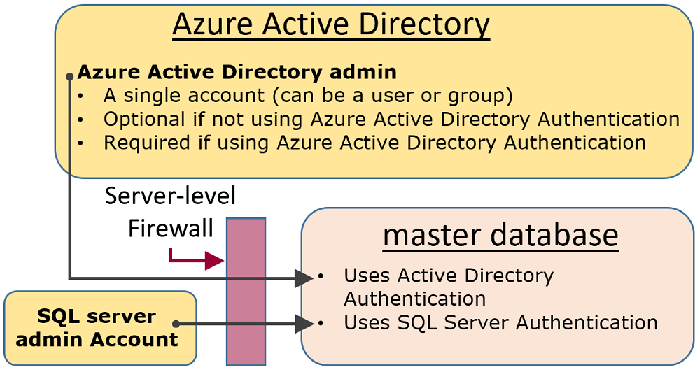
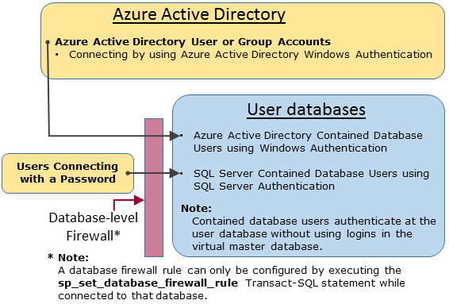

<properties
   pageTitle="SQL 数据库身份验证和授权：授予访问权限 | Azure"
   description="了解 SQL 数据库安全管理，特别是如何通过服务器级的主体帐户管理数据库的访问和登录安全。"
   keywords="sql 数据库安全,数据库安全管理,登录安全,数据库安全,数据库访问权限"
   services="sql-database"
   documentationCenter=""
   authors="BYHAM"
   manager="jhubbard"
   editor=""
   tags=""/>

<tags
   ms.service="sql-database"
   ms.devlang="na"
   ms.topic="article"
   ms.tgt_pltfrm="na"
   ms.workload="data-management"
   ms.date="09/14/2016"
   wacn.date="11/18/2016"
   ms.author="rickbyh"/>  

# SQL 数据库身份验证和授权：授予访问权限 

> [AZURE.SELECTOR]
- [入门教程](/documentation/articles/sql-database-get-started-security/)
- [授予访问权限](/documentation/articles/sql-database-manage-logins/)

本文概述针对管理员、非管理员以及各种角色的 SQL 数据库访问权限概念。

## 非受限管理帐户

有两种可能的管理帐户，可通过这两种帐户在权限不受限制的情况下访问虚拟 master 数据库以及所有用户数据库。这些帐户称为服务器级主体帐户。

### Azure SQL 数据库订户帐户 

创建逻辑 SQL 实例时会创建单个登录帐户，称为“SQL 数据库订户帐户”。此帐户通过 SQL Server 身份验证（用户名和密码）进行连接。此帐户为管理员，负责管理逻辑服务器实例以及所有附加到该实例的用户数据库。不能限制订户帐户的权限。此类帐户只能存在一个。

### Azure Active Directory 管理员
也可以将某个 Azure Active Directory 帐户配置为管理员。此帐户可以是单个 Azure AD 用户，也可以是包含多个 Azure AD 用户的 Azure AD 组。配置 Azure AD 管理员是选择性的，但如果需要使用 Windows Authentication for Azure AD 帐户连接到 SQL 数据库，则必须配置 Azure AD 管理员。有关配置 Azure Active Directory 访问权限的详细信息，请参阅[使用 Azure Active Directory 身份验证连接到 SQL 数据库或 SQL 数据仓库](/documentation/articles/sql-database-aad-authentication/)。

### 配置防火墙
配置服务器级防火墙后，Azure SQL 数据库订户帐户和 Azure Active Directory 帐户可以连接到 master 数据库以及所有用户数据库。可以通过门户配置服务器级防火墙。建立连接以后，还可以使用 [sp\_set\_firewall\_rule](https://msdn.microsoft.com/zh-cn/library/dn270017.aspx) Transact-SQL 语句配置其他服务器级防火墙规则。有关如何配置防火墙的详细信息，请参阅[如何：使用 Azure PowerShell 配置 Azure SQL 数据库防火墙](/documentation/articles/sql-database-configure-firewall-settings-powershell/)。

### 管理员访问路径

对服务器级防火墙进行适当配置以后，SQL 数据库订户帐户和 Azure Active Directory SQL Server 管理员可以使用 SQL Server Management Studio 或 SQL Server Data Tools 等客户端工具进行连接。仅最新工具提供所有的特性和功能。下图显示了这两个管理员帐户的典型配置。
	

使用服务器级防火墙中的开放端口时，管理员可以连接到任何 SQL 数据库。

### 通过使用 SQL Server Management Studio 连接到数据库
有关如何使用 SQL Server Management Studio 进行连接的详细说明，请参阅[使用 SQL Server Management Studio 连接到 SQL 数据库并执行示例 T-SQL 查询](/documentation/articles/sql-database-connect-query-ssms/)。

> [AZURE.IMPORTANT] 建议始终使用最新版本的 Management Studio 以保持与 Azure 和 SQL 数据库的更新同步。[更新 SQL Server Management Studio](https://msdn.microsoft.com/zh-cn/library/mt238290.aspx)。

## 其他特殊帐户
SQL 数据库在虚拟 master 数据库中提供了两个受限管理角色，可以向这两个角色添加用户帐户。

### 数据库创建者
管理帐户可以创建新数据库。若要创建其他可以创建数据库的帐户，必须在 master 中创建一个用户，然后将该用户添加到特殊的 **dbmanager** 数据库角色。该用户可以是包含的数据库用户，也可以是虚拟 master 数据库中基于 SQL Server 登录名的用户。

1.	使用管理员帐户连接到虚拟 master 数据库。
2.	可选步骤：使用 [CREATE LOGIN](https://msdn.microsoft.com/zh-cn/library/ms189751.aspx) 语句创建 SQL Server 身份验证登录名。示例语句：

     
     	CREATE LOGIN Mary WITH PASSWORD = '<strong_password>';
     

     > [AZURE.NOTE] 创建登录名或包含数据库用户时必须使用强密码。有关详细信息，请参阅[强密码](https://msdn.microsoft.com/zh-cn/library/ms161962.aspx)。

    为了提高性能，会暂时在数据库级别缓存登录名（服务器级主体）。若要刷新身份验证缓存，请参阅 [DBCC FLUSHAUTHCACHE](https://msdn.microsoft.com/zh-cn/library/mt627793.aspx)。

3.	在虚拟 master 数据库中，使用 [CREATE USER](https://msdn.microsoft.com/zh-cn/library/ms173463.aspx) 语句创建用户。该用户可以是 Azure Active Directory 身份验证包含数据库用户（如果你已针对 Azure AD 身份验证配置了环境），可以是 SQL Server 身份验证包含数据库用户，也可以是基于 SQL Server 身份验证登录名（在前一步骤中创建）的 SQL Server 身份验证用户。 示例语句：

     
	     CREATE USER [mike@contoso.com] FROM EXTERNAL PROVIDER;
	     CREATE USER Tran WITH PASSWORD = '<strong_password>';
	     CREATE USER Mary FROM LOGIN Mary; 
     

4.	使用 [ALTER ROLE](https://msdn.microsoft.com/zh-cn/library/ms189775.aspx) 语句将新用户添加到 **dbmanager** 数据库角色。示例语句：

	     ALTER ROLE dbmanager ADD MEMBER Mary; 
	     ALTER ROLE dbmanager ADD MEMBER [mike@contoso.com];

     > [AZURE.NOTE] dbmanager 是虚拟 master 数据库中的数据库角色，因此只能向该 dbmanager 角色添加用户。不能向数据库级角色添加服务器级登录名。

5.	必要时，可将服务器级防火墙配置为允许新用户进行连接。

现在，用户可以连接到虚拟 master 数据库，并且可以创建新数据库。创建数据库的帐户成为该数据库的所有者。

### 登录名管理器

如果愿意，可以完成相同的步骤（创建登录名和用户，然后向 **loginmanager** 角色添加用户），允许用户在虚拟 master 数据库中创建新的登录名。一般而言，没有必要进行此操作，我们建议使用包含数据库用户在数据库级进行身份验证，不必使用基于登录名的用户。有关详细信息，请参阅[包含的数据库用户 - 使你的数据库可移植](https://msdn.microsoft.com/zh-cn/library/ff929188.aspx)。

## 非管理员用户

非管理员帐户通常不需访问虚拟 master 数据库。使用 [CREATE USER (Transact-SQL)](https://msdn.microsoft.com/zh-cn/library/ms173463.aspx) 语句在数据库级别创建包含数据库用户。该用户可以是 Azure Active Directory 身份验证包含数据库用户（如果你已针对 Azure AD 身份验证配置了环境），可以是 SQL Server 身份验证包含数据库用户，也可以是基于 SQL Server 身份验证登录名（在前一步骤中创建）的 SQL Server 身份验证用户。 有关详细信息，请参阅[包含的数据库用户 - 使你的数据库可移植](https://msdn.microsoft.com/zh-cn/library/ff929188.aspx)。

若要创建用户，请先连接到数据库，然后执行如下所示的语句：

	CREATE USER Mary FROM LOGIN Mary; 
	CREATE USER [mike@contoso.com] FROM EXTERNAL PROVIDER;

开始时，仅其中一个管理员或数据库所有者可以创建用户。若要授权其他用户来创建新用户，可通过如下所示语句向该选定用户授予 `ALTER ANY USER` 权限：

	GRANT ALTER ANY USER TO Mary;

若要向其他用户授予对数据库的完全控制权限，可通过 `ALTER ROLE` 语句让这些用户成为 **db\_owner** 固定数据库角色的成员。

> [AZURE.NOTE] 根据登录名创建数据库用户的主要原因是，有时 SQL Server 身份验证用户需要访问多个数据库。基于登录名的用户与登录名绑定，并且只为该登录名保留一个密码。各个数据库中的包含数据库用户都是单个的实体，且均保留各自的密码。如果包含数据库用户的密码不相同，则可能会给这些用户造成混淆。

### 配置数据库级防火墙

最好是规定非管理员用户只能通过防火墙来访问所使用的数据库。可以使用 [sp\_set\_database\_firewall\_rule](https://msdn.microsoft.com/zh-cn/library/dn270010.aspx) 语句来配置数据库级防火墙，而不必通过服务器级防火墙来授权其 IP 地址访问所有数据库。不能通过门户来配置数据库级防火墙。

### 非管理员访问路径

对数据库级防火墙进行适当配置以后，数据库用户即可使用 SQL Server Management Studio 或 SQL Server Data Tools 这样的客户端工具进行连接。仅最新工具提供所有的特性和功能。下图显示了典型的非管理员访问路径。

 
## 组和角色
有效的访问管理需要将权限分配到组和角色，而不是分配到单个用户。例如，使用 Azure Active Directory 身份验证时，需执行以下操作：

- 将 Azure Active Directory 用户置于 Azure Active Directory 组中。为该组创建包含数据库用户。将一个或多个数据库用户放到一个数据库角色中。然后将权限分配给该数据库角色。

使用 SQL Server 身份验证时，需执行以下操作：

- 在数据库中创建包含数据库用户。将一个或多个数据库用户放到一个数据库角色中。然后将权限分配给该数据库角色。

数据库角色可以是内置的角色，例如 **db\_owner**、**db\_ddladmin**、**db\_datawriter**、**db\_datareader**、**db\_denydatawriter** 和 **db\_denydatareader**。**db\_owner** 通常用于向部分用户授予完全权限。其他固定数据库角色可用于快速开发简单的数据库，但不建议用于大多数生产数据库。例如，**db\_datareader** 固定数据库角色授予用户对数据库中每个表的读取访问权限，这通常超出了必要的范畴。而如果先使用 [CREATE ROLE](https://msdn.microsoft.com/zh-cn/library/ms187936.aspx) 语句创建自己的用户定义数据库角色，然后再根据业务需要向每个角色授予所需的最低权限，则要合适得多。如果用户是多个角色的成员，则会聚合所有这些角色的权限。

## 权限

可以在 SQL 数据库中单独授予或拒绝 100 多种权限。这些权限中，许多都是嵌套式的。例如，针对架构的 `UPDATE` 权限包括针对该架构中每个表的 `UPDATE` 权限。与大多数权限系统中的情况一样，拒绝某个权限将覆盖对该权限的授予操作。考虑到权限的嵌套性质和数目，可能需要进行仔细的研究才能设计出适当的权限系统，以便对你的数据库进行恰当的保护。一开始可以了解[权限（数据库引擎）](https://msdn.microsoft.com/zh-cn/library/ms191291.aspx)中的权限列表，然后查看这些权限的[海报大小的图](http://go.microsoft.com/fwlink/?LinkId=229142)。

## 后续步骤

[保护你的 SQL 数据库](/documentation/articles/sql-database-security/)

[创建表（教程）](https://msdn.microsoft.com/zh-cn/library/ms365315.aspx)

[插入和更新表中的数据（教程）](https://msdn.microsoft.com/zh-cn/library/ms365309.aspx)

[读取表中的数据（教程）](https://msdn.microsoft.com/zh-cn/library/ms365310.aspx)

[创建视图和存储过程](https://msdn.microsoft.com/zh-cn/library/ms365311.aspx)

[授予访问数据库对象的权限](https://msdn.microsoft.com/zh-cn/library/ms365327.aspx)

## 其他资源

[保护你的 SQL 数据库](/documentation/articles/sql-database-security/)

[SQL Server 数据库引擎和 Azure SQL 数据库安全中心](https://msdn.microsoft.com/zh-cn/library/bb510589.aspx)

<!---HONumber=Mooncake_Quality_Review_1118_2016-->