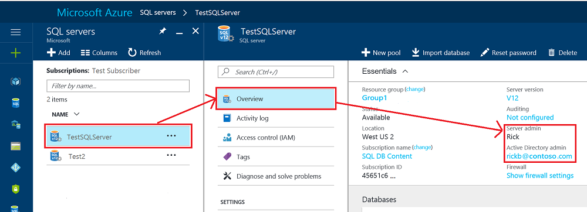

<properties
    pageTitle="Azure SQL 登录名和用户 | Azure"
    description="了解 SQL 数据库安全管理，特别是如何通过服务器级的主体帐户管理数据库的访问和登录安全。"
    keywords="sql 数据库安全,数据库安全管理,登录安全,数据库安全,数据库访问权限"
    services="sql-database"
    documentationcenter=""
    author="BYHAM"
    manager="jhubbard"
    editor=""
    tags="" />
<tags
    ms.assetid="0a65a93f-d5dc-424b-a774-7ed62d996f8c"
    ms.service="sql-database"
    ms.custom="authentication and authorization"
    ms.devlang="na"
    ms.topic="article"
    ms.tgt_pltfrm="na"
    ms.workload="data-management"
    ms.date="01/23/2017"
    wacn.date="03/24/2017"
    ms.author="rickbyh" />  

# 控制和授予数据库访问权限

配置防火墙规则后，可以使用某个管理员帐户、数据库所有者或数据库中数据库用户的身份连接到 SQL 数据库。

>[AZURE.NOTE]  
 本主题适用于 Azure SQL 服务器，同时也适用于在 Azure SQL 服务器中创建的 SQL 数据库和 SQL 数据仓库数据库。为简单起见，在提到 SQL 数据库和 SQL 数据仓库时，本文统称 SQL 数据库。

> [AZURE.TIP]
>有关如何使用 SQL Server 身份验证的教程，请参阅[教程：SQL Server 身份验证](/documentation/articles/sql-database-control-access-sql-authentication-get-started/)。有关如何使用 Azure Active Directory 身份验证的教程，请参阅[教程：AAD 身份验证](/documentation/articles/sql-database-control-access-aad-authentication-get-started/)。
>

## 非受限管理帐户
有两个充当管理员的管理帐户（**服务器管理员**和 **Active Directory 管理员**）。若要在 SQL 服务器中识别这些管理员帐户，请打开 Azure 门户预览并导航到 SQL 服务器的属性。

  

- **服务器管理员**创建 Azure SQL 服务器时，必须指定**服务器管理员登录名**。SQL 服务器创建该帐户作为 master 数据库中的登录名。此帐户通过 SQL Server 身份验证（用户名和密码）进行连接。此类帐户只能存在一个。
- **Azure Active Directory 管理员**也可以将某个 Azure Active Directory 帐户（个人帐户或安全组帐户）配置为管理员。配置 Azure AD 管理员是选择性的，但如果需要使用 Azure AD 帐户连接到 SQL 数据库，则必须配置 Azure AD 管理员。有关配置 Azure Active Directory 访问权限的详细信息，请参阅[使用 Azure Active Directory 身份验证连接到 SQL 数据库或 SQL 数据仓库](/documentation/articles/sql-database-aad-authentication/)和 [SQL 数据库和 SQL 数据仓库针对 Azure AD MFA 的 SSMS 支持](/documentation/articles/sql-database-ssms-mfa-authentication/)。
 

**服务器管理员**和 **Azure AD 管理员**帐户具有以下特征：
- 只有这些帐户才能自动连接到服务器上的任何 SQL 数据库。（其他帐户若要连接到用户数据库，它们必须是数据库的所有者，或者在用户数据库中具有相应的用户帐户。）
- 这些帐户将以 `dbo` 用户的身份进入用户数据库，在用户数据库中拥有所有权限。（用户数据库的所有者也以 `dbo` 用户的身份进入数据库。）
- 这些帐户不会以 `dbo` 用户的身份进入 `master` 数据库，在 master 数据库中拥有受限的权限。
- 这些帐户不是标准 SQL Server `sysadmin` 固定服务器角色的成员，SQL 数据库中不提供此角色。
- 这些帐户可以在 master 数据库和服务器级防火墙规则中创建、更改及删除数据库、登录名与用户。
- 这些帐户可在 `dbmanager` 与 `loginmanager` 角色中添加和删除成员。
- 这些帐户可以查看 `sys.sql_logins` 系统表。

### 配置防火墙
为单个 IP 地址或地址范围配置服务器级防火墙后，**SQL 服务器管理员**和 **Azure Active Directory 管理员**可以连接到 master 数据库以及所有用户数据库。初始服务器级防火墙可通过 [Azure 门户预览](/documentation/articles/sql-database-configure-firewall-settings/)、[PowerShell](/documentation/articles/sql-database-configure-firewall-settings-powershell/) 或 [REST API](/documentation/articles/sql-database-configure-firewall-settings-rest/) 进行配置。建立连接以后，还可以使用 [Transact-SQL](/documentation/articles/sql-database-configure-firewall-settings-tsql/) 配置其他服务器级防火墙规则。

### 管理员访问路径
适当地配置服务器级防火墙后，**SQL 服务器管理员**和 **Azure Active Directory 管理员**可以使用 SQL Server Management Studio 或 SQL Server Data Tools 等客户端工具进行连接。仅最新工具提供所有的特性和功能。下图显示了这两个管理员帐户的典型配置。

  

使用服务器级防火墙中的开放端口时，管理员可以连接到任何 SQL 数据库。

### 通过使用 SQL Server Management Studio 连接到数据库
有关创建服务器、数据库和服务器级防火墙规则，以及使用 SQL Server Management Studio 查询数据库的演练，请参阅[通过 Azure 门户和 SQL Server Management Studio 开始使用 Azure SQL 数据库服务器、数据库和防火墙规则](/documentation/articles/sql-database-get-started/)。

> [AZURE.IMPORTANT] 建议始终使用最新版本的 Management Studio 以与 Azure 和 SQL 数据库的更新保持同步。[更新 SQL Server Management Studio](https://msdn.microsoft.com/zh-cn/library/mt238290.aspx)。

## 其他服务器级管理角色
除了上述服务器级管理角色以外，SQL 数据库还在可以添加用户帐户的 master 数据库中提供了两个受限的管理角色，这些角色可授予创建数据库或管理登录名的权限。

### 数据库创建者
其中一个管理角色是 **dbmanager** 角色。此角色的成员可以创建新数据库。若要使用此角色，请在 `master` 数据库中创建一个用户，然后将该用户添加到 **dbmanager** 数据库角色。若要创建数据库，用户必须是 master 数据库中基于 SQL Server 登录名的用户，或者是基于 Azure Active Directory 用户的包含数据库用户。

1.	使用管理员帐户连接到 master 数据库。
2.	可选步骤：使用 [CREATE LOGIN](https://msdn.microsoft.com/zh-cn/library/ms189751.aspx) 语句创建 SQL Server 身份验证登录名。示例语句：

     
     	CREATE LOGIN Mary WITH PASSWORD = '<strong_password>';
     

     > [AZURE.NOTE] 创建登录名或包含数据库用户时使用强密码。有关详细信息，请参阅[强密码](https://msdn.microsoft.com/zh-cn/library/ms161962.aspx)。

    为了提高性能，会暂时在数据库级别缓存登录名（服务器级主体）。若要刷新身份验证缓存，请参阅 [DBCC FLUSHAUTHCACHE](https://msdn.microsoft.com/zh-cn/library/mt627793.aspx)。

3.	在 master 数据库中，使用 [CREATE USER](https://msdn.microsoft.com/zh-cn/library/ms173463.aspx) 语句创建用户。该用户可以是 Azure Active Directory 身份验证包含数据库用户（如果你已针对 Azure AD 身份验证配置了环境），可以是 SQL Server 身份验证包含数据库用户，也可以是基于 SQL Server 身份验证登录名（在前一步骤中创建）的 SQL Server 身份验证用户。 示例语句：

     
	     CREATE USER [mike@contoso.com] FROM EXTERNAL PROVIDER;
	     CREATE USER Tran WITH PASSWORD = '<strong_password>';
	     CREATE USER Mary FROM LOGIN Mary; 
     

4.	使用 [ALTER ROLE](https://msdn.microsoft.com/zh-cn/library/ms189775.aspx) 语句将新用户添加到 **dbmanager** 数据库角色。示例语句：

	     ALTER ROLE dbmanager ADD MEMBER Mary; 
	     ALTER ROLE dbmanager ADD MEMBER [mike@contoso.com];

     > [AZURE.NOTE] dbmanager 是 master 数据库中的数据库角色，因此只能向该 dbmanager 角色添加数据库用户。不能向数据库级角色添加服务器级登录名。

5.	必要时，可将防火墙规则配置为允许新用户建立连接。（可在现有防火墙规则中包括新用户。）

现在，该用户可以连接到 master 数据库，并且可以创建新数据库。创建数据库的帐户成为该数据库的所有者。

### 登录名管理器

另一个管理角色是登录管理员角色。此角色的成员可在 master 数据库中创建新登录名。如果需要，可以完成相同的步骤（创建登录名和用户，然后向 **loginmanager** 角色添加用户），使用户能够在 master 数据库中创建新登录名。通常不必要创建登录名，因为我们建议使用包含的数据库用户在数据库级别进行身份验证，而不要使用基于登录名的用户。有关详细信息，请参阅[包含的数据库用户 - 使你的数据库可移植](https://msdn.microsoft.com/zh-cn/library/ff929188.aspx)。

## 非管理员用户

非管理员帐户通常无需访问 master 数据库。使用 [CREATE USER (Transact-SQL)](https://msdn.microsoft.com/zh-cn/library/ms173463.aspx) 语句在数据库级别创建包含数据库用户。该用户可以是 Azure Active Directory 身份验证包含数据库用户（如果你已针对 Azure AD 身份验证配置了环境），可以是 SQL Server 身份验证包含数据库用户，也可以是基于 SQL Server 身份验证登录名（在前一步骤中创建）的 SQL Server 身份验证用户。 有关详细信息，请参阅[包含的数据库用户 - 使你的数据库可移植](https://msdn.microsoft.com/zh-cn/library/ff929188.aspx)。

若要创建用户，请先连接到数据库，然后执行如下所示的语句：

	CREATE USER Mary FROM LOGIN Mary; 
	CREATE USER [mike@contoso.com] FROM EXTERNAL PROVIDER;

开始时，仅其中一个管理员或数据库所有者可以创建用户。若要授权其他用户来创建新用户，可通过如下所示语句向该选定用户授予 `ALTER ANY USER` 权限：

	GRANT ALTER ANY USER TO Mary;

若要向其他用户授予对数据库的完全控制权限，可通过 `ALTER ROLE` 语句让这些用户成为 **db\_owner** 固定数据库角色的成员。

> [AZURE.NOTE] 根据登录名创建数据库用户的最常见原因是 SQL Server 身份验证用户需要访问多个数据库。基于登录名的用户与登录名绑定，并且只为该登录名保留一个密码。各个数据库中的包含数据库用户都是单个的实体，且均保留各自的密码。如果包含数据库用户的密码不相同，则可能会给这些用户造成混淆。

### 配置数据库级防火墙

最好是规定非管理员用户只能通过防火墙来访问所使用的数据库。可以使用 [sp\_set\_database\_firewall\_rule](https://msdn.microsoft.com/zh-cn/library/dn270010.aspx) 语句来配置数据库级防火墙，而不必通过服务器级防火墙来授权其 IP 地址访问所有数据库。不能通过门户来配置数据库级防火墙。

### 非管理员访问路径
对数据库级防火墙进行适当配置以后，数据库用户即可使用 SQL Server Management Studio 或 SQL Server Data Tools 这样的客户端工具进行连接。仅最新工具提供所有的特性和功能。下图显示了典型的非管理员访问路径。

 
## 组和角色
有效的访问管理需要将权限分配到组和角色，而不是分配到单个用户。

- 使用 Azure Active Directory 身份验证时，请将 Azure Active Directory 用户放入 Azure Active Directory 组。为该组创建包含数据库用户。将一个或多个数据库用户添加到[数据库角色](https://msdn.microsoft.com/zh-cn/library/ms189121)，然后向数据库角色分配[权限](https://msdn.microsoft.com/zh-cn/library/ms191291.aspx)。

- 使用 SQL Server 身份验证时，请在数据库中创建包含的数据库用户。将一个或多个数据库用户添加到[数据库角色](https://msdn.microsoft.com/zh-cn/library/ms189121)，然后向数据库角色分配[权限](https://msdn.microsoft.com/zh-cn/library/ms191291.aspx)。

数据库角色可以是内置的角色，例如 **db\_owner**、**db\_ddladmin**、**db\_datawriter**、**db\_datareader**、**db\_denydatawriter** 和 **db\_denydatareader**。**db\_owner** 通常用于向部分用户授予完全权限。其他固定数据库角色可用于快速开发简单的数据库，但不建议用于大多数生产数据库。例如，**db\_datareader** 固定数据库角色授予用户对数据库中每个表的读取访问权限，这通常超出了必要的范畴。而如果先使用 [CREATE ROLE](https://msdn.microsoft.com/zh-cn/library/ms187936.aspx) 语句创建自己的用户定义数据库角色，然后再根据业务需要向每个角色授予所需的最低权限，则要合适得多。如果用户是多个角色的成员，则会聚合所有这些角色的权限。

## 权限
可以在 SQL 数据库中单独授予或拒绝 100 多种权限。这些权限中，许多都是嵌套式的。例如，针对架构的 `UPDATE` 权限包括针对该架构中每个表的 `UPDATE` 权限。与大多数权限系统中的情况一样，拒绝某个权限将覆盖对该权限的授予操作。考虑到权限的嵌套性质和数目，可能需要进行仔细的研究才能设计出适当的权限系统，以便对你的数据库进行恰当的保护。一开始可以了解[权限（数据库引擎）](https://msdn.microsoft.com/zh-cn/library/ms191291.aspx)中的权限列表，然后查看这些权限的[海报大小的图](http://go.microsoft.com/fwlink/?LinkId=229142)。

### 注意事项和限制
管理 SQL 数据库中的登录名和用户时，请注意以下事项：

* 执行 `CREATE/ALTER/DROP DATABASE` 语句时，必须连接到 **master** 数据库。
* 不能更改或删除与**服务器管理员**登录名相对应的数据库用户。
* 美国英语是**服务器管理员**登录名的默认语言。
* 只有管理员（**服务器管理员**登录名或 Azure AD 管理员）和 **master** 数据库中 **dbmanager** 数据库角色的成员才有权执行 `CREATE DATABASE` 和 `DROP DATABASE` 语句。
* 执行 `CREATE/ALTER/DROP LOGIN` 语句时，必须连接到 master 数据库。但不建议使用登录名。改用包含的数据库用户。
* 若要连接到用户数据库，必须在连接字符串中提供数据库的名称。
* 只有服务器级别主体登录名和 **master** 数据库中 **loginmanager** 数据库角色的成员才有权执行 `CREATE LOGIN`、`ALTER LOGIN` 和 `DROP LOGIN` 语句。
* 在 ADO.NET 应用程序中执行 `CREATE/ALTER/DROP LOGIN` 和 `CREATE/ALTER/DROP DATABASE` 语句时，不允许使用参数化命令。有关详细信息，请参阅[命令和参数](https://msdn.microsoft.com/zh-cn/library/ms254953.aspx)。
* 在执行 `CREATE/ALTER/DROP DATABASE` 和 `CREATE/ALTER/DROP LOGIN` 语句时，上述每个语句都必须是 Transact-SQL 批处理中的唯一语句。否则将会出错。例如，以下 Transact-SQL 将检查该数据库是否存在。如果该数据库存在，则调用 `DROP DATABASE` 语句删除该数据库。因为 `DROP DATABASE` 语句不是该批处理中的唯一语句，所以执行以下 Transact-SQL 将导致错误。

	  IF EXISTS (SELECT [name]
	           FROM   [sys].[databases]
	           WHERE  [name] = N'database_name')
	  DROP DATABASE [database_name];
	  GO

* 在使用 `FOR/FROM LOGIN` 选项执行 `CREATE USER` 语句时，该语句必须是 Transact-SQL 批处理中的唯一语句。
* 在使用 `WITH LOGIN` 选项执行 `ALTER USER` 语句时，该语句必须是 Transact-SQL 批处理中的唯一语句。
* 若要执行 `CREATE/ALTER/DROP` 操作，用户需要对数据库拥有 `ALTER ANY USER` 权限。
* 在数据库角色的所有者尝试在该数据库角色中添加或删除其他数据库用户时，可能会发生以下错误：“此数据库中不存在用户或角色‘Name’”。 在用户对所有者不可见时，将会发生此错误。若要解决此问题，请向角色所有者授予对该用户的 `VIEW DEFINITION` 权限。

## 后续步骤

- 有关防火墙规则的详细信息，请参阅 [Azure SQL 数据库防火墙](/documentation/articles/sql-database-firewall-configure/)。
- 有关所有 SQL 数据库安全功能的概述，请参阅 [SQL 安全概述](/documentation/articles/sql-database-security-overview/)。
- 有关教程，请参阅 [SQL 安全入门](/documentation/articles/sql-database-control-access-sql-authentication-get-started/)
- 有关视图和存储过程的信息，请参阅[创建视图和存储过程](https://msdn.microsoft.com/zh-cn/library/ms365311.aspx)
- 有关授予数据库对象访问权限的信息，请参阅[授予数据库对象访问权限](https://msdn.microsoft.com/zh-cn/library/ms365327.aspx)
- 有关如何使用 SQL Server 身份验证的教程，请参阅[教程：SQL Server 身份验证](/documentation/articles/sql-database-control-access-sql-authentication-get-started/)。
- 有关如何使用 Azure Active Directory 身份验证的教程，请参阅[教程：AAD 身份验证](/documentation/articles/sql-database-control-access-aad-authentication-get-started/)。

<!---HONumber=Mooncake_0320_2017-->
<!--Update_Description: wording update-->