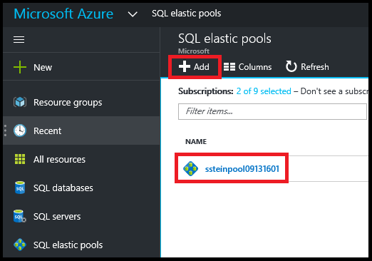
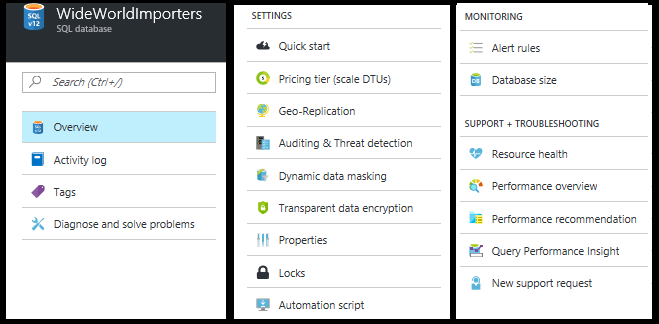
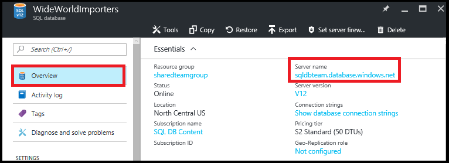
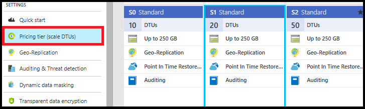
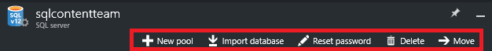

<properties
	pageTitle="使用 Azure 门户预览管理 Azure SQL 数据库"
	description="了解如何使用 Azure 门户预览管理云中的关系数据库。"
	services="sql-database"
	documentationCenter=""
	authors="stevestein"
	manager="jhubbard"
	editor=""/>

<tags
	ms.service="sql-database"
	ms.devlang="NA"
	ms.workload="data-management"
	ms.topic="article"
	ms.tgt_pltfrm="NA"
	ms.date="09/14/2016"
	wacn.date="10/17/2016"
	ms.author="sstein"/>  

# 使用 Azure 门户预览管理 Azure SQL 数据库

> [AZURE.SELECTOR]
- [Azure 门户预览](/documentation/articles/sql-database-manage-portal/)
- [SSMS](/documentation/articles/sql-database-manage-azure-ssms/)
- [PowerShell](/documentation/articles/sql-database-command-line-tools/)

在 [Azure 门户预览](https://portal.azure.cn)中，可以创建、监视和管理 Azure SQL 数据库与服务器。本文提供常见任务的快速说明和详细信息的链接。

## 查看 Azure SQL 数据库、服务器和池

若要查看可用的 SQL 数据库服务，请单击“更多服务”，然后在搜索框中键入 **SQL**：

  

## 如何创建或查看 Azure SQL 数据库？

若要打开“SQL 数据库”边栏选项卡，请单击“SQL 数据库”，然后单击要使用的数据库，或单击“+添加”创建 SQL 数据库。有关详细信息，请参阅 [Create a SQL database in minutes by using the Azure portal](/documentation/articles/sql-database-get-started/)（使用 Azure 门户预览在几分钟内创建 SQL 数据库）。

  

## 如何创建或查看 Azure SQL 服务器？

若要打开“SQL 服务器”边栏选项卡，请单击“SQL 服务器”，然后单击要使用的服务器，或单击“+添加”创建 SQL 服务器。有关详细信息，请参阅 [Create a SQL database in minutes by using the Azure portal](/documentation/articles/sql-database-get-started/)（使用 Azure 门户预览在几分钟内创建 SQL 数据库）。

  

## 如何创建或查看 SQL 弹性池？

若要打开“SQL 弹性池”边栏选项卡，请单击“SQL 弹性池”，然后单击要使用的池，或单击“+添加”创建池。有关详细信息，请参阅 [Create an elastic database pool with the Azure portal](/documentation/articles/sql-database-elastic-pool-create-portal/)（使用 Azure 门户预览创建弹性数据库池）。

  

## 如何更新或查看 SQL 数据库设置？

若要查看或更新数据库设置，请在“SQL 数据库”边栏选项卡中单击所需的设置：

  

## 如何查找 SQL 数据库的完整限定服务器名称？

若要查看数据库服务器名称，请在“SQL 数据库”边栏选项卡中单击“概述”，然后记下服务器名称：

  

## 如何管理防火墙规则以控制 SQL 服务器和数据库的访问权限？

若要查看、创建或更新防火墙规则，请在“SQL 数据库”边栏选项卡中单击“设置服务器防火墙”。有关详细信息，请参阅 [Configure an Azure SQL Database server-level firewall rule using the Azure portal](/documentation/articles/sql-database-configure-firewall-settings/)（使用 Azure 门户预览配置 Azure SQL 数据库服务器级防火墙规则）。

  

## 如何更改 SQL 数据库服务层或性能级别？

若要更新 SQL 数据库的服务层或性能级别，请在“SQL 数据库”边栏选项卡中单击“定价层(缩放 DTU)”。有关详细信息，请参阅 [Change the service tier and performance level (pricing tier) of a SQL database](/documentation/articles/sql-database-scale-up/)（更改 SQL 数据库的服务层和性能级别（定价层））。

  

## 如何为 SQL 数据库配置审核和威胁检测？

若要为 SQL 数据库配置审核和威胁检测，请在“SQL 数据库”边栏选项卡中单击“审核与威胁检测”。有关详细信息，请参阅 [Get started with SQL database auditing](/documentation/articles/sql-database-auditing-get-started/)（SQL 数据库审核入门）和 [Get started with SQL Database Threat Detection](/documentation/articles/sql-database-threat-detection-get-started/)（SQL 数据库威胁检测入门）。

## 如何为 SQL 数据库配置动态数据屏蔽？

若要为 SQL 数据库配置动态数据屏蔽，请在“SQL 数据库”边栏选项卡中单击“动态数据屏蔽”。有关详细信息，请参阅 [Get started with SQL Database Dynamic Data Masking](/documentation/articles/sql-database-dynamic-data-masking-get-started/)（SQL 数据库动态数据屏蔽入门）。

## 如何为 SQL 数据库配置透明数据加密 (TDE)？

若要为 SQL 数据库配置透明数据加密，请在“SQL 数据库”边栏选项卡中单击“透明数据加密”。有关详细信息，请参阅 [Enable TDE on a database using the portal](https://msdn.microsoft.com/zh-cn/library/dn948096#Anchor_1)（使用门户为数据库启用 TDE）。

## 如何查看或更改SQL 数据库的大小上限？

若要查看或更改 SQL 数据库的大小，请在“SQL 数据库”边栏选项卡中单击“数据库大小”。通过更改服务层或性能级别来更新数据库的大小上限。有关详细信息，请参阅 [Change the service tier and performance level (pricing tier) of a SQL database](/documentation/articles/sql-database-scale-up/)（更改 SQL 数据库的服务层和性能级别（定价层））。

## 如何监视和改善 SQL 数据库的性能？

若要监视和改善 SQL 数据库的性能特征，请在“SQL 数据库”边栏选项卡中单击“性能概述”。有关详细信息，请参阅 [SQL Database Performance Insight](/documentation/articles/sql-database-performance/)（SQL 数据库性能见解）。

## 如何配置异地复制？

若要为 SQL 数据库配置异地复制，请在“SQL 数据库”边栏选项卡中单击“异地复制”。有关详细信息，请参阅 [Configure Geo-Replication for Azure SQL Database with the Azure portal](/documentation/articles/sql-database-geo-replication-portal/)（使用 Azure 门户预览为 Azure SQL 数据库配置异地复制）。

## 如何故障转移到异地复制的 SQL 数据库？

若要故障转移到异地复制的辅助数据库，请在“SQL 数据库”边栏选项卡中单击“异地复制”，然后单击“故障转移”。有关详细信息，请参阅 [Initiate a planned or unplanned failover for Azure SQL Database with the Azure portal](/documentation/articles/sql-database-geo-replication-failover-portal/)（使用 Azure 门户预览为 Azure SQL 数据库启动计划内或计划外故障转移）。

## 如何复制 SQL 数据库？

若要复制 SQL 数据库，请在“SQL 数据库”边栏选项卡中单击“复制”。有关详细信息，请参阅 [Copy an Azure SQL database using the Azure portal](/documentation/articles/sql-database-copy-portal/)（使用 Azure 门户预览复制 Azure SQL 数据库）。

  

## 如何将 Azure SQL 数据库存档到 BACPAC 文件？

若要创建 SQL 数据库的 BACPAC，请在“SQL 数据库”边栏选项卡中单击“导出”。有关详细信息，请参阅 [Archive an Azure SQL database to a BACPAC file using the Azure portal](/documentation/articles/sql-database-export/)（使用 Azure 门户预览将 Azure SQL 数据库存档到 BACPAC 文件）。

  

## 如何将 SQL 数据库还原到以前的时间点？

若要还原 SQL 数据库，请在“SQL 数据库”边栏选项卡中单击“还原”。有关详细信息，请参阅 [Restore an Azure SQL Database to a previous point in time with the Azure portal](/documentation/articles/sql-database-point-in-time-restore-portal/)（使用 Azure 门户预览将 Azure SQL 数据库还原到以前的时间点）。

  

## 如何从 BACPAC 文件创建 Azure SQL 数据库？

若要从 BACPAC 文件创建 Azure SQL 数据库，请在“SQL 服务器”边栏选项卡上中单击“导入数据库”。有关详细信息，请参阅 [Import a BACPAC file to create an Azure SQL database](/documentation/articles/sql-database-import/)（导入 BACPAC 文件以创建 Azure SQL 数据库）。

  

## 如何还原已删除的 SQL 数据库？

若要还原已删除的 SQL 数据库，请在“SQL 服务器”边栏选项卡上中单击“已删除的数据库”（包含已删除的数据库的 SQL 服务器）。有关详细信息，请参阅 [Restore a deleted Azure SQL database using the Azure portal](/documentation/articles/sql-database-restore-deleted-database-portal/)（使用 Azure 门户预览还原已删除的 Azure SQL 数据库）。

## 如何删除 SQL 数据库？

若要删除 SQL 数据库，请在“SQL 数据库”边栏选项卡中单击“删除”。

  

## 其他资源

- [SQL 数据库](/documentation/articles/sql-database-technical-overview/)
- [使用 Azure 门户预览监视和管理弹性数据库池](/documentation/articles/sql-database-elastic-pool-manage-portal/)

<!---HONumber=Mooncake_1010_2016-->