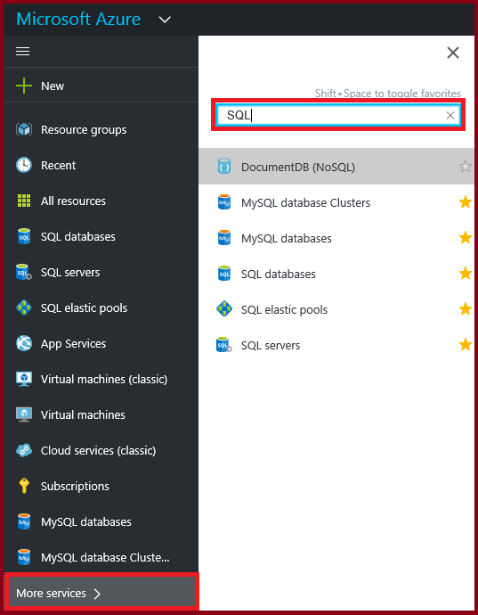
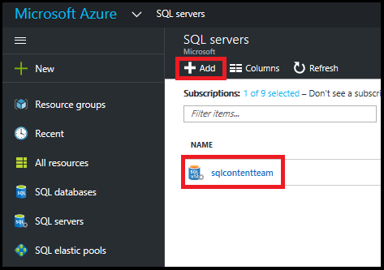
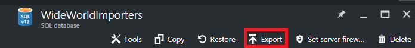
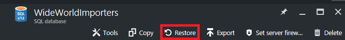

<properties
    pageTitle="使用 Azure 门户管理 Azure SQL 数据库 | Azure"
    description="有关如何使用 Azure 门户管理云中的关系数据库的快速参考。"
    services="sql-database"
    documentationcenter=""
    author="CarlRabeler"
    manager="jhubbard"
    editor="" />
<tags
    ms.assetid="3a56e9de-c21a-40ba-9a35-958172cb4e5b"
    ms.service="sql-database"
    ms.custom="overview"
    ms.devlang="NA"
    ms.workload="data-management"
    ms.topic="get-started-article"
    ms.tgt_pltfrm="NA"
    ms.date="01/10/2017"
    wacn.date="01/25/2017"
    ms.author="carlrab" />  

# 使用 Azure 门户管理 Azure SQL 数据库

> [AZURE.SELECTOR]
- [Azure 门户](/documentation/articles/sql-database-manage-portal/)
- [SSMS](/documentation/articles/sql-database-manage-azure-ssms/)
- [PowerShell](/documentation/articles/sql-database-manage-powershell/)

在 [Azure 门户](https://portal.azure.cn)中，可以创建、监视和管理 Azure SQL 数据库与服务器。本文提供更多常见任务的快速说明和详细信息的链接。

> [AZURE.TIP]
有关演示如何创建服务器、创建基于服务器的防火墙、查看服务器属性、使用 SQL Server Management Studio 进行连接、查询 master 数据库、创建示例数据库和空白数据库、查询数据库属性、使用 SQL Server Management Studio 进行连接和查询示例数据库的教程，请参阅[入门教程](/documentation/articles/sql-database-get-started/)。

## 查看 Azure SQL 数据库、服务器和池

若要查看可用的 SQL 数据库服务，请单击“更多服务”，然后在搜索框中键入 **SQL**：

  

## 如何创建或查看 Azure SQL 数据库？

若要打开“SQL 数据库”边栏选项卡，请单击“SQL 数据库”，然后单击要使用的数据库，或单击“+添加”创建 SQL 数据库。有关详细信息，请参阅[使用 Azure 门户在几分钟内创建 SQL 数据库](/documentation/articles/sql-database-get-started/)。

  

## 如何创建或查看 Azure SQL 服务器？

若要打开“SQL 服务器”边栏选项卡，请单击“SQL 服务器”，然后单击要使用的服务器，或单击“+添加”创建 SQL 服务器。有关详细信息，请参阅[使用 Azure 门户在几分钟内创建 SQL 数据库](/documentation/articles/sql-database-get-started/)。

  

## 如何创建或查看 SQL 弹性池？

若要打开“SQL 弹性池”边栏选项卡，请单击“SQL 弹性池”，然后单击要使用的池，或单击“+添加”创建池。有关详细信息，请参阅[使用 Azure 门户创建弹性池](/documentation/articles/sql-database-elastic-pool-create-portal/)。

  

## 如何更新或查看 SQL 数据库设置？

若要查看或更新数据库设置，请在“SQL 数据库”边栏选项卡中单击所需的设置：

  

## 如何查找 SQL 数据库的完整限定服务器名称？

若要查看数据库服务器名称，请在“SQL 数据库”边栏选项卡中单击“概述”，然后记下服务器名称：

  

## 如何管理防火墙规则以控制 SQL 服务器和数据库的访问权限？

若要查看、创建或更新防火墙规则，请在“SQL 数据库”边栏选项卡中单击“设置服务器防火墙”。有关详细信息，请参阅[使用 Azure 门户配置 Azure SQL 数据库服务器级防火墙规则](/documentation/articles/sql-database-configure-firewall-settings/)。

## 如何更改 SQL 数据库服务层或性能级别？

若要更新 SQL 数据库的服务层或性能级别，请在“SQL 数据库”边栏选项卡中单击“定价层(缩放 DTU)”。有关详细信息，请参阅[更改 SQL 数据库的服务层和性能级别（定价层）](/documentation/articles/sql-database-scale-up/)。

  

## 如何为 SQL 数据库配置审核和威胁检测？

若要为 SQL 数据库配置审核和威胁检测，请在“SQL 数据库”边栏选项卡中单击“审核与威胁检测”。有关详细信息，请参阅 [SQL 数据库审核入门](/documentation/articles/sql-database-auditing-get-started/)和 [SQL 数据库威胁检测入门](/documentation/articles/sql-database-threat-detection-get-started/)。

## 如何为 SQL 数据库配置动态数据掩码？

若要为 SQL 数据库配置动态数据掩码，请在“SQL 数据库”边栏选项卡中单击“动态数据掩码”。有关详细信息，请参阅 [SQL 数据库动态数据掩码入门](/documentation/articles/sql-database-dynamic-data-masking-get-started/)。

## 如何为 SQL 数据库配置透明数据加密 (TDE)？

若要为 SQL 数据库配置透明数据加密，请在“SQL 数据库”边栏选项卡中单击“透明数据加密”。有关详细信息，请参阅[使用门户为数据库启用 TDE](https://msdn.microsoft.com/zh-cn/library/dn948096#Anchor_1)。

## 如何查看或更改SQL 数据库的大小上限？

若要查看或更改 SQL 数据库的大小，请在“SQL 数据库”边栏选项卡中单击“数据库大小”。通过更改服务层或性能级别来更新数据库的大小上限。有关详细信息，请参阅[更改 SQL 数据库的服务层和性能级别（定价层）](/documentation/articles/sql-database-scale-up/)。

## 如何监视和改善 SQL 数据库的性能？

若要监视和改善 SQL 数据库的性能特征，请在“SQL 数据库”边栏选项卡中单击“性能概述”。有关详细信息，请参阅 [SQL 数据库性能见解](/documentation/articles/sql-database-performance/)。

## 如何配置异地复制？

若要为 SQL 数据库配置异地复制，请在“SQL 数据库”边栏选项卡中单击“异地复制”。有关详细信息，请参阅[使用 Azure 门户为 Azure SQL 数据库配置异地复制](/documentation/articles/sql-database-geo-replication-portal/)。

## 如何故障转移到异地复制的 SQL 数据库？

若要故障转移到异地复制的辅助数据库，请在“SQL 数据库”边栏选项卡中单击“异地复制”，然后单击“故障转移”。有关详细信息，请参阅[使用 Azure 门户为 Azure SQL 数据库启动计划的或未计划的故障转移](/documentation/articles/sql-database-geo-replication-failover-portal/)。

## 如何复制 SQL 数据库？

若要复制 SQL 数据库，请在“SQL 数据库”边栏选项卡中单击“复制”。有关详细信息，请参阅[使用 Azure 门户复制 Azure SQL 数据库](/documentation/articles/sql-database-copy-portal/)。

## 如何将 Azure SQL 数据库存档到 BACPAC 文件？

若要创建 SQL 数据库的 BACPAC，请在“SQL 数据库”边栏选项卡中单击“导出”。有关详细信息，请参阅[使用 Azure 门户将 Azure SQL 数据库存档到 BACPAC 文件](/documentation/articles/sql-database-export/)。

## 如何将 SQL 数据库还原到以前的时间点？

若要还原 SQL 数据库，请在“SQL 数据库”边栏选项卡中单击“还原”。有关详细信息，请参阅[使用 Azure 门户将 Azure SQL 数据库还原到以前的时间点](/documentation/articles/sql-database-point-in-time-restore-portal/)。

## 如何从 BACPAC 文件创建 Azure SQL 数据库？

若要从 BACPAC 文件创建 SQL 数据库，请在“SQL 服务器”边栏选项卡中单击“导入数据库”。有关详细信息，请参阅[导入 BACPAC 文件以创建 Azure SQL 数据库](/documentation/articles/sql-database-import/)。

## 如何还原已删除的 SQL 数据库？

若要还原已删除的 SQL 数据库，请在“SQL 服务器”边栏选项卡中单击“已删除的数据库”（包含已删除的数据库的 SQL Server）。有关详细信息，请参阅[使用 Azure 门户还原已删除的 Azure SQL 数据库](/documentation/articles/sql-database-restore-deleted-database-portal/)。

## 如何删除 SQL 数据库？

若要删除 SQL 数据库，请在“SQL 数据库”边栏选项卡中单击“删除”。

## 其他资源

- [SQL 数据库](/documentation/articles/sql-database-technical-overview/)
- [使用 Azure 门户监视和管理弹性数据库池](/documentation/articles/sql-database-elastic-pool-manage-portal/)

<!---HONumber=Mooncake_0120_2017-->
<!--Update_Description: add one tip tag-->