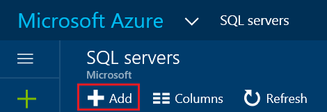

<properties
    pageTitle="Azure 门户：创建和管理 Azure SQL 数据库服务器 | Azure"
    description="快速参考：如何使用 Azure 门户创建和管理 Azure SQL 数据库服务器。"
    services="sql-database"
    documentationcenter=""
    author="CarlRabeler"
    manager="jhubbard"
    editor="" />
<tags
    ms.service="sql-database"
    ms.custom="servers"
    ms.devlang="NA"
    ms.workload="data-management"
    ms.topic="article"
    ms.tgt_pltfrm="NA"
    ms.date="02/06/2017"
    wacn.date="03/24/2017"
    ms.author="carlrab" />  

# 使用 Azure 门户创建和管理 Azure SQL 数据库服务器

可以使用 [Azure 门户](https://portal.azure.cn/)、PowerShell、REST API 或 C# 创建和管理 Azure SQL 数据库服务器。本主题说明如何使用 Azure 门户。有关 PowerShell，请参阅[使用 Powershell 创建和管理服务器](/documentation/articles/sql-database-manage-servers-powershell/)。

## 使用 Azure 门户创建 Azure SQL 数据库服务器

1. 在 [Azure 门户](https://portal.azure.cn/)中打开“SQL Server”边栏选项卡。

      

2. 单击“添加”创建 SQL Server

      

> [AZURE.TIP]
>有关使用 Azure 门户和 SQL Server Management Studio 的入门教程，请参阅 [开始使用 Azure 门户和 SQL Server Management Studio 了解 Azure SQL 数据库服务器、数据库和防火墙规则](/documentation/articles/sql-database-get-started/)。
>

## 使用 Azure 门户查看和更新 Azure SQL Server 设置
1. 在 [Azure 门户](https://portal.azure.cn/)中打开“SQL Server”边栏选项卡。

      

2. 在“SQL Server”边栏选项卡上，单击要使用的服务器，然后单击所需设置。

      

> [AZURE.TIP]
>如需使用 Azure 门户创建服务器的入门教程，请参阅[创建数据库 - Azure 门户](/documentation/articles/sql-database-get-started/)。
>

## 后续步骤
* 有关管理工具的概述，请参阅[管理工具概述](/documentation/articles/sql-database-manage-overview/)
* 若要了解如何使用 Azure 门户执行管理任务，请参阅[使用 Azure 门户管理 Azure SQL 数据库](/documentation/articles/sql-database-manage-portal/)
* 若要了解如何使用 PowerShell 执行管理任务，请参阅[使用 PowerShell 管理 Azure SQL 数据库](/documentation/articles/sql-database-manage-powershell/)
* 若要了解如何使用 SQL Server Management Studio 执行其他任务，请参阅 [SQL Server Management Studio](/documentation/articles/sql-database-manage-azure-ssms/)。
* 有关 SQL 数据库服务的信息，请参阅[什么是 SQL 数据库](/documentation/articles/sql-database-technical-overview/)。
* 有关 Azure 数据库服务器和数据库功能的信息，请参阅[功能](/documentation/articles/sql-database-features/)。

<!---HONumber=Mooncake_0320_2017-->