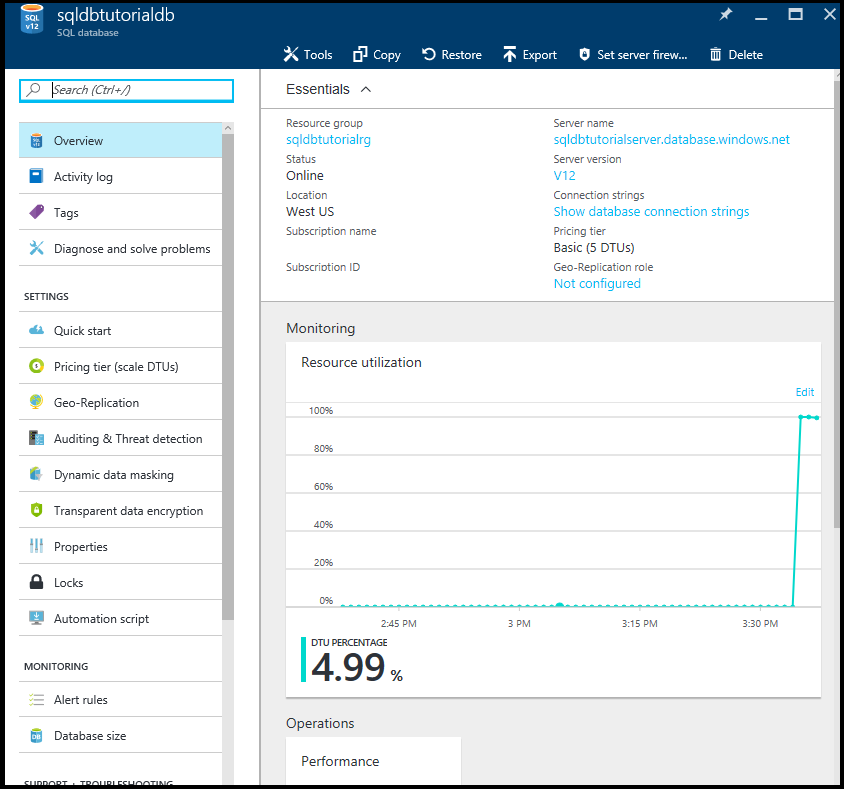
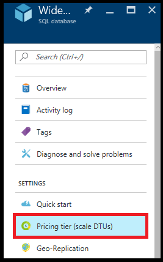
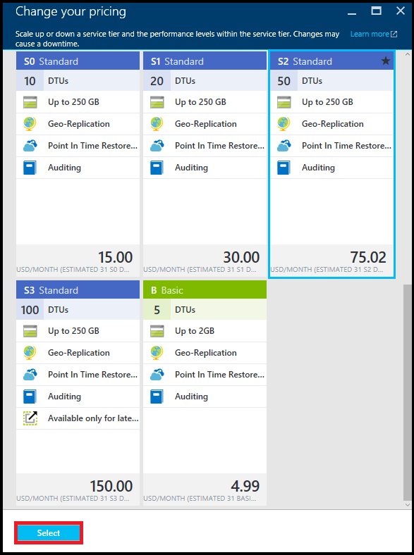
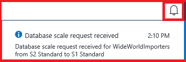

<properties
    pageTitle="Azure 门户：创建和管理单一 Azure SQL 数据库 | Azure"
    description="快速参考：如何使用 Azure 门户创建和管理单一 Azure SQL 数据库"
    services="sql-database"
    documentationcenter=""
    author="CarlRabeler"
    manager="jhubbard"
    editor="" />
<tags
    ms.service="sql-database"
    ms.custom="single databases"
    ms.devlang="NA"
    ms.workload="data-management"
    ms.topic="article"
    ms.tgt_pltfrm="NA"
    ms.date="02/06/2017"
    wacn.date="03/24/2017"
    ms.author="carlrab" />  

# 使用 Azure 门户创建和管理单一 Azure SQL 数据库

可以使用 [Azure 门户](https://portal.azure.cn/)、PowerShell、Transact-SQL、REST API 或 C# 创建和管理单一 Azure SQL 数据库。本主题说明如何使用 Azure 门户。有关 PowerShell，请参阅[使用 Powershell 创建和管理单一数据库](/documentation/articles/sql-database-manage-single-databases-powershell/)。有关 Transact-SQL，请参阅[使用 Transact-SQL 创建和管理单一数据库](/documentation/articles/sql-database-manage-single-databases-tsql/)。

## 使用 Azure 门户创建单一 Azure SQL 数据库

1. 在 [Azure 门户](https://portal.azure.cn/)中打开“SQL 数据库”边栏选项卡。

      

2. 在“SQL 数据库”边栏选项卡上，单击“添加”。

      

> [AZURE.TIP]
>有关使用 Azure 门户创建数据库的教程，请参阅[创建数据库 - Azure 门户](/documentation/articles/sql-database-get-started/)。
>    

## 使用 Azure 门户查看和更新 SQL 数据库设置

1. 在 [Azure 门户](https://portal.azure.cn/)中打开“SQL 数据库”边栏选项卡。

      

2. 在“SQL 数据库”边栏选项卡上，单击要使用的数据库，然后单击所需设置。

      

## 更改单一数据库的服务层和性能级别
打开要增加或减少的数据库的 SQL 数据库边栏选项卡：

1. 在 [Azure 门户](https://portal.azure.cn)中，依次单击“更多服务”>“SQL 数据库”。
2. 单击要更改的数据库。
3. 在“SQL 数据库”边栏选项卡中单击“定价层(缩放 DTU)”：
   
     
4. 选择新层，然后单击“选择”：
   
   单击“选择”将提交更改定价层的缩放请求。根据数据库的大小，缩放操作可能需要一些时间才能完成（请参阅本文顶部的信息）。
   
   > [AZURE.NOTE]
   >更改数据库定价层不会更改最大数据库大小。若要更改数据库最大大小，请使用 [Transact-SQL (T-SQL)](https://msdn.microsoft.com/zh-cn/library/mt574871.aspx) 或 [PowerShell](https://msdn.microsoft.com/zh-cn/library/mt619433.aspx)。
   > 
   > 
   
     
5. 单击右上角中的通知图标（铃铛）：
   
   
6. 单击通知文本打开详细信息窗格，可在其中查看请求状态。

## 后续步骤
* 有关管理工具的概述，请参阅[管理工具概述](/documentation/articles/sql-database-manage-overview/)。
* 若要了解如何使用 Azure 门户执行管理任务，请参阅[使用 Azure 门户管理 Azure SQL 数据库](/documentation/articles/sql-database-manage-portal/)。
* 若要了解如何使用 PowerShell 执行管理任务，请参阅[使用 PowerShell 管理 Azure SQL 数据库](/documentation/articles/sql-database-manage-powershell/)。
* 若要了解如何使用 SQL Server Management Studio 执行管理任务，请参阅 [SQL Server Management Studio](/documentation/articles/sql-database-manage-azure-ssms/)。
* 有关 SQL 数据库服务的信息，请参阅[什么是 SQL 数据库](/documentation/articles/sql-database-technical-overview/)。
* 有关 Azure 数据库服务器和数据库功能的信息，请参阅[功能](/documentation/articles/sql-database-features/)。

<!---HONumber=Mooncake_0320_2017-->