<properties
    pageTitle="将 SQL Server DB 迁移到 Azure SQL 数据库 | Azure"
    description="了解如何将 SQL Server 数据库迁移至 Azure SQL 数据库。"
    services="sql-database"
    documentationcenter=""
    author="janeng"
    manager="jstrauss"
    editor=""
    tags="" />
<tags
    ms.assetid=""
    ms.service="sql-database"
    ms.custom="tutorial-migrate"
    ms.devlang="na"
    ms.topic="article"
    ms.tgt_pltfrm="na"
    ms.workload=""
    ms.date="04/04/2017"
    wacn.date="05/22/2017"
    ms.author="janeng"
    ms.translationtype="Human Translation"
    ms.sourcegitcommit="8fd60f0e1095add1bff99de28a0b65a8662ce661"
    ms.openlocfilehash="e53f693e800c628575c7874d3a6f6f382c270444"
    ms.contentlocale="zh-cn"
    ms.lasthandoff="05/12/2017" />

# 将 SQL Server 数据库迁移到 Azure SQL 数据库

本教程介绍如何使用 Microsoft Data Migration Assistant 将现有 SQL Server 数据库迁移到 Azure SQL 数据库，并完成准备迁移、执行实际数据迁移、以及迁移完成后连接到已迁移数据库的所需步骤。 

> [AZURE.IMPORTANT]
> 若要解决兼容性问题，请使用 [Visual Studio Data Tools](https://docs.microsoft.com/sql/ssdt/download-sql-server-data-tools-ssdt)。 
>

如果没有 Azure 订阅，可在开始前创建一个[试用帐户](/pricing/1rmb-trial/)。

若要完成本教程，请确保做好以下准备：

- 最新版本的 [SQL Server Management Studio](https://docs.microsoft.com/sql/ssms/download-sql-server-management-studio-ssms) (SSMS)。 安装 SSMS 就会安装最新版本的 SQLPackage，这是一个可用于自动执行一系列数据库开发任务的命令行实用工具。 
- [Data Migration Assistant](https://www.microsoft.com/download/details.aspx?id=53595) (DMA)。
- 要迁移的数据库。 本教程在 SQL Server 2008R2 或更高版本的实例上使用 [SQL Server 2008R2 AdventureWorks OLTP 数据库](https://msftdbprodsamples.codeplex.com/releases/view/59211)，但你可以使用所选的任何数据库。 

## 步骤 1 - 准备迁移

现在可以准备迁移。 按照以下步骤使用 **[Data Migration Assistant](https://www.microsoft.com/download/details.aspx?id=53595)** 来评估数据库迁移到 Azure SQL 数据库的准备情况。

1. 打开 **Data Migration Assistant**。 可以在任何连接到包含计划迁移的数据库的 SQL Server 实例的计算机上运行 DMA，且不需要将其安装在托管 SQL Server 实例的计算机上。

     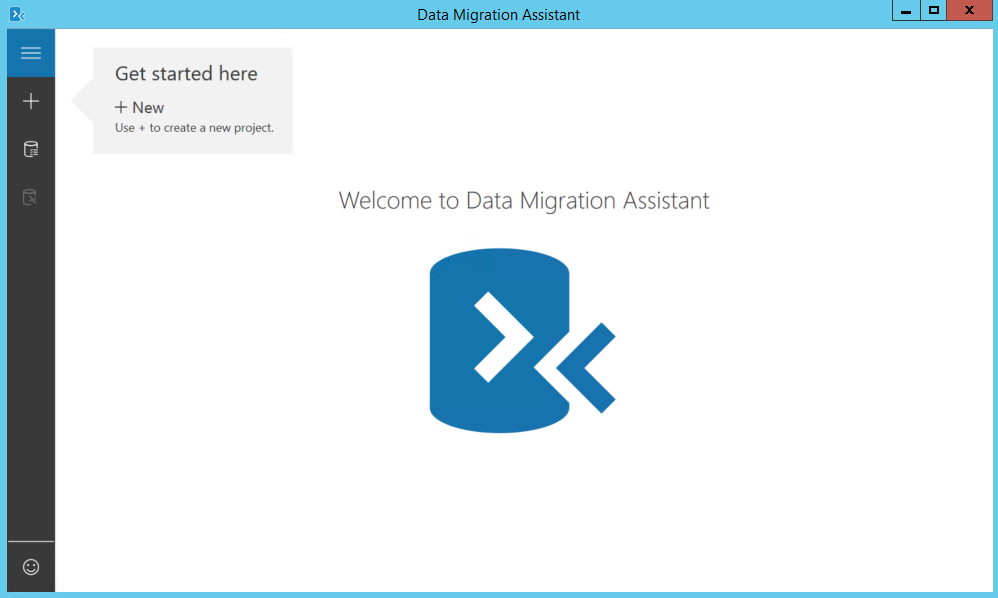

2. 在左侧菜单中，单击“+ 新建”创建“评估”项目。 将**项目名称**填入表单（其他所有值都应保留为默认值），然后单击“创建”。 “选项”页随即打开。

     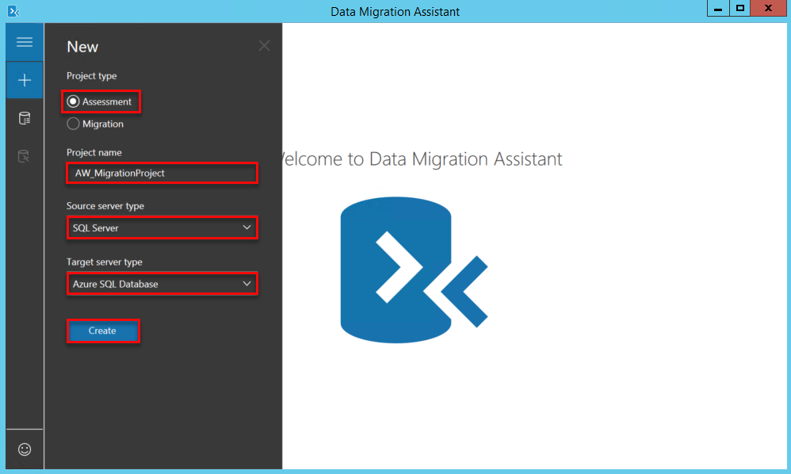

3. 在“选项”页上，单击“下一步”。 “选择源”页面随即打开。

     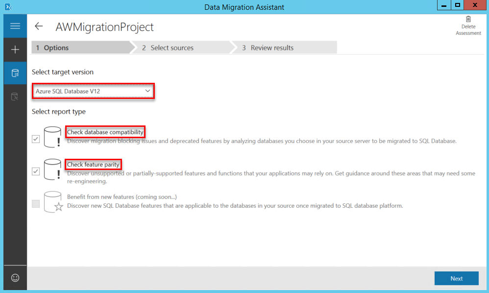 

4. 在“选择源”页面上，输入包含要迁移的服务器的 SQL Server 实例的名称。 如有必要，请更改此页上的其他值。 单击“连接”。

     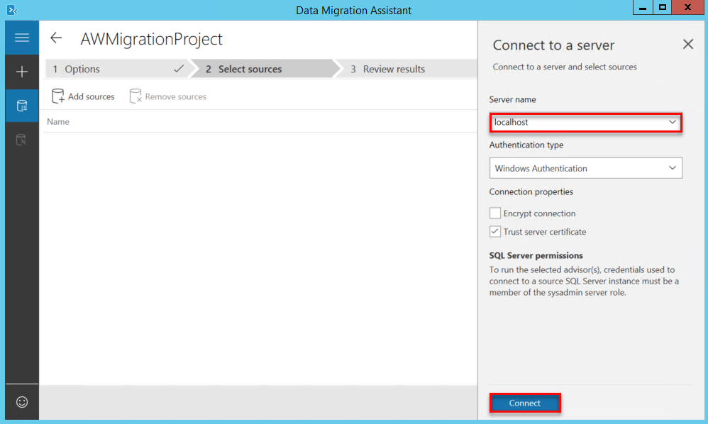

5. 在“选择源”页面的“添加源”部分，选择要测试兼容性的数据库的复选框。 单击“添加” 。

     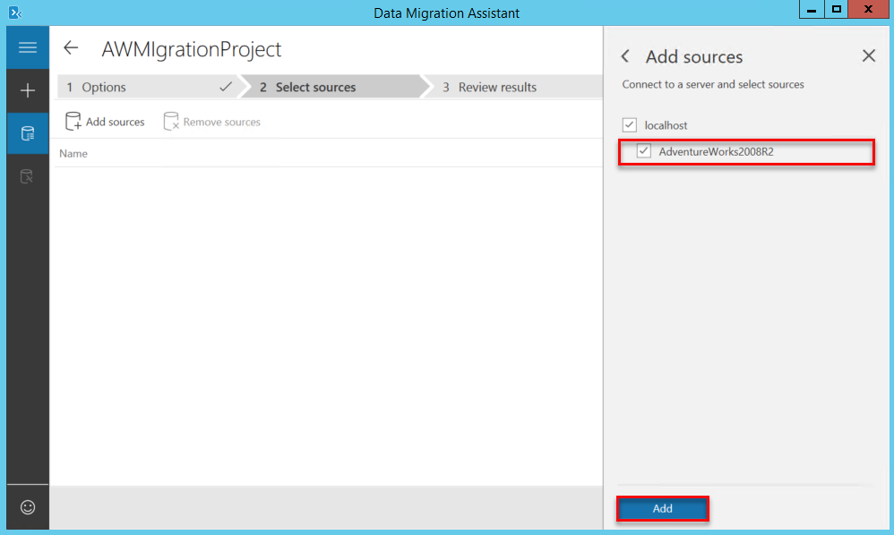

6. 单击“启动评估”。

     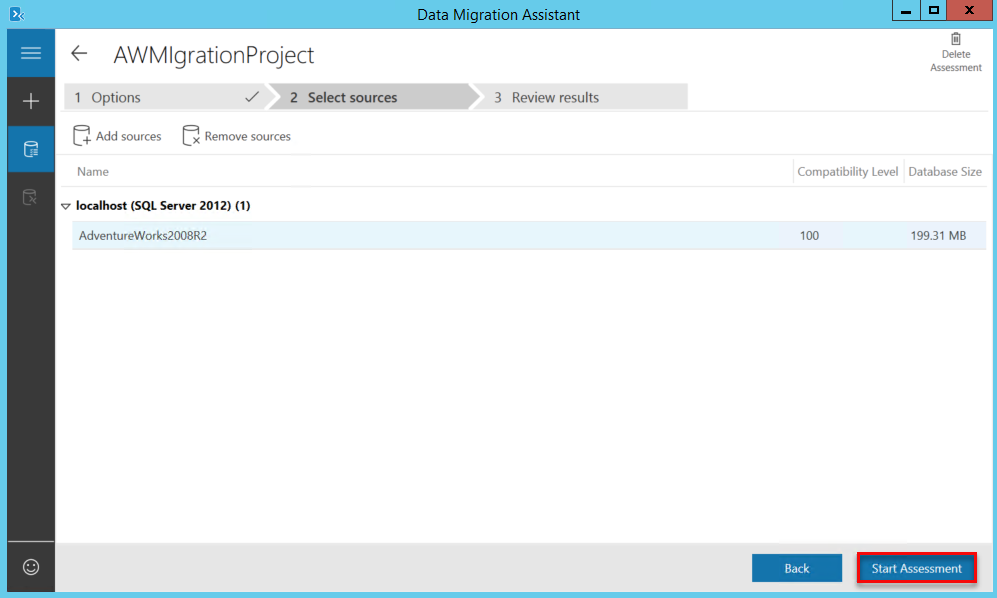

7. 完成评估后，首先确认数据库是否具有迁移所需的足够兼容性。 查找具有绿圈的复选标记。

     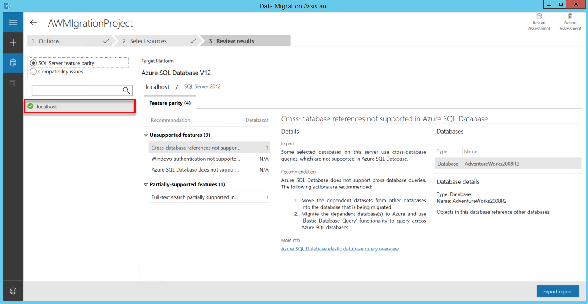

8. 从 **SQL Server 功能奇偶校验**开始查看结果。 特别查看有关不受支持和部分支持的功能的信息和有关推荐操作的信息。 

     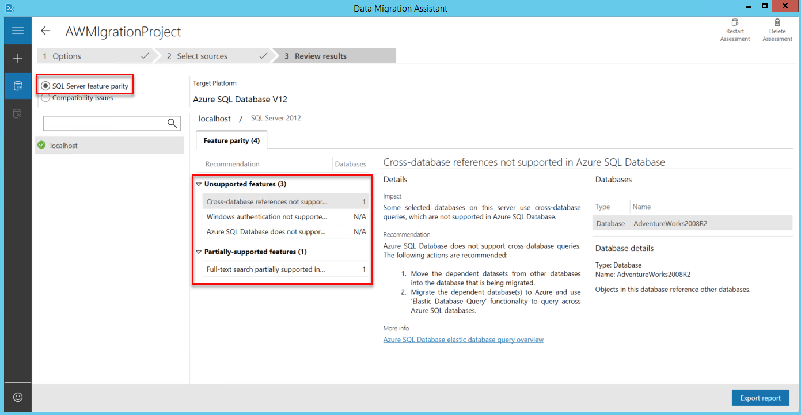

9. 单击“兼容性问题”。 特别查看有关每个兼容级别的迁移阻止程序、行为更改和已弃用功能的信息。 对于 AdventureWorks2008R2 数据库，请查看自 SQL Server 2008 以来对全文搜索的更改以及自 SQL Server 2000 以来对 SERVERPROPERTY('LCID') 的更改。 有关这些更改的详细信息，已提供链接。 已更改全文搜索的许多搜索选项和设置 

   > [AZURE.IMPORTANT] 
   > 将数据库迁移到 Azure SQL 数据库后，可选择以当前兼容级别（对于 AdventureWorks2008R2 数据库是级别 100）或更高级别操作数据库。 有关在特定兼容级别操作数据库的影响和选项的详细信息，请参阅 [ALTER DATABASE Compatibility Level](https://docs.microsoft.com/sql/t-sql/statements/alter-database-transact-sql-compatibility-level)（更改数据库兼容级别）。 有关与兼容级别相关的其他数据库级别设置的信息，另请参阅 [ALTER DATABASE SCOPED CONFIGURATION](https://docs.microsoft.com/sql/t-sql/statements/alter-database-scoped-configuration-transact-sql)（更改数据库范围的配置）。
   >

10. 或者，单击“导出报告”将报告另存为 JSON 文件。
11. 关闭 Data Migration Assistant。

## 步骤 2 - 导出到 BACPAC 文件 

BACPAC 文件是扩展名为 BACPAC 的 ZIP 文件，其中包含来自 SQL Server 数据库的元数据和数据。 BACPAC 文件可以存储在 Azure Blob 存储或本地存储中，以进行存档或迁移（例如从 SQL Server 到 Azure SQL 数据库的迁移）。 若要使导出在事务上保持一致，必须确保在导出期间不会发生任何写入活动。

请按照以下步骤使用 SQLPackage 命令行实用工具将 AdventureWorks2008R2 数据库导出到本地存储。

1. 打开 Windows 命令提示符并将目录更改为包含 **130**  版本的 SQLPackage 的文件夹，例如 **C:\Program Files (x86)\Microsoft SQL Server\130\DAC\bin**。

2. 在命令提示符处执行以下 SQLPackage 命令，将 **AdventureWorks2008R2** 数据库从 **localhost** 导出到  **AdventureWorks2008R2.bacpac**。 根据环境更改这些值。

        sqlpackage.exe /Action:Export /ssn:localhost /sdn:AdventureWorks2008R2 /tf:AdventureWorks2008R2.bacpac

    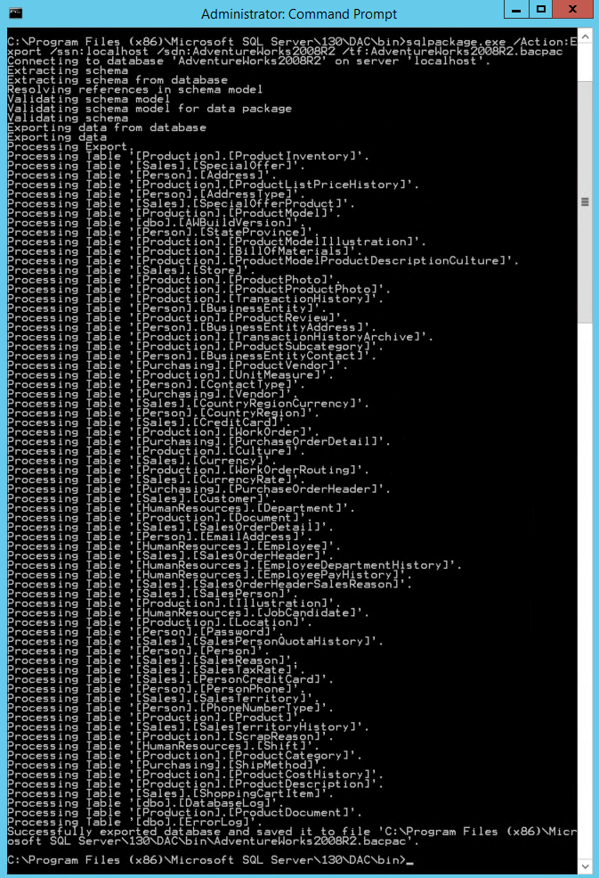

执行完成后，生成的 BCPAC 文件将存储在 sqlpackage 可执行文件所在的目录中。 在此示例中为 C:\Program Files (x86)\Microsoft SQL Server\130\DAC\bin。 

## 步骤 3：登录到 Azure 门户

登录到 [Azure 门户](https://portal.azure.cn/)。 从运行 SQLPackage 命令行实用工具的计算机登录有助于步骤 5 中的防火墙规则创建。

## 步骤 4：创建 SQL 数据库逻辑服务器

[Azure SQL 数据库逻辑服务器](/documentation/articles/sql-database-features/)充当多个数据库的中心管理点。 按照以下步骤创建 SQL 数据库逻辑服务器以包含已迁移的 Adventure Works OLTP SQL Server 数据库。 

1. 单击 Azure 门户左上角的“新建”按钮。

2. 在“新建”页面的搜索窗口中键入**服务器**，然后从筛选列表中选择“SQL 数据库(逻辑服务器)”。

    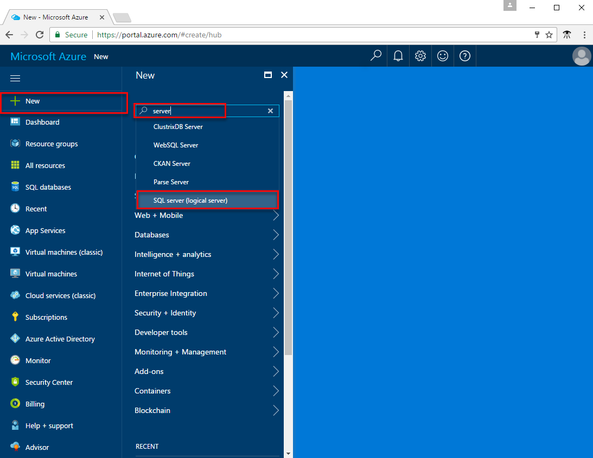

3. 在“所有内容”页面上，单击“SQL Server (逻辑服务器)”，然后在“SQL Server (逻辑服务器)”页面上单击“创建”。

    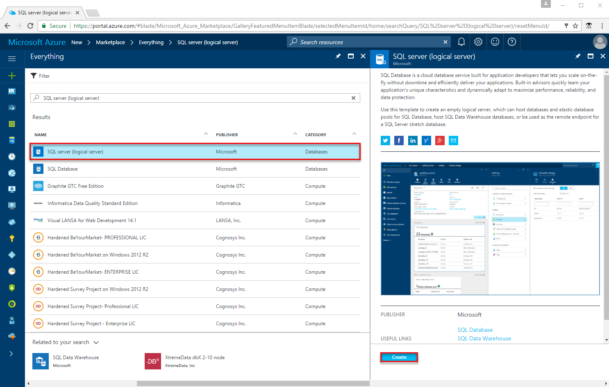

4. 如上图所示，在“SQL Server (逻辑服务器)”窗体中填写以下信息：     

   - 服务器名称：指定全局唯一的服务器名称
   - 服务器管理员登录名：提供服务器管理员的登录名
   - 密码：指定所选的密码
   - 资源组：选择“新建”并指定 **myResourceGroup**
   - 位置：选择数据中心位置

    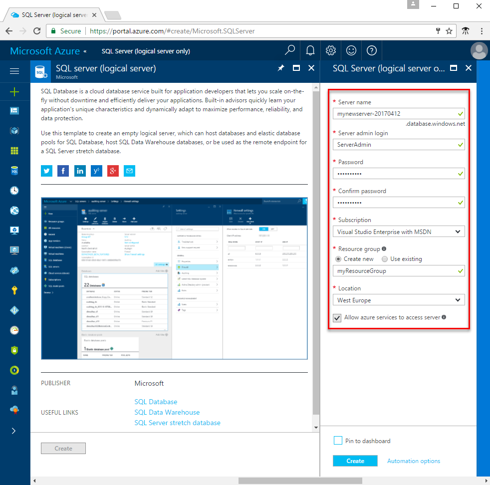

5. 单击“创建”以预配逻辑服务器。 预配需要数分钟。 

## 步骤 5：创建服务器级防火墙规则

SQL 数据库服务[在服务器级别创建一个防火墙](/documentation/articles/sql-database-firewall-configure/)。除非创建了防火墙规则来为特定的 IP 地址打开防火墙，否则会阻止外部应用程序和工具连接到服务器或服务器上的任何数据库。 按照以下步骤为运行 SQLPackage 命令行实用工具的计算机的 IP 地址创建 SQL 数据库服务器级防火墙规则。 这使 SQLPackage 能够通过 Azure SQL 数据库防火墙连接到 SQL 数据库逻辑服务器。 

1. 单击左侧菜单中的“所有资源”，然后在“所有资源”页面上单击新服务器。 此时将打开服务器的概述页，其中显示了完全限定的服务器名称（例如 **mynewserver20170403.database.chinacloudapi.cn**），并提供了其他配置的选项。

     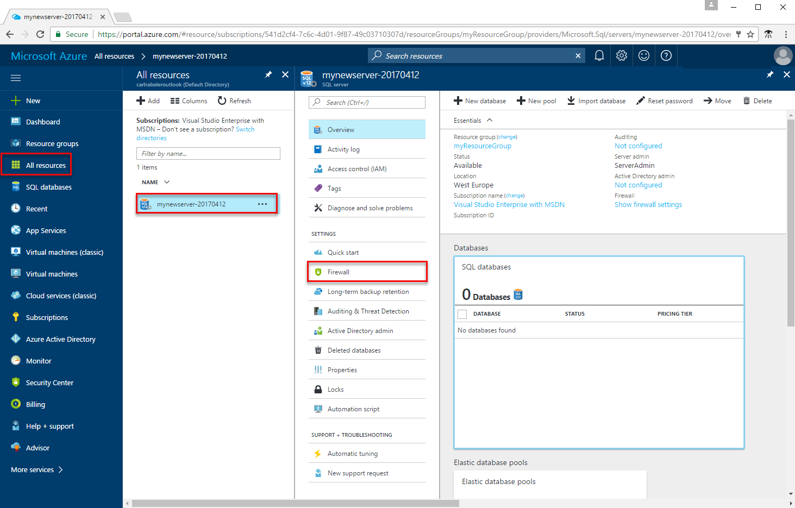

2. 在概述页面的“设置”下面，单击左侧菜单中的“防火墙”。 此时会打开 SQL 数据库服务器的“防火墙设置”页。 

3. 单击工具栏上的“添加客户端 IP”以添加当前使用的计算机的 IP 地址，然后单击“保存”。 此时会针对此 IP 地址创建服务器级防火墙规则。

     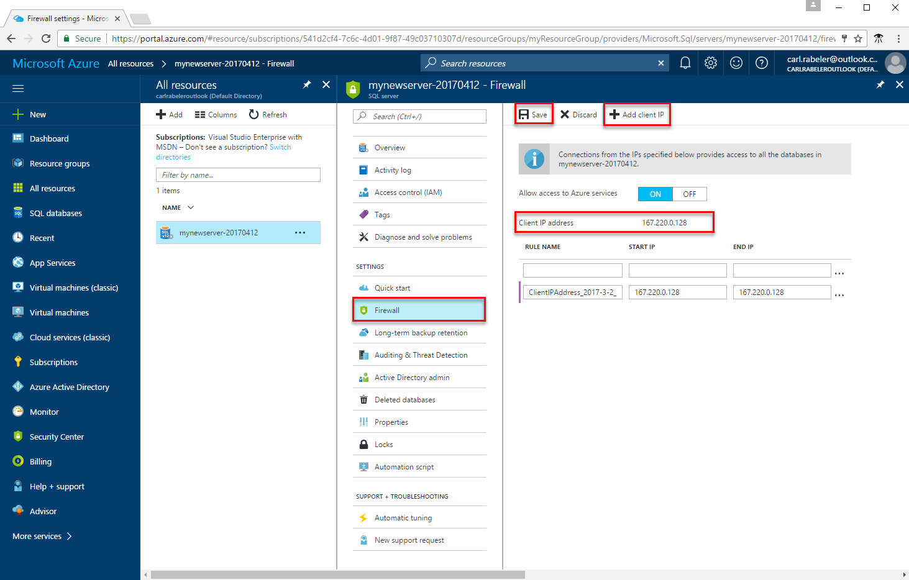

4. 单击 **“确定”**。

现在可以使用之前创建的服务器管理员帐户通过 SQL Server Management Studio 或其他所选工具从此 IP 地址连接到此服务器上的所有数据库。

> [AZURE.NOTE]
> 通过端口 1433 进行的 SQL 数据库通信。 如果尝试从企业网络内部进行连接，则该网络的防火墙可能不允许经端口 1433 的出站流量。 如果是这样，则无法连接到 Azure SQL 数据库服务器，除非 IT 部门打开了端口 1433。
>

## 步骤 6 - 将 BACPAC 文件导入 Azure SQL 数据库 

SQLPackage 命令行实用工具的最新版本支持在指定[服务层和性能级别](/documentation/articles/sql-database-service-tiers/)创建 Azure SQL 数据库。 为了在导入过程中获得最佳性能，请选择一个较高的服务层和性能级别，然后在导入后降低级别（如果此服务层和性能级别高于当前所需级别）。

请按照以下步骤使用 SQLPackage 命令行实用工具将 AdventureWorks2008R2 数据库导入 Azure SQL 数据库。

- 在命令提示符下执行以下 SQLPackage 命令，将 **AdventureWorks2008R2** 数据库从本地存储导入先前创建的 Azure SQL 数据库逻辑服务器（数据库名称为 **myMigratedDatabase**、服务层为**高级**、服务目标为 **P6**）。 根据环境更改这 3 个值。

        SqlPackage.exe /a:import /tcs:"Data Source=mynewserver20170403.database.chinacloudapi.cn;Initial Catalog=myMigratedDatabase;User Id=<change_to_your_admin_user_account>;Password=<change_to_your_password>" /sf:AdventureWorks2008R2.bacpac /p:DatabaseEdition=Premium /p:DatabaseServiceObjective=P6

   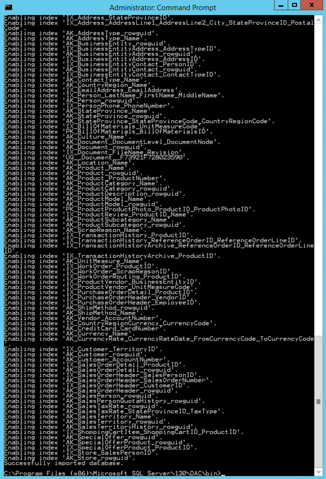

> [AZURE.IMPORTANT]
> Azure SQL 数据库逻辑服务器在端口 1433 上进行侦听。 如果尝试在企业防火墙内连接到 Azure SQL 数据库逻辑服务器，则必须在企业防火墙中打开此端口，否则无法成功进行连接。
>

## 步骤 7 - 使用 SQL Server Management Studio (SSMS) 连接

使用 SQL Server Management Studio 建立到 Azure SQL 数据库服务器和新迁移的数据库的连接。 如果不在运行 SQLPackage 的计算机上运行 SQL Server Management Studio，请使用前面过程中的步骤为此计算机创建防火墙规则。

1. 打开 SQL Server Management Studio。

2. 在“连接到服务器”对话框中，输入以下信息：
   - **服务器类型**：指定数据库引擎
   - **服务器名称**：输入完全限定的服务器名称，例如 **mynewserver20170403.database.chinacloudapi.cn**
   - **身份验证**：指定 SQL Server 身份验证
   - **登录名**：输入服务器管理员帐户
   - **密码**：输入服务器管理员帐户的密码
 
    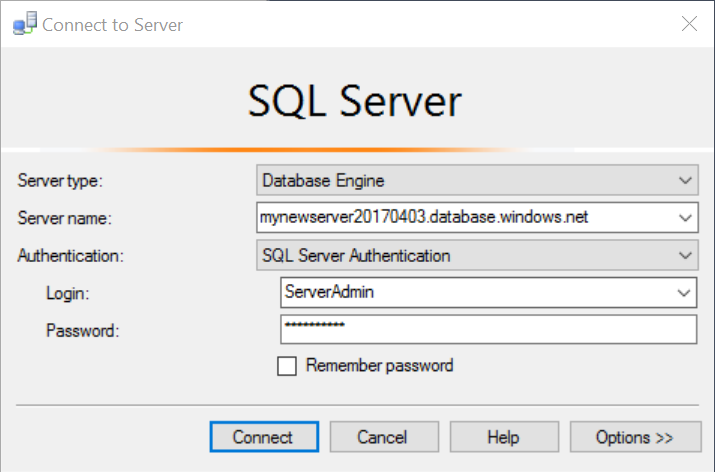

3. 单击“连接”。 此时会打开“对象资源管理器”窗口。 

4. 在对象资源管理器中展开“数据库”，然后展开 **myMigratedDatabase**，查看示例数据库中的对象。

## 步骤 8 - 更改数据库属性

可以使用 SQL Server Management Studio 更改服务层、性能级别和兼容级别。

1. 在“对象资源管理器”中，右键单击“myMigratedDatabase”，然后单击“新建查询”。 此时会打开一个连接到数据库的查询窗口。

2. 执行以下命令将服务层设置为“标准”，将性能级别设置为“S1”。

        ALTER DATABASE myMigratedDatabase 
        MODIFY 
            (
            EDITION = 'Standard'
            , MAXSIZE = 250 GB
            , SERVICE_OBJECTIVE = 'S1'
        );

    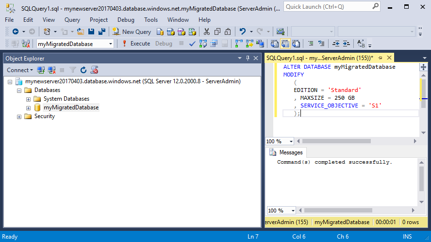

3. 执行以下命令将数据库兼容级别更改为 **130**。

        ALTER DATABASE myMigratedDatabase  
        SET COMPATIBILITY_LEVEL = 130;

   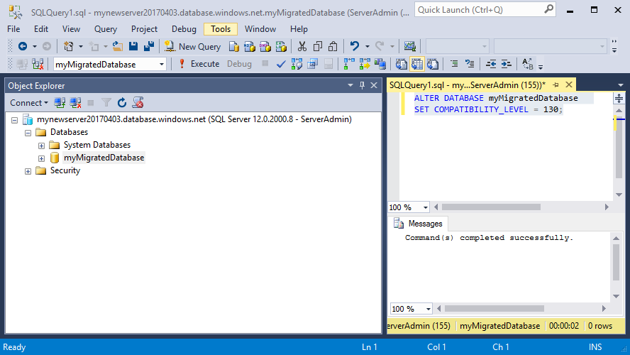

## 后续步骤 

- 有关迁移的概述，请参阅[数据库迁移](/documentation/articles/sql-database-cloud-migrate/)。
- 有关 T-SQL 差异的讨论，请参阅[解析迁移到 SQL 数据库的过程中的 Transact-SQL 差异](/documentation/articles/sql-database-transact-sql-information/)。
- 若要使用 Visual Studio Code 进行连接和查询，请参阅[使用 Visual Studio Code 进行连接和查询](/documentation/articles/sql-database-connect-query-vscode/)。
- 若要使用 .NET 进行连接和查询，请参阅[使用 .NET 进行连接和查询](/documentation/articles/sql-database-connect-query-dotnet/)。
- 若要使用 PHP 进行连接和查询，请参阅[使用 PHP 进行连接和查询](/documentation/articles/sql-database-connect-query-php/)。
- 若要使用 Node.js 进行连接和查询，请参阅[使用 Node.js 进行连接和查询](/documentation/articles/sql-database-connect-query-nodejs/)。
- 若要使用 Java 进行连接和查询，请参阅[使用 Java 进行连接和查询](/documentation/articles/sql-database-connect-query-java/)。
- 若要使用 Python 进行连接和查询，请参阅[使用 Python 进行连接和查询](/documentation/articles/sql-database-connect-query-python/)。
- 若要使用 Ruby 进行连接和查询，请参阅[使用 Ruby 进行连接和查询](/documentation/articles/sql-database-connect-query-ruby/)。