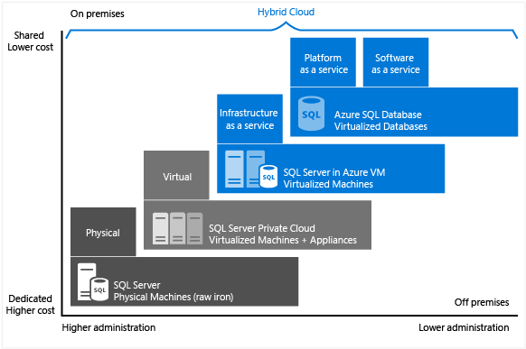

<properties
    pageTitle="SQL (PaaS) 数据库与VM 上云中的 SQL Server (IaaS) | Azure"
    description="了解哪个云 SQL Server 选项适合你的应用程序：Azure SQL (PaaS) 数据库或 Azure 虚拟机上云中的 SQL Server。"
    services="sql-database, virtual-machines"
    keywords="SQL Server 云, 云中 SQL Server, PaaS 数据库, 云 SQL Server, DBaaS"
    documentationcenter=""
    author="CarlRabeler"
    manager="jhubbard"
    editor="cjgronlund" />
<tags
    ms.assetid="7467f422-b77d-4b60-9cb5-0f1ec17ec565"
    ms.service="sql-database"
    ms.custom="overview"
    ms.workload="data-management"
    ms.tgt_pltfrm="vm-windows-sql-server"
    ms.devlang="na"
    ms.topic="get-started-article"
    ms.date="02/01/2017"
    wacn.date="04/06/2017"
    ms.author="carlrab" />

# 选择云 SQL Server 选项：Azure SQL (PaaS) 数据库或 Azure VM 上的 SQL Server (IaaS)

Azure 有两个选项可用于在 Azure 中托管 SQL Server 工作负荷：

* [Azure SQL 数据库](/home/features/sql-database/)：云的本机 SQL 数据库，也称为平台即服务 (PaaS) 数据库或数据库即服务 (DBaaS)，它已针对软件即服务 (SaaS) 应用开发进行优化。Azure SQL 数据库与大多数 SQL Server 功能兼容。
* Azure 虚拟机上的 SQL Server：在 Azure 上运行的云中 Windows Server 虚拟机 (VM) 上安装并托管的 SQL Server，也称为基础结构即服务 (IaaS)。
Azure 虚拟机上的 SQL Server 经过优化，适合用于迁移现有的 SQL Server 应用程序。可以使用 SQL Server 的所有版本。它完全与 SQL Server 兼容，可用于托管任意数量的数据库，以及执行跨数据库事务。它提供对 SQL Server 和 Winodws 的完全控制权。

了解每个选项如何配合 Microsoft 数据平台一起运行，并在匹配适合业务要求的选项时获得帮助。无论以节省成本为优先考虑，还是将精简管理视为第一要素，本文都会帮助你确定哪种方法能够满足你最重视的业务要求。

## Microsoft 的数据平台

在 Azure 与本地 SQL Server 数据库的任何介绍中，要了解的要点之一是可以同时使用两者。Microsoft 数据平台利用 SQL Server 技术，使其可在跨本地物理机、私有云环境、第三方托管的私有云环境和公有云中使用。使用 Azure 虚拟机上的 SQL Server，可以通过本地和云托管部署的组合来满足独特的多样化业务需求，同时在这些环境中使用相同的服务器产品、开发工具和专业知识组合。

     

如图所示，每个产品可根据基础结构（X 轴）中所拥有的管理级别，以及数据库级别合并与自动化（Y 轴）所达到的成本效益程度等特征进行分类。

设计应用程序时，可以使用四个基本选项来托管属于应用程序一部分的 SQL Server：

* 非虚拟化物理计算机上的 SQL Server
* 本地虚拟机中的 SQL Server（私有云）
* Azure 虚拟机中的 SQL Server（Microsoft 公有云）
* Azure SQL 数据库（Microsoft 公有云）

以下部分介绍 Microsoft 公有云中的 SQL Server：Azure SQL 数据库和 Azure VM 上的 SQL Server。此外，将探讨常见的业务动机，判断哪一个选项最适合应用程序。

## Azure SQL 数据库和 Azure VM 中的 SQL Server 详述

**Azure SQL 数据库**是托管在 Azure 云中的关系数据库即服务 (DBaaS)，属于*软件即服务 (SaaS)* 和*平台即服务 (PaaS)* 行业类别。[SQL 数据库](/documentation/articles/sql-database-technical-overview/)构建在 Microsoft 所拥有、托管及维护的标准化硬件和软件基础之上。使用 SQL 数据库，可以使用内置的特性和功能在服务上直接进行开发。使用 SQL 数据库时，可以即用即付，并使用向上或向外缩放选项获得更强大的功能且不会中断服务。

**Azure 虚拟机 (VM) 上的 SQL Server** 属于*基础结构即服务 (IaaS)* 行业类别，允许在云中的虚拟机上运行 SQL Server。与 SQL 数据库一样，它构建在 Microsoft 所拥有、托管及维护的标准化硬件基础之上。使用 VM 上的 SQL Server 时，可以根据需要支付 SQL Server 映像中已包含的 SQL Server 许可证费用，或者直接使用现有许可证。还可以根据需要轻松扩展/缩减以及暂停/恢复 VM。

通常，这两个 SQL 选项已针对不同的用途进行优化：

- **SQL 数据库**经过优化，可将预配和管理许多数据库的整体成本降到最低。由于你无需管理任何虚拟机、操作系统或数据库软件，因此可以持续降低管理成本。不需要管理升级、高可用性或[备份](/documentation/articles/sql-database-automated-backups/)。一般而言，Azure SQL 数据库可以大幅增加由单个 IT 或开发资源管理的数据库数目。
- **Azure VM 上运行的 SQL Server** 经过优化，可用于将现有应用程序迁移到 Azure 或者在混合部署中将现有本地应用程序扩展到云。此外，可以使用虚拟机中的 SQL Server 开发和测试传统 SQL Server 应用程序。有了 Azure VM 上的 SQL server，即拥有了专用 SQL Server 实例和基于云的 VM 的完全管理权限。当组织拥有可用来维护虚拟机的 IT 资源时，此选项是最佳选择。使用这些功能可以构建高度定制的系统，解决应用程序的具体性能与可用性要求。

下表汇总了 SQL 数据库和 Azure VM 中 SQL Server 的主要特征：

| **最适用于：** | **Azure SQL 数据库** | **Azure 虚拟机中的 SQL Server** |
| --- | --- | --- |
| |开发与营销阶段有时间限制的新式云设计应用程序。 |需要快速迁移到云，而仅需少量更改的现有应用程序。你想要快速完成开发和测试方案，但又不想购买本地 SQL Server 非生产硬件。 |
| | 需要内置高可用性、灾难恢复和数据库升级的团队。 |可以配置和管理高可用性、灾难恢复与 SQL Server 修补的团队。提供的某些自动化功能大大简化了这些任务。 | |
| | 不想要管理基础操作系统和配置设置的团队。 |需要一个拥有完全管理权限的定制环境。 | |
| | 高达 1 TB 或更大的、可使用扩展模式进行[横向或纵向分区](/documentation/articles/sql-database-elastic-scale-introduction/#horizontal-and-vertical-scaling)的数据库。 |具有高达 64 TB 存储空间的 SQL Server 实例。实例可以支持所需数量的数据库。 | |
| | [构建软件即服务 (SaaS) 应用程序](/documentation/articles/sql-database-design-patterns-multi-tenancy-saas-applications/)。 |迁移和构建企业与混合应用程序。 | |
| | | |
| **资源：** |不想要利用 IT 资源来配置和管理基础结构，而想要专注于应用程序层。 |可将某些 IT 资源用于配置和管理。提供的某些自动化功能大大简化了这些任务。 |
| **总拥有成本：** |消除硬件成本并减少管理成本。 |消除硬件成本。 |
|**业务连续性：**|除了内置的容错基础结构功能以外，Azure SQL 数据库还提供可提高业务连续性的功能，例如[自动备份](/documentation/articles/sql-database-automated-backups/)、[时间点还原](/documentation/articles/sql-database-recovery-using-backups/#point-in-time-restore)、[异地还原](/documentation/articles/sql-database-recovery-using-backups/#geo-restore)和[活动异地复制](/documentation/articles/sql-database-geo-replication-overview/)。有关详细信息，请参阅 [SQL 数据库业务连续性概述](/documentation/articles/sql-database-business-continuity/)。|Azure VM 上的 SQL Server 允许设置高可用性和灾难恢复解决方案，以满足数据库的具体需求。因此，可以构建针对应用程序高度优化的系统。可以按需求自行测试并运行故障转移。有关详细信息，请参阅 [Azure 虚拟机中 SQL Server 的高可用性和灾难恢复](/documentation/articles/virtual-machines-windows-sql-high-availability-dr/)。|
|**混合云：**|本地应用程序可以访问 Azure SQL 数据库中的数据。|借助 Azure VN 上的 SQL Server，应用程序可以一部分在云中运行，一部分在本地运行。例如，可以通过 [Azure 虚拟网络](/documentation/articles/virtual-networks-overview/)，将本地网络和 Active Directory 域扩展到云中。此外，可以使用 [Azure 中的 SQL Server 数据文件功能](http://msdn.microsoft.com/zh-cn/library/dn385720.aspx)，将本地数据文件存储在 Azure 存储空间中。有关详细信息，请参阅 [SQL Server 2014 混合云简介](http://msdn.microsoft.com/zh-cn/library/dn606154.aspx)。|
| | 支持使用 [SQL Server 事务复制](https://msdn.microsoft.com/zh-cn/library/mt589530.aspx)作为订阅服务器来复制数据。|完全支持 [SQL Server 事务复制](https://msdn.microsoft.com/zh-cn/library/mt589530.aspx)、[AlwaysOn 可用性组](/documentation/articles/virtual-machines-windows-sql-high-availability-dr/)、集成服务，并支持使用日志传送来复制数据。此外，完全支持传统的 SQL Server 备份|
| | | |

## 选择 Azure SQL 数据库或 Azure VM 上的 SQL Server 时的业务动机

### 成本

无论你是现金不足的新公司，或是在预算有限的情况下运作的已成立公司的小组，有限资金经常是决定数据库托管方式的主要考虑因素。本部分先讲解 Azure 中有关以下两个关系数据库选项的计费和许可基本概念：SQL 数据库和 Azure VM 中的 SQL Server。此外，还介绍如何计算应用程序总成本。

#### 计费和许可基础概念

**SQL 数据库**以服务形式出售给客户，不附带许可证。出售的 [Azure VM 上的 SQL Server](/documentation/articles/virtual-machines-windows-sql-server-iaas-overview/) 随附按分钟付费的许可证。客户也可以使用现有的许可证。

目前，我们在多个服务层中提供 **SQL 数据库**，并根据你选择的服务层和性能级别，以固定费率向你收取每小时费用。此外，你需要对固定的[数据传输速率](/pricing/details/data-transfer/)的 Internet 传出流量付费。基本、标准和高级服务层旨在以多个性能级别提供可预测的性能，以满足应用程序的高峰要求。可以在服务层和性能级别之间进行更改，以满足应用程序的不同吞吐量需求。如果数据库具有高事务量且必须支持许多并发用户，我们建议使用高级服务层。有关目前支持的服务层的最新信息，请参阅 [Azure SQL 数据库服务层](/documentation/articles/sql-database-service-tiers/)。还可以创建[弹性数据库池](/documentation/articles/sql-database-elastic-pool/)，在数据库实例之间共享性能资源。

使用 **Azure SQL 数据库**，Microsoft 将自动配置、修补和升级数据库软件，从而降低管理成本。此外，它的[内置备份](/documentation/articles/sql-database-automated-backups/)功能可帮助你大幅降低成本，尤其是当你拥有大量的数据库时。

在 **Azure VM 上的 SQL Server** 中，可以使用平台提供的任何 SQL Server 映像（附带许可证），或使用自己的 SQL Server 许可证。可以使用所有受支持的 SQL Server 版本（2008R2、2012、2014、2016 以及 Developer、Express、Web、Standard、Enterprise）。此外，可以使用映像的自带许可版本 (BYOL)。使用 Azure 提供的映像时，营运成本取决于所选的 VM 大小以及 SQL Server 版本。无论 VM 大小或 SQL Server 版本为何，你都需要支付 SQL Server 和 Windows Server 的每分钟许可成本，以及 VM 磁盘的 Azure 存储空间成本。每分钟计费选项可让你随时使用 SQL Server，而无需另外购买 SQL Server 许可证。如果在 Azure 中使用自己的 SQL Server 许可证，则只需支付 Windows Server 和存储成本。有关自带许可证的详细信息，请参阅 [Azure 上通过软件保障实现的许可移动性](/pricing/license-mobility/)。

#### 计算应用程序总成本

开始使用云平台时，运行应用程序的成本包括开发和管理成本，以及公有云平台服务成本。

以下是针对在 SQL 数据库和 Azure VM 中的 SQL Server 上运行的应用程序的详细成本计算方法：

**使用 Azure SQL 数据库时：**

*应用程序总成本 = 大幅降低的管理成本 + 软件开发成本 + SQL 数据库服务成本*

**使用 Azure VM 上的 SQL Server 时：**

*应用程序总成本 = 大幅降低的软件开发成本 + 管理成本 + SQL Server 与 Windows Server 许可成本 + Azure 存储成本*

有关定价的详细信息，请参阅以下资源：

- [SQL 数据库定价](/pricing/details/sql-database/)
- [SQL](/pricing/details/virtual-machines/#sql) 和 [Windows](/pricing/details/virtual-machines/#windows) 的[虚拟机定价](/pricing/details/virtual-machines/)
- [Azure 价格计算器](/pricing/calculator/)

> [AZURE.NOTE] SQL Server 上有一小部分的功能不适用于或不可用于 SQL 数据库。有关详细信息，请参阅 [SQL 数据库功能](/documentation/articles/sql-database-features/)以及 [SQL 数据库 Transact-SQL 信息](/documentation/articles/sql-database-transact-sql-information/)。如果要将现有的 SQL Server 解决方案迁移到云中，请参阅[将 SQL Server 数据库迁移到 Azure SQL 数据库](/documentation/articles/sql-database-cloud-migrate/)。当将现有的本地 SQL Server 应用程序迁移到 SQL 数据库时，建议更新应用程序以利用云服务提供的功能。例如，可以考虑使用 [Azure Web 应用服务](/home/features/web-site/) 或 [Azure 云服务](/home/features/cloud-services/)来托管应用层，以提高成本效益。

### 管理

对许多企业来说，决定过渡到到云服务的关键在于降低管理复杂度。使用 **SQL 数据库**，Microsoft 可以管理底层硬件，自动复制所有数据以提供高可用性，配置及升级数据库软件，管理负载均衡，并在发生服务器故障时执行透明的故障转移。你可以继续管理数据库，但不再需要管理数据库引擎、服务器操作系统或硬件。可以继续管理的项目示例包括数据库和登录、索引和查询优化，以及审核和安全性。

使用 **Azure VM 上的 SQL Server**，可以完全掌控操作系统和 SQL Server 实例配置。使用 VM，可以决定何时更新/升级操作系统与数据库软件，以及何时安装任何其他软件（例如防病毒软件）。提供的某些自动化功能可以大大简化修补、备份和高可用性。此外，你还可以控制 VM 的大小、磁盘数目及其存储配置。Azure 允许根据需要更改 VM 的大小。有关信息，请参阅 [Azure 的虚拟机和云服务大小](/documentation/articles/virtual-machines-windows-sizes/)。

### 服务级别协议 (SLA)

对于许多 IT 部门而言，达到服务级别协议 (SLA) 规定的正常运行时间义务是首要任务。在本部分中，我们将了解 SLA 对每个数据库托管选项代表的含义。

对于 **SQL 数据库**基本、标准和高级服务层，Microsoft 提供 99.99% 的可用性 SLA。有关最新信息，请参阅[服务级别协议](/support/sla/sql-data/)。有关 SQL 数据库服务层和支持的业务连续性计划的最新信息，请参阅[服务层](/documentation/articles/sql-database-service-tiers/)。

对于 **Azure VM 上运行的 SQL Server**，Microsoft 提供 99.95% 的可用性 SLA（仅涵盖虚拟机）。此 SLA 不包括 VM 上运行的进程（例如 SQL Server），并且要求你在可用性集中托管至少两个 VM 实例。有关最新信息，请参阅 [VM SLA](/support/sla/virtual-machines/)。为了在 VM 中实现数据库高可用性 (HA)，你应在 SQL Server 中配置一个受支持的高可用性选项，例如 [AlwaysOn 可用性组](http://blogs.technet.com/b/dataplatforminsider/archive/2014/08/25/sql-server-alwayson-offering-in-microsoft-azure-portal-gallery.aspx)。使用支持的高可用性选项并不提供额外的 SLA，但可实现 99.99% 以上的数据库可用性。

### 面市时间

开发人员生产力和快速面市为关键要素时，**SQL 数据库**是云式应用程序的理想解决方案。此选项提供类似于编程 DBA 的功能，非常适合云架构师和开发人员，因为它能降低管理基础操作系统和数据库的需求。例如，可以使用 [REST API](http://msdn.microsoft.com/zh-cn/library/azure/dn505719.aspx) 和 [PowerShell Cmdlet](http://msdn.microsoft.com/zh-cn/library/mt740629.aspx) 来自动化和管理数千个数据库的管理操作。[弹性池](/documentation/articles/sql-database-elastic-pool/)等功能可让你将重点放在应用程序层上，更快地将解决方案推向市场。

如果现有或新的应用程序需要大型数据库、相互关联的数据库或者 SQL Server 或 Windows 中所有功能的访问权限，**Azure VM 上运行的 SQL Server** 是理想选择。此外，如果你想要依现状将现有的本地应用程序和数据库迁移到 Azure，则它也是一个不错的选择。由于无需更改呈现、应用程序和数据层，重新架构现有解决方案时可节省时间和预算。相反地，可以将重点放在将所有解决方案迁移到 Azure，并执行 Azure 平台可能需要的某些性能优化。有关详细信息，请参阅 [Azure 虚拟机上 SQL Server 的性能最佳实践](/documentation/articles/virtual-machines-windows-sql-performance/)。

## 摘要

本文探讨了 Azure 虚拟机 (VM) 上的 SQL 数据库和 SQL Server，并讨论了可能会影响决策的常见业务动机。以下是供你考虑的建议摘要：

对于以下情况，请选择 **Azure SQL 数据库**：

- 打算构建全新的基于云的应用程序，以便利用云服务提供的成本节省和性能优化。此方法提供全面管理云服务的优势，有助于加速产品面市，并提供长期的成本效益。

- 你想要让 Microsoft 在数据库上运行常见管理操作，因而数据库需要更高的可用性 SLA。

对于以下情况，请选择 **Azure VM 上的 SQL Server**：

- 想要将现有本地应用程序迁移或扩展到云，或如果想要构建大于 1 TB 的企业应用程序。此方法的优点是提供 100% SQL 兼容性、大型数据库的容量、SQL Server 和 Windows 的完整控制权以及本地的安全通道。此方法可以降低开发和修改现有应用程序的成本。

- 有现有的 IT 资源，最终可以拥有修补、备份和数据库高可用性。请注意，某些自动化功能可大幅简化这些操作。

## 后续步骤
* 若需 SQL 数据库的入门，请参阅[创建你的第一个 Azure SQL 数据库](/documentation/articles/sql-database-get-started/)。
* 请参阅[《SQL Database pricing》](/pricing/details/sql-database/)（SQL 数据库定价）。
* 若要开始在 Azure VM 上使用 SQL Server，请参阅[在 Azure 中预配 SQL Server 虚拟机](/documentation/articles/virtual-machines-windows-portal-sql-server-provision/)。

<!---HONumber=Mooncake_0320_2017-->
<!--Update_Description: update features table; link references update-->