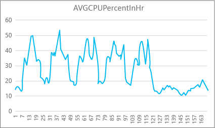
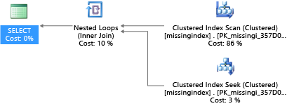
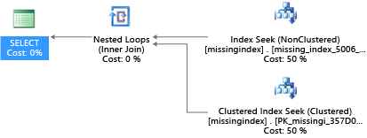

<properties
    pageTitle="单一数据库的 Azure SQL 数据库性能 | Azure"
    description="此文可帮助你确定哪个服务层适合你的应用程序。 它还会提供调整建议使的应用程序可以充分利用 Azure SQL 数据库。"
    services="sql-database"
    documentationcenter="na"
    author="CarlRabeler"
    manager="jhubbard"
    editor=""
    translationtype="Human Translation" />
<tags
    ms.assetid="dd8d95fa-24b2-4233-b3f1-8e8952a7a22b"
    ms.service="sql-database"
    ms.custom="monitor and tune"
    ms.devlang="na"
    ms.topic="article"
    ms.tgt_pltfrm="na"
    ms.workload="data-management"
    ms.date="03/06/2017"
    wacn.date="04/17/2017"
    ms.author="carlrab"
    ms.sourcegitcommit="7cc8d7b9c616d399509cd9dbdd155b0e9a7987a8"
    ms.openlocfilehash="c98870341d2c7f09c3ebbb61122974c46d67f206"
    ms.lasthandoff="04/07/2017" />

# Azure SQL 数据库和单一数据库的性能
Azure SQL 数据库提供了四个[服务层](/documentation/articles/sql-database-service-tiers/)：基本、标准、高级和高级 RS。 每个服务层可严格隔离你的 SQL 数据库可以使用的资源，并保证相应服务级别的可预测性能。 本文将指导用户为其应用程序选择服务层， 并讨论如何通过多种方式调整应用程序，以便充分利用 Azure SQL 数据库。

> [AZURE.NOTE]
> 本文侧重于 Azure SQL 数据库中单一数据库的性能指南。 有关弹性池的性能指南，请参阅[弹性池的价格和性能注意事项](/documentation/articles/sql-database-elastic-pool-guidance/)。 不过，请注意，你也可以将本文中的多项优化建议应用于弹性池中的数据库，获得类似的性能优势。
> 
> 

## 为什么使用服务层？
每个数据库工作负荷可能各不相同，而服务层的目的就是在不同性能级别提供性能可预测性。 具有大规模数据库资源需求的客户可以在更专用的计算环境下工作。

### 常见服务层用例
#### 基本
* **用户开始使用 Azure SQL 数据库**。 处于开发阶段的应用程序通常需要的性能级别不高。 基本数据库是进行数据库开发的理想环境，价位较低。
* **用户的数据库有一个用户**。 将单个用户与某个数据库进行关联的应用程序通常在并发能力和性能方面不会提出很高的要求。 这些应用程序适合使用基本服务层。

#### 标准
* **用户的数据库有多个并发请求**。 同时为多个用户提供服务的应用程序通常需要更高的性能级别。 例如，中等流量的网站或需要更多资源的部门应用程序，可考虑使用标准服务层。

#### 高级
大多数高级服务层用例具有下述一项或多项特征：

* **高峰值负载**。 需要大量 CPU、内存或输入/输出 (I/O) 才能完成其操作的应用程序，都需要专用、高性能级别。 例如，已知较长时间使用多个 CPU 内核的数据库操作非常适合高级服务层。
* **并发请求数较多**。 某些数据库应用程序为许多并发请求提供服务（例如，为流量较高的网站提供服务）。 基本和标准服务层会限制每个数据库的并发请求数。 需要更多连接的应用程序需要选择相应的预留大小以处理最大数量的所需请求。
* **延迟较低**。 某些应用程序需要确保在最短时间内从数据库获得响应。 如果在更大范围的客户操作期间调用了特定存储过程，则有 99% 的时间可能需要在 20 毫秒内从该调用返回响应。 此类型的应用程序受益于高级服务层，以确保提供所需的计算能力。

* **高级 RS**。 专为拥有 IO 密集型工作负荷，但不需要最高可用性保证的客户设计。 示例包括测试高性能工作负荷或数据库不是记录系统的分析工作负荷。

SQL 数据库所需的服务级别取决于每个资源维度的峰值负载要求。 某些应用程序对于某种资源仅少量使用，但对于其他资源需要大量使用。

## 服务层功能和限制
每个服务层和性能级别都与不同的限制和性能特征相关联。 下表描述单一数据库的这些特征。

[AZURE.INCLUDE [SQL DB service tiers table](../../includes/sql-database-service-tiers-table.md)]

### 最大并发请求数
若要查看并发请求数，请在 SQL 数据库中运行以下 Transact-SQL 查询：

    SELECT COUNT(*) AS [Concurrent_Requests]
    FROM sys.dm_exec_requests R

若要分析本地 SQL Server 数据库的工作负荷，请修改此查询，针对要分析的特定数据库进行筛选。 例如，如果有一个名为 MyDatabase 的本地数据库，则以下 Transact-SQL 查询返回该数据库中并发请求的计数：

    SELECT COUNT(*) AS [Concurrent_Requests]
    FROM sys.dm_exec_requests R
    INNER JOIN sys.databases D ON D.database_id = R.database_id
    AND D.name = 'MyDatabase'

这只是某一时刻的快照。 若要更好地了解工作负荷和并发请求需求，需在一定时间内收集多个样本。

### 最大并发登录数
你可以通过分析用户和应用程序模式来了解登录频率。 还可以在测试环境中运行实际负荷，确保不会超过本文所介绍的这样或那样的限制。 无法通过单一查询或动态管理视图 (DMV) 了解并发登录计数或历史记录。

如果多个客户端使用相同的连接字符串，该服务也会对每个登录名进行身份验证。 如果 10 个用户使用相同的用户名和密码同时连接到数据库，则会有 10 个并发登录。 此限制仅针对使用登录名进行身份验证的那段时间。 如果这 10 个用户依次连接到数据库，则并发登录数始终不会超过 1。

> [AZURE.NOTE]
> 此限制目前不适用于弹性池中的数据库。
> 
> 

### 最大会话数
若要查看当前的活动会话数，请在 SQL 数据库中运行以下 Transact-SQL 查询：

    SELECT COUNT(*) AS [Sessions]
    FROM sys.dm_exec_connections

若要分析本地 SQL Server 工作负荷，可以对查询进行修改，使之专注于特定的数据库。 此查询有助于确定数据库可能的会话需求（如果考虑将其移至 Azure SQL 数据库）。

    SELECT COUNT(*)  AS [Sessions]
    FROM sys.dm_exec_connections C
    INNER JOIN sys.dm_exec_sessions S ON (S.session_id = C.session_id)
    INNER JOIN sys.databases D ON (D.database_id = S.database_id)
    WHERE D.name = 'MyDatabase'

同样，这些查询返回时间点计数。 如果在一段内收集多个样本，则会对会话的使用情况有最佳了解。

对于 SQL 数据库分析，也可以通过查询 [sys.resource_stats](https://msdn.microsoft.com/zh-cn/library/dn269979.aspx) 视图并查看 **active_session_count** 列获取会话的历史统计信息。 

## 监视资源使用情况

可以使用 [SQL 数据库 Query Performance Insight](/documentation/articles/sql-database-query-performance/) 和 [Query Store](https://msdn.microsoft.com/zh-cn/library/dn817826.aspx) 监视资源使用情况。

也可以使用以下两个视图来监视使用情况：

* [sys.dm_db_resource_stats](https://msdn.microsoft.com/zh-cn/library/dn800981.aspx)
* [sys.resource_stats](https://msdn.microsoft.com/zh-cn/library/dn269979.aspx)

### sys.dm_db_resource_stats
你可以在每个 SQL 数据库中使用 [sys.dm_db_resource_stats](https://msdn.microsoft.com/zh-cn/library/dn800981.aspx) 视图。 **Sys.dm_db_resource_stats** 视图显示相对于服务层的最新资源使用数据。 CPU 平均百分比、数据 I/O、日志写入以及内存每 15 秒记录一次，持续记录 1 小时。

由于此视图提供了更精细的资源使用情况，因此首先将 **sys.dm_db_resource_stats** 用于任何当前状态分析或故障排除。 例如，此查询显示过去一小时的当前数据库平均和最大资源使用情况：

    SELECT  
        AVG(avg_cpu_percent) AS 'Average CPU use in percent',
        MAX(avg_cpu_percent) AS 'Maximum CPU use in percent',
        AVG(avg_data_io_percent) AS 'Average data I/O in percent',
        MAX(avg_data_io_percent) AS 'Maximum data I/O in percent',
        AVG(avg_log_write_percent) AS 'Average log write use in percent',
        MAX(avg_log_write_percent) AS 'Maximum log write use in percent',
        AVG(avg_memory_usage_percent) AS 'Average memory use in percent',
        MAX(avg_memory_usage_percent) AS 'Maximum memory use in percent'
    FROM sys.dm_db_resource_stats;  

有关其他查询，请参阅 [sys.dm_db_resource_stats](https://msdn.microsoft.com/zh-cn/library/dn800981.aspx) 中的示例。

### sys.resource_stats
**master** 数据库中的 [Sys.resource_stats](https://msdn.microsoft.com/zh-cn/library/dn269979.aspx) 视图包含可帮助你监视 SQL 数据库在特定服务层和性能级别的性能。 每 5 分钟收集一次数据，并且会保留大约 14 天。 此视图可用于 SQL 数据库使用资源的方式的长期历史分析。

下图显示了性能级别为 P2 的高级数据库在一周内每小时的 CPU 资源使用情况。 此图从星期一开始显示，先显示 5 个工作日，然后显示周末，应用程序在周末使用的资源要少得多。

从数据而言，此数据库当前有一个峰值 CPU 负载刚好超过相对于 P2 性能级别的 50% CPU 使用率（星期二中午）。 如果 CPU 是应用程序资源分布曲线中的决定因素，则可确定 P2 就是适当的性能级别，它能够保证工作负荷始终适当。 如果预期应用程序的资源使用会随时间而增长，则最好是设置额外的资源缓冲，使应用程序不会达到性能级别限制。 如果提高性能级别，则可避免当数据库的功能无法有效处理请求时会发生的错误（这种错误客户也能看到，尤其是在对延迟很敏感的环境中）。 例如，如果数据库支持的应用程序根据数据库调用结果绘制网页，则属于这种情况。

其他应用程序类型对同一图形可能有不同的解释。 例如，如果某个应用程序尝试每天处理工资数据并使用相同的图表，则使用 P1 性能级别也许就能让此类“批处理作业”模型正常工作。 P1 性能级别有 100 个 DTU，而 P2 性能级别有 200 个 DTU。 P1 性能级别提供的性能是 P2 性能级别的一半。 因此，P2 级别 50% 的 CPU 使用率相当于 P1 级别 100% 的 CPU 使用率。 如果应用程序没有设置超时，则即使有作业耗时 2 小时或 2.5 小时才完成也无关紧要，只要今天完成即可。 此类别的应用程序也许只需使用 P1 性能级别。 一个事实是，白天有几个时段的资源使用率较低，因此可充分利用这一点，将“大高峰”作业分配一部分到当天晚些时候的某个资源使用低谷。 只要作业可以每天按时完成，P1 性能级别就适用于该类型的应用程序（且节省费用）。

Azure SQL 数据库在每个服务器的 **master** 数据库的 **sys.resource_stats** 视图中，公开每个活动数据库的资源耗用信息。 表中的数据以 5 分钟为间隔收集而得。 对于基本、标准和高级服务层，数据可能需要再耗费 5 分钟才会出现在表中，以使此数据更有利于历史分析而非接近实时的分析。 查询 **sys.resource_stats** 视图，以查看数据库的最近历史记录和验证你选择的保留是否提供了所需的性能。

> [AZURE.NOTE]
> 你必须连接到逻辑 SQL 数据库服务器的 **master** 数据库，才能查询下面示例中的 **sys.resource_stats**。
> 
> 

此示例演示如何公开此视图中的数据：

    SELECT TOP 10 *
    FROM sys.resource_stats
    WHERE database_name = 'resource1'
    ORDER BY start_time DESC

下面的示例演示你可以用不同方式使用 **sys.resource_stats** 目录视图，以获取有关 SQL 数据库如何使用资源的信息：

1. 若要查看数据库 userdb1 过去一周的资源使用情况，可以运行此查询：

        SELECT *
        FROM sys.resource_stats
        WHERE database_name = 'userdb1' AND
              start_time > DATEADD(day, -7, GETDATE())
        ORDER BY start_time DESC;

2. 若要评估你的工作负荷与性能级别的适合程度，需要向下钻取资源指标的每个方面：CPU、读取数、写入数、辅助进程数和会话数。 下面是使用 **sys.resource_stats** 的修订查询，用于报告这些资源度量值的平均值和最大值：

        SELECT
            avg(avg_cpu_percent) AS 'Average CPU use in percent',
            max(avg_cpu_percent) AS 'Maximum CPU use in percent',
            avg(avg_data_io_percent) AS 'Average physical data I/O use in percent',
            max(avg_data_io_percent) AS 'Maximum physical data I/O use in percent',
            avg(avg_log_write_percent) AS 'Average log write use in percent',
            max(avg_log_write_percent) AS 'Maximum log write use in percent',
            avg(max_session_percent) AS 'Average % of sessions',
            max(max_session_percent) AS 'Maximum % of sessions',
            avg(max_worker_percent) AS 'Average % of workers',
            max(max_worker_percent) AS 'Maximum % of workers'
        FROM sys.resource_stats
        WHERE database_name = 'userdb1' AND start_time > DATEADD(day, -7, GETDATE());

3. 使用每个资源指标的平均值和最大值信息，可以评估你的工作负荷与所选性能级别的适合程度。 通常情况下，**sys.resource_stats** 中的平均值可提供一个用于目标大小的良好基准。 它应该是你的主要测量标杆。 例如，你可能正在使用性能级别为 S2 的标准服务层。 CPU 以及 I/O 读取和写入的平均使用百分比低于 40%，平均辅助进程数低于 50，平均会话数低于 200。 你的工作负荷可能适合 S1 性能级别。 很轻松就能判断数据库是否在辅助进程和会话限制范围内。 若要查看数据库是否适合 CPU 和读写数等更低性能级别，请将更低性能级别的 DTU 数除以当前性能级别的 DTU 数，然后将结果乘以 100：

    **S1 DTU / S2 DTU * 100 = 20 / 50 * 100 = 40**

    结果是以百分比表示的两个性能级别之间的相对性能差异。 如果资源使用不超出此量，你的工作负荷可能适合更低的性能级别。 但是，你需要查看资源用量值的所有范围，并确定数据库工作负荷适合更低性能级别的频率（以百分比计）。 以下查询将会根据以上示例计算得出的阈值 40%，输出每个资源维度的适合性百分比：

        SELECT
            (COUNT(database_name) - SUM(CASE WHEN avg_cpu_percent >= 40 THEN 1 ELSE 0 END) * 1.0) / COUNT(database_name) AS 'CPU Fit Percent'
            ,(COUNT(database_name) - SUM(CASE WHEN avg_log_write_percent >= 40 THEN 1 ELSE 0 END) * 1.0) / COUNT(database_name) AS 'Log Write Fit Percent'
            ,(COUNT(database_name) - SUM(CASE WHEN avg_data_io_percent >= 40 THEN 1 ELSE 0 END) * 1.0) / COUNT(database_name) AS 'Physical Data IO Fit Percent'
        FROM sys.resource_stats
        WHERE database_name = 'userdb1' AND start_time > DATEADD(day, -7, GETDATE());

    可以根据数据库服务级别目标 (SLO) 确定工作负荷是否适合更低性能级别。 如果数据库工作负荷 SLO 为 99.9%，而上述查询针对所有三个资源维度返回的值大于 99.9%，则工作负荷可能适合更低性能级别。
   
    查看适合性百分比还可以深入分析是否应转到下一个更高的性能级别以满足 SLO。 例如，userdb1 显示过去一周的如下 CPU 使用率：
   
    | 平均 CPU 百分比 | 最大 CPU 百分比 |
    | --- | --- |
    | 24.5 |100.00 |
   
    平均 CPU 大约是性能级别限制的四分之一，这意味着它很适合数据库的性能级别限制。 但是，最大值显示该数据库达到了性能级别的限制。 在这种情况下，是否需要转到下一个更高的性能级别？ 查看工作负荷达到 100% 的次数，然后将这种情况与数据库工作负荷 SLO 进行比较。

        SELECT
        (COUNT(database_name) - SUM(CASE WHEN avg_cpu_percent >= 100 THEN 1 ELSE 0 END) * 1.0) / COUNT(database_name) AS 'CPU fit percent'
        ,(COUNT(database_name) - SUM(CASE WHEN avg_log_write_percent >= 100 THEN 1 ELSE 0 END) * 1.0) / COUNT(database_name) AS 'Log write fit percent'
        ,(COUNT(database_name) - SUM(CASE WHEN avg_data_io_percent >= 100 THEN 1 ELSE 0 END) * 1.0) / COUNT(database_name) AS 'Physical data I/O fit percent'
        FROM sys.resource_stats
        WHERE database_name = 'userdb1' AND start_time > DATEADD(day, -7, GETDATE());

    如果对于三个资源维度中的任何一个维度，此查询返回的值小于 99.9%，请考虑转到下一个更高的性能级别，或使用应用程序优化技术来减少 SQL 数据库上的负载。
    
4. 本练习还应将未来预计的工作负荷增加考虑在内。

## 优化应用程序
在传统的本地 SQL Server 中，进行初始容量规划的过程经常与在生产中运行应用程序的过程分离。 首先购买硬件和产品许可证，然后进行性能优化。 使用 Azure SQL 数据库时，最好是交替完成应用程序的运行和优化过程。 通过按需为容量付款的模型，可以优化应用程序，让其只需使用目前需要的最少资源，而非靠推测应用程序的未来增长计划来过度预配硬件（这些计划通常是不正确的）。 某些客户可能不选择优化应用程序，而是选择过度预配硬件资源。 如果不想在繁忙时段更改关键应用程序，不妨使用此方法。 但是，在使用 Azure SQL 数据库中的服务层时，优化应用程序可将资源需求降至最低并减少每月的费用。

### 应用程序特征
尽管可以利用 Azure SQL 数据库服务层提高应用程序的性能稳定性和可预测性，但也可通过某些最佳实践优化应用程序，使之能够更好地利用某个性能级别的资源。 尽管许多应用程序只需切换到更高性能级别或服务层即可大幅提升性能，但某些应用程序仍需经过额外的优化才能充分利用更高级别的服务。 若要提高性能，可考虑对具有以下特征的应用程序进行额外的优化：

* **应用程序因“健谈”行为而降低性能**。 “健谈”应用程序会过多地进行易受网络延迟影响的数据访问操作。 可能需要修改这些类型的应用程序，减少对 SQL 数据库的数据访问操作的数量。 例如，可使用将即席查询成批处理或将查询移至存储过程等方法，提高应用程序性能。 有关详细信息，请参阅 [批处理查询](#batch-queries)。
* **数据库工作负荷过大，超出单台计算机的处理能力**。 超过最高高级性能级别的资源的数据库可能受益于横向扩展工作负荷。 有关详细信息，请参阅[跨数据库分片](#cross-database-sharding)和[功能分区](#functional-partitioning)。
* **具有非最优查询的应用程序**。 应用程序（尤其是数据访问层的应用程序）如果查询优化不好，则可能无法利用更高性能级别的优势。 其中包括缺少 WHERE 子句、缺少索引或统计信息过时的查询。 标准查询性能优化技术能够为这些应用程序带来好处。 有关详细信息，请参阅[缺少索引](#missing-indexes)和[查询优化和提示](#query-tuning-and-hinting)。
* **具有非最优数据访问设计的应用程序**。 更高的性能级别可能无法给存在固有数据访问并发问题（例如死锁）的应用程序带来好处。 考虑使用 Azure 缓存服务或其他缓存技术将数据缓存在客户端，减少与 Azure SQL 数据库之间的往返次数。 请参阅 [应用程序层缓存](#application-tier-caching)。

## 优化方法
本部分介绍可用于优化 Azure SQL 数据库的某些方法，这些方法可使应用程序达到最佳性能并以尽可能低的性能级别运行。 有些方法可与传统的 SQL Server 优化最佳实践搭配使用，但有些方法专用于 Azure SQL 数据库。 在某些情况下，可通过检查数据库使用的资源找到要进一步优化的区域，扩展传统的 SQL Server 方法，使这些方法也可在 Azure SQL 数据库中使用。

### Azure 门户预览工具
Azure 门户预览中的以下工具用于分析和修复 SQL 数据库性能问题：

* [查询性能见解](/documentation/articles/sql-database-query-performance/)
* [SQL 数据库顾问](/documentation/articles/sql-database-advisor/)

Azure 门户预览有这两种工具及其使用方法的详细说明。若要有效地诊断和纠正问题，建议首先在 Azure 门户预览中尝试这些工具。建议使用手动优化方法来解决索引缺失和查询优化问题，这一点我们随后会用特例进行介绍。

### 缺少索引
OLTP 数据库性能有一个常见问题与物理数据库设计有关。 设计和交付数据库架构时，经常不进行规模（负载或数据卷）测试。 遗憾的是，在规模较小时，查询计划的性能可能尚可接受，但面对生产级数据卷时，性能就会大幅降低。 此问题最常见的原因是缺乏相应的索引，无法满足筛选器的要求或查询中的其他限制。 缺少索引经常导致表扫描，而此时索引搜寻即可满足要求。

在此示例中，所选查询计划在使用搜寻即可满足要求的情况下使用了扫描：

    DROP TABLE dbo.missingindex;
    CREATE TABLE dbo.missingindex (col1 INT IDENTITY PRIMARY KEY, col2 INT);
    DECLARE @a int = 0;
    SET NOCOUNT ON;
    BEGIN TRANSACTION
    WHILE @a < 20000
    BEGIN
        INSERT INTO dbo.missingindex(col2) VALUES (@a);
        SET @a += 1;
    END
    COMMIT TRANSACTION;
    GO
    SELECT m1.col1
    FROM dbo.missingindex m1 INNER JOIN dbo.missingindex m2 ON(m1.col1=m2.col1)
    WHERE m1.col2 = 4;

Azure SQL 数据库可用于查找和修复常见的索引缺失情况。 Azure SQL 数据库内置的 DMV 将查找其中索引会大幅降低运行查询的估算成本的查询编译。 在查询执行期间，SQL 数据库跟踪每个查询计划的执行频率，以及跟踪执行查询计划与想象其中存在该索引的查询计划之间的估算差距。 可以使用这些 DMV 迅速推测出哪些物理数据库设计更改可能减少数据库的总工作负荷成本及其真实工作负荷。

此查询可用于评估可能缺少的索引：

    SELECT CONVERT (varchar, getdate(), 126) AS runtime,
        mig.index_group_handle, mid.index_handle,
        CONVERT (decimal (28,1), migs.avg_total_user_cost * migs.avg_user_impact *
                (migs.user_seeks + migs.user_scans)) AS improvement_measure,
        'CREATE INDEX missing_index_' + CONVERT (varchar, mig.index_group_handle) + '_' +
                  CONVERT (varchar, mid.index_handle) + ' ON ' + mid.statement + '
                  (' + ISNULL (mid.equality_columns,'')
                  + CASE WHEN mid.equality_columns IS NOT NULL
                              AND mid.inequality_columns IS NOT NULL
                         THEN ',' ELSE '' END + ISNULL (mid.inequality_columns, '')
                  + ')'
                  + ISNULL (' INCLUDE (' + mid.included_columns + ')', '') AS create_index_statement,
        migs.*,
        mid.database_id,
        mid.[object_id]
    FROM sys.dm_db_missing_index_groups AS mig
    INNER JOIN sys.dm_db_missing_index_group_stats AS migs
        ON migs.group_handle = mig.index_group_handle
    INNER JOIN sys.dm_db_missing_index_details AS mid
        ON mig.index_handle = mid.index_handle
    ORDER BY migs.avg_total_user_cost * migs.avg_user_impact * (migs.user_seeks + migs.user_scans) DESC

在此示例中，查询生成了以下建议：

    CREATE INDEX missing_index_5006_5005 ON [dbo].[missingindex] ([col2])  

创建建议以后，同一 SELECT 语句会选取另一计划，使用搜寻而非扫描，从而提高计划执行效率：

其中的要点是共享商用系统与专用服务器计算机相比，I/O 容量更加有限。 客观上鼓励将多余 I/O 降至最低，最大限度地在 Azure SQL 数据库服务层的每个性能级别 DTU 范围内利用系统。 选择适当的物理数据库设计方式可显著缩短单个查询的延迟、提高对于每个缩放单位可处理的并发请求的吞吐量，以及将满足查询所需的成本降至最低。 有关缺少索引 DMV 的详细信息，请参阅 [sys.dm_db_missing_index_details](https://msdn.microsoft.com/zh-cn/library/ms345434.aspx)。

### 查询优化和提示
Azure SQL 数据库中的查询优化器与传统的 SQL Server 查询优化器相似。 有关优化查询和了解查询优化器的推理模型限制的最佳实践大多也适用于 Azure SQL 数据库。 如果优化 Azure SQL 数据库中的查询，则可能获得额外的优势：降低总体资源需求。 应用程序可以在更低的性能级别运行，因此相对于不进行优化，可以降低运行成本。

在 SQL Server 中常见的一个示例（也适用于 Azure SQL 数据库）是查询优化器如何“探查”参数。 在编译期间，查询优化器会计算参数的当前值，确定其是否能够生成更优化的查询计划。 尽管与不使用已知参数值进行编译的计划相比，此策略通常能够生成速度明显更快的查询计划，但目前在 SQL Server 和 Azure SQL 数据库中的使用效果仍欠佳。 有时不探查参数，有时虽对参数进行探查，但生成的计划对于工作负荷中的整套参数值来说效果欠佳。 Microsoft 提供查询提示（指令），让用户可以更谨慎地指定意图并取代参数探查的默认行为。 通常情况下，如果使用提示，则可纠正默认的 SQL Server 或 Azure SQL 数据库行为对于给定客户工作负荷不完善的情况。

下一示例演示了查询处理器生成的计划无法完全满足性能和资源要求的情况。 此示例还表明，如果使用查询提示，则可缩短 SQL 数据库的查询运行时间并降低资源要求：

    DROP TABLE psptest1;
    CREATE TABLE psptest1(col1 int primary key identity, col2 int, col3 binary(200));

    DECLARE @a int = 0;
    SET NOCOUNT ON;
    BEGIN TRANSACTION
    WHILE @a < 20000
    BEGIN
        INSERT INTO psptest1(col2) values (1);
        INSERT INTO psptest1(col2) values (@a);
        SET @a += 1;
    END
    COMMIT TRANSACTION
    CREATE INDEX i1 on psptest1(col2);
    GO

    CREATE PROCEDURE psp1 (@param1 int)
    AS
    BEGIN
        INSERT INTO t1 SELECT * FROM psptest1
        WHERE col2 = @param1
        ORDER BY col2;
    END
    GO

    CREATE PROCEDURE psp2 (@param2 int)
    AS
    BEGIN
        INSERT INTO t1 SELECT * FROM psptest1 WHERE col2 = @param2
        ORDER BY col2
        OPTION (OPTIMIZE FOR (@param2 UNKNOWN))
    END
    GO

    CREATE TABLE t1 (col1 int primary key, col2 int, col3 binary(200));
    GO

该设置代码将创建一个其数据分布处于偏斜状态的表。 最佳查询计划随所选参数的不同而不同。 遗憾的是，计划缓存行为并非始终根据最常用参数值来重新编译查询。 因此，对于许多值来说，即使平均情况下选择其他计划可能效果更佳，也可能会缓存和使用一个非最优的计划。 然后，查询计划会创建两个几乎相同的存储过程，唯一区别是其中一个有特殊的查询提示。

**示例，第 1 部分**

    -- Prime Procedure Cache with scan plan
    EXEC psp1 @param1=1;
    TRUNCATE TABLE t1;

    -- Iterate multiple times to show the performance difference
    DECLARE @i int = 0;
    WHILE @i < 1000
    BEGIN
        EXEC psp1 @param1=2;
        TRUNCATE TABLE t1;
        SET @i += 1;
    END

**示例（第 2 部分）**

（建议你至少等待 10 分钟，然后再开始示例的第 2 部分，以便在所得的遥测数据中有不同结果。）

    EXEC psp2 @param2=1;
    TRUNCATE TABLE t1;

    DECLARE @i int = 0;
    WHILE @i < 1000
    BEGIN
        EXEC psp2 @param2=2;
        TRUNCATE TABLE t1;
        SET @i += 1;
    END

本例的每个部分均尝试将某个参数化插入语句运行 1,000 次（以产生可用作测试数据集的足够的负载）。 当执行存储过程时，查询处理器在其首次编译期间检查传递给过程的参数值（参数“探查”）。 处理器会缓存生成的计划，将其用于以后的调用，即使参数值不同也是如此。 可能无法在所有情况下均使用最佳计划。 有时，用户需要引导优化器选取更适合普通情况而非首次编译查询时的特定情况的计划。 在此示例中，初始计划将生成一个“扫描”计划，后者会读取所有行以查找与参数匹配的每个值：

由于我们用值 1 执行该过程，因此所得的计划对于值 1 为最佳，但对于表中的所有其他值并非最佳。 如果随机选取每个计划，结果可能不如所愿，因为计划的执行速度可能较慢，所用资源可能较多。

如果运行测试时将 `SET STATISTICS IO` 设置为 `ON`，则会在后台完成此示例中的逻辑扫描工作。 你可以看到计划完成了 1,148 次读取（如果平均仅返回一行，此读取效率并不高）：

本例的第二部分使用查询提示告知优化器在编译过程中使用某个特定值。 在本示例中，它强制查询处理器忽略作为参数传递的值，而采用 `UNKNOWN`。 这是指在表中的出现频率为平均频率的值（忽略偏斜情况）。 所得的计划是一个基于搜寻的计划，平均而言，它比此示例第 1 部分中的计划速度更快且使用资源更少：

你可以查看 **sys.resource_stats** 表的影响（执行测试的时间与数据填充表的时间之间有延迟）。 对于本例，将在 22:25:00 时间范围内执行第 1 部分，在 22:35:00 执行第 2 部分。 越早时间范围使用的资源比越晚时间范围要多（因计划效率提高）。

    SELECT TOP 1000 *
    FROM sys.resource_stats
    WHERE database_name = 'resource1'
    ORDER BY start_time DESC

> [AZURE.NOTE]
> 虽然此示例中的卷是特意选择的小卷，但非最佳参数的影响仍很大，较大的数据库尤其如此。 这种区别在极端情况下对于快速情况和慢速情况可在数秒和数小时之间。
> 
> 

你可检查 **sys.resource_stats**，以确定测试使用的资源多于还是少于另一个测试。 在比较数据时，请使测试相隔一定时间，以使其不会在 **sys.resource_stats** 视图中的同一 5 分钟时间范围内重合。 本练习的目标是将使用的资源总量降至最低，而非将峰值资源降至最低。 一般而言，优化一段产生延迟的代码也将减少资源消耗。 请确保对应用程序所做的更改是必需的，且这些更改不会对那些可能会在应用程序中使用查询提示的人的客户体验造成负面影响。

如果工作负荷由一组重复的查询组成，则捕获并验证所做计划选择的最优性通常很有意义，因为这样做会使托管数据库所需的资源大小单位降至最低。 对其进行验证后，应偶尔重新检查计划，以帮助你确保其未降级。 你可以详细了解[查询提示 (TRANSACT-SQL)](https://msdn.microsoft.com/zh-cn/library/ms181714.aspx)。

### 跨数据库分片
由于 Azure SQL 数据库运行在商用硬件上，因此单一数据库的容量限制低于传统的本地 SQL Server 安装。 某些客户使用分片技术在数据库操作不符合 Azure SQL 数据库中单一数据库的限制时，将这些操作分摊到多个数据库上。 在 Azure SQL 数据库上使用分片技术的大多数客户将单个维度的数据拆分到多个数据库上。 对于该方法，需了解 OLTP 应用程序执行的事务经常仅适用于架构中的一行或少数几行。

> [AZURE.NOTE]
> SQL 数据库现在提供一个库来帮助分片。 有关详细信息，请参阅[弹性数据库客户端库概述](/documentation/articles/sql-database-elastic-database-client-library/)。
> 
> 

例如，如果数据库包含客户名称、订单和订单明细（如 SQL Server 附带的传统示例 Northwind 数据库），则可通过将客户与相关订单及订单明细集中在一起，将这些数据拆分到多个数据库中。 可以保证客户的数据留在单一数据库中。 应用程序将不同的客户拆分到多个数据库上，实际上就是将负载分散在多个数据库上。 通过分片，客户不仅可以避免达到最大数据库大小限制，而且还使 Azure SQL 数据库能够处理明显大于不同性能级别限制的工作负荷，前提是每个数据库适合其 DTU。

数据库分片不会减少解决方案的聚合资源容量，但在支持跨多个数据库的极大型解决方案时很有效。 每个数据库都可以在不同性能级别运行，因此支持资源要求高的极大型“高效”数据库。

### 功能分区
SQL Server 用户经常将许多功能集中在单一数据库中。 例如，如果应用程序包含管理商店库存的逻辑，则该数据库可能包含与库存、跟踪采购订单、存储过程、管理月末报告的索引视图或具体化视图关联的逻辑。 此方法可轻松管理数据库，进行备份之类的操作，但也要求用户调整硬件大小以处理应用程序所有功能的峰值负载。

如果在 Azure SQL 数据库中使用横向扩展体系结构，则可将应用程序的不同功能拆分到不同的数据库中。 每个应用程序均可使用此方法独立缩放。 随着应用程序变得更加繁忙（并且数据库上出现更多负载），管理员可针对应用程序中的每项功能单独选择性能级别。 在限制范围内，使用此体系结构时，由于负载分散在多个计算机上，因此应用程序的规模可超出单个商用计算机的处理能力。

### 批处理查询
对于以大量、频繁的即席查询形式访问数据的应用程序，在应用程序层与 Azure SQL 数据库层之间的网络通信上花费了大量响应时间。 即使在应用程序与 Azure SQL 数据库同处一个数据中心时，大量数据访问操作也可能会增大二者之间的网络延迟。 若要减少进行数据访问操作所需的网络往返，可考虑使用相应选项，要么批处理即席查询，要么将其编译为存储过程。 如果将即席查询分批，可将多个查询作为一个大批次在一次行程中发送到 Azure SQL 数据库。 将即席查询编入存储过程可获得与分批相同的结果。 使用存储过程还有一个好处，即可以有更多的机会将查询计划缓存在 Azure SQL 数据库中，以便再次使用存储过程。

某些应用程序频繁写入。 有时可以考虑通过适当方法来统一批处理写入，减少数据库上的总 I/O 负载。 通常，这与在存储过程和即席批处理中使用显式事务代替自动提交事务一样简单。 有关各种可用方法的评估，请参阅 [Azure 中 SQL 数据库应用程序的批处理技术](https://msdn.microsoft.com/zh-cn/library/azure/dn132615.aspx)。 使用自己的工作负荷进行实验，找到正确的批处理模型。 请务必了解，模型的事务一致性保证可能略有不同。 若要找到将资源用量降至最低的正确工作负荷，需要找到一致性与性能折中的正确组合。

### 应用程序层缓存
某些数据库应用程序的工作负荷包含大量的读取操作。 缓存层可减少数据库上的负载，还有可能降低支持使用 Azure SQL 数据库的数据库所需的性能级别。 如果读取工作负荷较重，通过 [Azure Redis 缓存](/home/features/redis-cache/)，只需读取数据一次（也许只需对每个应用层计算机读取一次，具体取决于其配置方式），然后将该数据存储在 SQL 数据库外部。 这样可降低数据库负载（CPU 和读取 I/O），但对于事务一致性有影响，因为从缓存读取的数据可能与数据库中数据不同步。 虽然许多应用程序可接受一定程度的不一致，但并非所有工作负荷都是这样。 应该先完全了解任何应用程序要求，然后再实施应用程序层缓存策略。

## 后续步骤
* 有关服务层的详细信息，请参阅 [SQL 数据库选项和性能](/documentation/articles/sql-database-service-tiers/)
* 有关弹性池的详细信息，请参阅[什么是 Azure 弹性池？](/documentation/articles/sql-database-elastic-pool/)
* 有关性能和弹性池的信息，请参阅[何时考虑弹性池](/documentation/articles/sql-database-elastic-pool-guidance/)
<!--Update_Description: wording update-->