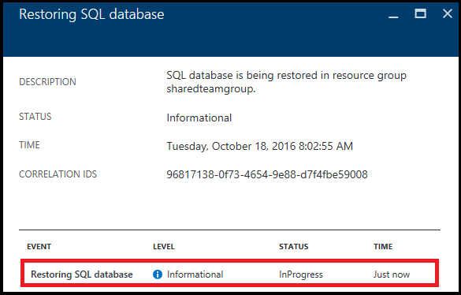

<properties
    pageTitle="Azure 门户预览：将 Azure SQL 数据库还原到以前的时间点 | Azure"
    description="使用 Azure 门户预览将 Azure SQL 数据库还原到以前的时间点"
    documentationcenter=""
    author="stevestein"
    manager="jhubbard"
    editor="" />
<tags
    ms.service="sql-database"
    ms.custom="business continuity"
    ms.devlang="NA"
    ms.topic="article"
    ms.tgt_pltfrm="powershell"
    ms.workload="NA"
    ms.date="12/08/2016"
    wacn.date="03/24/2017"
    ms.author="carlrab" />  

# 使用 Azure 门户预览将 Azure SQL 数据库还原到之前的时间点

本文介绍如何使用 PowerShell 将数据库从 [SQL 数据库自动备份](/documentation/articles/sql-database-automated-backups/)还原到以前的时间点。也可以[使用 PowerShell](/documentation/articles/sql-database-point-in-time-restore-powershell/) 执行此任务。

## 还原到以前的时间点 

> [AZURE.TIP]
有关教程，请参阅[开始使用备份和还原进行数据保护和恢复](/documentation/articles/sql-database-get-started-backup-recovery-portal/)
>

选择要在 Azure 门户预览中还原的数据库：

1. 打开 [Azure 门户预览](https://portal.azure.cn)。
2. 在屏幕左侧，选择“更多服务”>“SQL 数据库”。
3. 选择要还原的数据库。
4. 在数据库页面的顶部，选择“还原”：
   
     
5. 在“还原”页上，选择要将数据库还原到的日期和时间（UTC 时间），然后单击“确定”：
   
     
6. 在上一步中单击“确定”后，单击页面右上方的通知图标，然后单击“还原 SQL 数据库”通知以显示详细信息。
   
      

7. “还原 SQL 数据库”页面随即打开，显示有关还原状态的信息。可以单击行项查看更多详细信息：
   
      

## 后续步骤
- 若要了解 Azure SQL 数据库的自动备份，请参阅 [SQL 数据库自动备份](/documentation/articles/sql-database-automated-backups/)
- 若要了解如何使用自动备份进行恢复，请参阅[从服务启动的备份中还原数据库](/documentation/articles/sql-database-recovery-using-backups/)
- 有关业务连续性概述和应用场景，请参阅[业务连续性概述](/documentation/articles/sql-database-business-continuity/)

<!---HONumber=Mooncake_0320_2017-->
<!--Update_Description: overview content refine; clean link references-->