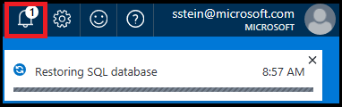

<properties
    pageTitle="将 Azure SQL 数据库还原到过去的时间点（Azure 门户） | Azure"
    description="将 Azure SQL 数据库还原到过去的时间点。"
    services="sql-database"
    documentationcenter=""
    author="stevestein"
    manager="jhubbard"
    editor="" />
<tags
    ms.assetid="d1822905-a11f-4c42-8940-98c6b81aed20"
    ms.service="sql-database"
    ms.devlang="NA"
    ms.date="10/18/2016"
    wacn.date="12/19/2016"
	ms.author="sstein"
    ms.workload="NA"
    ms.topic="article"
    ms.tgt_pltfrm="NA" />

# 使用 Azure 门户预览将 Azure SQL 数据库还原到之前的时间点

> [AZURE.SELECTOR]
- [概述](/documentation/articles/sql-database-recovery-using-backups/)
- [时间点还原：PowerShell](/documentation/articles/sql-database-point-in-time-restore-powershell/)

本文介绍如何使用 Azure 门户预览将数据库从 [SQL 数据库自动备份](/documentation/articles/sql-database-automated-backups/)还原到以前的时间点。

## 将 SQL 数据库还原到之前的时间点
选择要在 Azure 门户预览中还原的数据库：

1. 打开 [Azure 门户预览](https://portal.azure.cn)。
2. 在屏幕左侧，选择“更多服务”>“SQL 数据库”。
3. 选择要还原的数据库。
4. 在数据库页面的顶部，选择“还原”：
   
     

5. 在“还原”页上，选择要将数据库还原到的日期和时间（UTC 时间），然后单击“确定”：
   
     

## 监视还原操作
1. 在上一步中单击“确定”后，单击页面右上方的通知图标，然后单击“还原 SQL 数据库”通知以显示详细信息。
   
      

2. “还原 SQL 数据库”页面随即打开，显示有关还原状态的信息。可以单击行项查看更多详细信息：
   
      

## 后续步骤

- 有关业务连续性概述和应用场景，请参阅[业务连续性概述](/documentation/articles/sql-database-business-continuity/)
- 若要了解 Azure SQL 数据库的自动备份，请参阅 [SQL 数据库自动备份](/documentation/articles/sql-database-automated-backups/)
- 若要了解如何使用自动备份进行恢复，请参阅[从服务启动的备份中还原数据库](/documentation/articles/sql-database-recovery-using-backups/)
- 若要了解更快的恢复选项，请参阅[活动异地复制](/documentation/articles/sql-database-geo-replication-overview/)
- 若要了解如何使用自动备份进行存档，请参阅[数据库复制](/documentation/articles/sql-database-copy/)

<!---HONumber=Mooncake_1212_2016-->