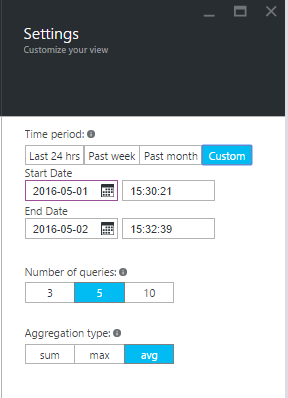

<properties 
   pageTitle="Azure SQL 数据库 Query Performance Insight" 
   description="查询性能监视可以识别 Azure SQL 数据库中 CPU 消耗最大的查询。" 
   services="sql-database" 
   documentationCenter="" 
   authors="stevestein" 
   manager="jhubbard" 
   editor="monicar"/>

<tags
   ms.service="sql-database"
   ms.devlang="na"
   ms.topic="article"
   ms.tgt_pltfrm="na"
   ms.workload="data-management" 
   ms.date="08/09/2016" 
   wacn.date="12/26/2016"
   ms.author="sstein"/>

# Azure SQL 数据库 Query Performance Insight

管理和优化关系数据库性能是一项颇具挑战性的操作，需要投入大量的专业知识和时间。Query Performance Insight 提供以下功能，使你能够花费更少的时间来排查数据库性能问题：

- 深入洞察数据库资源 (DTU) 的消耗。
- CPU 消耗排名靠前的查询经过优化后可以提升性能。
- 向下钻取查询详细信息的能力。

## 先决条件

- Query Performance Insight 仅适用于 Azure SQL 数据库 V12。
- Query Performance Insight 要求在数据库中运行[查询存储](https://msdn.microsoft.com/zh-cn/library/dn817826.aspx)。如果未运行查询存储，该门户会提示将其打开。

 
## 权限

需有以下[基于角色的访问控制](/documentation/articles/role-based-access-control-configure/)权限才能使用 Query Performance Insight：

- 查看资源消耗排名靠前的查询和图表时，需有“读取者”、“所有者”、“参与者”、“SQL DB 参与者”或“SQL Server 参与者”权限。
- 查看查询文本时，需有“所有者”、“参与者”、“SQL DB 参与者”或“SQL Server 参与者”权限。

## 使用 Query Performance Insight

Query Performance Insight 非常易于使用：

- 查看资源消耗排名靠前的查询列表。
- 若要查看其详细信息，请选择单个查询。
- 打开 [SQL 数据库顾问](/documentation/articles/sql-database-advisor/)并检查是否有任何建议。
- 放大查看详细信息。

    

> [AZURE.NOTE] SQL 数据库的查询存储需要捕获几个小时的数据，才能提供查询性能见解。如果在某段时间内数据库没有任何活动，或查询存储不处于活动状态，则显示该时间段的图表为空。如果查询存储未运行，可随时启用它。

## 查看 DTU 消耗量靠前的查询

在[门户](http://portal.azure.cn)中执行以下操作：

1. 浏览到 SQL 数据库并单击“设置”>“性能”>“查询”。

    ![Query Performance Insight][1]

    排名靠前的查询视图随即打开并列出 CPU 消耗量靠前的查询。

1. 单击图表周围了解详细信息。 最上一行显示数据库的总体 DTU 百分比。条形图显示所选间隔期间，选定查询所使用的 CPU 百分比（例如，如果选择“过去一周”，则每个条表示一天）。

    ![排名靠前的查询][2]

    底部网格表示可见查询的聚合信息。

    -	查询 ID - 数据库内查询的唯一标识符。
    -	每个查询在可观察到的时间间隔内使用的 CPU（取决于聚合函数）。
    -	每个查询的持续时间（取决于聚合函数）。
    -	特定查询的执行总次数。

	选择或清除图表要包含或排除的单个查询。

1. 如果感觉数据已过时，可单击“刷新”按钮。
1. 可选择单击“设置”以自定义 CPU 消耗数据的显示方式，或显示不同的时间段。

    

## 查看单个查询的详细信息

若要查看查询详细信息，请执行以下操作：

1. 单击排名靠前查询所在列表中的任意查询。

    

4. 详细信息视图随即打开，查询 CPU 消耗已按时间细分。
3. 单击图表以获取详细信息。 最前面一行显示整体 DTU 百分比，条形是所选查询消耗的 CPU 百分比。
4. 检查数据以查看详细度量值，包括运行查询的每个间隔持续时间、运行次数、资源消耗百分比。
    
    ![查询详细信息][3]

1. 可选择单击“设置”以自定义 CPU 消耗数据的显示方式，或显示不同的时间段。

## 	优化 Query Performance Insight 的“查询存储”配置

使用 Query Performance Insight 的过程中，可能会遇到以下查询存储消息：

- “查询存储容量已满，不能收集新数据。”
- “此数据库的查询存储处于只读模式，不能收集性能见解数据。”
- “查询存储参数没有针对 Query Performance Insight 进行优化设置。”

查询存储无法收集新数据时，通常会显示这些消息。若要解决这些问题，你有以下几种选择：

-	更改查询存储的保留和捕获策略
-	增加查询存储的大小
-	清除查询存储

### 建议的保留和捕获策略

有两种类型的保留策略：

- 基于大小的保留策略 – 如果设置为“自动”，则会在快要达到最大大小时自动清除数据。
- 基于时间的保留策略 - 如果查询存储用完了空间，则会删除早于 30 天默认设置的查询信息。

可以将捕获策略设置为：

- **所有** - 捕获所有查询。**所有**是默认选项。
- **自动** - 忽略不频繁的查询以及编译和执行持续时间很短的查询。执行计数、编译和运行时持续时间的阈值由内部决定。
- **无** - 查询存储停止捕获新的查询。
	
建议将所有策略设置为“自动”，并将清除策略设置为“30 天”：

    ALTER DATABASE [YourDB] 
    SET QUERY_STORE (SIZE_BASED_CLEANUP_MODE = AUTO);
    	
    ALTER DATABASE [YourDB] 
    SET QUERY_STORE (CLEANUP_POLICY = (STALE_QUERY_THRESHOLD_DAYS = 30));
    
    ALTER DATABASE [YourDB] 
    SET QUERY_STORE (QUERY_CAPTURE_MODE = AUTO);

通过连接到数据库并发出以下查询，增加查询存储的大小：

    ALTER DATABASE [YourDB]
    SET QUERY_STORE (MAX_STORAGE_SIZE_MB = 1024);

清除查询存储。删除查询存储中的所有当前信息：

    ALTER DATABASE [YourDB] SET QUERY_STORE CLEAR;

## 摘要

Query Performance Insight 可帮助你了解查询工作负荷的影响，以及它与数据库资源消耗的关系。使用此功能可以了解消耗排名靠前的查询，并在发生问题之前轻松找出问题。

## 后续步骤

有关改善 SQL 数据库性能的其他建议，请单击“Query Performance Insight”边栏选项卡上的[数据库顾问](/documentation/articles/sql-database-advisor/)。

<!--Image references-->
[1]: ./media/sql-database-query-performance/tile.png
[2]: ./media/sql-database-query-performance/top-queries.png
[3]: ./media/sql-database-query-performance/query-details.png

<!---HONumber=Mooncake_Quality_Review_1215_2016-->