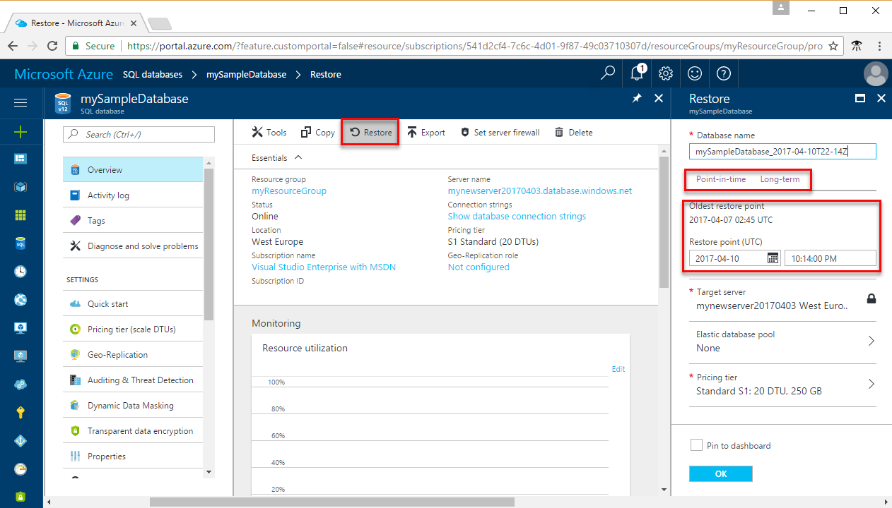
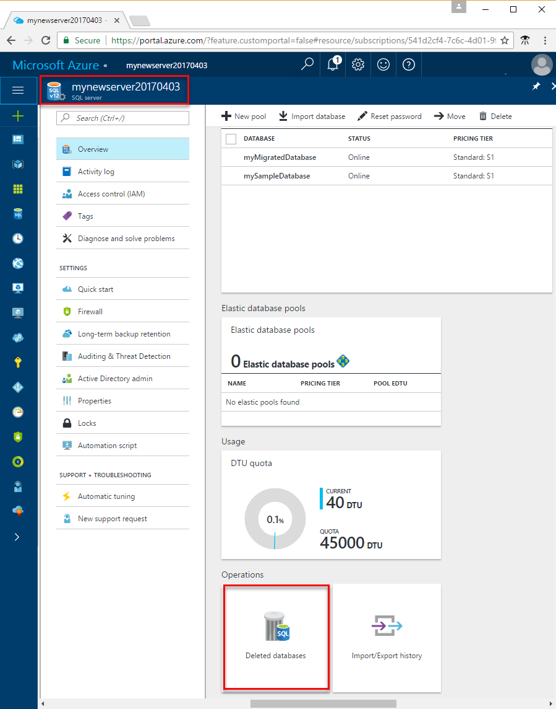
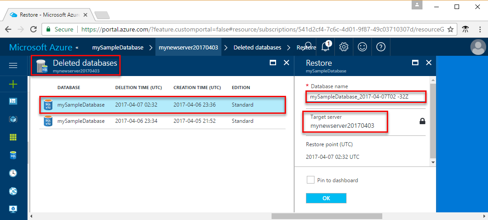

<properties
    pageTitle="从备份还原 Azure SQL 数据库 | Azure"
    description="了解有关时间点还原的信息，它让你能够将 Azure SQL 数据库回滚到之前的时间点（最多 35 天）。"
    services="sql-database"
    documentationcenter=""
    author="CarlRabeler"
    manager="jhubbard"
    editor="monicar" />
<tags
    ms.assetid="fd1d334d-a035-4a55-9446-d1cf750d9cf7"
    ms.service="sql-database"
    ms.custom="business continuity"
    ms.devlang="NA"
    ms.topic="article"
    ms.tgt_pltfrm="NA"
    ms.workload="NA"
    ms.date="04/10/2017"
    wacn.date="05/22/2017"
    ms.author="carlrab"
    ms.translationtype="Human Translation"
    ms.sourcegitcommit="8fd60f0e1095add1bff99de28a0b65a8662ce661"
    ms.openlocfilehash="2be531796ba59af243c2fadeafc38dd080bab9cf"
    ms.contentlocale="zh-cn"
    ms.lasthandoff="05/12/2017" />

# 使用自动数据库备份恢复 Azure SQL 数据库
SQL 数据库使用[自动数据库备份](/documentation/articles/sql-database-automated-backups/)为数据库恢复提供三个选项。 可从数据库备份还原到：

* 保留期内指定时间点的同一逻辑服务器上的新数据库。 
* 已删除数据库的删除时间的同一逻辑服务器上的数据库。
* 任何区域中恢复到异地复制 blob 存储 (RA-GRS) 的最新每日备份点的任何逻辑服务器上的新数据库。

还可以使用[自动数据库备份](/documentation/articles/sql-database-automated-backups/)在任何区域中的逻辑服务器上创建[数据库副本](/documentation/articles/sql-database-copy/)。 

## 恢复时间
使用自动数据库备份还原数据库的恢复时间受几个因素的影响： 

* 数据库的大小
* 数据库的性能级别
* 所涉及的事务日志数
* 需要重新播放以恢复到还原点的活动数量
* 还原到不同区域时的网络带宽 
* 目标区域中正在处理的并行还原请求数。 
  
  对于非常大和/或活动的数据库，还原可能要花费几个小时。 如果一个区域出现长时间的服务中断，则可能是因为存在大量正在由其他区域处理的异地还原请求。 当存在很多请求时，则可能会延长该区域中数据库的恢复时间。 大部分数据库还原操作可在 12 小时内完成。
  
  没有任何内置功能用于执行批量还原。 [Azure SQL 数据库：完全恢复服务器](https://gallery.technet.microsoft.com/Azure-SQL-Database-Full-82941666) 脚本是完成此任务的一种方法示例。

> [AZURE.IMPORTANT]
> 若要使用自动备份进行恢复，用户必须是订阅中的 SQL Server 参与者角色的成员或是订阅所有者。 可以使用 Azure 门户预览、PowerShell 或 REST API 进行恢复。 但不能使用 Transact-SQL。 
> 

## 时间点还原

通过使用 Azure 门户预览、PowerShell 或 [REST API](https://msdn.microsoft.com/zh-cn/library/azure/mt163685.aspx)，可将现有数据库还原到早期的时间点，作为同一逻辑服务器上的新数据库。 

> [AZURE.IMPORTANT]
> 还原期间无法覆盖现有数据库。
>

可将数据库还原到任何服务层或性能级别或还原到弹性池内，并用作单一数据库。 确保要将数据库还原到其中的逻辑服务器上或弹性池内有足够的资源。 还原完成后，还原的数据库应是一个完全可联机访问的正常数据库。 还原的数据库将基于其服务层和性能级别按正常费率计费。 在数据库还原完成之前，不会产生费用。

通常，为恢复目的将数据库还原到较早点。 这样做时，可以将还原的数据库作为原始数据库的替代数据库，或使用它来检索数据，然后更新原始数据库。 

* ***数据库替换***：如果还原的数据库旨在替换原始数据库，那么应验证性能级别和/或服务层是否合适，如有必要，还应调整该数据库的规模。 你可以使用 T-SQL 中的 ALTER DATABASE 命令来重命名原始数据库，然后为还原的数据库指定原有的名称。 
* ***数据恢复：***如果打算从还原的数据库检索数据以从用户或应用程序错误中恢复，则需要编写和执行要从还原的数据库将数据提取到原始数据库时所必需的数据恢复脚本。 尽管还原操作可能需要很长时间才能完成，但整个还原过程中，都可在数据库列表中看到还原数据库。 如果在还原期间删除数据库，将取消还原操作，则不会针对未完成还原的数据库向你收费。 

### Azure 门户预览

若要使用 Azure 门户预览还原到某个时间点，请打开数据库页，并在工具栏上单击“还原”。

## 已删除的数据库还原
通过使用 Azure 门户预览、[PowerShell](/documentation/articles/sql-database-restore-database-powershell/) 或 [REST (createMode=Restore)](https://msdn.microsoft.com/zh-cn/library/azure/mt163685.aspx)，可将已删除的数据库还原到同一逻辑服务器上已删除的数据库的删除时间。 

> [AZURE.IMPORTANT]
> 如果删除 Azure SQL 数据库服务器实例，其所有数据库也会一并删除，并且无法恢复。 目前不支持还原已删除的服务器。
> 

### Azure 门户预览

若要使用 Azure 门户预览在[保留期](/documentation/articles/sql-database-service-tiers/)期间恢复已删除的数据库，请打开服务器的页面，然后在“操作”区中，单击“已删除的数据库”。

## 异地还原
可在任何 Azure 区域的任何服务器上从最新异地复制的完整备份和差异备份中还原 SQL 数据库。 异地还原使用异地冗余备份作为源，即使由于停电而无法访问数据库或数据中心，也依然能够使用它来恢复数据库。 

当你的数据库因其所在的区域发生事故而不可用时，异地还原是默认的恢复选项。 如果区域中出现的大规模事件导致你的数据库应用程序不可用，你可以从异地复制的备份中将数据库还原到任何其他区域中的服务器。 提取差异备份和将其异地复制到其他区域中的 Azure blob 之间会有延迟。 此延迟可能长达一小时，因此发生灾难时，会有长达 1 小时的数据丢失风险。 下图显示的是从其他区域中的最后一个可用备份中还原数据库。

有关使用异地还原在中断后恢复的详细信息，请参阅[在中断后恢复](/documentation/articles/sql-database-disaster-recovery/)

> [AZURE.IMPORTANT]
> 从备份中还原是 SQL 数据库中提供的最基本的灾难恢复解决方案，具有最长的 RPO 和估计恢复时间 (ERT)。 对于最大为 2GB 的基本数据库，异地还原提供了 ERT 为 12 小时的合理灾难恢复解决方案。 对于较大的标准或高级数据库，如果需要在较短时间内恢复，或要减少数据丢失的可能性，应考虑使用活动异地复制。 活动异地复制可提供低得多的 RPO 和 ERT，因为它只需要你启动故障转移，以故障转移到连续复制的辅助数据库。 有关详细信息，请参阅[活动异地复制](/documentation/articles/sql-database-geo-replication-overview/)。
> 

### Azure 门户预览

若要使用 Azure 门户预览在[保留期](/documentation/articles/sql-database-service-tiers/)期间对数据库进行异地还原，请打开 SQL 数据库页，然后单击“添加”。 在“选择源”文本框中，选择“备份”。 在所选的区域和服务器上指定要从中执行恢复的备份。 

## 使用自动备份以编程方式执行恢复
如前所述，除了使用 Azure 门户预览外，还可以使用 Azure PowerShell 或 REST API 以编程方式执行数据库恢复。 下表描述了可用的命令集。

### PowerShell
| Cmdlet | 说明 |
| --- | --- |
| [Get-AzureRmSqlDatabase](https://msdn.microsoft.com/zh-cn/library/azure/mt603648.aspx) |获取一个或多个数据库。 |
| [Get-AzureRMSqlDeletedDatabaseBackup](https://msdn.microsoft.com/zh-cn/library/azure/mt693387.aspx) |获取可以还原的已删除数据库。 |
| [Get-AzureRmSqlDatabaseGeoBackup](https://msdn.microsoft.com/zh-cn/library/azure/mt693388.aspx) |获取数据库的异地冗余备份。 |
| [Restore-AzureRmSqlDatabase](https://msdn.microsoft.com/zh-cn/library/azure/mt693390.aspx) |还原 SQL 数据库。 |
|  | |

### REST API
| API | 说明 |
| --- | --- |
| [REST (createMode=Recovery)](https://msdn.microsoft.com/zh-cn/library/azure/mt163685.aspx) |还原数据库 |
| [获取创建或更新数据库状态](https://msdn.microsoft.com/zh-cn/library/azure/mt643934.aspx) |在还原操作过程中返回状态 |
|  | |

## 摘要
自动备份可保护数据库，使其免受用户和应用程序错误、意外的数据库删除和长时间中断的影响。 此内置的功能适用于所有服务层和性能级别。 

## 后续步骤
* 有关业务连续性概述和应用场景，请参阅[业务连续性概述](/documentation/articles/sql-database-business-continuity/)
* 若要了解 Azure SQL 数据库的自动备份，请参阅 [SQL 数据库自动备份](/documentation/articles/sql-database-automated-backups/)
* 若要了解更快的恢复选项，请参阅[活动异地复制](/documentation/articles/sql-database-geo-replication-overview/)
<!--Update_Description: remove several links-->