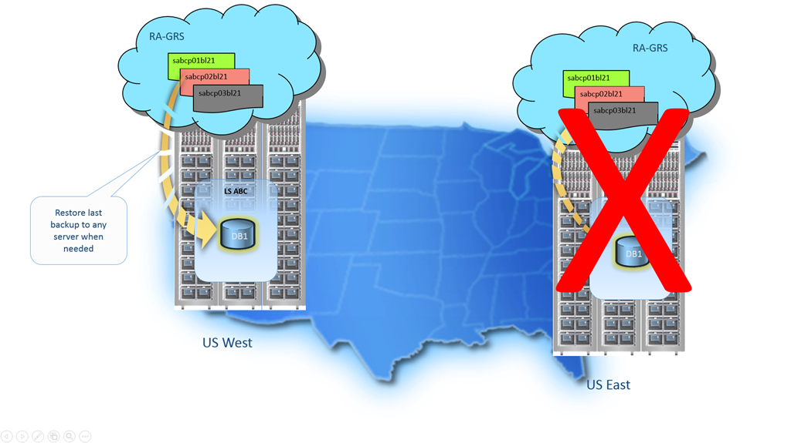

<properties
   pageTitle="云业务连续性 - 还原已删除的数据库 - SQL 数据库 | Microsoft Azure"
   description="了解有关时间点还原的信息，它让你能够将 Azure SQL 数据库回滚到之前的时间点（最多 35 天）。"
   services="sql-database"
   documentationCenter=""
   authors="stevestein"
   manager="jhubbard"
   editor="monicar"/>

<tags
   ms.service="sql-database"
   ms.date="06/09/2016"
   wacn.date="08/15/2016"/>

# 使用自动数据库备份恢复 Azure SQL 数据库

SQL 数据库使用 [SQL 数据库自动备份](/documentation/articles/sql-database-automated-backups/)为数据库恢复提供三个选项。你可以在[保留期](/documentation/articles/sql-database-service-tiers/)内从服务启动的备份将数据库还原到：

- 恢复到保留期内指定时间点的同一逻辑服务器上的新数据库。
- 恢复到已删除数据库的删除时间的同一逻辑服务器上的数据库。
- 任何区域中恢复到异地复制 blob 存储 (RA-GRS) 的最新每日备份的任何逻辑服务器上的新数据库。

你还可以使用 [SQL 数据库自动备份](/documentation/articles/sql-database-automated-backups/)在任何区域中的任何逻辑服务器上创建在事务上与当前 SQL 数据库一致的[数据库副本](/documentation/articles/sql-database-copy/)。可以使用数据库副本和[导出到 BACPAC](/documentation/articles/sql-database-export/) 将事务上一致的数据库副本存档以便在保留期以外长期存储，或者将数据库副本传输到本地或 SQL Server 的 Azure VM 实例。

## 恢复时间

使用自动数据库备份还原数据库的恢复时间受几个因素的影响：
 - 数据库的大小
 - 数据库的性能级别
 - 所涉及的事务日志数
 - 需要重新播放以恢复到还原点的活动数量
 - 还原到不同区域时的网络带宽
 - 目标区域中正在处理的并行还原请求数。
 
 对于非常大和/或活动的数据库，还原可能要花费几个小时。如果一个区域出现长时间的服务中断，则可能是因为存在大量正在由其他区域处理的异地还原请求。如果存在大量请求，则可能会延长该区域中数据库还原的时间。大部分数据库还原操作可在 12 小时内完成。

 没有任何内置功能用于执行批量还原。[Azure SQL 数据库：完全恢复服务器](https://gallery.technet.microsoft.com/Azure-SQL-Database-Full-82941666)脚本是完成此任务的一种方法示例。

## 时间点还原

使用时间点还原，可以通过 [SQL 数据库自动备份](/documentation/articles/sql-database-automated-backups/)将现有数据库作为新数据库还原到同一逻辑服务器上的较早时间点。无法覆盖现有数据库。你可以通过 [Azure 门户](/documentation/articles/sql-database-point-in-time-restore-portal/)、[PowerShell](/documentation/articles/sql-database-point-in-time-restore-powershell/) 或 [REST API](https://msdn.microsoft.com/zh-cn/library/azure/mt163685.aspx) 还原到较早时间点。

> [AZURE.SELECTOR]
- [时间点还原：Azure 门户](/documentation/articles/sql-database-point-in-time-restore-portal/)
- [时间点还原：PowerShell](/documentation/articles/sql-database-point-in-time-restore-powershell/)

可以将数据库还原到任何性能级别或还原到弹性池。你需要确保逻辑服务器或弹性池中有足够的 DTU 配额。请记住，还原将创建新的数据库且还原的数据库的服务层和性能级别可能与活动数据库的当前状态有所不同。还原完成后，还原的数据库将是完全可联机访问的正常数据库，并基于其服务层和性能级别按正常费率计费。在数据库还原完成之前，不会产生费用。

通常，为恢复目的将数据库还原到较早点。这样做时，可以将还原的数据库作为原始数据库的替代数据库，或使用它来检索数据，然后更新原始数据库。

- ***数据库替换：***如果还原的数据库旨在替换原始数据库，那么你应该验证性能级别和/或服务层是否合适，如有必要，还应调整该数据库的规模。你可以使用 T-SQL 中的 ALTER DATABASE 命令来重命名原始数据库，然后为还原的数据库指定原有的名称。
- ***数据恢复：***如果你打算从还原的数据库检索数据以从用户或应用程序错误中恢复，则将分别需要编写和执行要从还原的数据库将数据提取到原始数据库所需的任何数据恢复脚本。尽管还原操作可能需要很长时间才能完成，但整个过程中，都可在数据库列表中看到还原数据库。如果在还原期间删除数据库，将取消还原操作，且不会针对未完成还原的数据库向你收费。

有关使用时间点还原从用户和应用程序错误中恢复的详细信息，请参阅[从用户错误中恢复](/documentation/articles/sql-database-user-error-recovery/)

## 已删除的数据库还原

使用已删除的数据库还原，可以通过 [SQL 数据库自动备份](/documentation/articles/sql-database-automated-backups/)将已删除的数据库还原到同一逻辑服务器上已删除的数据库的删除时间。

> [AZURE.IMPORTANT] 如果删除 Azure SQL 数据库服务器实例，其所有数据库也会一并删除，并且无法恢复。目前不支持还原已删除的服务器。

可以对还原的数据库使用相同的或新的数据库名称。可以使用 [Azure 门户](/documentation/articles/sql-database-restore-deleted-database-portal/)、[PowerShell](/documentation/articles/sql-database-restore-deleted-database-powershell/) 或 [REST API](https://msdn.microsoft.com/zh-cn/library/azure/mt163685.aspx)。

> [AZURE.SELECTOR]
- [已删除的数据库还原：Azure 门户](/documentation/articles/sql-database-restore-deleted-database-portal/)
- [已删除的数据库还原：PowerShell](/documentation/articles/sql-database-restore-deleted-database-powershell/)

## 异地还原

使用异地还原，可以在任何 Azure 区域的任何服务器上从最新的异地复制[日常自动备份](/documentation/articles/sql-database-automated-backups/)还原 SQL 数据库。异地还原使用异地冗余备份作为源，即使由于停电而无法访问数据库或数据中心，也依然能够使用它来恢复数据库。可以使用 [Azure 门户](/documentation/articles/sql-database-geo-restore-portal/)、[PowerShell](/documentation/articles/sql-database-geo-restore-powershell/) 或 [REST (createMode=Restore)](https://msdn.microsoft.com/zh-cn/library/azure/mt163685.aspx)

> [AZURE.SELECTOR]
- [异地还原：Azure 门户](/documentation/articles/sql-database-geo-restore-portal/)
- [异地还原：PowerShell](/documentation/articles/sql-database-geo-restore-powershell/)

当你的数据库因其所在的区域发生事故而不可用时，异地还原是默认的恢复选项。如果区域中出现的大规模事件导致你的数据库应用程序不可用，你可以使用异地还原，将数据库从最新备份还原到任何其他区域中的服务器。所有备份是异地复制的，并且执行备份这一操作与异地复制到不同区域中的 Azure blob 这一操作之间可能会存在延迟。此延迟可能长达一小时，因此发生灾难时，会有长达 1 小时的数据丢失风险，即最多 1 小时的 RPO。下面显示了从上次的每日备份进行的数据库还原。

有关使用异地还原从中断中恢复的详细信息，请参阅 [Recover from an outage](/documentation/articles/sql-database-disaster-recovery/)（从中断中恢复）

> [AZURE.IMPORTANT] 虽然异地还原在所有服务层中均可用，但它是 SQL 数据库中提供的最基本的灾难恢复解决方案，具有最长的 RPO 和估计恢复时间 (ERT)。对于最大为 2GB 的基本数据库，异地还原提供了 ERT 为 12 小时的合理灾难恢复解决方案。对于较大的标准或高级数据库，如果需要在很短的恢复时间内恢复，或要减少数据丢失的可能性，应考虑使用活动异地复制。活动异地复制可提供低得多的 RPO 和 ERT，因为它只需要你启动故障转移，以故障转移到连续复制的辅助数据库。有关详细信息，请参阅[活动异地复制](/documentation/articles/sql-database-geo-replication-overview/)。

## 使用自动备份以编程方式执行恢复

如上所述，除了使用 Azure 门户外，还可以使用 Azure PowerShell 和 REST API 以编程方式执行数据库恢复。下表介绍可用的命令集。

### PowerShell

|Cmdlet|说明|
|------|-----------|
|[Get-AzureRmSqlDatabase](https://msdn.microsoft.com/zh-cn/library/azure/mt603648.aspx)|获取一个或多个数据库。|
|[Get-AzureRMSqlDeletedDatabaseBackup](https://msdn.microsoft.com/zh-cn/library/azure/mt693387.aspx)|获取可以还原的已删除数据库。|
|[Get-AzureRmSqlDatabaseGeoBackup](https://msdn.microsoft.com/zh-cn/library/azure/mt693388.aspx)|获取数据库的异地冗余备份。|
|[Restore-AzureRmSqlDatabase](https://msdn.microsoft.com/zh-cn/library/azure/mt693390.aspx)|还原 SQL 数据库。|
||||

### REST API

|API|说明|
|---|-----------|
|[REST (createMode=Restore)](https://msdn.microsoft.com/zh-cn/library/azure/mt163685.aspx)|还原数据库|
|[获取创建或更新数据库状态](https://msdn.microsoft.com/zh-cn/library/azure/mt643934.aspx)|在还原操作过程中返回状态|
||||

## 摘要

自动备份可保护数据库，使其免受用户和应用程序错误、意外的数据库删除和长时间中断的影响。所有 SQL 数据库均适用此零成本、零管理的解决方案。

## 后续步骤

- 有关业务连续性概述，请参阅[业务连续性概述](/documentation/articles/sql-database-business-continuity/)
- 若要了解有关 Azure SQL 数据库自动备份的信息，请参阅 [SQL Database automated backups（SQL 数据库自动备份）](/documentation/articles/sql-database-automated-backups/)
- 若要了解业务连续性设计和恢复方案，请参阅[连续性方案](/documentation/articles/sql-database-business-continuity-scenarios/)
- 若要了解更快的恢复选项，请参阅[活动异地复制](/documentation/articles/sql-database-geo-replication-overview/)
- 若要了解如何使用自动备份进行存档，请参阅[数据库复制](/documentation/articles/sql-database-copy/)

<!---HONumber=Mooncake_0808_2016-->