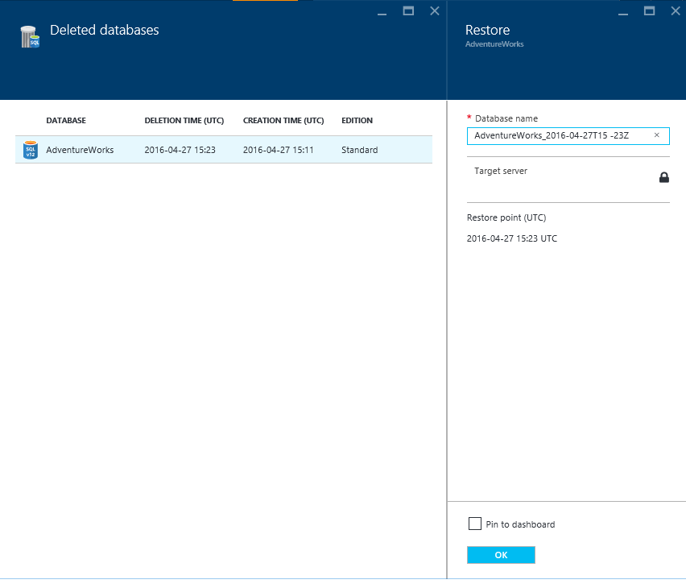

<properties
    pageTitle="Azure 门户预览：还原 Azure SQL 数据库 | Azure"
    description="还原 Azure SQL 数据库（Azure 门户预览）。"
    services="sql-database"
    documentationcenter=""
    author="stevestein"
    manager="jhubbard"
    editor=""
    translationtype="Human Translation" />
<tags
    ms.assetid="33b0c9e6-1cd2-4fd9-9b0d-70ecf6e54821"
    ms.service="sql-database"
    ms.custom="business continuity"
    ms.devlang="NA"
    ms.date="10/12/2016"
    wacn.date="04/17/2017"
    ms.author="sstein"
    ms.workload="NA"
    ms.topic="article"
    ms.tgt_pltfrm="NA"
    ms.sourcegitcommit="7cc8d7b9c616d399509cd9dbdd155b0e9a7987a8"
    ms.openlocfilehash="97846c0e6b23bebc139010bee5cd4ea927f71f23"
    ms.lasthandoff="04/07/2017" />

# 使用 Azure 门户预览还原 Azure SQL 数据库

以下步骤显示如何将 Azure SQL 数据库从已删除的数据库还原到某个时间点，以及如何从异地冗余备份还原。

## 将 Azure SQL 数据库还原到之前的时间点 

> [AZURE.TIP]
> 有关教程，请参阅[数据保护和恢复的备份和还原入门](/documentation/articles/sql-database-get-started-backup-recovery-portal/)
>

选择要在 Azure 门户预览中还原的数据库：

1. 打开 [Azure 门户预览](https://portal.azure.cn)。
2. 在屏幕左侧选择“**更多服务**” > “**SQL 数据库**”。
3. 选择要还原的数据库。
4. 在数据库页面的顶部，选择“还原” ：
   
   
5. 在“**还原**”页上，选择要将数据库还原到的日期和时间（UTC 时间），然后单击“**确定**”：
   
   

6. 在上一个步骤中单击“**确定**”后，单击页面右上方的通知图标，然后单击“**正在还原 SQL 数据库**”通知了解详细信息。
   
    
7. “还原 SQL 数据库”页面随即打开，显示有关还原状态的信息。 可以单击行项查看更多详细信息：
   
    

## 从备份还原已删除的 Azure SQL 数据库
在 Azure 门户预览中还原已删除的数据库：

1. 在 [Azure 门户预览](https://portal.azure.cn)中，单击“更多服务” > “SQL 服务器”。
2. 选择包含要还原的数据库的服务器。
3. 向下滚动到服务器边栏选项卡的“**操作**”部分并选择“**已删除的数据库**”：
4. 选择要还原的数据库。
5. 指定数据库名称，然后单击“确定”： 
   
   

## 从异地冗余备份还原 Azure SQL 数据库

若要在 Azure 门户预览中异地还原数据库，请执行以下步骤：

1. 转到 [Azure 门户预览](https://portal.azure.cn)。
2. 在屏幕左侧选择“**+新建**” > “**数据库**” > “**SQL 数据库**”：
   
   
3. 选择“备份”  作为源，然后选择要还原的备份。 指定数据库名称、要将数据库还原到其中的服务器，然后单击“创建” ：
   
   

4. 单击页面右上方的通知图标，监视还原操作的状态。

## 后续步骤
* 有关业务连续性概述和应用场景，请参阅[业务连续性概述](/documentation/articles/sql-database-business-continuity/)
* 若要了解 Azure SQL 数据库的自动备份，请参阅 [SQL 数据库自动备份](/documentation/articles/sql-database-automated-backups/)
* 若要了解如何使用自动备份进行恢复，请参阅[从服务启动的备份中还原数据库](/documentation/articles/sql-database-recovery-using-backups/)
* 若要了解更快的恢复选项，请参阅[活动异地复制](/documentation/articles/sql-database-geo-replication-overview/)  
* 若要了解如何使用自动备份进行存档，请参阅[数据库复制](/documentation/articles/sql-database-copy/)