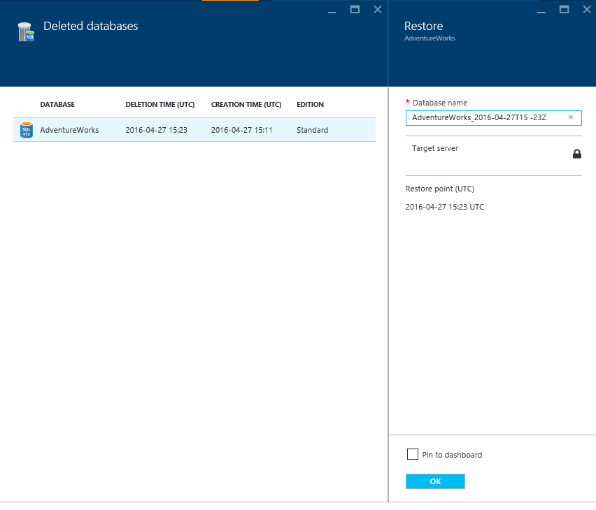

<properties
	pageTitle="还原已删除的 Azure SQL 数据库（Azure 门户预览）| Azure"
	description="还原已删除的 Azure SQL 数据库（Azure 门户预览）。"
	services="sql-database"
	documentationCenter=""
	authors="stevestein"
	manager="jhubbard"
	editor=""/>

<tags
	ms.service="sql-database"
	ms.devlang="NA"
	ms.date="10/12/2016"
	wacn.date="10/31/2016"
	ms.author="sstein"
	ms.workload="NA"
	ms.topic="article"
	ms.tgt_pltfrm="NA"/>

# 使用 Azure 门户预览还原已删除的 Azure SQL 数据库

> [AZURE.SELECTOR]
- [概述](/documentation/articles/sql-database-recovery-using-backups/)
- [**还原已删除的数据库：门户**](/documentation/articles/sql-database-restore-deleted-database-portal/)
- [还原已删除的数据库：PowerShell](/documentation/articles/sql-database-restore-deleted-database-powershell/)

## 选择要还原的数据库 

在 Azure 门户预览中还原已删除的数据库：

1.	在 [Azure 门户预览](https://portal.azure.cn)中，单击“更多服务”>“SQL 服务器”。
3.  选择包含要还原的数据库的服务器。
4.  向下滚动到服务器边栏选项卡的“操作”部分并选择“已删除的数据库”：
	
5.  选择要还原的数据库。
6.  指定数据库名称，然后单击“确定”：

    

## 后续步骤

- 有关业务连续性概述和应用场景，请参阅[业务连续性概述](/documentation/articles/sql-database-business-continuity/)
- 若要了解 Azure SQL 数据库的自动备份，请参阅 [SQL 数据库自动备份](/documentation/articles/sql-database-automated-backups/)
- 若要了解如何使用自动备份进行恢复，请参阅[从服务启动的备份中还原数据库](/documentation/articles/sql-database-recovery-using-backups/)
- 若要了解更快的恢复选项，请参阅[活动异地复制](/documentation/articles/sql-database-geo-replication-overview/)
- 若要了解如何使用自动备份进行存档，请参阅[数据库复制](/documentation/articles/sql-database-copy/)

<!---HONumber=Mooncake_1024_2016-->