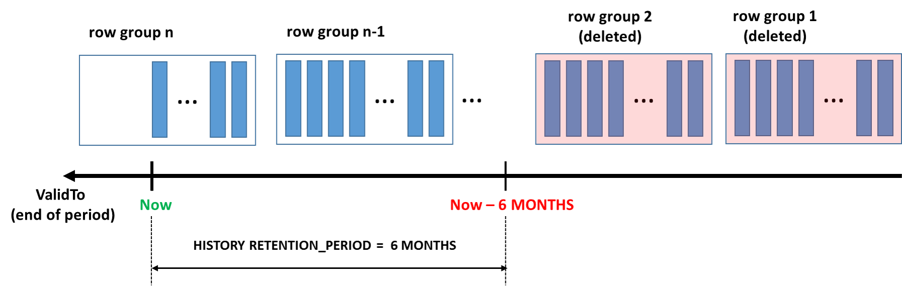
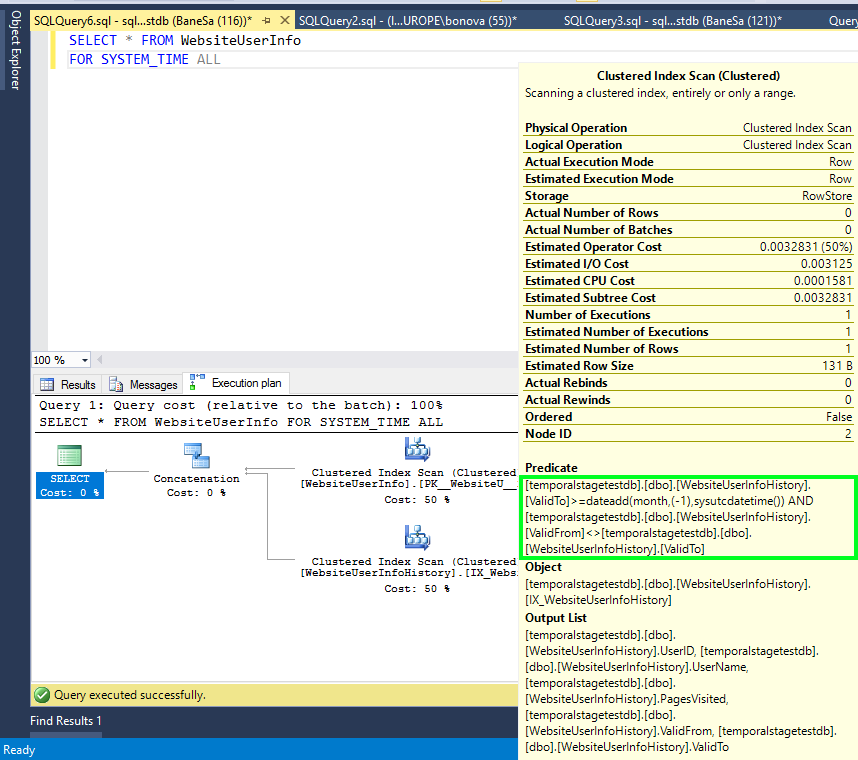

<properties
   pageTitle="使用保留策略管理临时表中的历史数据 | Azure"
   description="了解如何使用临时保留策略来控制历史数据。"
   services="sql-database"
   documentationCenter=""
   authors="bonova"
   manager="drasumic"
   editor=""/>  

<tags
   ms.service="sql-database"
   ms.devlang="NA"
   ms.topic="article"
   ms.tgt_pltfrm="NA"
   ms.workload="sql-database"
   ms.date="10/12/2016"
   wacn.date="10/31/2016"
   ms.author="bonova"/>  

#使用保留策略管理临时表中的历史数据

与普通的表相比，临时表数据库大小的增长幅度可能更大，尤其是长时间保留历史数据时。因此，针对历史数据创建保留策略是规划和管理每个临时表的生命周期的一个重要方面。Azure SQL 数据库中的临时表附带了易用的保留机制，可帮助完成此任务。

可以在单个表的级别配置临时历史记录保留期，以便用户创建灵活的期限策略。应用临时保留的过程十分简单：只需在创建表或更改架构期间设置一个参数即可。

定义保留策略后，Azure SQL 数据库将开始定期检查是否有符合自动数据清理条件的历史行。匹配行的识别以及从历史记录表中删除这些行的过程在系统计划和运行的后台任务中发生。历史记录表行的期限条件根据表示 SYSTEM\_TIME 期限结束时间的列进行检查。例如，如果保留期设置为六个月，则可以清理符合以下条件的表行：

	ValidTo < DATEADD (MONTH, -6, SYSUTCDATETIME())

在上面的示例中，假设 **ValidTo** 列对应于 SYSTEM\_TIME 期限结束时间。

##如何配置保留策略？

在为临时表配置保留策略之前，请先检查是否*在数据库级别*启用了临时历史记录保留策略。

	SELECT is_temporal_history_retention_enabled, name
	FROM sys.databases

数据库标志 **is\_temporal\_history\_retention\_enabled** 默认设置为 ON，但用户可以使用 ALTER DATABASE 语句更改此值。在执行时间点还原操作后，它会自动设置为 OFF。若要为数据库启用临时历史记录保留策略清理，请执行以下语句：

	ALTER DATABASE <myDB>
	SET TEMPORAL_HISTORY_RETENTION  ON

> [AZURE.IMPORTANT] 即使 **is\_temporal\_history\_retention\_enabled** 设置为 OFF，也可以为临时表配置保留策略，但在这种情况下，不会针对陈旧的行触发自动清理。

在创建表的过程中，可以通过指定 HISTORY\_RETENTION\_PERIOD 参数的值来配置保留策略：

	CREATE TABLE dbo.WebsiteUserInfo
	(  
	    [UserID] int NOT NULL PRIMARY KEY CLUSTERED
	  , [UserName] nvarchar(100) NOT NULL
	  , [PagesVisited] int NOT NULL
	  , [ValidFrom] datetime2 (0) GENERATED ALWAYS AS ROW START
	  , [ValidTo] datetime2 (0) GENERATED ALWAYS AS ROW END
	  , PERIOD FOR SYSTEM_TIME (ValidFrom, ValidTo)
	 )  
	 WITH
	 (
		 SYSTEM_VERSIONING = ON
		 (
			HISTORY_TABLE = dbo.WebsiteUserInfoHistory,
			HISTORY_RETENTION_PERIOD = 6 MONTHS
		 )
	 );

Azure SQL 数据库允许使用不同的时间单位指定保留策略：DAYS、WEEKS、MONTHS 和 YEARS。如果省略 HISTORY\_RETENTION\_PERIOD，则假设保留期限为 INFINITE（无限期）。也可以显式使用 INFINITE 关键字。

在某些情况下，你可能想要在创建表后配置保留策略或更改以前配置的值。在这种情况下，请使用 ALTER TABLE 语句：

	ALTER TABLE dbo.WebsiteUserInfo
	SET (SYSTEM_VERSIONING = ON (HISTORY_RETENTION_PERIOD = 9 MONTHS));

> [AZURE.IMPORTANT]  将 SYSTEM\_VERSIONING 设置为 OFF *不会保存*保留期值。在未显式指定 HISTORY\_RETENTION\_PERIOD 的情况下将 SYSTEM\_VERSIONING 设置为 ON 会导致保留期为 INFINITE。

若要查看保留策略的当前状态，请使用以下查询，该查询将数据库级别的临时保留启用标志与单个表的保留期相联接：

	SELECT DB.is_temporal_history_retention_enabled,
	SCHEMA_NAME(T1.schema_id) AS TemporalTableSchema,
	T1.name as TemporalTableName,  SCHEMA_NAME(T2.schema_id) AS HistoryTableSchema,
	T2.name as HistoryTableName,T1.history_retention_period,
	T1.history_retention_period_unit_desc
	FROM sys.tables T1  
	OUTER APPLY (select is_temporal_history_retention_enabled from sys.databases
	where name = DB_NAME()) AS DB
	LEFT JOIN sys.tables T2   
	ON T1.history_table_id = T2.object_id WHERE T1.temporal_type = 2

##SQL 数据库如何删除陈旧行？

清理过程取决于历史记录表的索引布局。必须注意，*只能为具有聚集索引（B 树或列存储）的历史记录表配置有限期保留策略*。对于具有有限保留期的所有临时表，系统会创建一个后台任务来执行陈旧数据清理。行存储（B 树）聚集索引的清理逻辑以较小的块区（最大 10K）删除陈旧行，因此可以最大程度地减轻数据库日志和 I/O 子系统的压力。尽管清理逻辑利用所需的 B 树索引，但不一定能够保证按顺序删除超过保留期的行。因此，*请不要对应用程序中的清理顺序有任何依赖*。

针对聚集列存储的清理任务会一次性删除整个[行组](https://msdn.microsoft.com/zh-cn/library/gg492088.aspx)（每个行组通常包含 1 百万行），这种方式非常高效，尤其是在高速生成历史数据时。

  

当工作负荷快速生成大量的历史数据时，优异的数据压缩和高效的保留数据清理使得聚集列存储索引成为完美的选择。使用临时表进行更改跟踪和审核、趋势分析或 IoT 数据引入的密集型[事务处理工作负荷](https://msdn.microsoft.com/zh-cn/library/mt631669.aspx)往往使用该模式。

##索引注意事项

针对具有行存储聚集索引的表的清理任务要求索引的开头为对应于 SYSTEM\_TIME 期限结束时间的列。如果不存在这样的索引，将无法配置有限保留期：

*消息 13765，级别 16，状态 1   
在版本由系统控制的临时表 'temporalstagetestdb.dbo.WebsiteUserInfo' 中设置有限保留期失败，因为历史记录表 'temporalstagetestdb.dbo.WebsiteUserInfoHistory' 不包含所需的聚集索引。请考虑在历史记录表中创建聚集列存储，或者创建开头为与 SYSTEM\_TIME 期限结束时间匹配的列的 B 树索引。*

请务必注意，Azure SQL 数据库创建的默认历史记录表已有聚集索引，这符合保留策略。如果尝试在具有有限保留期的表中删除该索引，该操作将会失败并出现以下错误：

*Msg 13766，级别 16，状态 1   
无法删除聚集索引 'WebsiteUserInfoHistory.IX\_WebsiteUserInfoHistory'，因为它正用于自动清理陈旧数据。如果需要删除此索引，请考虑在版本由系统控制的临时表中将 HISTORY\_RETENTION\_PERIOD 设置为 INFINITE。*

如果按升序插入历史行（按期限结束时间列排序），则清理聚集列存储索引的过程最为顺利。当历史记录表是由 SYSTEM\_VERSIONIOING 机制以独占方式填充时，情况往往如此。如果历史记录表中的行未按期限结束时间列排序（如果迁移了现有历史数据，可能会存在这种情况），则应在正确排序的 B 树行存储索引顶层重新创建聚集列存储索引，以获得最佳性能。

避免在具有有限保留期的历史记录表中重建聚集列存储索引，因为这可能会改变行组中由系统版本控制操作施加的固有顺序。如果需要在历史记录表中重建聚集列存储索引，请在符合条件的 B 树索引顶层创建该索引，同时保留行组的顺序，以便能够执行常规数据清理。如果要使用具有聚集列索引且数据顺序没有保证的现有历史记录表创建临时表，则应采用同样的方法：

	/*Create B-tree ordered by the end of period column*/
	CREATE CLUSTERED INDEX IX_WebsiteUserInfoHistory ON WebsiteUserInfoHistory (ValidTo)
	WITH (DROP_EXISTING = ON);
	GO
	/*Re-create clustered columnstore index*/
	CREATE CLUSTERED COLUMNSTORE INDEX IX_WebsiteUserInfoHistory ON WebsiteUserInfoHistory
	WITH (DROP_EXISTING = ON);

为具有聚集列存储索引的历史记录表配置有限保留期时，无法在该表表创建附加的非聚集 B 树索引：

	CREATE NONCLUSTERED INDEX IX_WebHistNCI ON WebsiteUserInfoHistory ([UserName])

尝试执行上述语句将会失败并出现以下错误：

*消息 13772，级别 16，状态 1   
无法在临时历史记录表 'WebsiteUserInfoHistory' 中创建非聚集索引，因为该表定义了有限保留期和聚集列存储索引。*

##使用保留策略查询表

针对临时表执行的所有查询会自动筛选出与有限保留策略匹配的历史行，以免出现不可预测且不一致的结果，因为清理任务可能会*在任何时间点按任意顺序*删除陈旧行。

下图显示一个简单查询的查询计划：

	SELECT * FROM dbo.WebsiteUserInfo FROM SYSTEM_TIME ALL;

该查询计划包含的附加筛选器已应用到历史记录表上“聚集索引扫描”运算符中的期限结束时间列 (ValidTo)（已突出显示）。此示例假设已在 WebsiteUserInfo 表中设置了 1 个月 (1 MONTH) 的保留期。

  

但是，在直接查询历史记录表时，可以看到超过指定保留期的行，但不保证会看到可重复的查询结果。下图显示了针对历史记录表执行的、未应用附加筛选器的查询的查询执行计划：

  

不要依赖于业务逻辑来读取超过保留期的历史记录表，否则可能会收到不一致或意外的结果。建议配合 FOR SYSTEM\_TIME 子句使用临时查询来分析临时表中的数据。

##时间点还原注意事项

通过将现有数据库还原到特定时间点创建新数据库时，将在数据库级别禁用临时保留（**is\_temporal\_history\_retention\_enabled** 标志设置为 OFF）。使用此功能可以在还原时检查所有历史行，无需担心在查询陈旧行之前它们是否已删除。可以使用此功能*检查已超过配置的保留期的历史数据*。

假设为某个临时表指定了一个月的保留期。如果数据库是在高级服务层中创建的，则你可以使用保持过去最多 35 天前状态的数据库创建数据库副本。这样，便可以通过直接查询历史记录表，有效分析保留时间最长为 65 天前的历史行。

如果想要激活临时保留清理，请在执行时间点还原后运行以下 Transact-SQL 语句：

	ALTER DATABASE <myDB>
	SET TEMPORAL_HISTORY_RETENTION  ON

##后续步骤

若要了解如何在应用程序中使用临时表，请查看 [Getting Started with Temporal Tables in Azure SQL Database](/documentation/articles/sql-database-temporal-tables/)（Azure SQL 数据库中的临时表入门）。

访问第 9 频道收听[客户实施临时表的真实成功案例](https://channel9.msdn.com/Blogs/jsturtevant/Azure-SQL-Temporal-Tables-with-RockStep-Solutions)，观看[临时表现场演示](https://channel9.msdn.com/Shows/Data-Exposed/Temporal-in-SQL-Server-2016)。

有关临时表的详细信息，请查看 [MSDN 文档](https://msdn.microsoft.com/zh-cn/library/dn935015.aspx)。

<!---HONumber=Mooncake_1024_2016-->