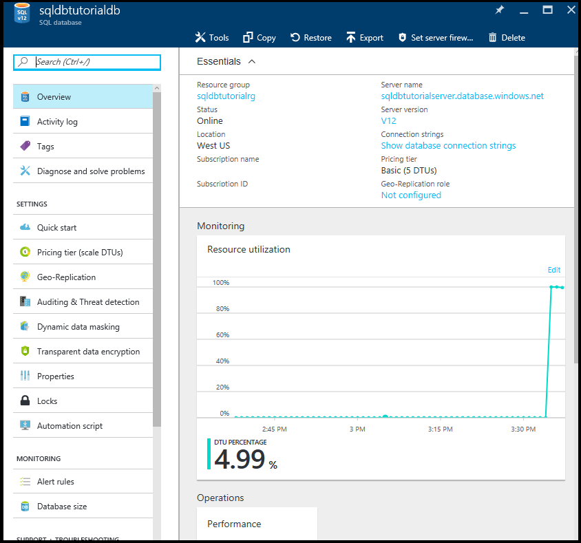

<properties
    pageTitle="查看和更新 Azure SQL 数据库及其设置 | Azure"
    description="有关如何使用 Azure 门户预览和 PowerShell 查看和更新 Azure SQL 数据库设置的快速参考。"
    services="sql-database"
    documentationcenter=""
    author="CarlRabeler"
    manager="jhubbard"
    editor="" />
<tags
    ms.service="sql-database"
    ms.custom="single databases"
    ms.devlang="NA"
    ms.workload="data-management"
    ms.topic="article"
    ms.tgt_pltfrm="NA"
    ms.date="11/14/2016"
    wacn.date="01/20/2017"
    ms.author="carlrab" />  

# 查看和更新 Azure SQL 数据库及其设置

可以使用 [Azure 门户预览](/documentation/articles/sql-database-manage-portal/)、[PowerShell](/documentation/articles/sql-database-manage-powershell/)、[SQL Server Management Studio](/documentation/articles/sql-database-manage-azure-ssms/)、REST API 或 C# 查看和更新 Azure SQL 数据库及其设置。

## 使用 Azure 门户预览查看和更新 SQL 数据库设置

1. 在 [Azure 门户预览](https://portal.azure.cn/)中打开“SQL 数据库”边栏选项卡。

      

2. 在“SQL 数据库”边栏选项卡上，单击要使用的数据库，然后单击所需设置。

      

> [AZURE.TIP]
有关使用 Azure 门户预览的入门教程，请参阅 [开始使用 Azure 门户预览和 SQL Server Management Studio 了解 Azure SQL 数据库服务器、数据库和防火墙规则](/documentation/articles/sql-database-get-started/)。
>

## 其他资源
* 有关管理工具的概述，请参阅[管理工具概述](/documentation/articles/sql-database-manage-overview/)。
* 若要了解如何使用 Azure 门户预览执行其他管理任务，请参阅[使用 Azure 门户预览管理 Azure SQL 数据库](/documentation/articles/sql-database-manage-portal/)。
* 若要了解如何使用 PowerShell 执行其他管理任务，请参阅[使用 PowerShell 管理 Azure SQL 数据库](/documentation/articles/sql-database-manage-powershell/)。
* 若要了解如何使用 SQL Server Management Studio 执行其他管理任务，请参阅 [SQL Server Management Studio](/documentation/articles/sql-database-manage-azure-ssms/)。
* 有关 SQL 数据库服务的信息，请参阅[什么是 SQL 数据库](/documentation/articles/sql-database-technical-overview/)。
* 有关 Azure 数据库服务器和数据库功能的信息，请参阅[功能](/documentation/articles/sql-database-features/)。

<!---HONumber=Mooncake_0116_2017-->