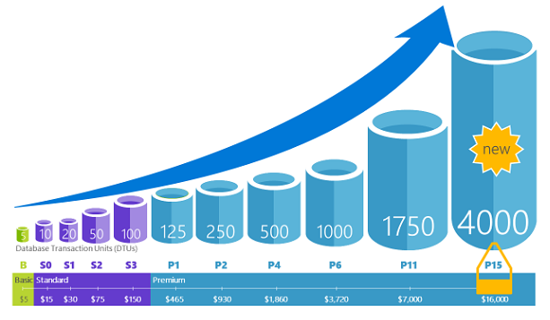
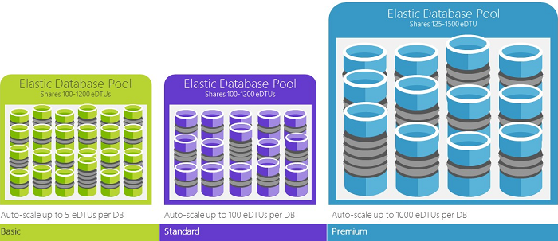

<properties
    pageTitle="SQL 数据库：什么是 DTU？| Azure"
    description="了解什么是 Azure SQL 数据库事务单位。"
    keywords="数据库选项,数据库性能"
    services="sql-database"
    documentationcenter=""
    author="CarlRabeler"
    manager="jhubbard"
    editor="CarlRabeler" />
<tags
    ms.assetid="89e3e9ce-2eeb-4949-b40f-6fc3bf520538"
    ms.service="sql-database"
    ms.custom="overview"
    ms.devlang="na"
    ms.topic="article"
    ms.tgt_pltfrm="na"
    ms.workload="NA"
    ms.date="02/01/2017"
    wacn.date="03/24/2017"
    ms.author="carlrab" />  

# 解释数据库事务单位 (DTU) 和弹性数据库事务单位 (eDTU)

本文解释数据库事务单位 (DTU) 和弹性数据库事务单位 (eDTU)，以及在达到 DTU 或 eDTU 上限时会发生什么情况。

## 什么是数据库事务单位 (DTU)

DTU 是资源度量单位，这些资源保证可用于[单一数据库服务层](/documentation/articles/sql-database-service-tiers/#single-database-service-tiers-and-performance-levels)中特定性能级别的单一 Azure SQL 数据库。DTU 是 CPU、内存、数据 I/O 和事务日志 I/O 的混合度量值，以设计为典型真实 OLTP 工作负荷的 OLTP 基准工作负荷所确定的比率表示。通过提升数据库的性能级别来使 DTU 加倍，就相当于让该数据库可用的资源集合加倍。例如，具有 1750 个 DTU 的高级 P11 数据库提供的 DTU 计算能力是具有 5 个 DTU 的基本数据库的 350 倍。若要了解使用 OLTP 基准工作负荷确定 DTU 混合度量值的方法，请参阅 [SQL Database benchmark overview](/documentation/articles/sql-database-benchmark-overview/)（SQL 数据库基准概述）。

可以随时[更改服务层](/documentation/articles/sql-database-service-tiers/)，将给应用程序造成的停机时间降至最低（通常平均为四秒以下）。许多业务和应用只要能够创建数据库并按需调高或调低性能即可，尤其是当使用模式相对容易预测时。但如果有无法预测的使用模式，则管理成本和业务模式就会变得相当困难。在此方案中，可以使用具有特定 eDTU 数目的弹性池。

## 什么是弹性数据库事务单位 (eDTU)

eDTU 是可以在 Azure SQL 服务器上一组数据库（称为[弹性池](/documentation/articles/sql-database-elastic-pool/)）之间共享的资源集 (DTU) 的度量单位。弹性池是一种简单的低成本高效益的解决方案，用于管理使用模式变化很大且不可预测的多个数据库的性能目标。有关详细信息，请参阅 [elastic pools and service tiers](/documentation/articles/sql-database-service-tiers/#elastic-pool-service-tiers-and-performance-in-edtus)（弹性池和服务层）。

为池提供了固定数量的 eDTU，以获得固定价格。在弹性池中，单独的数据库都被赋予了在配置的边界内自动缩放的灵活性。负载较重的数据库会消耗较多的 eDTU 来满足需求，负载较轻的数据库消耗的 eDTU 较少，而完全无负载的数据库则不消耗任何 eDTU。为整个池而非单个数据库预配资源可简化管理任务，池的预算也可预测。

可以向现有池添加额外的 eDTU，不会造成数据库关闭，对池中的数据库也不会有影响。同样，可以随时从现有池中删除不再需要的额外 eDTU。可以增减池的数据库，也可以限制数据库在负载较重时能够使用的 eDTU 数，保留 eDTU 供其他数据库使用。如果某个数据库处于资源使用率较低的状态且这种状态可以预测，则可将其移出池，使用其所需要的可预测资源数将其配置为单一数据库。

## 如何确定工作负荷所需的 DTU 数目？
如果要将现有的本地或 SQL Server 虚拟机工作负荷迁移到 Azure SQL 数据库，可以使用 [DTU 计算器](http://dtucalculator.azurewebsites.net/)来估算所需的 DTU 数目。对于现有的 Azure SQL 数据库工作负荷，可以使用 [SQL 数据库 Query Performance Insight](/documentation/articles/sql-database-query-performance/) 来了解数据库资源消耗量 (DTU)，更深入地探讨如何优化工作负荷。也可以使用 [sys.dm\_db\_ resource\_stats](https://msdn.microsoft.com/zh-cn/library/dn800981.aspx) DMV 获取最近一小时的资源消耗信息。或者，可以查询目录视图 [sys.resource\_stats](http://msdn.microsoft.com/zh-cn/library/dn269979.aspx)，获取最近 14 天的同类数据，不过，五分钟平均值的准确性较低。

## 如何知道资源弹性池是否能够带来优势？
池很适合具有特定使用模式的大量数据库。对于给定的数据库，此模式的特征是低平均使用量与相对不频繁的使用高峰。SQL数据库自动评估现有 SQL 数据库服务器中数据库的历史资源使用率，并在 Azure 门户中推荐适当的池配置。有关详细信息，请参阅[何时使用弹性池？](/documentation/articles/sql-database-elastic-pool-guidance/)

## 达到 DTU 上限时会发生什么情况

性能级别将会校准并受到控制，在选定服务层/性能级别所允许的最大限制范围内提供所需的资源来运行数据库工作负荷。如果工作负荷达到了 CPU/数据 IO/日志 IO 限制之一，将会继续接收资源直到达到最大允许级别，但是，查询延迟可能会不断增大。这些限制不会造成任何错误，而只会减慢工作负荷，直到严重变慢，以致于查询开始超时。如果达到了并发用户会话/请求（工作线程）的最大允许数目限制，将明确显示错误。有关 CPU、内存、数据 I/O 和事务日志 I/O 以外的资源限制的信息，请参阅 [Azure SQL Database resource limits](/documentation/articles/sql-database-resource-limits/)（Azure SQL 数据库资源限制）。

## 后续步骤

- 有关适用于单一数据库和弹性池的 DTU 和 eDTU 的信息，请参阅[服务层](/documentation/articles/sql-database-service-tiers/)。
- 有关 CPU、内存、数据 I/O 和事务日志 I/O 以外的资源限制的信息，请参阅 [Azure SQL 数据库资源限制](/documentation/articles/sql-database-resource-limits/)。
- 请参阅 [SQL 数据库 Query Performance Insight](/documentation/articles/sql-database-query-performance/)，了解 (DTU) 消耗量。
- 请参阅 [SQL 数据库基准概述](/documentation/articles/sql-database-benchmark-overview/)，了解使用 OLTP 基准工作负荷确定 DTU 混合度量值的方法。

<!---HONumber=Mooncake_0320_2017-->
<!--Update_Description: wording update-->