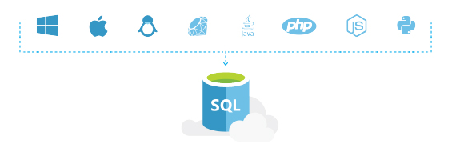

<properties
   pageTitle="Azure SQL 数据库在你的环境中正常工作"
   description="了解 SQL 数据库如何提供帮助、安全和保护"
   keywords=""
   services="sql-database"
   documentationCenter=""
   authors="CarlRabeler"
   manager="jhubbard"
   editor=""/>

<tags
   ms.service="sql-database"
   ms.date="07/19/2016"
   wacn.date="09/28/2016"/>

# Azure SQL 数据库在你的环境中正常工作

## 使用你已知的内容进行连接

用户要做的最后一件事就是为连接数据库了解新的内容。Azure SQL 数据库使你可以轻松使用你已习惯于使用的各种语言和平台。

选择数据库时，不必移动到新平台或学习新语言。SQL 数据库提供代码示例，无论身在何处均可帮助入门。

[了解有关 SQL 数据库开发的更多信息](/documentation/articles/sql-database-develop-overview/)

## 适合于作业的工具

开始使用 SQL 数据库时，不必学习一整套新工具。可以利用开源工具，如 [cheetah](https://github.com/wunderlist/cheetah)、[sql-cli](https://www.npmjs.com/package/sql-cli)、[VS Code](https://code.visualstudio.com/)。此外，Azure SQL 数据库可与 Microsoft 工具（如 [Visual Studio](https://www.visualstudio.com/visual-studio-homepage-vs.aspx) 和 [SQL Server Management Studio](https://msdn.microsoft.com/zh-cn/library/ms174173.aspx)）配合使用。还可以使用 Azure 经典管理门户、PowerShell 和 REST API 帮助提高工作效率。

## 快速入门

通过相关教程（如创建第一个 SQL 数据库、排查查询问题和快速入门代码示例），SQL 数据库问题的正确答案并不是遥不可及。

[了解有关 SQL 数据库的详细信息](/documentation/articles/sql-database-technical-overview/)

## 后续步骤

获取 [Azure 订阅](/pricing/1rmb-trial)，并[创建首个 Azure SQL 数据库](/documentation/articles/sql-database-get-started/)。

## 其他资源

浏览所有 [SQL 数据库的功能](/home/features/sql-database)。查看 [SQL 数据库技术概述](/documentation/articles/sql-database-technical-overview/)。
* [SQL 数据库开发概述](/documentation/articles/sql-database-develop-overview/)

<!---HONumber=Mooncake_0919_2016-->