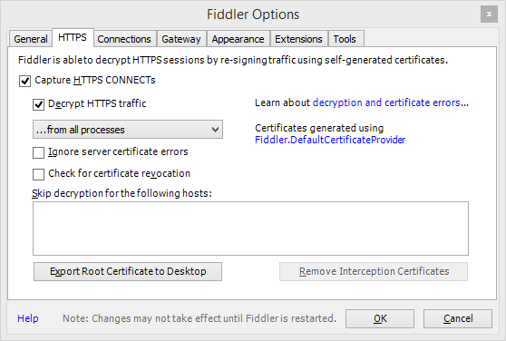
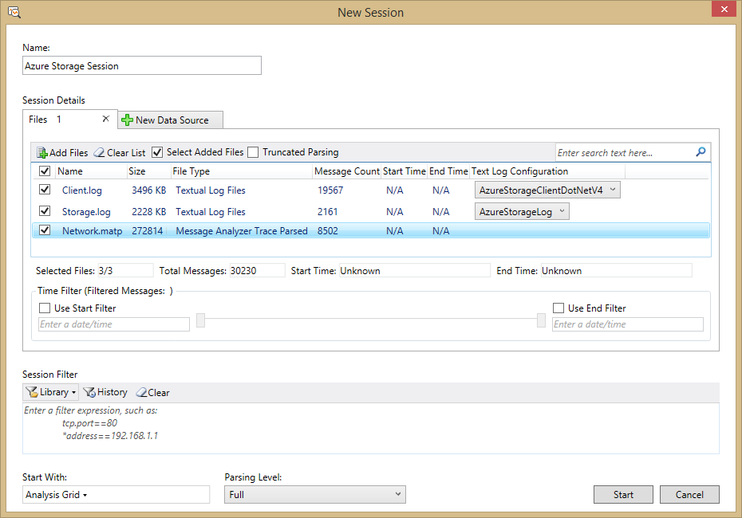
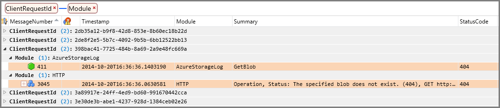

<properties 
	pageTitle="使用 Azure 存储度量值和日志记录、AzCopy 及 Message Analyzer 进行点对点故障排除 | Azure" 
	description="本教程演示如何使用 Azure 存储分析、AzCopy 和 Microsoft Message Analyzer 进行点对点故障排除" 
	services="storage" 
	documentationCenter="dotnet" 
	authors="tamram" 
	manager="adinah"/>

<tags 
	ms.service="storage" 
	ms.date="05/09/2016" 
	wacn.date="06/06/2016"/>

# 使用 Azure 存储度量值和日志记录、AzCopy 及 Message Analyzer 进行点对点故障排除 

[AZURE.INCLUDE [storage-selector-portal-e2e-troubleshooting](../includes/storage-selector-portal-e2e-troubleshooting.md)]

## 概述

诊断和故障排除是构建和支持包含 Azure 存储空间的客户端应用程序的一项关键技能。由于 Azure 应用程序的分布特性，诊断和排查错误与性能问题可能会比在传统环境中更为复杂。

在本教程中，我们将演示如何识别某些会影响性能的错误，并使用 Microsoft 和 Azure 存储空间提供的工具以点对点的方式排查这些错误，以优化客户端应用程序。

本教程提供了点对点故障排除方案的实践分析。有关排查 Azure 存储应用程序问题的深入化概念指南，请参阅[监视、诊断和排查 Azure 存储空间问题](/documentation/articles/storage-monitoring-diagnosing-troubleshooting/)。

## Azure 存储应用程序故障排除工具

若要使用 Azure 存储空间排查客户端应用程序问题，可以使用多种工具的组合来确定问题出现的时间以及可能的原因。这些工具包括：

- **Azure 存储分析**。[Azure 存储分析](http://msdn.microsoft.com/zh-cn/library/azure/hh343270.aspx)提供 Azure 存储空间的度量值和日志记录。
	- **存储度量值**用于跟踪存储帐户的事务度量值和容量度量值。使用度量值，你可以确定应用程序如何根据各种不同的度量值执行。有关存储分析跟踪的度量值类型的详细信息，请参阅[存储分析度量值表架构](http://msdn.microsoft.com/zh-cn/library/azure/hh343264.aspx)。 

	- **存储日志记录**可以在服务器端日志中记录发送到 Azure 存储服务的每个请求。日志用于跟踪每个请求的详细数据，包括执行的操作、操作的状态和延迟信息。有关存储分析写入日志的请求和响应数据的详细信息，请参阅[存储分析日志格式](http://msdn.microsoft.com/zh-cn/library/azure/hh343259.aspx)。

- **Azure 管理门户**。可以在[Azure 管理门户](https://manage.windowsazure.cn)中配置存储帐户的度量值和日志记录。还可以查看显示应用程序在各时间段执行情况的图表和图形，以及配置警报，以便在应用程序的特定度量值不同于预期时接收通知。
	
	请参阅[监视 Azure 门户中的存储帐户](/documentation/articles/storage-monitor-storage-account/)，了解如何在 Azure 管理门户中配置监视功能。

- **AzCopy**。Azure 存储空间的服务器日志存储为 Blob，因此你可以使用 AzCopy 将日志 Blob 复制到本地目录，以使用 Microsoft Message Analyzer 进行分析。有关 AzCopy 的详细信息，请参阅[使用 AzCopy 命令行实用程序传输数据](/documentation/articles/storage-use-azcopy/)。

- **Microsoft Message Analyzer**。Message Analyzer 是一个工具，它使用日志文件并以可视格式显示日志数据，方便你筛选、搜索日志数据，以及将日志数据组合成有用的集，用于分析错误和性能问题。有关 Message Analyzer 的详细信息，请参阅 [Microsoft Message Analyzer 操作指南](http://technet.microsoft.com/zh-cn/library/jj649776.aspx)。

## 关于示例情景

在本教程中，我们将介绍 Azure 存储度量值指示调用 Azure 存储空间的应用程序成功率较低的情景。低成功率度量值（在 Azure 管理门户和度量值表中显示为 **PercentSuccess**）用于跟踪已经成功，但返回的 HTTP 状态代码大于 299 的操作。在服务器端存储日志文件中，这些操作将使用事务状态 **ClientOtherErrors** 进行记录。有关低成功率度量值的详细信息，请参阅[度量值显示低 PercentSuccess，或者分析日志项包含事务状态为 ClientOtherErrors 的操作](/documentation/articles/storage-monitoring-diagnosing-troubleshooting/#metrics-show-low-percent-success)。

Azure 存储操作可能返回 HTTP 状态代码大于 299 作为其正常功能的一部分。但在某些情况下，这些错误指示你可能能够优化客户端应用程序以提高性能。

在此情况下，我们将低成功率视为低于 100% 的任何状态。但是，你可以根据自己的需求选择不同的度量值级别。我们建议你在测试期间，为关键性能度量值建立基线容差。例如，你可以根据测试，确定应用程序应该持续保持 90% 或 85% 的成功率。如果度量值数据显示应用程序与该数字有偏差，则你可以调查导致成功率上升的原因。

对于我们的示例方案，一旦我们建立了成功率度量值低于 100%，我们将检查日志以查找与度量值相关的错误，并使用它们来找出导致较低成功率的原因。我们将专门介绍 400 范围内的错误。然后，我们将更细致地调查 404（未找到）错误。

### 400 范围错误的某些原因

以下示例中显示了对 Azure Blob 存储发出请求后返回的某些 400 范围错误示例和可能的原因。其中的任何错误，以及 300 范围和 500 范围内的错误，可能会导致低成功率。

请注意，以下列表远远算不上完整。有关一般性 Azure 存储空间错误以及特定于每个存储服务的错误的详细信息，请参阅[状态和错误代码](http://msdn.microsoft.com/zh-cn/library/azure/dd179382.aspx)。

**状态代码 404（找不到）示例**

当针对容器或 Blob 的读取操作失败，或者由于找不到 Blob 或容器而失败时发生。

- 当容器或 Blob 被此请求之前的另一个客户端删除时发生。 
- 当使用的 API 调用在检查容器或 Blob 是否存在后创建容器或 Blob 时发生。CreateIfNotExists API 先执行 HEAD 调用以检查容器或 Blob 是否存在；如果不存在，则将返回 404 错误，然后再次执行 PUT 调用以写入容器或 Blob。

**状态代码 409（冲突）示例**

- 当你使用 Create API 创建新容器或 Blob，但未事先检查存在性，而已经存在同名的容器或 Blob 时发生。 
- 如果在删除某个容器时，你尝试在删除操作完成之前创建同名的新容器，则会发生此错误。
- 如果在容器或 Blob 中指定了租约，但已存在租约，则会发生此错误。
 
**状态代码 412（前置条件失败）示例**

- 当未满足条件标头指定的条件时发生。
- 当指定的租约 ID 与容器或 Blob 上的租约 ID 不匹配时发生。

## 生成日志文件用于分析

在本教程中，我们将使用 Message Analyzer 来处理三种不同类型的日志文件，不过，你可以选择要处理的类型之一：

- **服务器日志**，这是在启用 Azure 存储日志记录时创建的。服务器日志包含有关针对 Azure 存储服务（Blob、队列、表和文件）之一调用的每个操作的数据。服务器日志将指示调用的操作、返回的状态代码，以及有关请求和响应的其他详细信息。
- **.NET 客户端日志**，这是在从 .NET 应用程序内部启用客户端日志记录时创建的。客户端日志包括有关客户端准备请求以及接收和处理响应的详细信息。 
- **HTTP 网络跟踪日志**，它收集有关 HTTP/HTTPS 请求的数据和响应数据，包括针对 Azure 存储空间的操作的数据。在本教程中，我们将通过 Message Analyzer 生成网络跟踪。

### 配置服务器端日志记录和度量值

首先，我们需要配置 Azure 存储日志记录和度量值，以便可以从客户端应用程序获取要分析的数据。可以通过不同的方式配置日志记录和度量值 - 通过 [Azure 管理门户](https://manage.windowsazure.cn)、使用 PowerShell 或以编程方式。有关配置日志记录和度量的详细信息，请参阅[启用存储度量值和查看度量值数据](http://msdn.microsoft.com/zh-cn/library/azure/dn782843.aspx)及[启用存储日志记录和访问日志数据](http://msdn.microsoft.com/zh-cn/library/azure/dn782840.aspx)。

**通过 Azure 管理门户**

若要使用门户配置存储帐户的日志记录和度量值，请遵循[监视 Azure 门户中的存储帐户](/documentation/articles/storage-monitor-storage-account/)中的说明。

> [AZURE.NOTE] 无法使用 Azure 管理门户设置分钟度量值。但是，对于本教程，我们建议你设置分钟度量值，它还可以调查应用程序的性能问题。可以使用 PowerShell（如下所示）设置分钟度量值，也可以通过编程方式或 Azure 管理门户来进行。
>
> 请注意，Azure 管理门户无法显示分钟度量值，而只显示小时度量值。

**通过 PowerShell**

若要开始使用 PowerShell for Azure，请参阅[如何安装和配置 Azure PowerShell](/documentation/articles/powershell-install-configure/)。

1. 使用 [Add-AzureAccount](http://msdn.microsoft.com/zh-cn/library/azure/dn722528.aspx) cmdlet 将 Azure 用户帐户添加到 PowerShell 窗口中：

	```
	Add-AzureAccount -Environment azurechinacloud
	```

2. 在“登录 Azure”窗口中，键入与你的帐户关联的电子邮件地址和密码。Azure 将对凭据信息进行身份验证和保存，然后关闭该窗口。
3. 通过在 PowerShell 窗口中执行以下命令，将默认存储帐户设置为用于本教程的存储帐户：

	```
	$SubscriptionName = 'Your subscription name'
	$StorageAccountName = 'yourstorageaccount' 
	Set-AzureSubscription -CurrentStorageAccountName $StorageAccountName -SubscriptionName $SubscriptionName 
	```

4. 为 Blob 服务启用存储日志记录：
 
	```
	Set-AzureStorageServiceLoggingProperty -ServiceType Blob -LoggingOperations Read,Write,Delete -PassThru -RetentionDays 7 -Version 1.0 
	```
5. 为 Blob 服务启用存储度量值，确保将 **-MetricsType** 设置为 `Minute`：

	```
	Set-AzureStorageServiceMetricsProperty -ServiceType Blob -MetricsType Minute -MetricsLevel ServiceAndApi -PassThru -RetentionDays 7 -Version 1.0 
	```

### 配置 .NET 客户端日志记录

若要为 .NET 应用程序配置客户端日志记录，请在应用程序的配置文件（web.config 或 app.config）中启用 .NET 诊断。有关详细信息，请参阅[使用 .NET 存储客户端库进行的客户端日志记录](http://msdn.microsoft.com/zh-cn/library/azure/dn782839.aspx)和[通过 Azure Storage SDK for Java 进行的客户端日志记录](http://msdn.microsoft.com/zh-cn/library/azure/dn782844.aspx)。

客户端日志包括有关客户端准备请求以及接收和处理响应的详细信息。

存储客户端库将客户端的日志数据存储在应用程序的配置文件（web.config 或 app.config）中的指定位置。

### 收集网络跟踪

当客户端应用程序正在运行时，你可以使用 Message Analyzer 来收集 HTTP/HTTPS 网络跟踪。Message Analyzer 在后端使用 [Fiddler](http://www.telerik.com/fiddler)。在收集网络跟踪之前，我们建议你配置 Fiddler 来记录未加密的 HTTPS 通信：

1. 安装 [Fiddler](http://www.telerik.com/download/fiddler)。
2. 启动 Fiddler。
2. 选择“工具”|“Fiddler 选项”。
3. 在“选项”对话框中，确保“捕获 HTTPS 连接”和“解密 HTTPS 通信”都已选中，如下所示。



对于本教程，我们将先在 Message Analyzer 中收集并保存网络跟踪，然后创建分析会话以分析跟踪和日志。在 Message Analyzer 中收集网络跟踪：

1. 在 Message Analyzer 中，选择“文件”|“快速跟踪”|“未加密的 HTTPS”。
2. 随后将立即开始跟踪。选择“停止”可以停止跟踪，以便将它配置为仅跟踪存储通信。
3. 选择“编辑”可以编辑跟踪会话。
4. 选择 **Microsoft-Pef-WebProxy** ETW 提供程序右侧的“配置”链接。
5. 在“高级设置”对话框中，单击“提供程序”选项卡。
6. 在“主机名筛选器”字段中，指定存储终结点，以空格分隔。例如，可按如下所示指定终结点；将 `storagesample` 更改为你的存储帐户名称：
	
	```	
	storagesample.blob.core.chinacloudapi.cn storagesample.queue.core.chinacloudapi.cn storagesample.table.core.chinacloudapi.cn 
	```

7. 退出对话框，然后单击“重新启动”，在启用主机名筛选器的情况下开始收集跟踪，以便仅在跟踪中包含 Azure 存储网络通信。

>[AZURE.NOTE] 在完成收集网络跟踪后，我们强烈建议还原你可能在 Fiddler 中为了解密 HTTPS 通信而更改的设置。在“Fiddler 选项”对话框中，取消选中“捕获 HTTPS 连接”和“解密 HTTPS 通信”复选框。

有关详细信息，请参阅 Technet 上的[使用网络跟踪功能](http://technet.microsoft.com/zh-cn/library/jj674819.aspx)。

## 在 Azure 管理门户中查看度量值数据

在应用程序运行一段时间后，你可以查看 Azure 管理门户中显示的度量值图表，以观察服务的性能。首先，让我们将“成功百分比”度量值添加到“监视”页：

1. 在 [Azure 管理门户](https://manage.windowsazure.cn)中导航到存储帐户的“仪表板”，然后选择“监视”以查看监视页。
2. 单击“添加度量值”显示“选择度量值”对话框。
3. 向下滚动以找到“成功百分比”组并将其展开，然后选择“聚合”，如下图中所示。此度量值聚合了所有 Blob 操作的成功百分比数据。


现在，Azure 管理门户中的监视图上将会显示“成功百分比”，以及你可能添加的任何其他度量值（图表上一次最多可以显示六个度量值）。在下图中可以看到，成功率百分比略低于 100%，这是接下来我们要在 Message Analyzer 中通过分析日志调查的情况：


有关将度量值添加到监视页的详细信息，请参阅[如何：向度量值表中添加度量值](/documentation/articles/storage-monitor-storage-account/#how-to-add-metrics-to-the-metrics-table)。

> [AZURE.NOTE] 在启用存储度量值后，可能需要经过一段时间，度量值数据才会显示在 Azure 管理门户中。这是因为，只有在当前小时已过后，前一个小时的小时度量值才会显示在 Azure 管理门户中。此外，分钟度量值不会显示在 Azure 管理门户中。因此，根据启用度量值的时间，最多可能需要两个小时才能看到度量值数据。

## 使用 AzCopy 将服务器日志复制到本地目录

Azure 存储空间将服务器日志数据写入 Blob，将度量值写入表。存储帐户的已知的 `$logs` 容器中提供了日志 Blob。日志 Blob 按年、月、日和小时的分层形式命名，因此，你可以轻松地找到想要调查的时间范围。例如，在 `storagesample` 帐户中，对应于 2015 年 1 月 2 日早晨 8-9 点的日志 blob 容器为 `https://storagesample.blob.core.chinacloudapi.cn/$logs/blob/2015/01/08/0800`。此容器中的各个 blob 均按顺序命名，并以 `000000.log` 开头。

可以使用 AzCopy 命令行工具将这些服务器端日志文件下载到你本地计算机上的所选位置。例如，可以使用以下命令将发生于 2015 年 1 月 2 日 Blob 操作的日志文件下载到文件夹 `C:\Temp\Logs\Server`；将 `<storageaccountname>` 替换为你的存储帐户名称，将 `<storageaccountkey>` 替换为你的帐户访问密钥：

	AzCopy.exe /Source:http://<storageaccountname>.blob.core.chinacloudapi.cn/$logs /Dest:C:\Temp\Logs\Server /Pattern:"blob/2015/01/02" /SourceKey:<storageaccountkey> /S /V

可以从 [Azure 下载](/downloads/)页下载 AzCopy。有关使用 AzCopy 的详细信息，请参阅[使用 AzCopy 命令行实用程序传输数据](/documentation/articles/storage-use-azcopy/)。

有关下载服务器端日志的其他信息，请参阅[下载存储日志记录日志数据](http://msdn.microsoft.com/zh-cn/library/azure/dn782840.aspx#DownloadingStorageLogginglogdata)。

## 使用 Microsoft Message Analyzer 分析日志数据

Microsoft Message Analyzer 是在故障排除和诊断方案中用于捕获、显示和分析协议消息传递通信、事件和其他系统或应用程序消息的工具。Message Analyzer 还允许你加载、聚合和分析日志和保存的跟踪文件中的数据。有关 Message Analyzer 的详细信息，请参阅 [Microsoft Message Analyzer 操作指南](http://technet.microsoft.com/zh-cn/library/jj649776.aspx)。

Message Analyzer 包括 Azure 存储空间的资产，可帮助你分析服务器、客户端和网络日志。在本部分中，我们将讨论如何使用这些工具来解决存储日志中成功百分比较低的问题。

### 下载并安装 Message Analyzer 和 Azure 存储空间资产

1. 从 Microsoft 下载中心下载 [Message Analyzer](http://www.microsoft.com/download/details.aspx?id=44226)，并运行安装程序。
2. 启动 Message Analyzer。
3. 从“工具”菜单中选择“资产管理器”。在“资产管理器”对话框中，选择“下载”，然后筛选“Azure 存储空间”。你将会看到 Azure 存储空间资产，如下图中所示。
4. 单击“同步所有显示的项”以安装 Azure 存储空间资产。可用的资产包括： 
	- **Azure 存储空间颜色规则**：Azure 存储空间颜色规则可让你定义特殊筛选器，以使用颜色、文本和字形来突出显示跟踪中包含特定信息的消息。
	- **Azure 存储空间图表**：Azure 存储空间图表是根据服务器日志数据绘制的预定义图表。请注意，若在此时使用 Azure 存储空间图表，可以只将服务器日志加载到分析网格中。
	- **Azure 存储空间分析程序**：Azure 存储空间分析程序可以分析 Azure 存储空间客户端、服务器和 HTTP 日志，以便在分析网格中显示。
	- **Azure 存储空间筛选器**：Azure 存储空间筛选器是可用于查询分析网格中的数据的预定义条件。
	- **Azure 存储空间视图布局**：Azure 存储空间视图布局是分析网格中的预定义列布局和分组。
4. 安装资产后，请重新启动 Message Analyzer。


> [AZURE.NOTE] 对于本教程，请安装显示的所有 Azure 存储空间资产。

### 将日志文件导入 Message Analyzer

可以将所有已保存的日志文件（服务器端、客户端和网络）导入到 Microsoft Message Analyzer 的单个会话中以进行分析。

1. 在 Microsoft Message Analyzer 中的“文件”菜单上单击“新建会话”，然后单击“空白会话”。在“新建会话”对话框中，输入分析会话的名称。在“会话详细信息”面板中，单击“文件”按钮。 
1. 若要加载 Message Analyzer 生成的网络跟踪数据，请单击“添加文件”，浏览到你通过 Web 跟踪会话将 .matp 文件保存到的位置，选择该 .matp 文件，然后单击“打开”。 
1. 若要加载服务器端日志数据，请单击“添加文件”，浏览到你将服务器端日志下载到的位置，选择要分析的时间范围内的日志文件，并单击“打开”。然后，在“会话详细信息”面板中，将每个服务器端日志文件的“文本日志配置”下拉列表设置为 **AzureStorageLog**，以确保 Microsoft Message Analyzer 可以正确分析日志文件。
1. 若要加载客户端日志数据，请单击“添加文件”，浏览到客户端日志保存到的位置，选择想要分析的日志文件，并单击“打开”。然后，在“会话详细信息”面板中，将每个客户端日志文件的“文本日志配置”下拉列表设置为 **AzureStorageClientDotNetV4**，以确保 Microsoft Message Analyzer 可以正确分析日志文件。
1. 在“新建会话”对话框中单击“开始”以加载并分析日志数据。日志数据将显示在 Message Analyzer 分析网格中。

下图显示了使用服务器、客户端和网络跟踪日志文件配置的示例会话。



请注意，Message Analyzer 会将日志文件载入内存中。如果有大量的日志数据，则你需要进行筛选，以便从 Message Analyzer 获得最佳性能。

首先，确定你想要审查的时间范围，并使用尽可能小的时间范围。在许多情况下，你需要审查最多几分钟或几小时的时间段。导入可以满足需求的最小日志集。

如果仍有大量的日志数据，则你可能需要在加载日志数据之前指定会话筛选器以筛选数据。在“会话筛选器”框中，选择“库”按钮可以选择预定义的筛选器；例如，从 Azure 存储空间筛选器中选择“全局时间筛选器 I”可根据某个时间间隔进行筛选。然后，可以编辑筛选条件，以指定想要查看的间隔的起始和结束时间戳。还可以根据特定的状态代码筛选；例如，可以选择仅加载状态代码为 404 的日志条目。

有关如何将日志数据导入 Microsoft Message Analyzer 的详细信息，请参阅 TechNet 上的[检索消息数据](http://technet.microsoft.com/zh-cn/library/dn772437.aspx)。

### 使用客户端请求 ID 关联日志文件数据

Azure 存储客户端库会自动为每个请求生成唯一的客户端请求 ID。此值将写入客户端日志、服务器日志和网络跟踪，因此你可以在 Message Analyzer 中使用它在所有三个日志之间关联数据。请参阅[客户端请求 ID](/documentation/articles/storage-monitoring-diagnosing-troubleshooting/#client-request-id) 以了解有关客户端请求 ID 的更多信息。

以下部分介绍如何使用预配置的和自定义的布局视图，来根据客户端请求 ID 关联和分组数据。

### 选择要在分析网格中显示的视图布局

Message Analyzer 的存储空间资产包括 Azure 存储视图布局，这是一些预配置的视图，可用于显示不同情况下的数据，以及有用的分组和列。你还可以创建自定义视图布局，并保存它们以供重复使用。

下图显示了可通过从工具栏功能区选择“视图布局”来访问的“视图布局”菜单。Azure 存储空间的视图布局分组在菜单中的“Azure 存储空间”节点下。可以在搜索框中搜索 `Azure Storage`，以仅筛选 Azure 存储空间视图布局。还可以选择某个视图布局旁边的星形，使之成为收藏的布局并显示在菜单顶部。


若要开始，请选择“按客户端请求 ID 和模块分组”。此视图布局会先根据客户端请求 ID，然后根据源日志文件（或 Message Analyzer 中的“模块”）对所有三个日志中的日志数据分组。使用此视图可以深入到特定的客户端请求 ID，并查看该客户端请求 ID 的所有三个日志文件中的数据。

下图显示了已应用到示例日志数据的此布局视图，并显示了一部分列。可以看到，对于特定的客户端请求 ID，分析网格显示了客户端日志、服务器日志和网络跟踪中的数据。


>[AZURE.NOTE] 不同的日志文件具有不同的列，因此，当分析网格中显示了多个日志文件中的数据时，某些列可能不包含某一给定行的任何数据。例如，在上图中，客户端日志行未显示“时间戳”、“已用时间”、“源”和“目标”列的任何数据，因为这些列不在客户端日志中，而在网络跟踪中。同样，“时间戳”列显示了服务器日志中的时间戳数据，但未显示“已用时间”、“源”和“目标”列的任何数据，因为这些数据不在服务器日志中。

除了使用 Azure 存储空间视图布局以外，还可以定义并保存自己的视图布局。可以选择其他所需字段来分组数据，并将分组保存为自定义布局的一部分。

### 将颜色规则应用到分析网格

存储空间资产还包括颜色规则，用于以直观方式在分析网格中标识不同类型的错误。预定义的颜色规则将应用到 HTTP 错误，因此它们仅对服务器日志和网络跟踪显示。

若要应用颜色规则，请从工具栏功能区中选择“颜色规则”。你将在菜单中看到 Azure 存储空间颜色规则。对于本教程，请选择“客户端错误(介于 400 和 499 之间的状态代码)”，如下图中所示。


除了使用 Azure 存储空间颜色规则以外，还可以定义并保存自己的颜色规则。

### 分组并筛选日志数据以查找 400 范围错误

接下来，我们将分组并筛选日志数据，以查找 400 范围内的所有错误。

1. 在分析网格中找到 **StatusCode** 列，右键单击列标题，然后选择“分组”。
2. 接下来，根据 **ClientRequestId** 列分组。你将看到，分析网格中的数据现已根据状态代码和客户端请求 ID 进行组织。
1. 显示“视图筛选器”工具窗口（如果尚未显示）。在工具栏功能区中，选择“工具窗口”，然后选择“视图筛选器”。
2. 若要将日志数据筛选为仅显示 400 范围错误，请将以下筛选条件添加到“视图筛选器”窗口，然后单击“应用”：

		(AzureStorageLog.StatusCode >= 400 && AzureStorageLog.StatusCode <=499) || (HTTP.StatusCode >= 400 && HTTP.StatusCode <= 499)

下图显示了此分组和筛选器的结果。例如，展开状态代码 409 所对应的分组下面的 **ClientRequestID** 字段会显示导致该状态代码的操作。


应用此筛选器后，你将看到已从客户端日志中排除的行，因为客户端日志不包含 **StatusCode** 列。首先，我们将检查服务器和网络跟踪日志，以找到 404 错误，然后我们会返回到客户端日志以检查导致它们的客户端操作。

>[AZURE.NOTE] 如果向筛选器添加表达式以包含状态代码为 null 的日志条目，则可以根据 **StatusCode** 列筛选，并仍显示所有三个日志（包括客户端日志）中的数据。若要构造此筛选器表达式，请使用：
>
> <code>&#42;StatusCode >= 400 或 !&#42;StatusCode</code>
>
> 此筛选器返回所有行从客户端日志和仅从服务器日志和 HTTP 日志的行的状态代码大于 400。如果将其应用到客户端请求 ID 和模块按分组视图布局，你可以搜索或向下滚动到日志条目，以查找与其中表示所有三个日志。

### 筛选日志数据以查找 404 错误

存储空间资产包括可用于缩小日志数据，以找出错误或你正在寻找的趋势的预定义筛选器。接下来，我们将要应用两个预定义的筛选器：一个用于筛选服务器和网络跟踪日志中的 404 错误，另一个用于筛选指定时间范围内的数据。

1. 显示“视图筛选器”工具窗口（如果尚未显示）。在工具栏功能区中，选择“工具窗口”，然后选择“视图筛选器”。
2. 在“视图筛选器”窗口中，选择“库”，然后搜索 `Azure Storage` 以查找 Azure 存储空间筛选器。选择用于筛选**所有日志中的 404（找不到）消息**的筛选器。
3. 再次显示“库”菜单，找到并选择“全局时间筛选器”。
4. 将筛选器中显示的时间戳编辑为你想要查看的范围。这有助于缩小分析数据的范围。
5. 你的筛选器应类似于以下示例。单击“应用”将筛选器应用到分析网格。

		((AzureStorageLog.StatusCode == 404 || HTTP.StatusCode == 404)) And 
		(#Timestamp >= 2014-10-20T16:36:38 and #Timestamp <= 2014-10-20T16:36:39)


### 分析日志数据

现在，你已分组并筛选数据，接下来可以检查生成 404 错误的各个请求的详细信息。在当前视图布局中，分别按客户端请求 ID 和日志源分组数据。由于我们是根据“StatusCode”字段包含 404 的请求进行筛选的，因此我们只能看到服务器和网络跟踪数据，而看不到客户端日志数据。

下图显示了由于 Get Blob 不存在，而导致 Get Blob 操作生成 404 的特定请求。请注意，为了显示相关数据，某些列已从标准视图中删除。



接下来，我们将与此客户端请求 ID 与客户端日志数据相关联，以查看发生错误时客户端正在执行哪些操作。可以为此会话显示一个新的分析网格视图，以在另一个选项卡中查看客户端日志数据：

1. 首先，将 **ClientRequestId** 字段的值复制到剪贴板。为此，你可以选择任一行，找到 **ClientRequestId** 字段，右键单击数据值，然后选择“复制 "ClientRequestId"”。 
1. 在工具栏功能区中，选择“新建查看器”，然后选择“分析网格”打开一个新选项卡。新选项卡将显示日志文件中的所有数据，且未应用分组、筛选或颜色规则。 
2. 在工具栏功能区中，选择“视图布局”，然后选择“Azure 存储空间”部分下的“所有 .NET 客户端列”。此视图布局显示客户端日志以及服务器和网络跟踪日志中的数据。默认情况下，这些数据已按 **MessageNumber** 列排序。
3. 接下来，搜索客户端请求 ID 的客户端日志。在工具栏功能区中，选择“查找消息”，然后在“查找”字段中对客户端请求 ID 指定一个自定义筛选器。对于筛选器，请使用以下语法指定自己的客户端请求 ID：

		*ClientRequestId == "398bac41-7725-484b-8a69-2a9e48fc669a"

Message Analyzer 将查找并选择搜索条件匹配客户端请求 ID 的第一个日志条目在客户端日志中，每个客户端请求 ID 有多个条目，因此，你可能需要根据 **ClientRequestId** 字段对其分组，以便更轻松地查看其聚合视图。下图显示了指定的客户端请求 ID 的客户端日志中的所有消息。


使用这两个选项卡中的视图布局内显示的数据，你可以分析请求数据，以确定导致错误的可能原因。你还可以查看此项前面的请求，以确定前一个事件是否是导致 404 错误的可能原因。例如，你可以查看此客户端请求 ID 前面的客户端日志条目，以确定 Blob 是否已删除，或者错误的原因是否为客户端应用程序对容器或 Blob 调用了 CreateIfNotExists API。在客户端日志中，可以在“说明”字段中查找 Blob 的地址；在服务器和网络跟踪日志中，此信息显示在“摘要”字段中。

在知道产生 404 错误 Blob 地址后，你可以进一步展开调查。通过搜索与同一 Blob 中的操作关联的其他消息的日志条目，你可以检查客户端以前是否删除了实体。

## 分析其他类型的存储错误

在熟悉如何使用 Message Analyzer 分析日志数据后，你可以使用视图布局、颜色规则和搜索/筛选分析其他类型的错误。下表列出了你可能会遇到一些问题，以及可用于查找这些问题的筛选条件。有关构造筛选器和 Message Analyzer 筛选语言的详细信息，请参阅[筛选消息数据](http://technet.microsoft.com/zh-cn/library/jj819365.aspx)。

| 若要调查... | 使用筛选器表达式… | 将表达式应用到日志（客户端、服务器、网络、所有） |
|------------------------------------------------------------------------------------------------------------------|------------------------------------------------------------------------------------------------------------------------------------------------------------------------------------------------------------------------------------------------------------------|------------------------------------------------------------------|
| 队列上的消息传递出现意外的延迟 | AzureStorageClientDotNetV4.Description 包含“Retrying failed operation.” | 客户端 |
| PercentThrottlingError 的 HTTP 提升 | HTTP.Response.StatusCode == 500 &#124;&#124; HTTP.Response.StatusCode == 503 | 网络 |
| PercentTimeoutError 提升 | HTTP.Response.StatusCode == 500 | 网络 |
| PercentTimeoutError 提升（全部） |    *StatusCode == 500 | 全部 |
| PercentNetworkError 增加 | AzureStorageClientDotNetV4.EventLogEntry.Level < 2 | 客户端 |
| HTTP 403 (禁止) 消息 | HTTP.Response.StatusCode == 403 | 网络 |
| HTTP 404 (找不到) 消息 | HTTP.Response.StatusCode == 404 | 网络 |
| 404 (全部) | *StatusCode == 404 | 全部 |
| 共享访问签名 (SAS) 授权问题 | AzureStorageLog.RequestStatus == "SASAuthorizationError" | 网络 |
| HTTP 409 (冲突) 消息 | HTTP.Response.StatusCode == 409 | 网络 |
| 409 (全部) | *StatusCode == 409 | 全部 |
| PercentSuccess 过低或者分析日志条目包含事务状态为 ClientOtherErrors 的操作 | AzureStorageLog.RequestStatus == "ClientOtherError" | 服务器 |
| Nagle 警告 | ((AzureStorageLog.EndToEndLatencyMS - AzureStorageLog.ServerLatencyMS) > (AzureStorageLog.ServerLatencyMS * 1.5)) 且 (AzureStorageLog.RequestPacketSize <1460) 且 (AzureStorageLog.EndToEndLatencyMS - AzureStorageLog.ServerLatencyMS >= 200) | 服务器 |
| 服务器和网络日志中的时间范围 | #Timestamp >= 2014-10-20T16:36:38 且 #Timestamp <= 2014-10-20T16:36:39 | 服务器、网络 |
| 服务器日志中的时间范围 | AzureStorageLog.Timestamp >= 2014-10-20T16:36:38 且 AzureStorageLog.Timestamp <= 2014-10-20T16:36:39 | 服务器 |


## 后续步骤

有关在 Azure 存储空间中执行点对点故障排除方案的详细信息，请参阅以下资源：

- [对 Azure 存储空间进行监视、诊断和故障排除](/documentation/articles/storage-monitoring-diagnosing-troubleshooting/)
- [存储分析](http://msdn.microsoft.com/zh-cn/library/azure/hh343270.aspx)
- [监视 Azure 门户中的存储帐户](/documentation/articles/storage-monitor-storage-account/)
- [使用 AzCopy 命令行实用程序传输数据](/documentation/articles/storage-use-azcopy/)
- [Microsoft Message Analyzer 操作指南](http://technet.microsoft.com/zh-cn/library/jj649776.aspx)
 
 

<!---HONumber=Mooncake_0530_2016-->