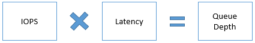

<properties
    pageTitle="Azure 高级存储：针对性能进行设计 | Azure"
    description="使用 Azure 高级存储设置高性能应用程序。高级存储为 Azure 虚拟机上运行的 I/O 密集型工作负载提供高性能、低延迟的磁盘支持。"
    services="storage"
    documentationCenter="na"
    authors="ms-prkhad"
    manager=""
    editor=""/>

<tags
    ms.service="storage"
    ms.date="03/28/2016"
    wacn.date="05/23/2016"/>

# Azure 高级存储：高性能设计

## 概述  
本文提供了使用 Azure 高级存储构建高性能应用程序的准则。你可以将本文档中提供的说明与适用于你的应用程序所使用技术的性能最佳实践结合使用。为了说明这些准则，我们在本文档中使用了在高级存储上运行的 SQL Server 作为示例。

由于我们在本文中所处理的性能方案是针对存储层的，因此你需要对应用程序层进行优化。例如，如果你要在 Azure 高级存储上托管 SharePoint 场，则可 使用本文中的 SQL Server 示例来优化数据库服务器。另请优化 SharePoint 场的 Web 服务器和应用程序服务器以获取最高性能。

本文将帮助你回答关于如何在 Azure 高级存储上优化应用程序性能的以下常见问题：

-   如何度量应用程序性能？  
-   为什么你看不到预期的高性能？  
-   哪些因素会影响应用程序在高级存储上的性能？  
-   这些因素如何影响应用程序在高级存储上的性能？  
-   如何针对 IOPS、带宽和延迟进行优化？  

我们所提供的这些准则是专门针对高级存储的，因为在高级存储上运行的工作负荷具有高度的性能敏感性。我们根据需要提供示例。你也可以将部分此类准则应用于在标准存储磁盘的 IaaS VM 上运行的应用程序。

在开始之前，如果你对高级存储不熟悉，请先阅读[高级存储：适用于 Azure 虚拟机工作负荷的高性能存储](/documentation/articles/storage-premium-storage/)一文和 [Azure 高级存储可伸缩性和性能目标](/documentation/articles/storage-scalability-targets/#premium-storage-accounts)一文。

## 应用程序性能指标  
我们评估应用程序的性能好坏时，会使用下面这样的性能指标：应用程序处理用户请求的速度如何、应用程序每个请求处理多少数据、应用程序在特定时间内处理多少请求、用户在提交其请求后必须等待多长时间才能获得响应。与这些性能指标相对应的技术术语是：IOPS、吞吐量或带宽、延迟。

我们会在本部分讨论使用高级存储情况下的常见性能指标。在随后的“收集应用程序要求”部分，你将学习如何针对应用程序来度量这些性能指标。在随后的“优化应用程序性能”部分，你将了解影响这些性能指标的各种因素，以及该采用何种建议来优化它们。

## IOPS  
IOPS 是指应用程序在一秒内发送到存储磁盘的请求数。可以按顺序或随机读取或写入输入/输出操作。OLTP 应用程序（例如在线零售网站）需要即时处理多个并发用户请求。用户请求是插入和更新操作密集型数据库事务，必须通过应用程序进行快速处理。因此，OLTP 应用程序需要很高的 IOPS。此类应用程序处理数百万个小型和随机的 IO 请求。如果你的应用程序是这样的，则必须在设计应用程序基础结构时针对 IOPS 进行优化。在后面的“优化应用程序性能”部分，我们会详细讨论获取高的 IOPS 所必须考虑的所有因素。

当你将高级存储磁盘连接到高规格 VM 时，Azure 会根据磁盘规格为你预配保障数目的 IOPS。例如，P30 磁盘预配 5000 IOPS。每个大型 VM 还存在一个其所能承受的特定 IOPS 限制。

## 吞吐量  
吞吐量或带宽是指应用程序在指定时间间隔内发送到存储磁盘的数据量。如果应用程序执行的输入/输出操作使用的 IO 单位很大，则需要高吞吐量。数据仓库应用程序往往会发出扫描密集型操作（这些操作一次就会访问大量的数据），并且通常会执行批处理操作。换而言之，此类应用程序需要更高的吞吐量。如果你的应用程序是这样的，则必须在设计其基础结构时针对吞吐量进行优化。在下一部分，我们会详细讨论那些为了实现此目标而必须进行调整的因素。

当你将高级存储磁盘连接到大型 VM 时，Azure 会根据磁盘规格预配吞吐量。例如，P30 磁盘预配 200 MB/秒的磁盘吞吐量。每个高规格 VM 还存在一个其所能承受的特定吞吐量限制。

吞吐量和 IOPS 之间存在一个关系，如以下公式所示。


因此，必须确定你的应用程序所需的最佳吞吐量和 IOPS 值。当你尝试优化其中一个值时，另一个值也会受影响。在后面的“优化应用程序性能”部分，我们会更详细地讨论如何优化 IOPS 和吞吐量。

## 延迟  
延迟是指应用程序接收单个请求，将其发送到存储磁盘，然后又将响应发送到客户端所花的时间。这是除 IOPS 和吞吐量之外的针对应用程序性能的关键度量。高级存储磁盘的延迟是指该磁盘检索请求的信息并将其发送回应用程序所花的时间。高级存储提供持续一致的低延迟服务。如果你在高级存储磁盘上启用 ReadOnly 主机缓存，则可获得相当低的读取延迟。在后面的“优化应用程序性能”部分，我们将更详细地讨论磁盘缓存。

当你对应用程序进行优化以获取更高的 IOPS 和吞吐量时，应用程序的延迟就会受到影响。在优化应用程序性能以后，应始终评估应用程序的延迟，以免出现意外的高延迟行为。

## 收集应用程序性能要求  
设计在 Azure 高级存储上运行的高性能应用程序时，第一步是了解应用程序的性能要求。收集性能要求后，即可优化应用程序，使性能得到最大优化。

在上一节中，我们介绍了常见的性能指标：IOPS、吞吐量和延迟。你必须确定这其中的哪些性能指标对于应用程序最重要，以便为用户提供理想的体验。例如，对于需要在一秒内处理数百万事务的 OLTP 应用程序来说，提高 IOPS 最重要。而对于需要在一秒内处理大量数据的数据仓库应用程序来说，提高吞吐量最重要。对于实时应用程序（例如视频直播网站）来说，最重要的是确保极低的延迟。

接下来，请衡量一下应用程序在其整个生存期的最大性能要求。一开始请使用下面的示例清单。记录在正常工作负荷期间、高峰工作负荷期间、非工作时间工作负荷期间的最大性能要求。确定所有工作负荷级别的要求以后，你就能够确定应用程序的总体性能要求。例如，电子商务网站的正常工作负荷是指该网站在一年中的多数日子需要处理的事务数。网站的高峰工作负荷是指该网站在假日或进行特殊促销活动时候需要处理的事务数。高峰工作负荷通常会在有限的时段内出现，但可能需要你的应用程序处理正常运行期间两倍或两倍以上的事务。找出第 50 百分位数、第 90 百分位和第 99 百分位的要求。这有助于筛选出性能要求中的任何离群值，让你能够专门针对正确的值进行优化。

**应用程序性能要求清单**

| **性能要求** | **第 50 百分位数** | **第 90 百分位数** | **第 99 百分位数** |
|---|---|---|---|
| 最大每秒事务数 | | | |
| 读取操作百分数 | | | |
| 写入操作百分数 | | | |
| 随机操作百分数 | | | |
| 顺序操作百分数 | | | |
| IO 请求大小 | | | |
| 平均吞吐量 | | | |
| 最大吞吐量 | | | |
| 最小值延迟 | | | |
| 平均延迟 | | | |
| 最大CPU | | | |
| 平均 CPU | | | |
| 最大内存 | | | |
| 平均内存 | | | |
| 队列深度 | | | |

>**重要说明：**  
>你应该根据应用程序未来的预期增长情况，来考虑对这些数字进行缩放。最好是预先对增长情况进行计划，因为以后可能更难通过更改基础结构来提高性能。

如果你在已经有一个应用程序的情况下想要转到高级存储，请首先构建一个针对现有应用程序的上述清单。然后，在高级存储上构建应用程序的原型，根据本文档后面部分的“优化应用程序性能”中描述的准则设计应用程序。下一部分说明那些可以用来收集性能度量的工具。

针对与现有应用程序类似的原型创建一份清单。使用各种能够用来模拟工作负荷并衡量原型应用程序性能的基准测试工具。请参阅有关[“基准测试”](#benchmarking)的部分以了解更多信息。这样做即可确定高级存储是否能够满足或超过应用程序性能要求。然后，你就可以将相同的准则实施到生产型应用程序中。

### 用于衡量应用程序性能要求的计数器  
若要衡量应用程序的性能要求，最好的方式是使用服务器的操作系统提供的性能监视工具。你可以使用 Windows 版 PerfMon 或 Linux 版 iostat。这些工具会根据以上部分所述的每个度量来捕获计数器。你必须在应用程序运行其正常工作负荷、高峰工作负荷和非工作时间工作负荷时捕获这些计数器的值。

PerfMon 计数器适用于处理器、内存以及服务器的每个逻辑磁盘和物理磁盘。当你将高级存储磁盘用于 VM 时，物理磁盘计数器适用于每个高级存储磁盘，逻辑磁盘计数器适用于在高级存储磁盘上创建的每个卷。你必须捕获托管应用程序负荷的磁盘的值。如果在逻辑磁盘和物理磁盘之间存在一一映射，则可以引用物理磁盘计数器，否则请引用逻辑磁盘计数器。在 Linux 中，iostat 命令会生成 CPU 和磁盘使用率报告。磁盘使用率报告会按物理设备或分区提供统计信息。如果数据库服务器的数据和日志位于不同的磁盘上，则请针对两种磁盘收集此类数据。下表描述了磁盘、处理器和内存的计数器：

| 计数器 | 说明 | PerfMon | Iostat |
|---|---|---|---|
| **IOPS 或每秒事务数** | 每秒发送到存储磁盘的 I/O 请求数。 | 磁盘读取数/秒 <br> 磁盘写入数/秒 | tps <br> r/s <br> w/s |
| **磁盘读取数和写入数** | 在磁盘上执行的读取和写入操作的百分比。 | 磁盘读取时间百分比 <br> 磁盘写入时间百分比 | r/s <br> w/s |
| **吞吐量** | 每秒从磁盘读取或向磁盘写入的数据量。 | 磁盘读取字节数/秒 <br> 磁盘写入字节数/秒 | kB_read/s <br> kB_wrtn/s |
| **延迟** | 完成磁盘 IO 请求的总时间。 | 平均磁盘秒数/读取 <br> 平均磁盘秒数/写入 | await <br> svctm |
| **IO 大小** | 向存储磁盘发出的 I/O 请求的大小。 | 平均磁盘字节数/读取 <br> 平均磁盘字节数/写入 | avgrq-sz |
| **队列深度** | 等待从存储磁盘读取或等待向存储磁盘写入的待处理 I/O 请求的数目。 | 当前的磁盘队列长度 | avgqu-sz |
| **最大内存** | 顺利运行应用程序所需的内存量 | 提交的在用字节数百分比 | 使用 vmstat |
| **最大CPU** | 顺利运行应用程序所需的 CPU 速度 | 处理器时间百分比 | %util |

详细了解 [iostat](http://linuxcommand.org/man_pages/iostat1.html) 和 [PerfMon](https://msdn.microsoft.com/zh-cn/library/aa645516.aspx)。


## 优化应用程序性能  
影响运行在高级存储上的应用程序的性能的主要因素包括：IO 请求的性质、VM 大小、磁盘大小、磁盘数目、磁盘缓存、多线程处理和队列深度。你可以使用系统提供的设置来控制其中部分因素。大多数应用程序不会为你提供一个选项来直接更改 IO 大小和队列深度。例如，如果你使用的是 SQL Server，则不能选择 IO 大小和队列深度。SQL Server 会选择最佳 IO 大小和队列深度值以获取最大性能。必须了解两类因素对应用程序性能的影响，这样你才能根据性能需要预配相应的资源。

此部分从始至终都需要参考你所创建的应用程序要求清单，以便确定相关需求以优化应用程序性能。根据该清单，你就可以确定此部分的哪些因素需要进行调整。若要了解每个因素对应用程序性能的影响，可在应用程序安装以后运行基准测试工具。请参阅本文末尾的[基准测试](#Benchmarking)部分，了解需要执行哪些步骤才能在 Windows 和 Linux VM 上运行常见的基准测试工具。

### 迅速优化 IOPS、吞吐量和延迟  
下表汇总了所有性能因素以及进行 IOPS、吞吐量和延迟优化所需的步骤。此汇总以后的部分将更深入地介绍每个因素。

| | **IOPS** | **吞吐量** | **延迟** |
|---|---|---|---|
| **示例方案** | 企业 OLTP 应用程序，需要很高的每秒事务数比率。 | 企业数据仓库应用程序，处理大量数据。 | 近实时应用程序，需要对用户请求进行即时响应，例如在线游戏。 |
| 性能因素 | | | |
| **IO 大小** | IO 大小越小，产生的 IOPS 越高。 | IO 大小越大，产生的吞吐量越大。 | |
| **VM 大小** | 使用所提供的 IOPS 超出应用程序要求的 VM 大小。请参阅此处的 VM 大小及其 IOPS 限制。 | 使用 VM 大小时，应确保吞吐量限制超出应用程序要求。请参阅此处的 VM 大小及其吞吐量限制。 | 使用所提供的规模限制超出应用程序要求的 VM 大小。请参阅此处的 VM 大小及其限制。 |
| **磁盘大小** | 使用所提供的 IOPS 超出应用程序要求的磁盘大小。请参阅此处的磁盘大小及其 IOPS 限制。 | 使用磁盘大小时，应确保吞吐量限制超出应用程序要求。请参阅此处的磁盘大小及其吞吐量限制。 | 使用所提供的规模限制超出应用程序要求的磁盘大小。请参阅此处的磁盘大小及其限制。 |
| **VM 和磁盘规模限制** | 所选 VM 大小的 IOPS 限制应大于已连接的高级存储磁盘所要求的总 IOPS。 | 所选 VM 大小的吞吐量限制应大于已连接的高级存储磁盘所要求的总吞吐量。 | 所选 VM 大小的规模限制必须大于已连接高级存储磁盘的总规模限制。 |
| **磁盘缓存** | 在需要进行大量读取操作的高级存储磁盘上启用 ReadOnly 缓存，以便提高读取 IOPS。 | | 在需要进行大量读取操作的高级存储磁盘上启用 ReadOnly 缓存，以便尽量降低读取延迟。 |
| **磁盘条带化** | 使用多个磁盘并将其条带化，在组合后获得更高的 IOPS 和吞吐量限制。请注意，单个 VM 的组合限制应高于所连接的高级磁盘的组合限制。 | |
| **条带大小** | 较小的条带大小适用于随机小型 IO 模式，见于 OLTP 应用程序。例如，SQL Server OLTP 应用程序使用 64KB 的条带大小。 | 较大的条带大小适用于顺序大型 IO 模式，见于数据仓库应用程序。例如，SQL Server 数据仓库应用程序使用 256KB 的条带大小。 | |
| **多线程处理** | 使用多线程处理将更高数目的请求推送到高级存储，导致 IOPS 和吞吐量更高。例如，在 SQL Server 上设置较高的 MAXDOP 值，将更多 CPU 分配到 SQL Server。 | |
| **队列深度** | 队列深度越大，产生的 IOPS 越高。 | 队列深度越大，产生的吞吐量越高。 | 队列深度越小，产生的延迟越低。 |

## IO 请求的性质  
IO 请求是应用程序将要执行的输入/输出操作单元。识别 IO 请求的性质（是随机还是顺序，是读取还是写入，是小还是大）将有助于你确定应用程序的性能要求。了解 IO 请求的性质很重要，这将有助于你在设计应用程序基础结构时进行正确的决策。

IO 大小是较为重要的因素之一。IO 大小是由应用程序生成的输入/输出操作请求的大小。IO 大小对性能（尤其是应用程序能够实现的 IOPS 和带宽）有很大的影响。下面的公式说明了 IOPS、IO 大小和带宽/吞吐量之间的关系。
	

某些应用程序允许你更改其 IO 大小，而某些应用程序则不允许。例如，SQL Server 会自行确定最佳 IO 大小，不允许用户对其进行更改。另一方面，Oracle 提供了一个名为 [DB_BLOCK_SIZE](https://docs.oracle.com/cd/B19306_01/server.102/b14211/iodesign.htm#i28815) 的参数，你可以使用该参数配置数据库的 I/O 请求大小。

如果你使用的应用程序不允许你更改 IO 大小，则可根据本文中的准则来优化与应用程序最相关的性能 KPI。例如，

-   OLTP 应用程序生成数以百万计的小型和随机 IO 请求。若要处理这些类型的 IO 请求，必须对应用程序基础结构进行设计，以便提高 IOPS。  
-   数据仓库应用程序生成大型和顺序 IO 请求。若要处理这些类型的 IO 请求，必须对应用程序基础结构进行设计，以便提高带宽或吞吐量。

如果你使用的应用程序允许你更改 IO 大小，则可使用这条针对 IO 大小的经验法则以及其他性能准则。

-   通过降低 IO 大小来提高 IOPS。例如，对 OLTP 应用程序使用 8 KB 的 IO 大小。  
-   通过提高 IO 大小来提高带宽/吞吐量。例如，对数据仓库应用程序使用 1024 KB 的 IO 大小。

下面是一个如何计算应用程序的 IOPS 和吞吐量/带宽的示例。以使用 P30 磁盘的应用程序为考虑对象。P30 磁盘能够实现的最大 IOPS 和吞吐量/带宽分别是 5000 IOPS 和 200 MB/秒。现在，如果你的应用程序要求实现 P30 磁盘能够达到的最大 IOPS，而你使用较小的 IO 大小（例如 8 KB），则你能够获得的最终带宽将是 40 MB/秒。但是，如果你的应用程序要求实现 P30 磁盘能够达到的最大吞吐量/带宽，而你使用较大的 IO 大小（例如 1024 KB），则最终 IOPS 将较小 (200 IOPS)。因此，可以调整 IO 大小，使之满足应用程序的 IOPS 和吞吐量/带宽要求。下表总结了 P30 磁盘的不同 IO 大小以及相应的 IOPS 和吞吐量。

| **应用程序要求** | **I/O 大小** | **IOPS** | **吞吐量/带宽** |
|-----------------------------|--------------|----------|--------------------------|
| 最大 IOPS | 8 KB | 5,000 | 40 MB/秒 |
| 最大吞吐量 | 1024 KB | 200 | 每秒 200 MB |
| 最大吞吐量 + 高 IOPS | 64 KB | 3,200 | 每秒 200 MB |
| 最大 IOPS + 高吞吐量 | 32 KB | 5,000 | 160 MB/秒 |

若要获取比单个高级存储磁盘的最大值还要高的 IOPS 和带宽，可将多个高级磁盘一起条带化。例如，将两个 P30 磁盘条带化得到的组合 IOPS 为 10,000 IOPS，得到的组合吞吐量为 400 MB/秒。如下一部分所述，你必须使用支持组合式磁盘 IOPS 和吞吐量的 VM 大小。

>**注意：**  
>当你增加 IOPS 或吞吐量这两个指标中的其中一个时，另一个指标也会增加，因此请确保在增加任何一个指标时不要超过磁盘或 VM 的吞吐量或 IOPS 限制。

若要了解 IO 大小对应用程序性能的影响，你可以在 VM 和磁盘上运行基准测试工具。创建多个测试运行并对每个运行使用不同的 IO 大小，即可观察相应的影响。如需更多详细信息，请参阅本文末尾的[基准测试](#Benchmarking)部分。

## 大型 VM 大小  
当你开始设计应用程序时，首先要做的一件事就是选择一个 VM 来托管应用程序。高级存储提供高规格 VM 大小，可以运行需要更高计算能力和高的本地磁盘 I/O 性能的应用程序。这些 VM 为本地磁盘提供更快的处理器、更高的内存内核比和固态驱动器 (SSD)。DS、DSv2 系列 VM 都是支持高级存储的高规格 VM 的例子。

高规格 VM 提供不同的大小、不同数目的 CPU 内核、内存、OS 和临时磁盘大小。每种 VM 大小还设置了可以连接到 VM 的最大数目的数据磁盘。因此，所选 VM 大小会影响提供给应用程序的处理能力、内存大小和存储容量。它还会影响计算和存储成本。例如，以下是 DS 系列、DSv2 系列中最大 VM 大小的规格：

| VM 大小 | CPU 核心数 | 内存 | VM 磁盘大小 | 最大数据磁盘数 | 缓存大小 | IOPS | 带宽缓存 IO 限制 |
|---|---|---|---|---|---|---|---|
| Standard_DS14 | 16 | 112 GB | OS = 1023 GB <br> 本地 SSD = 224 GB | 32 | 576 GB | 50,000 IOPS <br> 512 MB/秒 | 4,000 IOPS，33 MB/秒 |

若要查看所有可用 Azure VM 大小的完整列表，请参阅 [Azure 虚拟机大小](/documentation/articles/virtual-machines-size-specs/)。选择能够满足或者在扩展后能够满足所需应用程序性能要求的 VM 大小。除此之外，在选择 VM 大小时，还需考虑以下重要事项。


规模限制  
每个 VM 和每个磁盘的最大 IOPS 限制是不同的，互不影响。请确保应用程序所要实现的 IOPS 处于 VM 以及连接到 VM 的高级磁盘的限制内。否则，应用程序性能就会受到限制。

举例来说，假设应用程序要求的 IOPS 最大值为 4,000。为此，你在 DS1 VM 上预配了一个 P30 磁盘。P30 磁盘可以提供的 IOPS 最多为 5,000。但是，DS1 VM 的 IOPS 限制为 3,200。因此，应用程序性能将受限于 3,200 IOPS 的 VM 限制，性能将会下降。若要防止这种情况的发生，在选择 VM 和磁盘大小时，应确保二者都能满足应用程序要求。

运行成本  
在许多情况下，使用高级存储的总体运行成本可能会低于使用标准存储。

例如，以需要 16,000 IOPS 的应用程序为考虑对象。若要达到这样的性能，你需要一个 Standard_D14 Azure IaaS VM，该 VM 可以使用 32 个标准存储 1TB 磁盘来实现 16,000 的最大 IOPS。每个 1 TB 标准存储磁盘最多可以实现 500 IOPS。此 VM 每月的估计成本将是 $1,570。32 个标准存储磁盘每月的成本将是 $1,638。每月估计的总成本将是 $3,208。

但是，如果你将相同的应用程序托管在高级存储上，你需要的 VM 大小会降低，需要的高级存储磁盘数会减少，从而降低总体成本。Standard_DS13 VM 可以使用 4 个 P30 磁盘来满足 16,000 IOPS 的要求。DS13 VM 的最大 IOPS 为 25,600，每个 P30 磁盘的最大 IOPS 为 5,000。总起来说，此配置可以达到 5,000 x 4 = 20,000 的 IOPS。此 VM 每月的估计成本将是 $1,003。4 个 P30 高级存储磁盘每月的成本将是 $544.34。每月估计的总成本将是 $1,544。

下表总结了这种情况下标准存储和高级存储的成本明细。

| | **标准** | **高级** |
|---|---|---|
| **VM 每月的成本** | $1,570.58 (Standard_D14) | $1,003.66 (Standard_DS13) |
| **磁盘每月的成本** | $1,638.40（32 x 1 TB 磁盘） | $544.34（4 x P30 磁盘） |
| **每月成本总计** | $3,208.98 | $1,544.34 |

Linux 发行版  
使用 Azure 高级存储，你可以让运行 Windows 和 Linux 的 VM 获得相同的性能级别。我们支持多种 Linux 发行版，你可以在[此处](/documentation/articles/virtual-machines/virtual-machines-linux-endorsed-distros)查看完整列表。请务必注意，不同的发行版适用于不同类型的工作负荷。根据运行工作负荷的发行版的不同，你所看到的性能级别也会有所不同。使用应用程序测试各种 Linux 发行版，选择最适合的。

使用高级存储运行 Linux 时，请查看与所需驱动程序相关的最新更新，确保实现高性能。

## 高级存储磁盘大小  
Azure 高级存储目前提供了三种磁盘大小。每种磁盘大小对 IOPS、带宽和存储空间设置了不同规格的限制。选择正确的高级存储磁盘大小，具体取决于应用程序要求和高规格 VM 大小。下表显示了三种磁盘大小及其功能。

| **磁盘类型** | **P10** | **P20** | **P30** |
|---------------------|-------------------|-------------------|-------------------|
| 磁盘大小 | 128 GiB | 512 GiB | 1024 GiB (1 TB) |
| 每个磁盘的 IOPS | 500 | 2300 | 5000 |
| 每个磁盘的吞吐量 | 每秒 100 MB | 每秒 150 MB | 每秒 200 MB |

选择多少磁盘取决于所选磁盘大小。你可以使用单个 P30 磁盘或多个 P10 磁盘以满足应用程序要求。进行选择时，可考虑下面列出的注意事项。

规模限制（IOPS 和吞吐量）  
每种高级磁盘大小的 IOPS 和吞吐量限制都是不同的，与 VM 规模限制无关。请确保磁盘的总 IOPS 和吞吐量处于所选 VM 大小的规模限制范围内。

例如，如果应用程序要求吞吐量最大为 250 MB/秒，而你使用的是带有单个 P30 磁盘的 DS4 VM。该 DS4 VM 可以提供高达 256 MB/秒的吞吐量。但是，单个 P30 磁盘的吞吐量限制为 200 MB/秒。结果就是，由于存在磁盘限制，应用程序的吞吐量将受限于 200 MB/秒。为了克服此限制，可为 VM 预配多个数据磁盘。

>**注意：**  
>缓存提供的读取不包括在磁盘 IOPS 和吞吐量之中，因此不受磁盘限制。缓存具有单独的 IOPS 和吞吐量限制，具体取决于每个 VM。
>
>例如，一开始的时候，你的读取和写入分别为 60MB/秒和 40MB/秒。随着时间的延长，缓存得到预热，可以通过缓存提供越来越多的读取。然后，你就可以从磁盘获得更高的写入吞吐量。

磁盘数  
通过评估应用程序要求，确定所需磁盘数。每种 VM 大小还设置了可以连接到 VM 的磁盘的数目限制。通常情况下，这是内核数的两倍。请确保所选 VM 大小能够支持所需磁盘数。

请记住，与标准存储磁盘相比，高级存储磁盘具有更高的性能。因此，如果你要将应用程序从使用标准存储的 Azure IaaS VM 迁移到高级存储，你可能只需较少的高级磁盘即可让应用程序实现相同的性能或更高的性能。

## 磁盘缓存  
利用 Azure 高级存储的高规格 VM 使用名为 BlobCache 的多层缓存技术。BlobCache 使用虚拟机 RAM 和本地 SSD 的组合进行缓存。此缓存适用于高级存储的永久性磁盘和 VM 本地磁盘。默认情况下，此缓存设置已设置为允许对 OS 磁盘进行读/写操作，允许对托管在高级存储中的数据磁盘进行只读操作。在高级存储磁盘上启用磁盘缓存后，高规格 VM 可以达到相当高的性能级别，超出基础磁盘性能。

若要详细了解 BlobCache 的工作方式，请参阅内部的 [Azure 高级存储](https://azure.microsoft.com/blog/azure-premium-storage-now-generally-available-2/)博客文章。

必须在正确的磁盘集上启用缓存。是否应在高级磁盘上启用磁盘缓存将取决于该磁盘需要处理的工作负荷模式。下表显示 OS 和数据磁盘的默认缓存设置。

| **磁盘类型** | **默认缓存设置** |
|---|---|
| 操作系统磁盘 | ReadWrite |
| 数据磁盘 | 无 |

以下是针对数据磁盘建议的磁盘缓存设置：

| **磁盘缓存设置** | **有关何时使用此设置的建议** |
|---|---|
| 无 | 对于只写磁盘和频繁写入磁盘，可将 host-cache 配置为“无”。 |
| ReadOnly | 对于只读磁盘和读写磁盘，可将 host-cache 配置为“ReadOnly”。 |
| ReadWrite | 如果你的应用程序可以在需要时正确地将缓存的数据写入永久性磁盘，则可将host-cache 配置为“ReadWrite”。 |

ReadOnly  
通过在高级存储数据磁盘上配置 ReadOnly 缓存，你可以为应用程序实现较低的读取延迟，并获得极高的读取 IOPS 和吞吐量。这有两个原因。

1.  通过缓存执行的读取操作发生在 VM 内存和本地 SSD 上，其速度要大大快于从数据磁盘进行的读取操作，后者发生在 Azure Blob 存储上。  
2.  高级存储不将从缓存提供的读取操作计入磁盘 IOPS 和吞吐量。因此，应用程序能够实现更高的总 IOPS 和吞吐量。

ReadWrite  
默认情况下，OS 磁盘已启用 ReadWrite 缓存。我们最近还增加了对在数据磁盘上进行 ReadWrite 缓存的支持。如果你使用的是 ReadWrite 缓存，则必须使用正确的方法将数据从缓存写入到永久性磁盘中。例如，SQL Server 会自行将缓存数据写入永久性存储磁盘。对不负责保留所需数据的应用程序使用 ReadWrite 缓存可能会在 VM 崩溃时导致数据丢失。

举例来说，你可以通过执行以下操作将这些准则应用到在高级存储上运行的 SQL Server：

1.  在托管数据文件的高级存储磁盘上配置“ReadOnly”缓存。  
    a.  从缓存快速读取可以缩短 SQL Server 查询时间，因为从缓存检索数据页的速度要大大快于直接从数据磁盘进行检索的速度。  
    b.  从缓存进行读取意味着可以从高级数据磁盘获得更多的吞吐量。SQL Server 可以利用这额外的吞吐量来检索更多数据页和执行其他操作，例如备份/还原、批量加载以及索引重建。  
2.  在托管日志文件的高级存储磁盘上将缓存配置为“无”。  
    a.  日志文件主要是进行频繁的写入操作。因此，将缓存设置为 ReadOnly 对其无用。

## 磁盘条带化  
当高规格 VM 与多个高级存储永久性磁盘连接时，可以将这些磁盘一起条带化，以便聚合其 IOPS、带宽和存储容量。

在 Windows 上，你可以使用存储空间将磁盘条带化。你必须在池中为每个磁盘配置一个列。否则，条带化卷的整体性能可能会低于预期，因为磁盘之间的通信分配不平均。

重要提示：使用服务器管理器 UI，可以将列的总数设置为每个条带化卷最多 8 个。连接 8 个以上的磁盘时，可使用 PowerShell 来创建卷。使用 PowerShell，你可以将列数设置为与磁盘数相等。例如，如果一个条带集中有 16 个磁盘，可在 New-VirtualDisk PowerShell cmdlet 的 NumberOfColumns 参数中指定 16 个列。

在 Linux 中，可使用 MDADM 实用工具将磁盘条带化。有关在 Linux 中对磁盘进行条带化操作的详细步骤，请参阅[在 Linux 上配置软件 RAID](/documentation/articles/virtual-machines-linux-configure-raid/)。

条带大小  
进行磁盘条带化操作时，一项重要配置是条带大小。条带大小或块大小是应用程序可以在条带化卷上处理的最小数据块区。你配置的条带大小取决于应用程序类型及其请求模式。如果你选择了错误的条带大小，则可能导致 IO 不一致，从而导致应用程序性能下降。

例如，如果应用程序生成的 IO 请求大于磁盘条带大小，存储系统会将数据写在不止一个磁盘上，跨越条带单元的边界。在需要访问该数据时，则必须跨多个条带单元进行搜索才能完成请求。这种行为的累积效应就是性能大幅下降。另一方面，如果 IO 请求大小小于条带大小，并且其性质是随机的，则 IO 请求可能会在同一磁盘上累积起来，导致瓶颈的出现，最终导致 IO 性能下降。

请根据应用程序正在运行的工作负荷的类型，选择合适的条带大小。对于随机的较小的 IO 请求，请使用较小的条带大小。而对于大型的顺序性的 IO 请求，则请使用较大的条带大小。对于要在高级存储上运行的应用程序，请找出相应的条带大小建议。对于 SQL Server，如果工作负荷为 OLTP 工作负荷，请将条带大小配置为 64KB；如果工作负荷为数据仓库型工作负荷，则请将条带大小配置为 256KB。请参阅 [Azure VM 上的 SQL Server 性能最佳实践](/documentation/articles/virtual-machines-windows-sql-performance/#disks-and-performance-considerations)以了解更多信息。

>**注意：**  
>你可以在 DS 系列的 VM 上将最多 32 个高级存储磁盘条带化。

## 多线程处理  
Azure 将高级存储平台设计为可以进行大规模并行处理。因此，相对于单线程应用程序，多线程应用程序可以实现更高的性能，而且要高得多。多线程应用程序将其任务拆分成多个线程，并将 VM 和磁盘资源利用到极致，从而提高其执行效率。

例如，如果应用程序是在使用两个线程的单核 VM 上运行，则 CPU 可以在这两个线程之间进行切换以实现高效率。当一个线程在等待磁盘 IO 完成时，CPU 可以切换至另一个线程。通过这种方式，两个线程可以完成比单个线程更多的任务。如果 VM 有多个内核，则可进一步缩短运行时间，因为每个内核都可以并行执行任务。

你可以无法改变现成应用程序进行单线程处理或多线程处理的方式。例如，SQL Server 能够处理多 CPU 和多核的情况。但是，SQL Server 可以决定在什么样的情况下利用一个或多个线程来处理查询。它可以运行查询，并使用多线程处理来生成索引。如果一个查询需要先联接多个大型表并对数据进行排序然后才能返回给用户，则 SQL Server 可能会使用多个线程。但是，用户不能控制 SQL Server 是使用单线程还是多线程来执行查询。

可以通过更改配置设置来影响应用程序的这种多线程处理或并行处理。例如，在使用 SQL Server 的情况下，可以更改最大并行度配置。该设置称为 MAXDOP，可以让你配置 SQL Server 在进行并行处理时能够使用的最大数目的处理器。你可以针对单个查询或索引操作配置 MAXDOP。当你需要对系统资源进行平衡时，这对性能关键型应用程序很有用。

例如，假设你的应用程序使用 SQL Server，并且正在同时执行大型查询和索引操作。假设你想要让索引操作比大型查询具有更高的性能。在这种情况下，你可以将索引操作的 MAXDOP 值设置得高于查询的 MAXDOP 值。这样一来，SQL Server 在进行索引操作时，就可以利用比进行大型查询所需的处理器更多的处理器。请记住，你不能控制 SQL Server 将要用于每个操作的线程数。你可以控制专用于多线程处理的处理器的最大数目。

详细了解 SQL Server 中的[并行度](https://technet.microsoft.com/zh-cn/library/ms188611.aspx)。找出应用程序中影响多线程处理的此类设置及其配置，以便优化性能。

## 队列深度  
队列深度、队列长度或队列大小是指系统中等待处理的 IO 请求的数目。队列深度的值决定了应用程序可以让多少个 IO 操作排队供存储磁盘处理。它会影响我们在本文中讨论过的所有三个应用程序性能指标，即 IOPS、吞吐量和延迟。

队列深度和多线程处理密切相关。队列深度值表示应用程序可以实现的多线程处理的程度。如果队列深度很大，则应用程序可以并行执行更多的操作，换言之，可以进行更多的多线程处理。如果队列深度小，则即使应用程序具有多个线程，它也无法让足够多的请求排队来完成并发执行。

通常情况下，现成的应用程序不允许你更改队列深度，因为设置不正确反而有害。应用程序会将队列深度设置成合适的值以获取最佳性能。但是，务必要理解这一概念，这样你才能解决应用程序的性能问题。你也可以通过在系统中运行基准测试工具来观察队列深度的影响。

某些应用程序提供可以影响队列深度的设置。例如，前一部分介绍的 SQL Server 中的 MAXDOP（最大并行度）设置。MAXDOP 是一种影响队列深度和多线程处理的方法，虽然它不直接更改 SQL Server 的队列深度值。

高队列深度  
高队列深度可以让更多操作在磁盘上排队。磁盘可以提前知道其队列中的下一个请求。因此，磁盘可以提前计划操作，按最佳顺序对其进行处理。由于应用程序向磁盘发送了更多的请求，因此磁盘可以处理更多的并行 IO。最终，应用程序可以实现更高的 IOPS。由于应用程序处理了更多的请求，因此应用程序的总吞吐量也增加。

通常，在每个连接的磁盘存在 8-16 个以上待处理 IO 的情况下，应用程序可以实现最大吞吐量。如果队列深度为 1，则应用程序不会将足够的 IO 推送到系统，在给定时间内所能处理的 IO 数目会较少。换而言之，吞吐量降低。

例如，在 SQL Server 中，将查询的 MAXDOP 值设置为“4”就是告知 SQL Server：最多可以使用 4 个内核来执行查询。将由 SQL Server 来确定最佳队列深度值以及执行查询所需的内核数目。

最佳队列深度  
队列深度值过高也有其缺点。如果队列深度值过高，则应用程序会尝试实现非常高的 IOPS。除非应用程序的永久性磁盘具有足够高的预配 IOPS，否则会对应用程序延迟造成负面影响。以下公式显示了 IOPS、延迟和队列深度之间的关系。  
	

不应随意地将队列深度配置为某个很高的值，而应将其配置为最佳值，该值可以确保应用程序实现足够高的 IOPS，但又不会影响延迟。例如，如果应用程序延迟需要设置为 1 毫秒，则要实现 5,000 IOPS，所需队列深度为：QD = 5000 x 0.001 = 5。

条带化卷的队列深度  
条带化卷应保持足够高的队列深度，使得每个磁盘都有各自的高峰队列深度。例如，以某个应用程序为考虑对象，该应用程序所推送的队列深度为 2，条带中有 4 个磁盘。两个 IO 请求会发送到两个磁盘中，剩下两个磁盘将处于空闲状态。因此，请将队列深度配置为让所有磁盘都能够处于繁忙状态。下面的公式说明了如何确定条带化卷的队列深度。  
	

## 限制  
Azure 高级存储会预配指定数目的 IOPS 和吞吐量，具体取决于你所选择的 VM 大小和磁盘大小。任何时候，只要你的应用程序尝试实现的 IOPS 或吞吐量超出了这些限制（VM 或磁盘能够处理的量），高级存储就会对其进行限制。这会以应用程序性能下降的方式体现出来。具体表现为延迟增高、吞吐量下降或 IOPS 降低。如果高级存储不对此进行限制，你的应用程序可能会超过其资源的处理能力，从而彻底崩溃。因此，为了避免因限制而造成的性能问题，请始终为应用程序预配足够的资源。请考虑一下我们在上面的 VM 大小和磁盘大小部分讨论过的内容。若要了解你需要哪些资源来托管应用程序，最好的方式是进行基准测试。

## 基准测试  
基准测试是指模拟应用程序的不同工作负荷，针对每个工作负荷来测量应用程序性能这样一个过程。通过执行前面部分所描述的步骤，你已经收集了应用程序的性能要求。通过在托管应用程序的 VM 上运行基准测试工具，你可以确定应用程序在高级存储中能够达到的性能级别。在本部分，我们为你提供了如何对预配了 Azure 高级存储磁盘的标准 DS14 VM 进行基准测试的示例。

我们使用了常见的基准测试工具 Iometer 和 FIO，分别适用于 Windows 和 Linux。这些工具会生成多个线程，这些线程模拟类似生产的工作负荷，并测量系统性能。使用这些工具还可以配置各种参数（例如块大小和队列深度），应用程序的这些参数通常无法更改。这样你就可以更灵活地在针对不同类型的应用程序工作负荷预配了高级磁盘的高规格 VM 上实现最大性能。若要详细了解每种基准测试工具，请参阅 [Iometer](http://www.iometer.org/) 和 [FIO](http://freecode.com/projects/fio)。

若要按以下示例进行操作，请创建一个标准 DS14 VM，然后将 11 个高级存储磁盘连接到 VM。在这 11 个磁盘中，将 10 个磁盘的主机缓存配置为“无”，然后将它们条带化到名为 NoCacheWrites 的卷中。将剩余磁盘上的主机缓存配置为“ReadOnly”，在该磁盘上创建名为 CacheReads 的卷。进行这样的设置以后，你就可以看到标准 DS14 VM 展现出最大的读写性能。有关通过高级磁盘创建 DS14 VM 的详细步骤，请参阅[针对虚拟机数据磁盘创建和使用高级存储帐户](/documentation/articles/storage-premium-storage/#create-and-use-a-premium-storage-account-for-a-virtual-machine-data-disk)。

预热缓存  
启用 ReadOnly 主机缓存的磁盘将能够提供比磁盘限制更高的 IOPS。若要通过主机缓存来实现此最大读取性能，首先必须对此磁盘的缓存进行预热。这样可确保需要通过基准测试工具在 CacheReads 卷上实现的读取 IO 实际上可以直接命中缓存而不是磁盘。命中缓存导致单个启用缓存的磁盘可以实现额外的 IOPS。

>**重要提示：**  
>每次重启 VM 后，你必须在运行基准测试之前预热缓存。

#### Iometer   
在 VM 上[下载 Iometer 工具](http://sourceforge.net/projects/iometer/files/iometer-stable/2006-07-27/iometer-2006.07.27.win32.i386-setup.exe/download)。

测试文件  
Iometer 使用一个测试文件，该文件存储在将要运行基准测试的卷上。Iometer 会尝试完成此测试文件中的读取和写入，以便测量磁盘 IOPS 和吞吐量。如果你没有提供此测试文件，Iometer 会创建一个。在 CacheReads 和 NoCacheWrites 卷上创建名为 iobw.tst 的 200GB 的测试文件。

访问规范  
规范、请求 IO 大小、读/写百分比、随机/顺序百分比都在 Iometer 中使用“访问规范”选项卡进行配置。为下述每个方案创建一个访问规范。创建访问规范，并使用合适的名称（例如 RandomWrites_8K、RandomReads_8K）进行“保存”。在运行测试方案时，请选择相应的规范。

最大写入 IOPS 方案的访问规范示例如下所示：  
	

最大 IOPS 测试规范  
若要演示最大 IOPS，请使用较小的请求大小。使用 8k 请求大小，创建随机读写的规范。

| 访问规范 | 请求大小 | 随机百分比 | 读取百分比 |
|----------------------|--------------|----------|--------|
| RandomWrites_8K | 8K | 100 | 0 |
| RandomReads_8K | 8K | 100 | 100 |

最大吞吐量测试规范  
若要演示最大吞吐量，请使用较大的请求大小。使用 64k 请求大小，创建随机读写的规范。

| 访问规范 | 请求大小 | 随机百分比 | 读取百分比 |
|----------------------|--------------|----------|--------|
| RandomWrites_64K | 64K | 100 | 0 |
| RandomReads_64K | 64K | 100 | 100 |

运行 Iometer 测试  
执行以下步骤来预热缓存

1.  使用显示在下面的值创建两个访问规范：

	| 名称 | 请求大小 | 随机百分比 | 读取百分比 |
	|-------------------|--------------|----------|--------|
	| RandomWrites_1MB | 1MB | 100 | 0 |
	| RandomReads_1MB | 1MB | 100 | 100 |

2.  运行 Iometer 测试，以便使用以下参数初始化缓存磁盘。针对目标卷使用三个工作线程，队列深度为 128。在"测试设置"选项卡上将测试的“运行时间”持续时间设置为 2 小时。

	| 方案 | 目标卷 | 名称 | Duration |
	|-----------------------|---------------|-------------------|----------|
	| 初始化缓存磁盘 | CacheReads | RandomWrites_1MB | 2 小时 |

3.  运行 Iometer 测试，以便使用以下参数预热缓存磁盘。针对目标卷使用三个工作线程，队列深度为 128。在"测试设置"选项卡上将测试的“运行时间”持续时间设置为 2 小时。

	| 方案 | 目标卷 | 名称 | Duration |
	|--------------------|---------------|------------------|----------|
	| 预热缓存磁盘 | CacheReads | RandomReads_1MB | 2 小时 |

预热缓存磁盘后，继续执行下面列出的测试方案。若要运行 Iometer 测试，请为**每个**目标卷使用至少三个工作线程。对于每个工作线程，请选择目标卷并设置队列深度，然后选择一个保存的测试规范（如下表所示），以便运行相应的测试方案。该表还显示了运行这些测试时 IOPS 和吞吐量的预期结果。所有方案都使用 8KB 的较小 IO 大小，而队列深度则较高，为 128。

| 测试方案 | 目标卷 | 名称 | 结果 |
|--------------------|---------------|-------------------|--------------|
| 最大读取 IOPS | CacheReads | RandomWrites_8K | 50,000 IOPS |
| 最大写入 IOPS | NoCacheWrites | RandomReads_8K | 64,000 IOPS |
| 最大组合 IOPS | CacheReads | RandomWrites_8K | 100,000 IOPS |
| | NoCacheWrites | RandomReads_8K | |
| 最大读取 MB/秒 | CacheReads | RandomWrites_64K | 524 MB/秒 |
| 最大写入 MB/秒 | NoCacheWrites | RandomReads_64K | 524 MB/秒 |
| 组合 MB/秒 | CacheReads | RandomWrites_64K | 1000 MB/秒 |
| | NoCacheWrites | RandomReads_64K | |

以下是组合型 IOPS 和吞吐量方案的 Iometer 测试结果的屏幕快照。

组合型读写最大 IOPS  


组合型读写最大吞吐量  


### FIO  
FIO 是一种常用工具，可以在 Linux VM 上对存储进行基准测试。它可以灵活地选择不同的 IO 大小、顺序或随机读取和写入。它生成的工作线程或进程可以执行指定的 I/O 操作。你可以指定每个工作线程使用作业文件时必须执行的 I/O 操作类型。我们根据以下示例所描述的方案创建了一个作业文件。你可以更改这些作业文件中的规范，以便对在高级存储上运行的不同工作负荷进行基准测试。在这些示例中，我们将使用运行 **Ubuntu** 的标准 DS 14 VM。运行基准测试之前，请使用[基准测试部分](#Benchmarking)开头描述的相同设置来预热缓存。

开始之前，[下载 FIO](https://github.com/axboe/fio) 并在虚拟机上安装它。

针对 Ubuntu 运行以下命令：

		apt-get install fio

我们将在磁盘上使用 4 个工作线程来执行写入操作，4 个工作线程来执行读取操作。写入工作线程将推动“nocache”卷上的流量，该卷有 10 个磁盘的缓存设置为“无”。读取工作线程将推动“readcache”卷上的流量，该卷有 1 个磁盘的缓存设置为“ReadOnly”。

最大写入 IOPS  
使用以下规范创建作业文件，以便获得最大写入 IOPS。将其命名为“fiowrite.ini”。

```
[global]
size=30g
direct=1
iodepth=256
ioengine=libaio
bs=8k

[writer1]
rw=randwrite
directory=/mnt/nocache
[writer2]
rw=randwrite
directory=/mnt/nocache
[writer3]
rw=randwrite
directory=/mnt/nocache
[writer4]
rw=randwrite
directory=/mnt/nocache
```

请注意以下重要事项，这些事项必须符合前面部分讨论的设计准则。这些规范是实现最大 IOPS 所必需的。
-   较高的队列深度：256。  
-   较小的块大小：8KB。  
-   多个执行随机写入的线程。

运行以下命令，开始进行 30 秒的 FIO 测试：

	sudo fio --runtime 30 fiowrite.ini

进行测试时，你就能够看到 VM 和高级磁盘传送的写入 IOPS 数。如以下示例所示，DS14 VM 传送的写入 IOPS 达到了最大限制：50,000 IOPS。  
	

最大读取 IOPS  
使用以下规范创建作业文件，以便获得最大读取 IOPS。将其命名为“fioread.ini”。

```
[global]
size=30g
direct=1
iodepth=256
ioengine=libaio
bs=8k

[reader1]
rw=randread
directory=/mnt/readcache
[reader2]
rw=randread
directory=/mnt/readcache
[reader3]
rw=randread
directory=/mnt/readcache
[reader4]
rw=randread
directory=/mnt/readcache
```

请注意以下重要事项，这些事项必须符合前面部分讨论的设计准则。这些规范是实现最大 IOPS 所必需的。

-   较高的队列深度：256。  
-   较小的块大小：8KB。  
-   多个执行随机写入的线程。

运行以下命令，开始进行 30 秒的 FIO 测试：

	sudo fio --runtime 30 fioread.ini

进行测试时，你就能够看到 VM 和高级磁盘传送的读取 IOPS 数。如以下示例所示，DS14 VM 传送了 64,000 个以上的读取 IOPS。这是磁盘和缓存性能相结合。  
	

最大读取和写入 IOPS  
使用以下规范创建作业文件，以便获得最大组合型读取和写入 IOPS。将其命名为“fioreadwrite.ini”。

```
[global]
size=30g
direct=1
iodepth=128
ioengine=libaio
bs=4k

[reader1]
rw=randread
directory=/mnt/readcache
[reader2]
rw=randread
directory=/mnt/readcache
[reader3]
rw=randread
directory=/mnt/readcache
[reader4]
rw=randread
directory=/mnt/readcache

[writer1]
rw=randwrite
directory=/mnt/nocache
rate_iops=12500
[writer2]
rw=randwrite
directory=/mnt/nocache
rate_iops=12500
[writer3]
rw=randwrite
directory=/mnt/nocache
rate_iops=12500
[writer4]
rw=randwrite
directory=/mnt/nocache
rate_iops=12500
```

请注意以下重要事项，这些事项必须符合前面部分讨论的设计准则。这些规范是实现最大 IOPS 所必需的。

-   较高的队列深度：128。  
-   较小的块大小：4KB。  
-   多个执行随机读取和写入的线程。

运行以下命令，开始进行 30 秒的 FIO 测试：

	sudo fio --runtime 30 fioreadwrite.ini

进行测试时，你就能够看到 VM 和高级磁盘传送的组合型读取和写入 IOPS 数。如以下示例所示，DS14 VM 传送了 100,000 个以上的组合型读取和写入 IOPS。这是磁盘和缓存性能相结合。  
	

最大组合吞吐量  
若要获得最大组合型读取和写入吞吐量，请使用较大的块大小和大的队列深度，并通过多个线程执行读取和写入操作。你可以使用 64KB 的块大小，128 的队列深度。

## 后续步骤  

了解有关 Azure 高级存储的详细信息：

- [高级存储：适用于 Azure 虚拟机工作负荷的高性能存储](/documentation/articles/storage-premium-storage/)  

SQL Server 用户请阅读有关 SQL Server 性能最佳实践的文章：

- [Azure 虚拟机中的 SQL Server 的性能最佳实践](/documentation/articles/virtual-machines-windows-sql-performance/)
- [Azure 高级存储为 Azure VM 中的 SQL Server 提供最高性能](http://blogs.technet.com/b/dataplatforminsider/archive/2015/04/23/azure-premium-storage-provides-highest-performance-for-sql-server-in-azure-vm.aspx) 


<!---HONumber=Mooncake_0516_2016-->