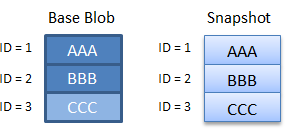

<properties
    pageTitle="在 Azure 存储中创建 Blob 的只读快照 | Azure"
    description="了解如何在指定时刻及时创建 blob 的快照以备份 blob 数据。 了解如何对快照计费，以及如何使用快照最大程度地减少容量费用。"
    services="storage"
    documentationcenter=""
    author="mmacy"
    manager="timlt"
    editor="tysonn"
    translationtype="Human Translation" />
<tags
    ms.assetid="3710705d-e127-4b01-8d0f-29853fb06d0d"
    ms.service="storage"
    ms.workload="storage"
    ms.tgt_pltfrm="na"
    ms.devlang="na"
    ms.topic="article"
    ms.date="04/11/2017"
    wacn.date="05/02/2017"
    ms.author="marsma"
    ms.sourcegitcommit="78da854d58905bc82228bcbff1de0fcfbc12d5ac"
    ms.openlocfilehash="632afa093eed28266ab4d0e0ce5c200bc8f0be84"
    ms.lasthandoff="04/22/2017" />

# 创建 Blob 快照

快照是在某一时间点拍摄的只读版本的 Blob。 快照可用于备份 Blob。 创建快照后，可以读取、复制或删除它，但无法修改它。

Blob 的快照与其基本 Blob 相同，不过，Blob URI 的后面追加了一个 **DateTime** 值，用于指示快照的生成时间。 例如，如果页 Blob URI 为 `http://storagesample.core.blob.chinacloudapi.cn/mydrives/myvhd`，则快照 URI 将类似于 `http://storagesample.core.blob.chinacloudapi.cn/mydrives/myvhd?snapshot=2011-03-09T01:42:34.9360000Z`。 

> [AZURE.NOTE]
> 所有快照共享基本 Blob 的 URI。 基本 Blob 与快照之间的唯一区别体现在追加的 **DateTime** 值。
>

一个 Blob 可以有任意数目的快照。 除非显式删除，否则快照会一直保留。 快照的生存期不能长于其基本 Blob。 你可以枚举与基本 Blob 关联的快照，以跟踪当前快照。

创建 Blob 的快照时，会将该 Blob 的系统属性复制到具有相同值的快照。 基本 Blob 的元数据也会复制到快照，除非创建快照时为其指定了单独的元数据。

任何与基本 Blob 关联的租约都不会影响快照。 无法获取快照上的租约。

VHD 文件用于存储 VM 磁盘的当前信息和状态。 可以将磁盘从 VM 分离或者关闭 VM，然后拍摄其 VHD 文件的快照。 可以在以后使用该快照文件检索该时间点的 VHD 文件并重新创建 VM。

如果为 Blob 所在的存储帐户启用了存储服务加密 (SSE)，则会对该 Blob 的任何快照进行静息加密。

## 创建快照
以下代码示例演示了如何使用[用于 .NET 的 Azure 存储客户端库](https://www.nuget.org/packages/WindowsAzure.Storage/)创建快照。 该示例在创建快照时为其指定了额外的元数据。

    private static async Task CreateBlockBlobSnapshot(CloudBlobContainer container)
    {
        // Create a new block blob in the container.
        CloudBlockBlob baseBlob = container.GetBlockBlobReference("sample-base-blob.txt");

        // Add blob metadata.
        baseBlob.Metadata.Add("ApproxBlobCreatedDate", DateTime.UtcNow.ToString());

        try
        {
            // Upload the blob to create it, with its metadata.
            await baseBlob.UploadTextAsync(string.Format("Base blob: {0}", baseBlob.Uri.ToString()));

            // Sleep 5 seconds.
            System.Threading.Thread.Sleep(5000);

            // Create a snapshot of the base blob.
            // Specify metadata at the time that the snapshot is created to specify unique metadata for the snapshot.
            // If no metadata is specified when the snapshot is created, the base blob's metadata is copied to the snapshot.
            Dictionary<string, string> metadata = new Dictionary<string, string>();
            metadata.Add("ApproxSnapshotCreatedDate", DateTime.UtcNow.ToString());
            await baseBlob.CreateSnapshotAsync(metadata, null, null, null);
        }
        catch (StorageException e)
        {
            Console.WriteLine(e.Message);
            Console.ReadLine();
            throw;
        }
    }

## 复制快照
涉及 Blob 和快照的复制操作遵循以下规则：

* 可以将快照复制到其基本 Blob 上。 通过将快照提升到基本 Blob 的位置，可还原早期版本的 Blob。 快照将保留，但基本 Blob 将由快照的可写副本覆盖。
* 你可将快照复制到具有不同名称的目标 Blob。 生成的目标 Blob 是可写 Blob，而不是快照。
* 复制源 Blob 时，不会将该源 Blob 的任何快照复制到目标。 使用副本覆盖目标 Blob 时，与原始目标 Blob 关联的所有快照将保持不变。
* 创建块 Blob 的快照时，也会将该 Blob 的已提交块列表复制到快照。 不会复制任何未提交的块。

## 指定访问条件
调用 [CreateSnapshotAsync][dotnet_CreateSnapshotAsync] 时，可以指定访问条件，以便仅在符合某条件时创建快照。 若要指定访问条件，请使用 [AccessCondition][dotnet_AccessCondition] 参数。 如果不符合指定条件，则不会创建快照，并且 Blob 服务会返回状态代码 [HTTPStatusCode][dotnet_HTTPStatusCode].PreconditionFailed。

## 删除快照
除非连同快照一起删除，否则无法删除包含快照的 Blob。 可以单独删除快照，或指定在删除源 Blob 时删除所有快照。 如果尝试删除仍包含快照的 Blob，将会发生错误。

以下代码示例演示如何在 .NET 中删除 Blob 及其快照，其中 `blockBlob` 是 [CloudBlockBlob][dotnet_CloudBlockBlob] 类型的对象：

	await blockBlob.DeleteIfExistsAsync(DeleteSnapshotsOption.IncludeSnapshots, null, null, null);

## 在 Azure 高级存储中使用快照
在高级存储中使用快照适用以下规则：

* 高级存储帐户中每个页 Blob 的快照数上限为 100。 如果超出该限制，快照 Blob 操作将返回错误代码 409 (`SnapshotCountExceeded`)。
* 可以每隔 10 分钟在高级存储帐户中创建页 Blob 快照一次。 如果超出该频率，快照 Blob 操作将返回错误代码 409 (`SnapshotOperationRateExceeded`)。
* 若要读取快照，你可以使用“复制 Blob”操作将快照复制到帐户中的另一个页 Blob。 复制操作的目标 Blob 不能包含任何现有快照。 如果目标 Blob 确实包含快照，则“复制 Blob”操作将返回错误代码 409 (`SnapshotsPresent`)。

## 返回快照的绝对 URI
此 C# 代码示例创建一个快照并写出主位置的绝对 URI。

    //Create the blob service client object.
    const string ConnectionString = "DefaultEndpointsProtocol=https;AccountName=account-name;AccountKey=account-key;EndpointSuffix=core.chinacloudapi.cn";

    CloudStorageAccount storageAccount = CloudStorageAccount.Parse(ConnectionString);
    CloudBlobClient blobClient = storageAccount.CreateCloudBlobClient();

    //Get a reference to a container.
    CloudBlobContainer container = blobClient.GetContainerReference("sample-container");
    container.CreateIfNotExists();

    //Get a reference to a blob.
    CloudBlockBlob blob = container.GetBlockBlobReference("sampleblob.txt");
    blob.UploadText("This is a blob.");

    //Create a snapshot of the blob and write out its primary URI.
    CloudBlockBlob blobSnapshot = blob.CreateSnapshot();
    Console.WriteLine(blobSnapshot.SnapshotQualifiedStorageUri.PrimaryUri);

## 了解快照如何产生费用
创建快照（它是 Blob 的只读副本）会导致你的帐户产生额外的数据存储费用。 在设计应用程序时，有必要了解在哪些情况下会产生这些费用，以便最大程度地减少费用。

### 重要计费注意事项
以下列表包含创建快照时要考虑的要点。

* 不管唯一的块或页是在 Blob 还是快照中，存储帐户都会产生费用。 在更新快照所基于的 Blob 之前，你的帐户将不会就与 Blob 关联的快照产生额外费用。 更新基本 Blob 后，它与其快照分离。 发生这种情况时，你需要支付每个 Blob 或快照中唯一块或页的费用。
* 在替换块 Blob 中的某个块后，会将该块作为唯一块进行收费。 即使该块具有的块 ID 和数据与它在快照中所具有的 ID 和数据相同也是如此。 重新提交块后，它将偏离它在任何快照中的对应部分，并且你将就其数据支付费用。 对于使用相同数据更新的页 Blob 中的页面来说，情况也是如此。
* 通过调用 [UploadFromFile][dotnet_UploadFromFile]、[UploadText][dotnet_UploadText]、[UploadFromStream][dotnet_UploadFromStream] 或 [UploadFromByteArray][dotnet_UploadFromByteArray] 方法替换块 Blob 可替换该 Blob 中的所有块。 如果你有与该 Blob 关联的快照，则基本 Blob 和快照中的所有块现在将发生偏离，你需要为这两个 Blob 中的所有块支付费用。 即使基本 Blob 和快照中的数据保持相同也是如此。
* Azure Blob 服务无法确定这两个块是否包含相同的数据。 每个上传和提交的块均被视为唯一的快，即使它具有相同的数据和块 ID 也是如此。 由于唯一的块会产生费用，因此必须考虑到：在更新具有快照的 Blob 时，会产生额外的唯一块，因此也会产生额外的费用。

### 将快照管理成本降至最低

我们建议你仔细管理快照，避免额外费用。 遵循下述最佳做法可以将存储快照的费用降至最低：

* 除非你的应用程序设计需要保留与 Blob 关联的快照，否则请在更新 Blob 时删除并重新创建这些快照，即使你使用相同的数据进行更新也是如此。 通过删除并重新创建 Blob 的快照，可以确保 Blob 和快照不会发生偏离。
* 如果要保留 Blob 的快照，请避免调用 [UploadFromFile][dotnet_UploadFromFile]、[UploadText][dotnet_UploadText]、[UploadFromStream][dotnet_UploadFromStream] 或 [UploadFromByteArray][dotnet_UploadFromByteArray] 来更新该 Blob。 这些方法将替换 Blob 中的所有块，导致基本 Blob 和其快照发生明显偏离。 与之相反，请使用 [PutBlock][dotnet_PutBlock] 和 [PutBlockList][dotnet_PutBlockList] 方法更新尽可能少的块。

### 快照计费方案
下列方案说明了块 Blob 及其快照将如何产生费用。

**方案 1**

在方案 1 中，基本 Blob 自创建快照后未进行更新，因此仅唯一块 1、2 和 3 会产生费用。

**方案 2**

在方案 2 中，已更新基本 Blob，但未更新快照。 已更新块 3，即使它包含相同的数据和 ID，它也与快照中的块 3 不同。 因此，帐户需要为四个块支付费用。

**方案 3**

在方案 3 中，已更新基本 Blob，但未更新快照。 块 3 已替换为基础 Blob 中的块 4，但快照仍反映块 3。 因此，帐户需要为四个块支付费用。

**方案 4**

在方案 4 中，已完全更新基本 Blob，并且其中不包含任何原始块。 因此，帐户需要为所有八个唯一块支付费用。 如果使用 [UploadFromFile][dotnet_UploadFromFile]、[UploadText][dotnet_UploadText]、[UploadFromStream][dotnet_UploadFromStream] 或 [UploadFromByteArray][dotnet_UploadFromByteArray] 之类的更新方法，则会出现此情况，因为这些方法将替换 Blob 的所有内容。

## 后续步骤

* 若要详细了解如何使用虚拟机 (VM) 磁盘快照，可参阅[通过递增快照备份 Azure 非托管 VM 磁盘](/documentation/articles/storage-incremental-snapshots/)

[dotnet_AccessCondition]: https://msdn.microsoft.com/zh-cn/library/azure/microsoft.windowsazure.storage.accesscondition.aspx
[dotnet_CloudBlockBlob]: https://msdn.microsoft.com/zh-cn/library/azure/microsoft.windowsazure.storage.blob.cloudblockblob.aspx
[dotnet_CreateSnapshotAsync]: https://msdn.microsoft.com/zh-cn/library/azure/microsoft.windowsazure.storage.blob.cloudblockblob.createsnapshotasync.aspx
[dotnet_HTTPStatusCode]: https://msdn.microsoft.com/zh-cn/library/system.net.httpstatuscode(v=vs.110).aspx
[dotnet_PutBlockList]: https://msdn.microsoft.com/zh-cn/library/azure/microsoft.windowsazure.storage.blob.cloudblockblob.putblocklist.aspx
[dotnet_PutBlock]: https://msdn.microsoft.com/zh-cn/library/azure/microsoft.windowsazure.storage.blob.cloudblockblob.putblock.aspx
[dotnet_UploadFromByteArray]: https://msdn.microsoft.com/zh-cn/library/azure/microsoft.windowsazure.storage.blob.cloudblockblob.uploadfrombytearray.aspx
[dotnet_UploadFromFile]: https://msdn.microsoft.com/zh-cn/library/azure/mt705654.aspx
[dotnet_UploadFromStream]: https://msdn.microsoft.com/zh-cn/library/azure/microsoft.windowsazure.storage.blob.cloudblockblob.uploadfromstream.aspx
[dotnet_UploadText]: https://msdn.microsoft.com/zh-cn/library/azure/microsoft.windowsazure.storage.blob.cloudblockblob.uploadtext.aspx
<!--Update_Description:add addtional notes for VHD and SSE;add link references to inline code blocks-->