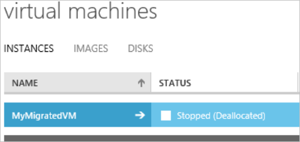
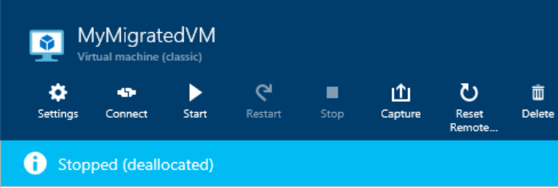

<properties
	pageTitle="对删除 Azure 存储帐户、容器或 VHD 进行故障排除 | Azure"
	description="对删除 Azure 存储帐户、容器或 VHD 进行故障排除"
	services="storage"
	documentationCenter=""
	authors="genlin"
	manager="felixwu"
	editor=""
	tags="storage"/>

<tags
	ms.service="storage"
	ms.workload="na"
	ms.tgt_pltfrm="na"
	ms.devlang="na"
	ms.topic="article"
	ms.date="08/24/2016"
	wacn.date="10/10/2016"
	ms.author="genli"/>

# 对删除 Azure 存储帐户、容器或 VHD 进行故障排除

## 摘要
当用户尝试在 [Azure 门户预览](https://portal.azure.cn/)或 [Azure 经典管理门户](https://manage.windowsazure.cn/)中删除 Azure 存储帐户、容器或 VHD 时，可能会收到错误。这些问题可能是由以下情况造成的：

-	当用户删除 VM 时，磁盘和 VHD 未自动删除。这可能是存储帐户删除失败的原因。我们不会删除磁盘，以便你可以使用该磁盘装入另一个 VM。

-	磁盘或者与磁盘关联的 Blob 上仍有租约。

## 解决方法
若要解决最常见的问题，请尝试以下方法：

1. 登录到 [Azure 经典管理门户](https://manage.windowsazure.cn/)。
2. 选择“虚拟机”>“磁盘”。

	

3. 找到与你想要删除的存储帐户、容器或 VHD 关联的磁盘。通过检查磁盘的位置，你将会找到关联的存储帐户、容器或 VHD。

	

4. 确认没有任何 VM 列于磁盘的“附加到”字段，然后删除磁盘。

 	> [AZURE.NOTE] 如果磁盘附加到 VM，则无法将其删除。以异步方式从已删除的虚拟机分离磁盘。删除 VM 后可能需要几分钟来清除此字段。

5. 选择“虚拟机”>“映像”，然后删除与存储帐户、容器或 VHD 关联的映像。

	之后，再次尝试删除存储帐户、容器或 VHD。

> [AZURE.WARNING] 请在删除帐户之前务必备份你想要保存的任何内容。无法恢复已删除的存储帐户，也无法检索删除之前该存储帐户包含的任何内容。对于帐户中的任务资源也是如此：一旦删除了一个 VHD、Blob、表、队列或文件，它将被永久删除。确保该资源未使用。

## 常见问题

以下部分列出了试图删除 Azure 存储帐户、容器或 VHD 时可能收到的常见错误。

### 场景 1：无法删除存储帐户

导航到 [Azure 门户预览](https://portal.azure.cn/)或 [Azure 经典管理门户](https://manage.windowsazure.cn/)中的存储帐户并选择“删除”时，可能会看到以下错误消息：

**Azure 门户预览**：

*未能删除存储帐户 <vm-storage-account-name>。无法删除存储帐户 <vm-storage-account-name>：“存储帐户 <vm-storage-account-name> 具有活动的映像和/或磁盘。删除此存储帐户前，请确保删除这些映像和/或磁盘。”*

**Azure 经典管理门户**：

*存储帐户 <vm-storage-account-name> 具有活动的映像和/或磁盘，例如 xxxxxxxxx- xxxxxxxxx-O-209490240936090599。删除此存储帐户前，请确保删除这些映像和/或磁盘。*

还可能看到此错误：

**Azure 门户预览**：

*存储帐户 <vm-storage-account-name> 拥有 1 个具有活动的映像和/或磁盘项目的容器。删除此存储帐户前，请确保从映像存储库中删除这些项目*。

**Azure 经典管理门户**：

*提交失败的存储帐户 <vm-storage-account-name> 拥有 1 个具有活动的映像和/或磁盘项目的容器。在删除此存储帐户前，请确保从映像存储库中删除这些项目。当你试图删除某个存储帐户，但仍存在与之关联的活动磁盘时，你将看到一条告诉你有活动磁盘需要进行删除的消息*。

### 场景 2：无法删除容器

尝试删除存储容器时，可能会看到以下错误：

*未能删除存储容器 <container name>。错误：目前容器上有租约，但请求中未指定任何租约 ID*。

### 场景 3：无法删除 VHD

删除虚拟机然后尝试删除与 VHD 关联的 blob 后，可能会收到以下消息：

*未能删除 blob“path/XXXXXX-XXXXXX-os-1447379084699.vhd”。错误：目前 Blob 上有租约，但请求中未指定任何租约 ID*。

## 有关已停止（已解除分配）的状态

在经典部署模型中创建且已保留的虚拟机将在 [Azure 门户预览](https://portal.azure.cn/)或 [Azure 经典管理门户](https://manage.windowsazure.cn/)中具有“已停止（已解除分配）”的状态。

**Azure 经典管理门户**：

**Azure 门户预览**：

已停止（已解除分配）的状态将释放计算机资源，如 CPU、内存和网络。但是，磁盘将仍然保留，以便用户可以快速重新创建虚拟机（如果需要）。这些磁盘都创建在基于 Azure 存储支持的 VHD 之上。存储帐户拥有这些 VHD，并且磁盘在这些 VHD 上有租约。

## 后续步骤

- [删除存储帐户](/documentation/articles/storage-create-storage-account/#delete-a-storage-account)
- [如何在 Azure（PowerShell）中中断 Blob 存储的锁定租约](https://gallery.technet.microsoft.com/scriptcenter/How-to-break-the-locked-c2cd6492)

<!---HONumber=Mooncake_0926_2016-->