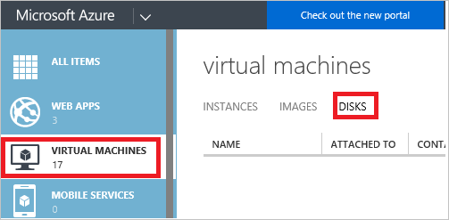

<properties
    pageTitle="对在经典部署中删除 Azure 存储帐户、容器或 VHD 进行故障排除 | Azure"
    description="对在经典部署中删除 Azure 存储帐户、容器或 VHD 进行故障排除"
    services="storage"
    documentationcenter=""
    author="genlin"
    manager="felixwu"
    editor="tysonn"
    tags="storage" />
<tags
    ms.assetid="0f7a8243-d8dc-432a-9d37-1272a0cb3a5c"
    ms.service="storage"
    ms.workload="na"
    ms.tgt_pltfrm="na"
    ms.devlang="na"
    ms.topic="article"
    ms.date="02/08/2017"
    wacn.date="03/20/2017"
    ms.author="genli" />  

# 对在经典部署中删除 Azure 存储帐户、容器或 VHD 进行故障排除
[AZURE.INCLUDE [storage-selector-cannot-delete-storage-account-container-vhd](../../includes/storage-selector-cannot-delete-storage-account-container-vhd.md)]

当用户尝试在 [Azure 门户](https://portal.azure.cn/)或 [Azure 经典管理门户](https://manage.windowsazure.cn/)中删除 Azure 存储帐户、容器或 VHD 时，可能会收到错误。这些问题可能由以下情况造成：

* 当用户删除 VM 时，磁盘和 VHD 未自动删除。这可能是存储帐户删除失败的原因。我们不会删除磁盘，以便你可以使用该磁盘装入另一个 VM。
* 磁盘或者与磁盘关联的 Blob 上仍有租约。
* 仍有一个 VM 映像使用 Blob、容器或存储帐户。

## 症状
以下部分列出了试图删除 Azure 存储帐户、容器或 VHD 时可能收到的常见错误。

### 应用场景 1：无法删除存储帐户
导航到 [Azure 门户](https://portal.azure.cn/)中的经典存储帐户并选择“删除”时，可能会看到阻止删除存储帐户的对象列表：

    

导航到 [Azure 经典管理门户](https://manage.windowsazure.cn/)中的存储帐户并选择“删除”时，可能会看到以下错误之一：

- *存储帐户 StorageAccountName 包含 VM 映像。删除此存储帐户前，请确保已删除这些 VM 映像。*

- *未能删除存储帐户 <vm-storage-account-name>。无法删除存储帐户 <vm-storage-account-name>：“存储帐户 <vm-storage-account-name> 具有一些活动的映像和/或磁盘。删除此存储帐户前，请确保删除这些映像和/或磁盘。”*

- *存储帐户 <vm-storage-account-name> 具有活动的映像和/或磁盘，例如 xxxxxxxxx- xxxxxxxxx-O-209490240936090599。删除此存储帐户前，请确保删除这些映像和/或磁盘。*

- *存储帐户 <vm-storage-account-name> 拥有 1 个具有活动的映像和/或磁盘项目的容器。删除此存储帐户前，请确保从映像存储库中删除这些项目*。

- *提交失败的存储帐户 <vm-storage-account-name> 拥有 1 个具有活动的映像和/或磁盘项目的容器。删除此存储帐户前，请确保从映像存储库中删除这些项目。当你试图删除某个存储帐户，但仍存在与之关联的活动磁盘时，你将看到一条告诉你有活动磁盘需要进行删除的消息*。

### 应用场景 2：无法删除容器
尝试删除存储容器时，可能会看到以下错误：

*未能删除存储容器 <container name>。错误：目前容器上有租约，但请求中未指定任何租约 ID*。

或

*“以下虚拟机磁盘使用了此容器中的 Blob，因此无法删除该容器: VirtualMachineDiskName1、VirtualMachineDiskName2...”*

### 应用场景 3：无法删除 VHD
删除 VM 并随后尝试删除与 VHD 关联的 blob 后，可能会收到以下消息：

*未能删除 blob“path/XXXXXX-XXXXXX-os-1447379084699.vhd”。错误：目前 Blob 上有租约，但请求中未指定任何租约 ID*。

或

*Blob ‘BlobName.vhd’ 已用作虚拟机磁盘 ‘VirtualMachineDiskName’，因此无法删除该 Blob。*

## 解决方案
若要解决最常见的问题，请尝试以下方法：

### 步骤 1：删除所有阻止删除存储帐户、容器或 VHD 的磁盘
1. 切换到 [Azure 经典管理门户](https://manage.windowsazure.cn/)。
2. 选择“虚拟机”>“磁盘”。

    
3. 找到与你想要删除的存储帐户、容器或 VHD 关联的磁盘。在检查磁盘的位置时，你将会找到关联的存储帐户、容器或 VHD。

      

4. 使用以下方法之一删除磁盘：

  - 如果磁盘的“附加到”字段中未列出任何 VM，则可以直接删除该磁盘。

  - 如果该磁盘是数据磁盘，请遵循以下步骤：

    1. 检查该磁盘已附加到的 VM 的名称。
    2. 转到“虚拟机”>“实例”，然后找到该 VM。
    3. 确保没有任何组件正在使用该磁盘。
    4. 选择门户底部的“分离磁盘”来分离磁盘。
    5. 转到“虚拟机”>“磁盘”，等到“附加到”字段变为空白。这表示已成功从 VM 分离磁盘。
    6. 在“虚拟机”>“磁盘”的底部选择“删除”以删除该磁盘。

  - 如果该磁盘是 OS 磁盘（“包含 OS”字段中出现诸如“Windows”的值）并已附加到 VM，请遵循以下步骤删除 VM。OS 磁盘无法分离，因此，只有删除 VM 才能释放租约。

    1. 检查数据磁盘附加到的虚拟机的名称。
    2. 转到“虚拟机”>“实例”，然后选择磁盘附加到的 VM。
    3. 确保没有任何组件正在使用该虚拟机，并确认你不再需要该虚拟机。
    4. 选择磁盘附加到的 VM，然后选择“删除”>“删除附加的磁盘”。
    5. 转到“虚拟机”>“磁盘”，等到该磁盘消失。磁盘可能需要几分钟才能消失，并且可能需要刷新页面。
    6. 如果磁盘未消失，请等到“附加到”字段变为空白。这表示已从 VM 分离磁盘。然后，选择该磁盘，在页面底部选择“删除”以删除该磁盘。

   > [AZURE.NOTE]如果磁盘附加到 VM，则无法将其删除。以异步方式从已删除 VM 分离磁盘。删除 VM 后可能需要几分钟来清除此字段。

### 步骤 2：删除任何阻止删除存储帐户或容器的 VM 映像
1. 切换到 [Azure 经典管理门户](https://manage.windowsazure.cn/)。
2. 选择“虚拟机”>“映像”，然后删除与存储帐户、容器或 VHD 关联的映像。

    之后，再次尝试删除存储帐户、容器或 VHD。

> [AZURE.WARNING]
删除帐户前请务必备份要保存的任何内容。删除 VHD、blob、表、队列或文件后，它将被永久删除。确保该资源未使用。
>
>

## 有关已停止（已解除分配）的状态
在经典部署模型中创建且已保留的虚拟机将在 [Azure 门户](https://portal.azure.cn/)或 [Azure 经典管理门户](https://manage.windowsazure.cn/)中具有“已停止（已解除分配）”的状态。

**Azure 经典管理门户**：

**Azure 门户**：

已停止（已解除分配）的状态将释放计算机资源，如 CPU、内存和网络。但是，磁盘将仍然保留，以便在需要时用户可以快速重新创建 VM。这些磁盘都创建在基于 Azure 存储支持的 VHD 之上。存储帐户具有这些 VHD，并且磁盘在这些 VHD 上有租约。

## 后续步骤
- [删除存储帐户](/documentation/articles/storage-create-storage-account/#delete-a-storage-account)
- [如何在 Azure（PowerShell）中中断 Blob 存储的锁定租约](https://gallery.technet.microsoft.com/scriptcenter/How-to-break-the-locked-c2cd6492)

<!---HONumber=Mooncake_0313_2017-->
<!--Update_Description: update "无法删除存储帐户" scenarios-->