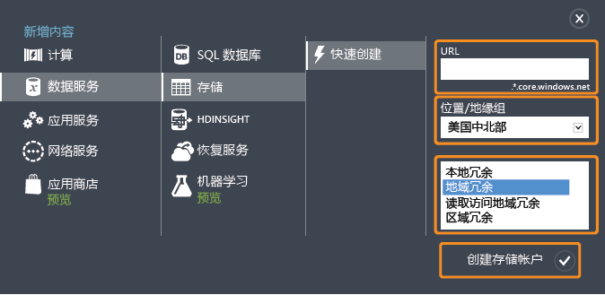
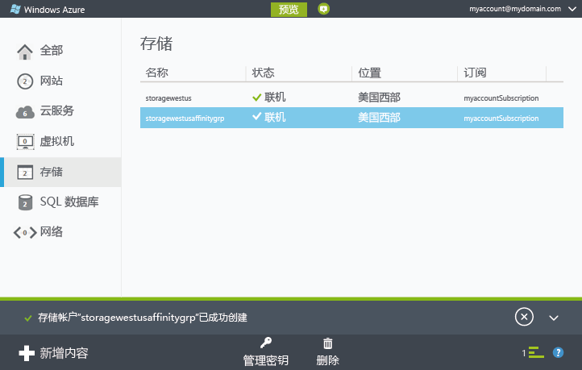
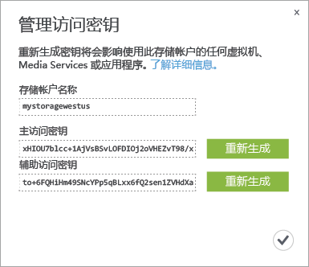

<properties
	pageTitle="如何在 Azure 经典管理门户中创建、管理或删除存储帐户 | Azure"
	description="创建新的存储帐户、管理帐户访问密钥，或删除 Azure 经典管理门户中的存储帐户。了解标准和高级存储帐户。"
	services="storage"
	documentationCenter=""
	authors="robinsh"
	manager="carmonm"
	editor="tysonn"/>

<tags
	ms.service="storage"
	ms.workload="storage"
	ms.tgt_pltfrm="na"
	ms.devlang="na"
	ms.topic="get-started-article"
	ms.date="07/26/2016"
	wacn.date="12/19/2016"
	ms.author="micurd;robinsh"/>

# 关于 Azure 存储帐户

[AZURE.INCLUDE [storage-selector-portal-create-storage-account](../../includes/storage-selector-portal-create-storage-account.md)]

## 概述

Azure 存储帐户将授权访问 Azure 存储中的 Azure Blob、队列、表和文件服务.存储帐户为 Azure 存储数据对象提供唯一的命名空间。默认情况下，只有帐户所有者才能使用帐户中的数据。

有两种类型的存储帐户：

- 标准存储帐户包括 Blob、表、队列和文件存储。
- 高级存储帐户当前仅支持 Azure 虚拟机磁盘。有关高级存储的详细信息，请参阅[高级存储：适用于 Azure 虚拟机工作负荷的高性能存储](/documentation/articles/storage-premium-storage/)。

## 存储帐户计费

根据存储帐户对 Azure 存储使用量进行收费。存储成本取决于四个因素：存储容量、复制方案、存储事务和数据出口。

- 存储容量指的是存储帐户中用来存储数据的配额。对数据进行简单存储时，其成本取决于存储的数据量和数据复制方式。
- 复制决定一次保留的数据副本数，以及保留位置。
- 事务指对 Azure 存储的所有读取和写入操作。
- 数据出口指的是传出某个 Azure 区域的数据。其他区域中的应用程序访问存储帐户中的数据时，无论该应用程序是云服务还是其他类型的应用程序，都将会针对数据出口进行收费。（对于 Azure 服务，可采取措施将数据和服务通过分组分到相同的数据中心内，从而降低或避免数据出口费用。）

[Azure 存储定价](/pricing/details/storage/)页提供了存储容量、复制和事务的详细定价信息。[数据传输定价详细信息](/pricing/details/data-transfer/)页提供了数据出口的详细定价信息。

有关存储帐户容量和性能目标的详细信息，请参阅 [Azure 存储可伸缩性和性能目标](/documentation/articles/storage-scalability-targets/)。

> [AZURE.NOTE] 创建 Azure 虚拟机时，如果部署位置上午存储帐户，将在该位置自动创建。因此，没有必要按照下面的步骤来创建虚拟机磁盘的存储帐户。存储帐户名称将基于虚拟机名称。请参阅 [Azure 虚拟机文档](/documentation/services/virtual-machines/)以了解更多详细信息。

## 创建存储帐户

1. 登录到 [Azure 经典管理门户](https://manage.windowsazure.cn)。

2. 单击页面底部任务栏中的“新建”。选择“数据服务”|“存储”，然后单击“快速创建”。

	  

3. 在 **URL** 中，输入存储帐户的名称。

	> [AZURE.NOTE] 存储帐户名称必须为 3 到 24 个字符，并且只能包含数字和小写字母。
	>  
	> 存储帐户名称在 Azure 中必须是唯一的。Azure 经典管理门户将指出所选存储帐户名称是否已经存在。

	请参阅下面的[存储帐户终结点](#storage-account-endpoints)以，解如何使用存储帐户名称来定位 Azure 存储中对象。

4. 在“位置/地缘组”中，选择靠近你或客户的存储帐户的位置。如果其他 Azure 服务（例如 Azure 虚拟机或云服务）将要访问你存储帐户中的数据，可能需要从列表中选择一个地缘组，以便将存储帐户与用于改进性能和降低成本的其他 Azure 服务组合到同一个数据中心。

	请注意，在创建存储帐户时，必须选择一个地缘组。不能将现有帐户移到一个地缘组中。有关地缘组的更多信息，请参阅下面的[服务与地缘组的归置](#service-co-location-with-an-affinity-group)。

	>[AZURE.IMPORTANT] 若要确定你的订阅可用的位置，可调用 [List all resource providers](https://msdn.microsoft.com/zh-cn/library/azure/dn790524.aspx)操作。若要从 PowerShell 列出提供程序，请调用 [Get-AzureLocation](https://msdn.microsoft.com/zh-cn/library/azure/dn757693.aspx)。通过 .NET，使用 ProviderOperationsExtensions 类的 [List](https://msdn.microsoft.com/zh-cn/library/azure/microsoft.azure.management.resources.provideroperationsextensions.list.aspx) 方法。
	>
<!--	>Additionally, see [Azure Regions](https://azure.microsoft.com/regions/#services) for more information about what services are available in which region.-->

5. 若有多个 Azure 订阅，将显示“订阅”字段。在“订阅”中，输入要使用存储帐户的 Azure 订阅。

6. 在“复制”中，选择存储帐户所需的复制级别。建议的复制选项为地域冗余复制，它可为数据提供最大耐用性。有关 Azure 存储复制选项的更多详细信息，请参阅 [Azure 存储复制](/documentation/articles/storage-redundancy/)。

6. 单击“创建存储帐户”。

	创建存储帐户可能需要花费几分钟的时间。若要检查状态，可以监视 Azure 经典管理门户底部的通知。创建存储帐户后，新存储帐户将处于“联机”状态并且随时可供使用。

### 存储帐户终结点

存储在 Azure 存储中的每个对象都有唯一的 URL 地址。存储帐户名称构成该地址的子域。特定于每个服务的子域和域名的组合构成存储帐户的*终结点*。

例如，如果存储帐户名为 *mystorageaccount*，则存储帐户的默认终结点为：

- Blob 服务：http://*mystorageaccount*.blob.core.chinacloudapi.cn

- 表服务：http://*mystorageaccount*.table.core.chinacloudapi.cn

- 队列服务：http://*mystorageaccount*.queue.core.chinacloudapi.cn

- 文件服务：http://*mystorageaccount*.file.core.chinacloudapi.cn

创建存储帐户后，可以在 [Azure 经典管理门户](https://manage.windowsazure.cn)的存储仪表板上看到该帐户的终结点。

用于访问存储帐户中某个对象的 URL 是通过将存储帐户中对象的位置附加到终结点而构建的。例如，Blob 地址可能具有以下格式：http://*mystorageaccount*.blob.core.chinacloudapi.cn/*mycontainer*/*myblob*。

此外还可以配置用于存储帐户的自定义域名称。请参阅[为 Blob 存储终结点配置自定义域名称](/documentation/articles/storage-custom-domain-name/)以了解详细信息。

### 服务与地缘组的归置

*地缘组*是 Azure 服务和 VM 及 Azure 存储帐户的地理分组。通过定位同一数据中心或靠近目标用户受众的计算机工作负载，地缘组可提高服务性能。此外，当某个存储帐户中的数据被另一个服务访问，而该服务是同一个地缘组的一部分时，不会对出口流量收费。

> [AZURE.NOTE]  若要创建地缘组，请打开 [Azure 经典管理门户](https://manage.windowsazure.cn)的“设置”区域，单击“地缘组”，然后单击“添加地缘组”或“添加”按钮。也可使用 Azure 服务管理 API 创建和管理地缘组。请参阅<a href="http://msdn.microsoft.com/zh-cn/library/azure/ee460798.aspx">对地缘组的操作</a>以了解更多信息。

## 查看、复制和重新生成存储访问密钥

创建存储帐户时，Azure 将生成两个 512 位存储访问密钥，用于在用户访问该存储帐户时对其进行身份验证。Azure 提供两个存储访问密钥，因此可在不中断存储服务的情况下重新生成用于访问该服务的密钥。

> [AZURE.NOTE] 建议避免与他人共享存储访问密钥。若要允许不提供访问密钥即可访问存储空间资源，可使用 *共享访问签名* 。通过共享访问签名，可在所定义的访问间隔用所指定访问权限，访问帐户中的资源。有关详细信息，请参阅[使用共享访问签名 (SAS)](/documentation/articles/storage-dotnet-shared-access-signature-part-1/)。

在 [Azure 经典管理门户](https://manage.windowsazure.cn)中，可使用仪表板或“存储”页面上的“管理密钥”查看、复制和重新生成用于访问 Blob、表和队列服务的存储访问密钥。

### 复制存储访问密钥  

可使用“管理密钥”复制要在连接字符串中使用的存储访问密钥。连接字符串需要在进行身份验证时使用存储帐户名称和密钥。有关配置连接字符串以访问 Azure 存储服务的信息，请参阅[配置 Azure 存储连接字符串](/documentation/articles/storage-configure-connection-string/)。

1. 在 [Azure 经典管理门户](https://manage.windowsazure.cn)中，单击“存储”，然后单击存储帐户名称即可打开仪表板。

2. 单击“管理密钥”。

 	“管理访问密钥”页面打开。

	  

3. 若要复制存储访问密钥，请选择密钥文本。然后右键单击，并单击“复制”。

### 重新生成存储访问密钥
建议定期更改存储帐户的访问密钥，以确保存储连接安全。分配了两个访问密钥，因此重新生成其中一个访问密钥时，始终能够使用另一个访问密钥连接到存储帐户。

> [AZURE.WARNING] 重新生成访问密钥会影响 Azure 中的服务以及依赖于存储帐户的应用程序。必须更新使用访问密钥访问存储帐户的所有客户端，以使用新密钥。

**媒体服务** - 如果媒体服务依赖于存储帐户，则重新生成密钥后必须将访问密钥与媒体服务重新同步。

**应用程序** - 如果拥有使用存储帐户的 Web 应用程序或云服务，则重新生成密钥将失去连接，除非滚动使用密钥。

**存储资源管理器** - 如果使用任何[存储资源管理器应用程序](/documentation/articles/storage-explorers/)，可能需要更新这些应用程序所使用的存储密钥。

下面是轮换存储访问密钥的过程：

1. 更新应用程序代码中的连接字符串以引用存储帐户的辅助访问密钥。

2. 为存储帐户重新生成主访问密钥。在 [Azure 经典管理门户](https://manage.windowsazure.cn)中，从仪表板或“配置”页面，单击“管理密钥”。单击主访问密钥下的“重新生成”，然后单击“是”以确认要生成新密钥。

3. 更新代码中的连接字符串以引用新的主访问密钥。

4. 重新生成辅助访问密钥。

## 删除存储帐户

若要删除不再使用的存储帐户，请使用仪表板或“配置”页上的“删除”。“删除”操作将删除整个存储帐户，包括帐户中的所有 Blob、表和队列。

> [AZURE.WARNING] 无法恢复已删除的存储帐户，也无法检索删除之前该存储帐户包含的任何内容。删除帐户前请务必备份要保存的任何内容。对于帐户中的任务资源也是如此 - Blob、表、队列或文件的删除是永久删除。
>
> 如果存储帐户包含用于 Azure 虚拟机的 VHD 文件，则必须删除使用这些 VHD 文件的任何映像和磁盘，然后才能删除存储帐户。首先，如果虚拟机正在运行，则停止运行，然后将其删除。若要删除磁盘，请导航到“磁盘”选项卡，然后在那里删除存所有磁盘。若要删除映像，请导航到“映像”选项卡，然后删除存储在帐户中的任何映像。

1. 在 [Azure 经典管理门户](https://manage.windowsazure.cn)中，单击“存储”。

2. 单击存储帐户条目中除名称以外的任何位置，然后单击“删除”。

	 -或-

	单击存储帐户的名称以打开仪表板，然后单击“删除”。

3. 单击“是”以确认要删除存储帐户。

## 后续步骤

- 若要了解有关 Azure 存储的详细信息，请参阅 [Azure 存储文档](/documentation/services/storage/)。
- 访问 [Azure 存储团队博客](http://blogs.msdn.com/b/windowsazurestorage/)。
- [使用 AzCopy 命令行实用程序传输数据](/documentation/articles/storage-use-azcopy/)

<!---HONumber=Mooncake_Quality_Review_1202_2016-->