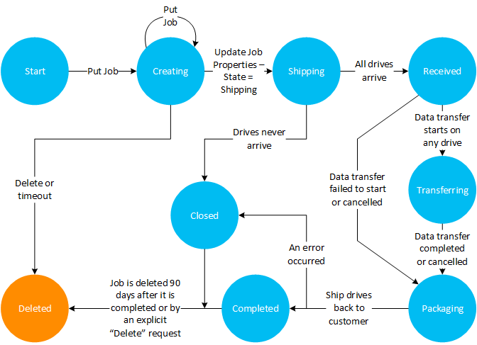
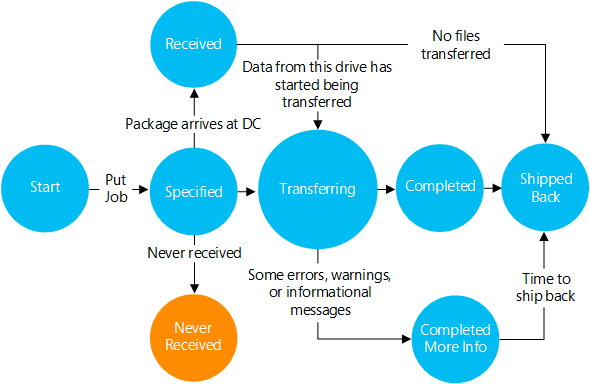

<properties
    pageTitle="检索 Azure 导入/导出服务作业的状态信息 | Azure"
    description="了解如何获取 Azure 导入/导出服务作业的状态信息"
    author="renashahmsft"
    manager="aungoo"
    editor="tysonn"
    services="storage"
    documentationcenter="" />  

<tags
    ms.assetid="22d7e5f0-94da-49b4-a1ac-dd4c14a423c2"
    ms.service="storage"
    ms.workload="storage"
    ms.tgt_pltfrm="na"
    ms.devlang="na"
    ms.topic="article"
    ms.date="12/16/2016"
    wacn.date="12/29/2016"
    ms.author="renash" />  

# 检索作业的状态信息
可以调用[获取作业](https://docs.microsoft.com/zh-CN/rest/api/storageimportexport/jobs#Jobs_Get)操作来检索有关导入和导出作业的信息。返回的信息包括：

-   作业的当前状态。

-   每个作业大致的已完成百分比。

-   每个驱动器的当前状态。

-   包含错误日志和详细日志记录信息的 Blob 的 URI（如果已启用）。

以下部分说明了“`Get Job`”操作返回的信息。

## 作业状态
下面的表格和状态图描述了作业在其生命周期内经历的各种状态。可通过调用“`Get Job`”操作来确定作业的当前状态。

  

下表描述了作业可能经历的每种状态。

|作业状态|说明|
|---------------|-----------------|
|`Creating`|
调用“放置作业”操作后，将创建一个作业，其状态设置为 `Creating`。当作业处于 `Creating` 状态时，导入/导出服务会假设驱动器尚未寄送到数据中心。作业可保持 `Creating` 状态最多两周，之后服务会自动将其删除。

 如果在作业处于 `Creating` 状态时调用“更新作业属性”操作，该作业将保持 `Creating` 状态，超时间隔将重置为两周。
|
|`Shipping`|
寄送包裹后，应调用“更新作业属性”操作，将作业状态更新为 `Shipping`。仅在为作业设置 `DeliveryPackage`（邮政承运人和跟踪号）与 `ReturnAddress` 属性后，才能设置寄送状态。

 作业将保持 Shipping 状态最多两周。如果两周已过但未收到驱动器，系统会通知导入/导出服务操作员。
|
|`Received`|数据中心中收到所有驱动器后，作业状态将设置为 Received。|
|`Transferring`|在数据中心收到驱动器且已开始处理至少一个驱动器后，作业状态将设置为 `Transferring`。有关详细信息，请参阅下面的“`Drive States`”部分。|
|`Packaging`|在处理完所有驱动器后，作业将进入 `Packaging` 状态，直到将驱动器寄回给客户。|
|`Completed`|在将所有驱动器寄回客户后，如果完成作业时未出现错误，该作业将设置为 `Completed` 状态。作业在保持 `Completed` 状态 90 天后将自动删除。|
|`Closed`|将所有驱动器寄回客户后，如果在处理作业期间出现过错误，该作业将设置为 `Closed` 状态。作业在保持 `Closed` 状态 90 天后将自动删除。|

只能取消处于特定状态的作业。已取消的作业将跳过数据复制步骤，不过会遵循与尚未取消的作业相同的状态转换。

下表描述了每种作业状态下可能会出现的错误，以及出错对作业产生的影响。

|作业状态|事件|解决方法/后续步骤|
|---------------|-----------|------------------------------|
|`Creating or Undefined`|作业的一个或多个驱动器已送达，但该作业不处于 `Shipping` 状态，或者服务中没有该作业的记录。|
导入/导出服务运营团队将尝试联系客户，使用必要的信息来创建或更新作业，使作业能够继续进行。

 如果运营团队在两周内无法联系到客户，将尝试寄回驱动器。

 如果无法寄回驱动器且无法联系到客户，将在 90 天后安全销毁驱动器。

 请注意，在作业状态更新为 `Shipping` 之前，无法处理作业。
|
|`Shipping`|作业的包裹在两个多星期后仍未送达。|
运营团队将通知客户包裹丢失。根据客户做出的回应，运营团队将延长间隔以等待包裹送达或取消作业。

 如果无法联系到客户或客户在 30 天内未做出回应，运营团队将采取措施，将作业直接从 `Shipping` 状态转移到 `Closed` 状态。
|
|`Completed/Closed`|驱动器从未送至回邮地址或在寄送途中受损（仅适用于导出作业）。|
如果驱动器未送至回邮地址，客户应先调用“获取作业”操作或者在门户中查看作业状态，确保已寄送驱动器。如果已寄送驱动器，客户应联系承运人来尝试找到驱动器。

 如果驱动器在寄送途中受损，客户可能需要请求另一个导出作业或下载缺失的 Blob。
|
|`Transferring/Packaging`|作业的回邮地址错误或缺失。|
运营团队将联系作业相关人员获取正确的地址。

 如果无法联系到客户，将在 90 天后安全销毁驱动器。
|
|`Creating / Shipping/ Transferring`|寄送包裹中包含要导入的驱动器列表中未显示的驱动器。|额外的驱动器不会得到处理，将在作业完成后退回给客户。|

## 驱动器状态
下面的表格和图描述了单个驱动器在导入或导出作业中转换时的生命周期。可以通过调用“`Get Job`”操作并检查 `DriveList` 属性的 `State` 元素来检索当前驱动器状态。

  

下表描述了驱动器可能经历的每种状态。

|驱动器状态|说明|
|-----------------|-----------------|
|`Specified`|对于导入作业，在通过“放置作业”操作创建该作业时，驱动器的初始状态为 `Specified`。对于导出作业，由于在创建该作业时未指定驱动器，因此驱动器的初始状态为 `Received`。|
|`Received`|导入/导出服务操作员为导入作业处理从货运公司收到的驱动器后，驱动器将转换为 `Received` 状态。对于导出作业，初始驱动器状态为 `Received`。|
|`NeverReceived`|当作业的包裹已送达但包裹不包含驱动器时，驱动器将转换为 `NeverReceived` 状态。如果在服务收到发货信息后的两周内包裹未送达数据中心，驱动器也会转换为此状态。|
|`Transferring`|服务开始将数据从驱动器传输到 Azure 存储时，驱动器将转换为 `Transferring` 状态。|
|`Completed`|服务成功传输所有数据且未出错时，驱动器将转换为 `Completed` 状态。|
|`CompletedMoreInfo`|如果服务在从驱动器中复制数据或将数据复制到驱动器时遇到一些问题，驱动器将转换为 `CompletedMoreInfo` 状态。信息可以包含有关覆盖 Blob 的错误、警告或信息性消息。|
|`ShippedBack`|驱动器从数据中心寄送到回邮地址后，驱动器将转换为 `ShippedBack` 状态。|

下表描述了驱动器故障状态以及针对每种状态采取的措施。

|驱动器状态|事件|解决方法/后续步骤|
|-----------------|-----------|-----------------------------|
|`NeverReceived`|标记为 `NeverReceived` 的驱动器（因为在作业寄送过程中未收到）通过另一次寄送送达。|运营团队将驱动器状态转换为 `Received`。|
|`N/A`|不属于任何作业的驱动器将作为其他作业的一部分送至数据中心。|完成与原始包裹关联的作业后，驱动器将标记为额外驱动器并寄回给客户。|

## 出错状态
当作业或驱动器未能正常完成其预期生命周期时，作业或驱动器将转换为 `Faulted` 状态。此时，运营团队将通过电子邮件或电话联系客户。解决问题后，出错的作业或驱动器将退出 `Faulted` 状态并转换为适当的状态。

## 另请参阅
[使用导入/导出服务 REST API](/documentation/articles/storage-import-export-using-the-rest-api/)

<!---HONumber=Mooncake_1226_2016-->