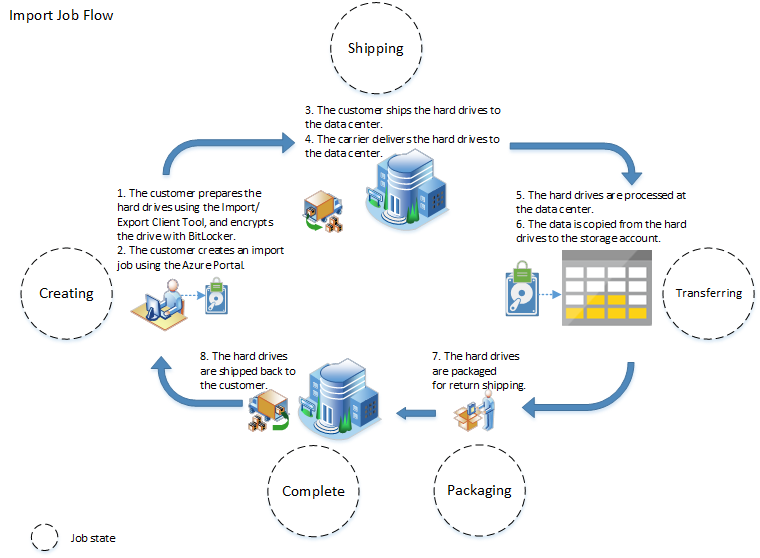
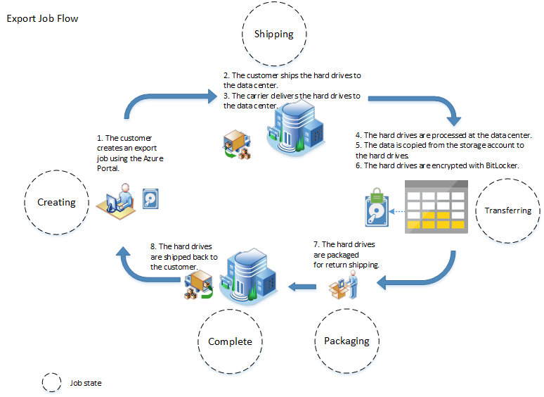
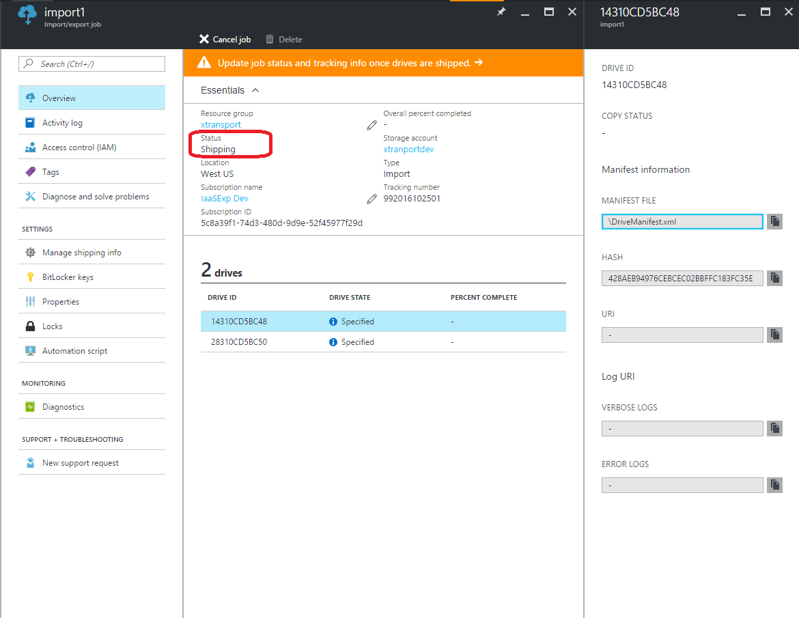
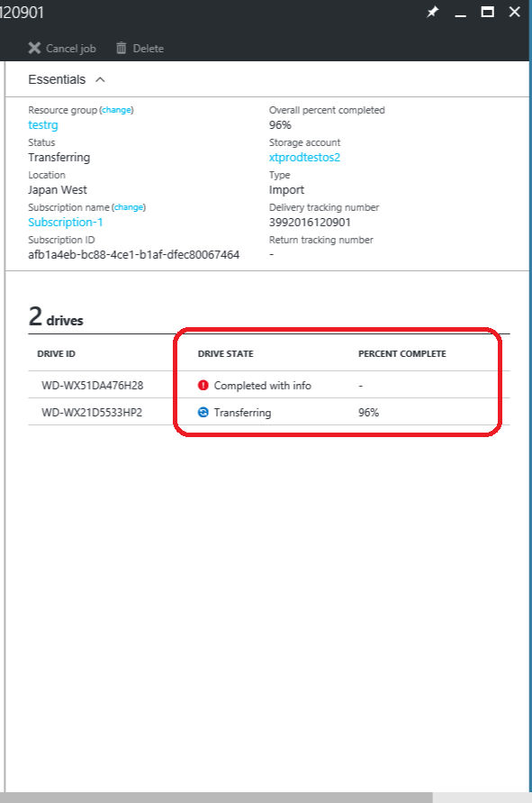
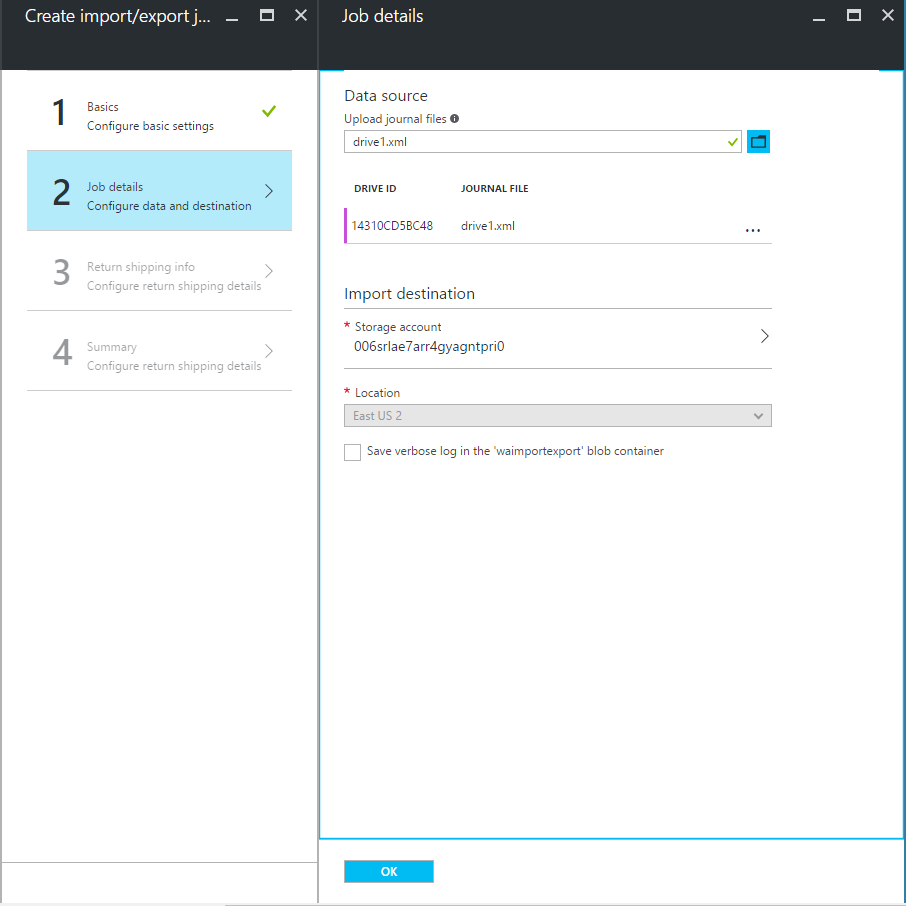
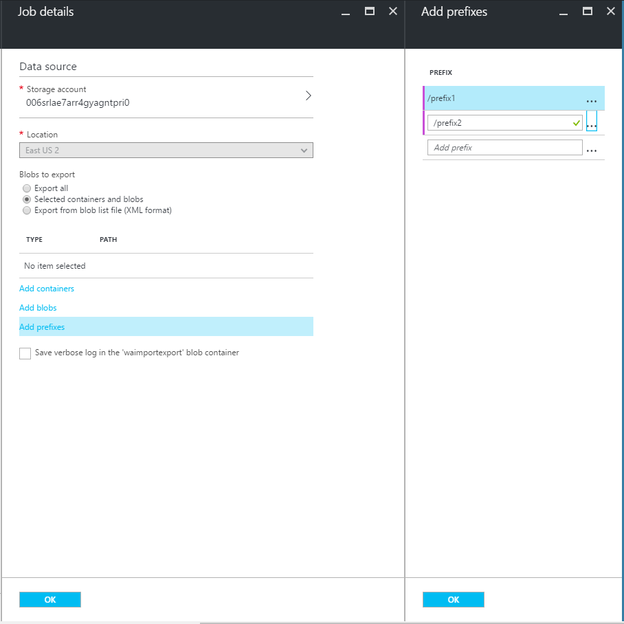
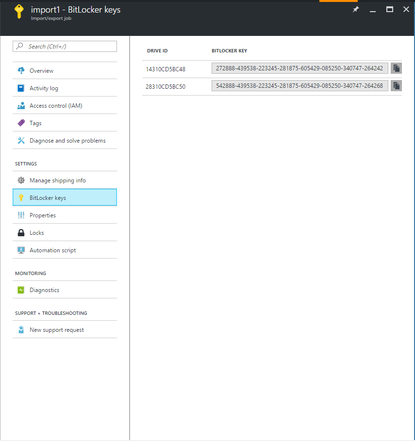

<properties 
	pageTitle="使用导入/导出将数据传输到 Blob 存储 | Azure" 
	description="了解如何在 Azure 经典管理门户中创建导入和导出作业，以将数据传输到 blob 存储中。"
	authors="renashahmsft"
	manager="aungoo"
	editor="tysonn"
	services="storage"
	documentationCenter=""/>  

<tags
    ms.assetid="668f53f2-f5a4-48b5-9369-88ec5ea05eb5"
    ms.service="storage"
    ms.workload="storage"
    ms.tgt_pltfrm="na"
    ms.devlang="na"
    ms.topic="article"
    ms.date="10/18/2016"
    wacn.date="12/29/2016"
    ms.author="renash" />  

# 使用 Azure 导入/导出服务可将数据传输到 Blob 存储中

## 概述

使用 Azure 导入/导出服务，你可以将硬盘驱动器寄送到 Azure 数据中心，从而安全地将大量数据传输到 Azure Blob 存储。你还可以使用此服务将数据从 Azure Blob 存储传输到硬盘驱动器，然后再寄送到你的本地站点。如果你需要在本地站点和 Azure 之间传输数 TB 的数据，而由于带宽限制或网络成本过高，通过网络上载或下载数据不可行，在这种情况下，你可以使用此服务。

此服务要求对硬盘驱动器进行 BitLocker 加密以确保数据的安全性。此服务支持中国北部中的经典存储账户以及（标准和冷层）资源管理存储账户。必须将硬盘驱动器寄送到本文后面指定的受支持的位置。

在本文中，你将详细了解 Azure 导入/导出服务，以及如何通过寄送驱动器将数据复制到 Azure Blob 存储以及从其复制数据。

## 应该在什么时候使用 Azure 导入/导出服务？

如果通过网络上载或下载数据速度太慢，或者获取额外的网络带宽因成本过高而受到限制，则可考虑使用 Azure 导入/导出服务。

下面这样的场景可以使用此服务：

- 将数据迁移到云：将大量数据快速且经济高效地转移到 Azure。
- 内容分发：将数据快速发送到客户站点。
- 备份：将本地数据备份后存储在 Azure Blob 存储中。
- 数据恢复：恢复存储在 Blob 存储中的大量数据，然后将其递送到本地位置。

## 先决条件

我们在本部分列出了使用此服务需要满足的先决条件。请在寄送驱动器之前仔细查看这些先决条件。

### 存储帐户

必须已拥有 Azure 订阅以及一个或多个存储帐户，才能使用导入/导出服务。每个作业只能用于将数据传输到一个存储帐户或者从一个存储帐户传输数据。换言之，一个导入/导出作业不能跨多个存储帐户。有关创建新存储帐户的信息，请参阅[如何创建存储帐户](/documentation/articles/storage-create-storage-account/#create-a-storage-account)。

### Blob 类型

你可以使用 Azure 导入/导出服务将数据复制到**块** Blob 或**页** Blob。与之相反，你只能使用此服务从 Azure 存储空间导出**块** Blob、**页** Blob 或**追加** Blob。

### 作业

若要开始从 Blob 存储进行导入或导出的过程，你首先要创建一个“作业”。作业可以是“导入作业”或“导出作业”：

- 需要将本地数据传输到 Azure 存储帐户中的 Blob 时，可创建导入作业。
- 在你想要将当前作为 Blob 存储于你的存储帐户中的数据传输到运送给你的硬盘驱动器时创建导出作业。

创建作业时，需通知导入/导出服务：你要将一个或多个硬盘驱动器运送到 Azure 数据中心。

- 对于导入作业，你需要寄送包含数据的硬盘驱动器。
- 对于导出作业，你需要寄送空硬盘驱动器。
- 每个作业最多可以寄送 10 个硬盘驱动器。

你可以使用[Azure 门户预览](https://portal.azure.cn/)或 [Azure 存储导入/导出 REST API](https://docs.microsoft.com/zh-cn/rest/api/storageimportexport/) 创建导入或导出作业。

### WAImportExport 工具
创建**导入**作业的第一步是准备需要通过寄送进行数据导入的驱动器。若要准备驱动器，必须将其连接到本地服务器，然后在本地服务器上运行 WAImportExport 工具。使用此 WAImportExport 工具，你可以方便地将数据复制到驱动器、使用 BitLocker 加密驱动器上的数据，以及生成驱动器日志文件。

日志文件存储有关作业和驱动器的基本信息，例如驱动器序列号和存储帐户名称。此日志文件不存储在该驱动器上。它在导入作业创建期间使用。本文后面提供了有关作业创建过程的分步详细信息。

此 WAImportExport 工具仅兼容 64 位 Windows 操作系统。请参阅[操作系统](#operating-system)部分以了解受支持的特定 OS 版本。

下载最新版 [WAImportExport 工具](http://download.microsoft.com/download/3/6/B/36BFF22A-91C3-4DFC-8717-7567D37D64C5/WAImportExport.zip)。有关使用 WAImportExport 工具的更多详细信息，请参阅 [使用 WAImportExport 工具](/documentation/articles/storage-import-export-tool-how-to/)。

>[AZURE.NOTE]**旧版:** 你可以下载 [WAImportExpot V1](http://download.microsoft.com/download/0/C/D/0CD6ABA7-024F-4202-91A0-CE2656DCE413/WaImportExportV1.zip) 版本工具， 并参考 [WAImportExpot V1 使用指南](/documentation/articles/storage-import-export-tool-how-to-v1/)。 WAImportExpot V1 版本工具支持**当数据已经预写入时准备磁盘**。当只有 SAS-Key 可用时，你也需要使用 WAImportExpot V1 版本。

### 硬盘驱动器
只支持将 2.5 英寸 SSD 或者 2.5 “或 3.5” 英寸 SATA II/III 内部硬盘驱动器用于导入/导出服务。可以使用容量最高为 10TB 的硬盘驱动器。对于导入作业，将处理驱动器上的第一个数据卷。该数据卷必须使用 NTFS 进行格式化。将数据复制到硬盘驱动器时，你可以使用 2.5 英寸 SSD 或者 2.5 “或 3.5” 英寸 SATA II/III 连接器直接附加该驱动器，也可以使用外部 2.5 英寸 SSD 或者 2.5 “或 3.5” 英寸 SATA II/III USB 适配器在外部进行附加。

> [AZURE.IMPORTANT] 此服务不支持内置 USB 适配器附带的外部硬盘驱动器。此外，不能使用外部 HDD 包装内的磁盘；请勿寄送外部 HDD。

### 加密

必须使用 BitLocker 驱动器加密对驱动器上的数据进行加密。这将在运送过程中保护你的数据。

对于导入作业，可以通过两种方式进行加密。第一种方式是在运行 WAImportExport 工具进行驱动器准备时，在 dataset CSV 文件中指定。第二种方式是在进行驱动器准备时，在驱动器上手动启用 BitLocker 加密并在运行 WAImportExport 工具命令行时，在 driveset CSV 文件中指定加密密钥。

对于导出作业，在将你的数据复制到驱动器以后，此服务会使用 BitLocker 加密驱动器，然后再将驱动器寄回给你。加密密钥会通过 Azure 门户预览提供给你。

### 操作系统

在将驱动器寄送到 Azure 之前，你可以使用下述 64 位操作系统之一通过 Azure 导入/导出工具准备硬盘驱动器：

Windows 7 Enterprise、Windows 7 Ultimate、Windows 8 Pro、Windows 8 Enterprise、Windows 8.1 Pro、Windows 8.1 Enterprise、Windows 101、Windows Server 2008 R2、Windows Server 2012、Windows Server 2012 R2。所有这些操作系统都支持 BitLocker 驱动器加密。

### 位置

Azure 导入/导出服务支持将数据复制到中国北部的 Azure 存储帐户，以及从后者进行复制。你可以将硬盘驱动器寄送到以下位置。如果你的存储帐户所在的 Azure 位置没有在这里指定，则当你使用 Azure 门户预览或导入/导出 REST API 创建作业时，将会提供备用的寄送位置。

支持的寄送位置：

- 中国北部

### 装运

**将驱动器寄送到数据中心：**

创建导入或导出作业时，将会向你提供某个受支持位置的寄送地址，以便你寄送自己的驱动器。提供的寄送地址将取决于你存储帐户的位置，但可能不同于存储帐户位置。

你可以通过 FedEx、DHL、UPS 或中国邮政总局等快递商将你的驱动器寄送到寄送地址。

**从数据中心寄送驱动器：**

创建导入或导出作业时，必须提供回寄地址，以便在你的作业完成后使用该地址将驱动器寄回给你。请确保提供有效的回寄地址，以免延误对你的驱动器的处理。

此外还必须提供有效的中国邮政服务帐户号码，以便将驱动器寄回给你。如果你已经有了一个快递商帐户号码，请确保其有效。

寄送你的包裹时，必须遵循 [Azure 服务条款](/support/legal/services-terms/)中的条款。

> [AZURE.IMPORTANT] 请注意，你发运的物理介质可能需要穿越国界。你应当负责确保你的物理介质和数据是遵照适用的法律导入和/或导出的。在寄送物理介质之前，请咨询你的顾问以验证你的介质和数据是否可以合法地寄送到所确定的数据中心。这将有助于确保它可以及时到达。

## Azure 导入/导出服务是如何工作的？

你可以使用 Azure 导入/导出服务在本地站点和 Azure Blob 存储之间传输数据，只需创建作业，然后将硬盘驱动器寄送到 Azure 数据中心即可。你寄送的每个硬盘驱动器都与单个作业相关联。每个作业都与单个存储帐户相关联。请仔细查看[“先决条件”部分](#pre-requisites)，以了解此服务的具体情况，例如支持的 Blob 类型、磁盘类型、位置和寄送方式。

在此部分，我们将概述性地介绍导入和导出作业所涉及的步骤。随后，我们会在[“快速启动”部分](#quick-start)提供分步说明，指导你创建导入和导出作业。

### 关于导入作业

概括而言，导入作业包括以下步骤：

- 确定要导入的数据，以及所需驱动器数目。
- 确定 Blob 存储中用于你的数据的目标 Blob 位置。
- 使用 WAImportExport 工具将你的数据复制到一个或多个硬盘驱动器，并使用 BitLocker 进行加密。
- 使用 Azure 门户预览或导入/导出 REST API 在目标经典存储帐户中创建导入作业。如果使用 Azure 门户预览，请上载驱动器日志文件。
- 请提供回寄地址以及快递商帐户号码，以便我们将驱动器寄回给你。
- 将硬盘驱动器寄送到在创建作业时获得的寄送地址。
- 在导入作业详细信息中更新快递跟踪号码，然后提交导入作业。
- Azure 数据中心在收到驱动器后会对其进行处理。
- 该中心会使用你的快递商帐户将驱动器寄送到你在导入作业中提供的回寄地址。

	

### 关于导出作业

概括而言，导出作业包括以下步骤：

- 确定要导出的数据，以及所需驱动器数目。
- 确定你的数据在 Blob 存储中的源 Blob 或容器路径。
- 使用 Azure 门户预览或导入/导出 REST API 在源存储帐户中创建导出作业。
- 指定你的数据在导出作业中的源 Blob 或容器路径。
- 请提供回寄地址以及快递商帐户号码，以便我们将驱动器寄回给你。
- 将硬盘驱动器寄送到在创建作业时获得的寄送地址。
- 在导出作业详细信息中更新快递跟踪号码，然后提交导出作业。
- Azure 数据中心在收到驱动器后会对其进行处理。
- 驱动器使用 BitLocker 加密；密钥通过 Azure 门户预览提供。
- 该中心会使用你的快递商帐户将驱动器寄送到你在导入作业中提供的回寄地址。

	

### 查看作业和驱动器状态

你可以从 Azure 门户预览跟踪导入或导出作业的状态。导航到经典门户中的存储帐户，然后单击“导入/导出”选项卡。你的作业的列表将出现在该页上。你可以根据作业状态、作业名称、作业类型或跟踪号码筛选该列表。

你会看到以下作业状态之一，具体取决于你的驱动器处于哪个处理阶段。

|:--- |:--- |
| 正在创建 |作业创建后，作业状态为正在创建。 当作业处于正在创建状态时，导入/导出服务会假定驱动器还没有被寄送到数据中心。 作业最高可处于正在创建状态长达两周，之后会被服务自动删除。 |
| 装运 |当你寄出你的包裹后，你需要在 Azure 门户预览上更新包裹的跟踪信息。这会将作业转为“寄送”状态。 作业最高可处于寄送状态长达两周。 |
| 接收 |当所有的驱动器都被数据中心接收后，作业会被设置为接收状态。|
| 转移 |当至少有一个驱动器开始处理，作业会被设为转移状态。详细信息请参考下面驱动器状态部分。 |
| 打包 |当所有驱动器都处理完毕，作业会被设为打包状态直到驱动器都寄送返回给你。|
| 完成 |当所有驱动器都被寄送回用户，如果作业没有错误，那么会被设为完成状态。作业会在处于完成状态 90 天后自动删除。 |
| 关闭 |当所有驱动器都被寄送回用户，如果作业在处理过程中遇到过任何错误，那么会被设为关闭状态。作业会在处于关闭状态 90 天后自动删除。 |

下表描述了一个独立驱动器在一个导入或导出作业中的生命周期。 作业中每个驱动器的当前状态都可在 Azure 门户预览中显示。
下表描述了驱动器在一个作业中可能经历的状态。

| 驱动器状态 | 说明 |
|:--- |:--- |
| Specified | 对于导入作业，当在 Azure 门户预览中创建作业时，驱动器的初始状态为 Specified。对于导出作业，由于在作业创建时不指定驱动器， 驱动器的初始状态为 Received。 |
| Received | 对于导入作业，当服务商已经处理了从寄送公司接收到的驱动器后，驱动器状态会转为 Received 。 对于导出作业，驱动器的初始状态为 Received。 |
| NeverReceived | 如果接收到的包裹中没有驱动器，驱动器状态会变成 NeverReceived。如果导入导出服务接收到寄送信息两周后包裹还没有到达数据中心，驱动器状态也会变为 NeverReceived。|
| Transferring | 当开始从驱动器向 Azure 存储转移数据时，驱动器会变为 Transferring 状态。|
| Completed | 当所有数据都成功转移并且没有错误时，驱动器会变为 Completed 状态|
| CompletedMoreInfo | 如果从或者向驱动器复制数据时发生问题，驱动器会变为 CompletedMoreInfo 状态。 这些信息包括错误，警告，或者 blob 被覆盖的提示性消息。|
| ShippedBack | 当驱动器从数据中心被寄送回指定的返回地址后，驱动器会变为 ShippedBack 状态。 |

下表描述了驱动器的错误状态以及应对措施。

| 驱动器状态 | 事件 | 解决方案 / 下一步措施 |
|:--- |:--- |:--- |
| NeverReceived | 驱动器在寄送到达时被标记为 NeverReceived （由于驱动器不属于作业装运的一部分） 。 | 运营团队会将驱动器改为 Received 状态。 |
| N/A | 不属于任何作业的驱动器被当成其他作业的一部分到达数据中心。 | 当该作业原来的包裹完成后，这个驱动器会被标记为额外的驱动器被寄送回用户。|

### 处理作业的时间

处理导入/导出作业的时间各不相同，取决于不同的因素，例如寄送时间、作业类型、要复制的数据的类型和大小，以及所提供磁盘的大小。导入/导出服务没有 SLA。你可以通过 REST API 更密切地跟踪作业进度。在“列出作业”操作中有一个完成百分比参数，该参数指示复制进度。如果你需要估算何时才能完成时间要求紧的导入/导出作业，请联系我们。

### 定价

**驱动器处理费用**

在导入或导出作业的过程中，处理每个驱动器都需要支付驱动器处理费用。请参阅有关 [Azure 导入/导出定价](/pricing/details/storage-import-export/)的详细信息。

**寄送费用**

将驱动器寄送到 Azure 时，你需要向快递商支付寄送费用。当驱动器寄回给你时，寄送费用由你在创建作业时提供的快递商帐户支付。

**事务费用**

将数据导入 Blob 存储没有事务费用。将数据从 Blob 存储导出时，需支付标准的传出费用。有关事务费用的更多详细信息，请参阅[数据传输定价](/pricing/details/data-transfer/)。

## 快速启动

我们将在此部分提供创建导入和导出作业的分步说明。请确保在执行下一步操作之前符合所有[先决条件](#pre-requisites)。

## 如何创建导入作业？

创建导入作业时，需将数据从硬盘驱动器复制到 Azure 存储帐户，其方法是将一个或多个包含数据的驱动器寄送到指定的数据中心。导入作业会将有关硬盘驱动器、要复制的数据、目标存储帐户和寄送信息的详细信息传至 Azure 导入/导出服务。创建导入作业是一个三步过程。第一步，使用 WAImportExport 工具准备你的驱动器。第二步，使用 Azure 门户预览提交导入作业。第三步，将驱动器寄送到你在创建作业时获得的寄送地址，并在作业详细信息中更新寄送信息。

> [AZURE.IMPORTANT] 一个存储帐户只能提交一个作业。寄送驱动器时，一个驱动器只能导入一个存储帐户中。例如，假设你希望将数据导入两个存储帐户中，则必须对每个存储帐户使用不同的硬盘驱动器，并针对存储帐户创建不同的作业。

### 准备驱动器

使用 Azure 导入/导出服务导入数据时，第一步是通过 Azure 导入/导出客户端工具准备你的驱动器。按照以下步骤准备你的驱动器。

1. 确定要导入的数据。导入的数据可以是本地服务器或网络共享中的目录和独立文件。
2. 根据数据总大小确定所需驱动器数目。采购所需数目的 2.5 英寸 SSD 或者 2.5 “或 3.5” 英寸 SATA II/III 硬盘驱动器。
3. 确定目标存储帐户、容器、虚拟目录和 Blob。
4. 确定要复制到每个磁盘驱动器的目录和/或独立文件。
5. 为 dataset 和 driveset 创建 CSV 文件。
    
    **Dataset CSV 文件**
    
    以下是 dataset CSV 文件示例:
    

	    BasePath,DstBlobPathOrPrefix,BlobType,Disposition,MetadataFile,PropertiesFile
	    "F:\50M_original\100M_1.csv.txt","containername/100M_1.csv.txt",BlockBlob,rename,"None",None
	    "F:\50M_original\","containername/",BlockBlob,rename,"None",None 

   
    在上面的示例中, 100M_1.csv.txt  会被拷贝到名为 “containername” 的根容器中。如果 “containername” 容器不存在，则会创建一个。50M_original 下的所有文件和文件夹会被递归复制到 containername 容器。文件夹结构保持不变。

    更多内容请参考 [准备 dataset CSV 文件](/documentation/articles/storage-import-export-tool-preparing-hard-drives-import/#prepare-the-dataset-csv-file)。
    
    **记住**: 数据默认是以块 blob 的形式导入的。你可以通过 BlobType 字段将数据导入成页 blob。例如，如果你要导入的是 Azure 虚拟机磁盘的 VHD 文件，你必须将他们导入成页 blob。
    
    **Driveset CSV 文件**

    driveset 标志的值是一个包含驱动器盘符映射的磁盘列表，使工具能够根据磁盘列表正确的选取需要准备的磁盘。

    以下是 driveset CSV 文件示例:
    

	    DriveLetter,FormatOption,SilentOrPromptOnFormat,Encryption,ExistingBitLockerKey
	    G,AlreadyFormatted,SilentMode,AlreadyEncrypted,060456-014509-132033-080300-252615-584177-672089-411631 |
	    H,Format,SilentMode,Encrypt,

    在以上示例中，假设附加了两个磁盘，以及创建了盘符为 G:\ 和 H:\ 的 NFTS 卷。工具会对 H:\ 进行格式化和加密，对 G:\ 则不会进行格式化和加密。

    更多内容请参考 [准备 driveset CSV 文件](/documentation/articles/storage-import-export-tool-preparing-hard-drives-import/#prepare-initialdriveset-or-additionaldriveset-csv-file).

6. 使用 [WAImportExport 工具](http://download.microsoft.com/download/3/6/B/36BFF22A-91C3-4DFC-8717-7567D37D64C5/WAImportExport.zip) 将数据拷贝到一个或多个硬盘驱动器。
7. 你可以通过将 drivset CSV 中的 Encryption 字段设为 "Encrypt" 来在硬盘驱动器上启用 BitLocker 加密。 或者，你也可以手动在硬盘驱动器上启用 BitLocker 加密，然后在运行工具时，在 driveset CSV 文件中设置 Encryption 字段为 AlreadyEncrypted， 设置 ExistingBitLockerKey 字段为 BitLocker 的加密密钥。

8. 在完成磁盘准备后请勿修改硬盘驱动器上的数据或日志文件。

> [AZURE.IMPORTANT]你准备的每一个硬盘驱动器都会有一个日志文件。当你在 Azure 门户预览中创建导入作业时，你必须上传驱动器的所有日志文件，这是导入作业的一部分。没有日志文件的驱动器将不会被处理。

下面是使用 WAImportExport 工具进行硬盘驱动器准备的命令和示例。

在第一次复制会话中进行目录复制的 WAImportExport 工具 PrepImport 命令：

	WAImportExport.exe PrepImport /j:<JournalFile> /id:<SessionId> [/logdir:<LogDirectory>] [/sk:<StorageAccountKey>] [/silentmode] [/InitialDriveSet:<driveset.csv>] DataSet:<dataset.csv>

**示例：**

	WAImportExport.exe PrepImport /j:JournalTest.jrn /id:session#1  /sk:************* /InitialDriveSet:driveset-1.csv /DataSet:dataset-1.csv /logdir:F:\logs

为了**添加更多驱动器**, 可以创建一个新的 driveset 文件并运行以下命令。 后续复制会话中如果需要不同于 InitialDriveset .csv 中的磁盘驱动器的话，那么创建一个新的 driveset CSV 文件并将其提供给 "AdditionalDriveSet" 参数。 使用 **相同的日志文件**名称并且提供一个**新的会话 ID**。 AdditionalDriveset CSV 文件的格式和 InitialDriveSet 相同。

	WAImportExport.exe PrepImport /j:<JournalFile> /id:<SessionId> /AdditionalDriveSet:<driveset.csv>

**示例**

	WAImportExport.exe PrepImport /j:JournalTest.jrn /id:session#3  /AdditionalDriveSet:driveset-2.csv

为同一个的 driveset 添加额外的数据，后续的复制会话可以调用 PrepImport 命令来复制额外的文件/目录:
对于和 InitialDriveset .csv 中的硬盘驱动器进行的后续复制会话，指定**相同的日志文件**名称并提供一个**新的会话 ID**；不需要提供存储账户。

	WAImportExport PrepImport /j:<JournalFile> /id:<SessionId> /j:<JournalFile> /id:<SessionId> [/logdir:<LogDirectory>] DataSet:<dataset.csv>

**示例:**

	WAImportExport.exe PrepImport /j:JournalTest.jrn /id:session#2  /DataSet:dataset-2.csv

若要更详细了解如何使用 WAImportExport 工具，请参阅[准备硬盘驱动器进行导入](/documentation/articles/storage-import-export-tool-preparing-hard-drives-import/)。

另请参阅[准备硬盘驱动器进行导入作业的示例工作流](/documentation/articles/storage-import-export-tool-sample-preparing-hard-drives-import-job-workflow/)，以获取更详细的分步说明。

### 创建导入作业

1.	准备好驱动器后，在[ Azure 门户预览](https://portal.azure.cn)中导航到你的存储帐户，然后查看“仪表板”。在“速览”下，单击“创建导入作业”。查看相关步骤，然后选择指示你已准备好驱动器并提供了驱动器日志文件的复选框。

2.	在步骤 1 中，提供负责该导入作业的人员的联系信息，以及有效的回寄地址。如果你希望保存导入作业的详细日志数据，则选中“将详细日志保存在我的‘waimportexport’Blob 容器中”选项。

3.	在步骤 2 中，上载你在驱动器准备步骤中获取的驱动器日志文件。你需要为已准备好的每个驱动器上载一个文件。

	

4.	在步骤 3 中，输入导入作业的描述性名称。请注意，你输入的名称只能包含小写字母、数字、连字符和下划线，必须以字母开头并且不得包含空格。在作业进行中以及作业完成后，你将使用所选名称来跟踪作业。

	接下来，从列表中选择你的数据中心区域。数据中心区域会指示必须将你的包裹运送到的数据中心和地址。有关更多信息，请参见下面的“常见问题”。

5. 	在步骤 4 中，从列表中选择回程快递商，并输入你的快递商帐户号码。当你的导入作业完成后，使用此帐户寄回驱动器。

	如果你有跟踪号码，则从列表中选择你的快递商，并输入你的跟踪号码。

	如果你还没有跟踪号码，请选择“我将在发运我的包裹后提供此导入作业的发运信息”，然后完成导入过程。

6. 若要在寄送包裹后输入跟踪号码，请在 Azure 门户预览中返回到你的存储帐户的“导入/导出”页面，从列表中选择你的作业并选择“寄送信息”。在向导中导航并在步骤 2 中输入你的跟踪号码。

	如果在创建作业后的 2 周内未更新跟踪号，该作业将会过期。

	如果作业处于“正在创建”、“正在发运”或“正在传送”状态，则你还可以在向导的第 2 步中更新你的承运人帐号。一旦作业处于“正在打包”状态，你将无法更新该作业的承运人帐号。

7. 你可以在门户仪表板上跟踪作业进度。若要了解上一部分中每个作业状态的含义，请[查看作业状态](#viewing-your-job-status)。

## 如何创建导出作业？

创建导出作业的目的是通知导入/导出服务：你要将一个或多个空驱动器寄送到数据中心；这样数据中心就可以将数据从你的存储帐户导出到驱动器，然后将驱动器寄送给你。

### 准备驱动器

对驱动器进行准备以便完成导出作业时，建议你执行以下预检查：

1. 使用 WAImportExport 工具的 PreviewExport 命令检查所需的磁盘数。有关详细信息，请参阅 [预览导出作业的驱动器使用情况](https://msdn.microsoft.com/zh-cn/library/azure/dn722414.aspx)。它可以根据你要使用的驱动器大小，帮助你预览所选 Blob 的驱动器使用情况。
2. 请检查你是否可以读取/写入需要寄送的用于导出作业的硬盘驱动器。

### 创建导出作业
1. 若要创建导出作业，请导航到[ Azure 门户预览](https://portal.azure.cn)中的存储帐户，然后查看“仪表板”。在“速览”下，单击“创建导出作业”，然后继续完成向导。
2. 在步骤 2 中，提供负责该导出作业的人员的联系信息。如果你希望保存导出作业的详细日志数据，则选中“将详细日志保存在我的‘waimportexport’Blob 容器中”选项。
3. 在步骤 3 中，指定要从你的存储帐户导出到空驱动器中的 Blob 数据。你可以选择导出该存储帐户中的所有 Blob 数据，也可以指定要导出的 Blob 或 Blob 组。
   
   若要指定要导出的 Blob，请使用“等于”选择器，并指定该 Blob 的相对路径，以容器名称开头。使用 *$root* 指定根容器。
   
   若要指定以某一前缀开头的所有 Blob，请使用“开头为”选择器，并指定前缀，以正斜杠“/”开头。该前缀可以是容器名称的前缀、完整容器名称或者后跟 Blob 名称前缀的完整容器名称。
   
   下表显示有效 Blob 路径的示例：
   
   | 选择器 | Blob 路径 | 说明 |
   | --- | --- | --- |
   | 起始 |/ |导出存储帐户中的所有 blob |
   | 起始 |/$root/ |导出根容器的所有 blob |
   | 起始 |/book | 导出任何容器中以前缀 **book** 开头的所有 blob |
   | 起始 |/music/ | 导出容器 **music** 中的所有 blob |
   | 起始 |/music/love | 导出容器 **music** 中以前缀 **love** 开头的所有 blob |
   | 等于 |$root/logo.bmp | 导出根容器中的 blob **logo.bmp** |
   | 等于 |videos/story.mp4 |导出容器 **videos** 中的 blob **story.mp4** |
   
   必须以有效格式提供 Blob 路径，以免在处理过程中出现错误，如以下屏幕快照所示。
   
   
4. 在步骤 4 中，为导出作业输入一个描述性名称。你输入的名称只能包含小写字母、数字、连字符和下划线，必须以字母开头并且不得包含空格。
   
   数据中心区域将指示必须将你的包装运送到的数据中心。有关更多信息，请参见下面的“常见问题”。

5. 在步骤 5 中，从列表中选择回程承运人，并输入你的承运人帐号。当你的导出作业完成后，将使用此帐户寄回你的驱动器。
   
   如果你有跟踪号码，则从列表中选择你的快递商，并输入你的跟踪号码。
   
   如果你还没有跟踪号码，请选择“我将在发运我的包裹后提供此导出作业的发运信息”，然后完成导出过程。

6. 若要在寄送包裹后输入跟踪号码，请在 Azure 门户预览中返回到你的存储帐户的“导入/导出”页面，从列表中选择你的作业并选择“寄送信息”。在向导中导航并在步骤 2 中输入你的跟踪号码。
   
    如果在创建作业后的 2 周内未更新跟踪号，该作业将会过期。
   
    如果作业处于“正在创建”、“正在发运”或“正在传送”状态，则你还可以在向导的第 2 步中更新你的承运人帐号。一旦作业处于“正在打包”状态，你将无法更新该作业的承运人帐号。
   
	> [AZURE.NOTE] 如果在复制到硬盘时要导出的 Blob 正在使用中，Azure 导入/导出服务将生成该 Blob 的快照，然后复制快照。

7. 你可以在 Azure 门户预览的仪表板上跟踪作业进度。通过“查看作业状态”，了解上一部分中每个作业状态的含义。

8. 收到包含已导出数据的驱动器以后，即可查看和复制该服务为你的驱动器生成的 BitLocker 密钥。导航到 Azure 门户预览中的存储帐户，然后单击“导入/导出”选项卡。从列表中选择你的导出作业，然后单击“查看密钥”按钮。BitLocker 密钥随即出现，如下所示：

	

请查看下面的“常见问题”部分，因为该部分介绍了客户在使用此服务时遇到的最常见问题。

## 常见问题

**能否使用 Azure 导入/导出服务复制 Azure 文件？**

否。Azure 导入/导出服务仅支持块 Blob 和页 Blob。所有其他存储类型（包括 Azure 文件、表和队列）均不受支持。

**Azure 导入/导出服务是否适用于 CSP 订阅？**

否。Azure 导入/导出服务不支持 CSP 订阅。将来会增加此方面的支持。

**能否跳过导入作业的驱动器准备步骤？能否在不复制的情况下准备驱动器？**

任何需要寄送到数据中心进行数据导入的驱动器都必须使用 WAImportExport 工具进行准备。必须使用 WAImportExport 工具将数据复制到驱动器。

**在创建导出作业时我是否需要执行任何磁盘准备操作？**

不需要，但建议执行一些预先检查。使用 WAImportExport 工具的 PreviewExport 命令检查所需的磁盘数。有关详细信息，请参阅 [预览导出作业的驱动器使用情况](https://msdn.microsoft.com/zh-cn/library/azure/dn722414.aspx)。它可以根据你要使用的驱动器大小，帮助你预览所选 Blob 的驱动器使用情况。此外，请检查你是否可以读取和写入需要寄送的用于导出作业的硬盘驱动器。

**如果我无意中发送了不符合支持的要求的 HDD，会发生什么情况？**

Azure 数据中心会将不符合支持要求的驱动器返还给你。如果包裹中只有某些驱动器满足支持要求，将处理这些驱动器，并且不符合支持的要求的驱动器将返还给你。

**是否可以取消我的作业？**

你可以取消状态为“创建”或“装运”的作业。

**在 Azure 门户预览中我可以查看多长时间的已完成作业的状态？**

你可以查看最长 90 天的已完成作业的状态。已完成作业将在 90 天后被删除。

**如果我想要导入或导出超过 10 个驱动器，我应该做什么？**

对于导入/导出服务，一个导入或导出作业在单个作业中只能引用 10 个驱动器。如果你想要装运超过 10 个驱动器，可以创建多个作业。与同一作业关联的驱动器必须放在同一个包裹中一起寄送。

**该服务是否会在返还驱动器之前将其格式化？**

否。所有驱动器都使用 BitLocker 加密。

**我是否可为导入/导出作业从 21 世纪互联购买驱动器？**

不可以。对于导入和导出作业，你将需要装运你自己的驱动器。

**导入作业完成后，我的数据在存储帐户中看起来是什么样的？ 是否会保留我的目录层次结构？**

准备用于导入作业的硬盘驱动器时，目标使用 dataset CSV 文件中的 DstBlobPathOrPrefix 字段指定。该目标是存储帐户中的目标容器，可以将硬盘驱动器中的数据复制到其中。在该目标容器中，将为硬盘驱动器中的文件夹创建虚拟目录，为文件创建 Blob。

**如果驱动器的文件已存在于我的存储帐户中，该服务是否会覆盖我的存储帐户中的现有 Blob？**

准备驱动器时，你可以使用 dataset CSV 中的 Disposition:<rename|no-overwrite|overwrite> 字段指定是否应覆盖或忽略目标文件。默认情况下，该服务会将新文件重命名，而不是覆盖现有 Blob。

**WAImportExport 工具是否兼容 32 位操作系统？**
否。WAImportExport 工具仅兼容 64 位 Windows 操作系统。有关受支持的 OS 版本的完整列表，请参阅[先决条件](#pre-requisites)中的“操作系统”部分。

**是否应该在包裹中添加除硬盘驱动器之外的其他东西？**

请仅发运你的硬盘驱动器。不要包括电源线或 USB 电缆之类的物品。

**是否必须通过 FedEx 或 DHL 寄送我的驱动器？**

你可以通过任何知名的快递商（例如 FedEx、DHL、UPS 或中国邮政总局）将驱动器寄送到数据中心。

**跨国寄送驱动器是否存在限制？**

请注意，你发运的物理介质可能需要穿越国界。你应当负责确保你的物理介质和数据是遵照适用的法律导入和/或导出的。在发运物理介质之前，请咨询你的顾问以验证你的介质和数据是否可以合法地发运到所确定的数据中心。这将有助于确保它可以及时到达。

**创建作业时，寄送地址是一个不同于存储帐户位置的位置。我该怎样做？**

某些存储帐户位置映射到备用寄送位置。此前可用的寄送位置也可临时映射到备用位置。在寄送驱动器之前，请始终查看你在创建作业的过程中提供的寄送地址。

**寄送我的驱动器时，快递商要求我提供数据中心的联系人姓名和电话号码。我该如何提供？**

电话号码在创建作业时提供给你。

**能否使用 Azure 导入/导出服务将 PST 邮箱和 SharePoint 数据复制到 O365？**

请参阅[将 PST 文件或 SharePoint 数据导入到 Office 365](https://technet.microsoft.com/zh-cn/library/ms.o365.cc.ingestionhelp.aspx)。

**能否使用 Azure 导入/导出服务将我的备份脱机复制到 Azure 备份服务？**

请参阅 [Azure 备份中的脱机备份工作流](/documentation/articles/backup-azure-backup-import-export/)。

## 另请参阅：

* [设置 WAImportExport 工具](/documentation/articles/storage-import-export-tool-how-to/)
* [使用 AzCopy 命令行实用程序传输数据](/documentation/articles/storage-use-azcopy/)

<!---HONumber=Mooncake_1128_2016-->
