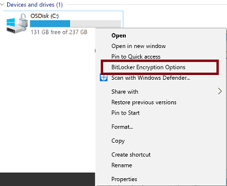

<properties
    pageTitle="为 Azure 导入/导出的导入作业准备硬盘驱动器 | Azure"
    description="了解如何使用 WAImportExport 工具准备硬盘驱动器，以便为 Azure 导入/导出服务创建导入作业。"
    author="muralikk"
    manager="syadav"
    editor="tysonn"
    services="storage"
    documentationcenter="" />
<tags
    ms.assetid=""
    ms.service="storage"
    ms.workload="storage"
    ms.tgt_pltfrm="na"
    ms.devlang="na"
    ms.topic="article"
    ms.date="04/21/2017"
    wacn.date="05/31/2017"
    ms.author="muralikk"
    ms.translationtype="Human Translation"
    ms.sourcegitcommit="4a18b6116e37e365e2d4c4e2d144d7588310292e"
    ms.openlocfilehash="523dee7701b20cf3bf5d85cf2bbf6c9319571125"
    ms.contentlocale="zh-cn"
    ms.lasthandoff="05/19/2017" />

# 为导入作业准备硬盘驱动器

WAImportExport 工具是可与 [Azure 导入/导出服务](/documentation/articles/storage-import-export-service/)一起使用的驱动器准备和修复工具。可以使用此工具将数据复制到要寄送给 Azure 数据中心的硬盘驱动器。完成某个导入作业后，可以使用此工具修复已损坏、丢失或与其他 Blob 冲突的任何 Blob。获得已完成导出作业的驱动器后，可以使用此工具修复这些驱动器上已损坏或丢失的任何文件。本文讲解此工具的工作原理。

## 先决条件

### WAImportExport.exe 的先决条件

- **计算机配置**
  - Windows 7、Windows Server 2008 R2 或更新版本的 Windows 操作系统
  - 必须安装 .NET Framework 4。有关如何检查计算机上是否已安装 .Net Framework，请参阅[常见问题](#faq)。
- **存储帐户密钥** - 需要存储帐户的至少一个帐户密钥。

### 为导入作业准备磁盘

- **BitLocker** - 必须在运行 WAImportExport 工具的计算机上启用 BitLocker。 有关如何启用 BitLocker，请参阅 [常见问题](#faq)
- **磁盘** 。 有关磁盘规格，请参阅 [常见问题](#faq) 。
- **源文件** - 打算导入的文件必须可从复制计算机访问，无论这些文件是位于网络共享还是本地硬盘驱动器上。

### 修复部分失败的导入作业

- Azure 导入/导出服务在存储帐户与磁盘之间复制数据时生成的副本日志文件。 该文件位于目标存储帐户中。

### 修复部分失败的导出作业

- Azure 导入/导出服务在存储帐户与磁盘之间复制数据时生成的副本日志文件。 该文件位于源存储帐户中。
- 清单文件 - [可选] 位于 21 VNET 返回的已导出驱动器中。

## 下载并安装 WAImportExport

下载[最新版本的 WAImportExport.exe](https://www.microsoft.com/download/details.aspx?id=42659)。 将压缩文件的内容解压缩到计算机上的某个目录。

下一个任务是创建 CSV 文件。

## 准备 dataset CSV 文件

### 什么是 dataset CSV

dataset CSV 文件是包含可复制到目标驱动器的目录列表和/或列表文件的 CSV 文件。 创建导入作业的第一步是，确定要导入的目录和文件。 可以是目录列表、独特文件的列表或这两者的组合。 包含某个目录时，该目录及其子目录中的所有文件都将成为导入作业的一部分。

对于要导入的每个目录或文件，需要在 Azure Blob 服务中指定一个目标虚拟目录或 Blob。 这些目标将用作 WAImportExport 工具的输入。 请注意，目录应使用正斜杠字符“/”来分隔。

下表显示了 Blob 目标的一些示例：

| 源文件或目录 | 目标 Blob 或虚拟目录 |
| --- | --- |
| H:\\Video | https://mystorageaccount.blob.core.chinacloudapi.cn/video |
| H:\\Photo | https://mystorageaccount.blob.core.chinacloudapi.cn/photo |
| K:\\Temp\\FavoriteVideo.ISO | https://mystorageaccount.blob.core.chinacloudapi.cn/favorite/FavoriteVideo.ISO |
| \\myshare\\john\\music | https://mystorageaccount.blob.core.chinacloudapi.cn/music |

### 示例 dataset.csv

	BasePath,DstBlobPathOrPrefix,BlobType,Disposition,MetadataFile,PropertiesFile
	"F:\50M_original\100M_1.csv.txt","containername/100M_1.csv.txt",BlockBlob,rename,"None",None
	"F:\50M_original","containername/",BlockBlob,rename,"None",None

### dataset CSV 文件字段

| 字段 | 说明 |
| --- | --- |
| BasePath | 
**[必需]**

此参数的值表示导入数据的源的所在位置。此工具将以递归方式复制位于此路径下的所有数据。

**允许的值**：这必须是本地计算机上的有效路径或者是有效的共享路径，并且应可以供用户访问。目录路径必须是绝对路径（而不是相对路径）。如果路径以“\\”结尾，则表示目录；如果路径不以“\\”结尾，则表示文件。

不允许在此字段中指定正则表达式。如果路径中包含空格，请用引号将其引起来。

**示例**："c:\\Directory\\c\\Directory\\File.txt" "\\\FBaseFilesharePath.domain.net\\sharename\\directory 1" |
| DstBlobPathOrPrefix | 
**[必需]**

 Azure 存储帐户中目标虚拟目录的路径。虚拟目录可能存在，也可能不存在。如果不存在，则导入/导出服务会创建一个目录。

在指定目标虚拟目录或 blob 时，请确保使用有效的容器名称。请记住，容器名称必须是小写的。有关容器命名规则，请参阅 [命名和引用容器、Blob 与元数据](https://docs.microsoft.com/zh-cn/rest/api/storageservices/naming-and-referencing-containers--blobs--and-metadata)。如果只指定了根目录，则会在目标 Blob 容器中复制源的目录结构。如果所需的目录结构不同于源的目录结构，可在 CSV 中包含多个映射行

可指定容器，或类似于 music/70s/ 的 blob 前缀。目标目录必须以容器名称开头，后接正斜杠“/”，并且可以选择包含以“/”结尾的虚拟 blob 目录。

当目标容器为根容器时，必须显式指定包含正斜杠的根容器，例如 $root/。由于根容器下的 blob 名称中不能包含“/”，因此当目标目录为根容器时，将不会复制源目录中的任何子目录。

**示例**

如果目标 blob 路径是 https://mystorageaccount.blob.core.chinacloudapi.cn/video，则此字段的值可以为 video
 |
| /BlobType | 
**[可选]** block \| page

导入/导出服务当前支持 2 种 blob：页 blob 和块 blob。默认情况下，所有文件将以块 blob 的形式导入。*.vhd 和 *.vhdx 将以页 blob 的形式导入。块 blob 和页 blob 允许的大小有一定限制。有关详细信息，请参阅 [存储可伸缩目标](/documentation/articles/storage-scalability-targets/#scalability-targets-for-blobs-queues-tables-and-files)。
 |
| Disposition | 
**[可选]** rename \| no-overwrite \| overwrite 

此字段指定导入期间（也就是将数据从磁盘上载到存储帐户时）的复制行为。可用选项为：rename\|overwite\|no-overwrite.。如果未指定任何值，则默认为“rename”。

**Rename**：如果存在同名的对象，则在目标中创建一个副本。

Overwrite：将文件覆盖为较新的文件。最后修改的文件优先。

**No-overwrite**：如果文件已存在，则跳过写入该文件。
|
| MetadataFile | 
**[可选]**

此字段的值是用户需要保留对象的元数据或者提供自定义元数据时可提供的元数据文件。目标 Blob 的元数据文件的路径。有关详细信息，请参阅[导入/导出服务元数据和属性文件格式](/documentation/articles/storage-import-export-file-format-metadata-and-properties/)
 |
| PropertiesFile | 
**[可选]**

目标 Blob 的属性文件的路径。有关详细信息，请参阅[导入/导出服务元数据和属性文件格式](/documentation/articles/storage-import-export-file-format-metadata-and-properties/)。
 |

## 准备 InitialDriveSet 或 AdditionalDriveSet CSV 文件

### 什么是 DriveSet CSV

/InitialDriveSet 或 /AdditionalDriveSet 标志的值是一个 CSV 文件，其中包含要将驱动器号映射到的磁盘的列表，以便工具可以正确选择要准备的磁盘。如果数据大小大于单个磁盘的大小，WAImportExport 工具将以优化方式在此 CSV 文件中所列的多个磁盘之间分配数据。

在单个会话中用于写入数据的磁盘没有数量限制。工具会根据磁盘大小和文件夹大小分配数据。它会选择对于对象大小最有利的磁盘。数据上载到存储帐户时，将融合回到 dataset 文件中指定的目录结构。若要创建驱动器集 CSV，请遵循以下步骤。

### 创建基本卷并分配驱动器号

若要创建基本卷并分配驱动器号，请遵照 [Overview of Disk Management](https://technet.microsoft.com/zh-cn/library/cc754936.aspx)（磁盘管理概述）中提供的有关“创建简单分区”的说明。

### 示例 InitialDriveSet 和 AdditionalDriveSet CSV 文件

	DriveLetter,FormatOption,SilentOrPromptOnFormat,Encryption,ExistingBitLockerKey
	G,AlreadyFormatted,SilentMode,AlreadyEncrypted,060456-014509-132033-080300-252615-584177-672089-411631
	H,Format,SilentMode,Encrypt,

### DriveSet CSV 文件字段

| 字段 | 值 |
| --- | --- |
| DriveLetter | 
**[必需]**

作为目标提供给工具的每个驱动器上需有一个简单的 NTFS 卷，并分配有一个驱动器号。
 
**示例**：R 或 r
|
| FormatOption | 
**[必需]** Format \| AlreadyFormatted

**Format**：如指定此值，将格式化磁盘上的所有数据。

**AlreadyFormatted**：如果指定此值，工具将跳过格式化。
|
| SilentOrPromptOnFormat | 
**[必需]** SilentMode \| PromptOnFormat

**SilentMode**：提供此值可让用户以无提示模式运行该工具。

**PromptOnFormat**：该工具在每次格式化时都将提示用户确认是否确实希望执行此操作。

如果未设置，则命令将中止并提示错误消息：“SilentOrPromptOnFormat 的值不正确: 无”
|
| Encryption | 
**[必需]**Encrypt \| AlreadyEncrypted

此字段的值确定加密和不加密的磁盘。

**Encrypt**：工具将格式化驱动器。如果“FormatOption”字段的值为“Format”，则此字段的值必须是“Encrypt”。如果在此情况下指定了“AlreadyEncrypted”，则会导致错误“指定‘Format’时，也必须指定‘Encrypt’”。

**AlreadyEncrypted**：工具将使用“ExistingBitLockerKey”字段中提供的 BitLockerKey 来加密驱动器。如果“FormatOption”字段的值为“AlreadyFormatted”，则此字段的值可以是“Encrypt”或“AlreadyEncrypted”
|
| ExistingBitLockerKey | 
**[必需]**（如果“Encryption”字段的值为“AlreadyEncrypted”）

此字段的值是与特定磁盘关联的 BitLocker 密钥。

如果“Encryption”字段的值为“Encrypt”，应将此字段留空。如果在这种情况下指定 BitLocker 密钥，将导致错误“不应指定 Bitlocker 密钥”。

 **示例**：060456-014509-132033-080300-252615-584177-672089-411631
|

##  为导入作业准备磁盘

若要为导入作业准备驱动器，请使用 **PrepImport** 命令调用 WAImportExport 工具。要包含的参数取决于这是第一个复制会话还是后续复制会话。

### 第一个会话

将单个/多个目录复制到单个/多个磁盘（取决于在 CSV 文件中指定的内容）的第一个复制会话。可以使用 PrepImport 命令调用 WAImportExport 工具，在第一个复制会话中使用一个新的复制会话来复制目录和/或文件：

	WAImportExport.exe PrepImport /j:<JournalFile> /id:<SessionId> [/logdir:<LogDirectory>] [/sk:<StorageAccountKey>] [/silentmode] [/InitialDriveSet:<driveset.csv>] DataSet:<dataset.csv>

**示例：**

	WAImportExport.exe PrepImport /j:JournalTest.jrn /id:session#1  /sk:************* /InitialDriveSet:driveset-1.csv /DataSet:dataset-1.csv /logdir:F:\logs

### 在后续会话中添加数据

在后续复制会话中，无需指定初始参数。需要使用相同的日记文件，使工具能够记住上一会话的暂停位置。复制会话的状态将写入日记文件。下面是用于复制更多目录和/或文件的后续复制会话的语法：

	WAImportExport.exe PrepImport /j:<SameJournalFile> /id:<DifferentSessionId>  [DataSet:<differentdataset.csv>]

**示例：**

	WAImportExport.exe PrepImport /j:JournalTest.jrn /id:session#2  /DataSet:dataset-2.csv

### 将驱动器添加到最新的会话

如果数据无法放入 InitialDriveset 中指定的驱动器，可以使用该工具将其他驱动器添加到同一个复制会话。

>[AZURE.NOTE] 
>会话 ID 应与上一个会话 ID 匹配。 日记文件应与上一个会话中指定的文件匹配。
>

	WAImportExport.exe PrepImport /j:<SameJournalFile> /id:<SameSessionId> /AdditionalDriveSet:<newdriveset.csv>

**示例：**

	WAImportExport.exe PrepImport /j:SameJournalTest.jrn /id:session#2  /AdditionalDriveSet:driveset-2.csv

### 中止最新会话：

如果复制会话已中断且无法恢复（例如，如果源目录被证实不可访问），则必须中止当前会话，使其可以回滚并启动新的复制会话：

	WAImportExport.exe PrepImport /j:<SameJournalFile> /id:<SameSessionId> /AbortSession

**示例：**

	WAImportExport.exe PrepImport /j:JournalTest.jrn /id:session#2  /AbortSession

如果异常终止，则只能中止最后的复制会话。 请注意，无法中止驱动器的第一个复制会话。 在此情况下，必须重新启动包含新日记文件的复制会话。

### 恢复最近中断的会话

如果复制会话因任何原因导致中断，可通过在仅指定日记文件的情况下运行该工具来恢复会话：

	WAImportExport.exe PrepImport /j:<SameJournalFile> /id:<SameSessionId> /ResumeSession

**示例：**

	WAImportExport.exe PrepImport /j:JournalTest.jrn /id:session#2 /ResumeSession

> [AZURE.IMPORTANT] 
> 恢复复制会话时，请不要通过添加或删除文件来修改源数据文件和目录。

## WAImportExport 参数

| Parameters | 说明 |
| --- | --- |
| /j:&lt;JournalFile&gt; | 
**必需**

日记文件的路径。日记文件跟踪一组驱动器，并记录这些驱动器的准备进度。必须始终指定日记文件。
 |
| /logdir:&lt;LogDirectory&gt; | 
**可选**。日志目录。

 详细日志文件以及某些临时文件将写入此目录。如果未指定，则将当前目录用作日志目录。对于同一个日记文件，只能指定一次日志目录。
 |
| /id:&lt;SessionId&gt; | 
**必需**

用于标识复制会话的会话 ID。它用于确保准确恢复中断的复制会话。
 |
| /ResumeSession | 可选。如果最后一个复制会话异常终止，可以指定此参数来恢复该会话。 |
| /AbortSession | 可选。如果最后一个复制会话异常终止，可以指定此参数来中止该会话。 |
| /sn:&lt;StorageAccountName&gt; | 
**必需**

仅适用于 RepairImport 和 RepairExport。存储帐户的名称。
 |
| /sk:&lt;StorageAccountKey&gt; | 
**必需**

存储帐户的密钥。
|
| /InitialDriveSet:&lt;driveset.csv&gt; | 
**必需**（运行第一个复制会话时）

包含要准备的驱动器列表的 CSV 文件。
 |
| /AdditionalDriveSet:&lt;driveset.csv&gt; | 
**必需**。（将驱动器添加到当前复制会话时）。

包含要添加的其他驱动器列表的 CSV 文件。
 |
| /r:&lt;RepairFile&gt; | 
**必需**仅适用于 RepairImport 和 RepairExport。

 用于跟踪修复进度的文件的路径。每个驱动器都必须有且仅有一个修复文件。
 |
| /d:&lt;TargetDirectories&gt; | **必需**。仅适用于 RepairImport 和 RepairExport。对于 RepairImport，值为要修复的一个或多个以分号分隔的目录；对于 RepairExport，值为要修复的一个目录，例如驱动器的根目录。 |
| /CopyLogFile:&lt;DriveCopyLogFile&gt; | **必需**仅适用于 RepairImport 和 RepairExport。驱动器复制日志文件（详细或错误）的路径。 |
| /ManifestFile:&lt;DriveManifestFile&gt; | 
**必需**仅适用于 RepairExport。

 驱动器清单文件的路径。
 |
| /PathMapFile:&lt;DrivePathMapFile&gt; | 
**可选**。仅适用于 RepairImport。

 包含驱动器根目录相对路径与实际文件位置之间的映射的文件（制表符分隔）的路径。首次指定时，该字段中将填充目标为空的文件路径，也就是说，在 TargetDirectories 中找不到目录、访问目标被拒绝、名称无效，或者目标在多个目录中存在。可以手动编辑路径映射文件来包含正确的目标路径，然后再次为工具指定该文件，以正确解析文件路径。
 |
| /ExportBlobListFile:&lt;ExportBlobListFile&gt; | 
**必需**。仅适用于 PreviewExport。

 包含要导出的 Blob 的 Blob 路径列表或 Blob 路径前缀的 XML 文件的路径。文件格式与导入/导出服务 REST API 的“放置作业”操作中的 Blob 列表 Blob 格式相同。
 |
| /DriveSize:&lt;DriveSize&gt; | 
**必需**。仅适用于 PreviewExport。

 导出操作所需的驱动器大小。例如，500GB、1.5TB。注意：1GB = 1,000,000,000 字节，1TB = 1,000,000,000,000 字节
 |
| /DataSet:&lt;dataset.csv&gt; | 
**必需**

CSV 文件，包含要复制到目标驱动器的目录列表和/或列表文件。
 |
| /silentmode | 
**可选**。

 如果未指定，系统会提醒驱动器的要求，并且需要确认才能继续操作。
 |

## 工具输出

### 示例驱动器清单文件

	<?xml version="1.0" encoding="UTF-8"?>
	<DriveManifest Version="2011-MM-DD">
	   <Drive>
	      <DriveId>drive-id</DriveId>
	      <StorageAccountKey>storage-account-key</StorageAccountKey>
	      <ClientCreator>client-creator</ClientCreator>
	      <!-- First Blob List -->
	      <BlobList Id="session#1-0">
	         <!-- Global properties and metadata that applies to all blobs -->
	         <MetadataPath Hash="md5-hash">global-metadata-file-path</MetadataPath>
	         <PropertiesPath Hash="md5-hash">global-properties-file-path</PropertiesPath>
	         <!-- First Blob -->
	         <Blob>
	            <BlobPath>blob-path-relative-to-account</BlobPath>
	            <FilePath>file-path-relative-to-transfer-disk</FilePath>
	            <ClientData>client-data</ClientData>
	            <Length>content-length</Length>
	            <ImportDisposition>import-disposition</ImportDisposition>
	            <!-- page-range-list-or-block-list -->
	            <!-- page-range-list -->
	            <PageRangeList>
	               <PageRange Offset="1073741824" Length="512" Hash="md5-hash" />
	               <PageRange Offset="1073741824" Length="512" Hash="md5-hash" />
	            </PageRangeList>
	            <!-- block-list -->
	            <BlockList>
	               <Block Offset="1073741824" Length="4194304" Id="block-id" Hash="md5-hash" />
	               <Block Offset="1073741824" Length="4194304" Id="block-id" Hash="md5-hash" />
	            </BlockList>
	            <MetadataPath Hash="md5-hash">metadata-file-path</MetadataPath>
	            <PropertiesPath Hash="md5-hash">properties-file-path</PropertiesPath>
	         </Blob>
	      </BlobList>
	   </Drive>
	</DriveManifest>

### 每个驱动器的示例日记文件 (XML)

	[BeginUpdateRecord][2016/11/01 21:22:25.379][Type:ActivityRecord]
	ActivityId: DriveInfo
	DriveState: [BeginValue]
	<?xml version="1.0" encoding="UTF-8"?>
	<Drive>
	   <DriveId>drive-id</DriveId>
	   <BitLockerKey>*******</BitLockerKey>
	   <ManifestFile>\DriveManifest.xml</ManifestFile>
	   <ManifestHash>D863FE44F861AE0DA4DCEAEEFFCCCE68</ManifestHash> </Drive>
	[EndValue]
	SaveCommandOutput: Completed
	[EndUpdateRecord]

### 会话的示例日记文件 (JRN)，该文件用于记录会话跟踪

	[BeginUpdateRecord][2016/11/02 18:24:14.735][Type:NewJournalFile]
	VocabularyVersion: 2013-02-01
	[EndUpdateRecord]
	[BeginUpdateRecord][2016/11/02 18:24:14.749][Type:ActivityRecord]
	ActivityId: PrepImportDriveCommandContext
	LogDirectory: F:\logs
	[EndUpdateRecord]
	[BeginUpdateRecord][2016/11/02 18:24:14.754][Type:ActivityRecord]
	ActivityId: PrepImportDriveCommandContext
	StorageAccountKey: *******
	[EndUpdateRecord]

## 常见问题

### 常规

#### WAImportExport 工具是什么？

WAImportExport 工具是可与 Azure 导入/导出服务一起使用的驱动器准备和修复工具。可以使用此工具将数据复制到要寄送给 Azure 数据中心的硬盘驱动器。完成某个导入作业后，可以使用此工具修复已损坏、丢失或与其他 Blob 冲突的任何 Blob。获得已完成导出作业的驱动器后，可以使用此工具修复这些驱动器上已损坏或丢失的任何文件。

#### WAImportExport 工具如何在多个源目录和磁盘中工作？

如果数据大小大于磁盘大小，WAImportExport 工具将以优化方式在磁盘之间分配数据。到多个磁盘的数据复制可以并行或者按顺序执行。可同时将数据写入到磁盘数量没有限制。工具会根据磁盘大小和文件夹大小分配数据。它会选择对于对象大小最有利的磁盘。数据上载到存储帐户时，将融合回到指定的目录结构。

#### 在哪里可以找到上一个版本的 WAImportExport 工具？

WAImportExport 工具包含 WAImportExport V1 工具所提供的全部功能。 用户可以使用 WAImportExport 工具指定多个源以及写入多个驱动器。 此外，用户可以在单个 CSV 文件中轻松管理要复制的数据的多个源位置。 但是，如果需要 SAS 支持或者要将单个源复制到单个磁盘，可以 [下载 WAImportExport V1 工具] (http://go.microsoft.com/fwlink/?LinkID=301900&amp;clcid=0x409) 并参阅 [WAImportExport V1 Reference](/documentation/articles/storage-import-export-tool-how-to-v1/)（WAImportExport V1 参考），获取 WAImportExport V1 用法的帮助。

#### 会话 ID 是什么？

如果用户的意图是将数据分散到多个磁盘，WAImportExport 工具要求复制会话 (/id) 参数相同。保留相同的复制会话名称可让用户将数据从一个或多个源位置复制到一个或多个目标磁盘/目录。保留相同的会话 ID 可让工具从上次的暂停位置选择文件副本。

但是，不能使用相同的复制会话将数据导入不同的存储帐户。

如果多次运行工具后复制会话名称相同，则日志文件 (/logdir) 和存储帐户密钥 (/sk) 也应会相同。

SessionId 可以包含字母、0~9、下划线 (\_)、短划线 (-) 或井号 (#)，长度必须为 3~30 个字符。

例如，session-1、session#1 或 session\_1

#### 日记文件是什么？

每次运行 WAImportExport 工具将文件复制到硬盘驱动器时，该工具会创建一个复制会话。复制会话的状态将写入日记文件。如果某个复制会话中断（例如，由于系统电源中断），可以通过重新运行该工具并在命令行上指定日记文件来恢复该复制会话。

对于使用 Azure 导入/导出工具准备的每个硬盘驱动器，该工具将创建一个日记文件，文件名为“&lt;DriveID&gt;.xml”，其中，DriveID 是与该工具从磁盘读取的驱动器关联的序列号。需要使用所有驱动器中的日记文件创建导入作业。在工具中断的情况下，还可使用日记文件来恢复驱动器准备操作。

#### 日志目录是什么？

日志目录指定用于存储详细日志和临时清单文件的目录。如果未指定，则使用当前目录作为日志目录。日志为详细日志。

### 先决条件

#### 磁盘的规格是什么？

一个或多个已连接到复制计算机的空 2.5/3.5 英寸 SATA II、III 或 SSD 硬盘驱动器。

#### 如何在计算机上启用 BitLocker？

一种简单的检查方法是右键单击系统驱动器。如果已启用该功能，则会显示 Bitlocker 的相关选项。如果该功能处于禁用状态，则不会显示 Bitlocker。

  

有关如何启用 BitLocker 的信息，请参阅[此文](https://technet.microsoft.com/zh-cn/library/cc766295.aspx)

有可能你的计算机不带 tpm 芯片。如果使用 tpm.msc 未返回任何输出，请查看下一条常见问题。

#### 如何在 BitLocker 中禁用受信任的平台模块 (TPM)？
> [AZURE.NOTE]
> 仅当服务器中没有 TPM 时，才需要禁用 TPM 策略。如果用户的服务器中有受信任的 TPM，则不需要禁用 TPM。 
> 

若要在 BitLocker 中禁用 TPM，请执行以下步骤：

1. 在命令提示符下键入 gpedit.msc，启动组策略编辑器。  如果“组策略编辑器”不可用，请先启用 BitLocker。 请参阅上一个常见问题解答。
2. 打开“本地计算机策略”&gt;“计算机配置”&gt;“管理模板”&gt;“Windows 组件”&gt;“BitLocker 驱动器加密”&gt;“操作系统驱动器”。
3. 编辑“启动时需要附加身份验证”策略。
4. 将该策略设置为“启用”，并确保已选中“没有兼容的 TPM 时允许 BitLocker”。

####  如何检查计算机上是否已安装 .NET 4 或更高版本？

所有 Microsoft .NET Framework 版本都安装在以下目录：%windir%\Microsoft.NET\Framework\

请在要运行该工具的目标计算机上导航到上述位置。 查找以“v4”开头的文件夹名称。 如果不存在这种目录，则表示计算机上未安装 .NET 4。 可以使用 [Microsoft .NET Framework 4（Web 安装程序）](https://www.microsoft.com/download/details.aspx?id=17851)在计算机上下载 .Net 4。

### 限制

#### 可以同时准备/发送多少个驱动器？

工具可准备的磁盘数量没有限制。但是，工具要求使用驱动器号作为输入。这会将同时准备的磁盘数限制为 25 个。一个作业每次最多可以处理 10 个磁盘。如果针对同一个存储帐户准备 10 个以上的磁盘，可将这些磁盘的准备分散在多个作业中。

#### 是否可以针对多个存储帐户准备磁盘？

在一个复制会话中，每个作业只能提交一个存储帐户。

### 功能

#### WAImportExport.exe 是否会加密数据？

是的。BitLocker 加密已启用，在此过程中需要用到。

#### 数据显示在存储帐户中时会采用哪种层次结构？

尽管数据分散在多个磁盘之间，但数据上载到存储帐户时，将融合回到 dataset CSV 文件中指定的目录结构。

#### 复制正在进行时，有多少个输入磁盘会并行发生活动 IO？

WAImportExport 工具根据输入文件的大小在输入磁盘之间分配数据。然而，并行的活动磁盘数完全取决于输入数据的性质。根据输入数据集中各个文件的大小，可能有一个或多个磁盘出现并行活动 IO。有关详细信息，请参阅下一条常见问题。

#### 工具如何在磁盘之间分配文件？

WAImportExport 工具逐批读取和写入文件，每个批最多包含 100000 个文件。也就是说，最多可以并行写入 100000 个文件。如果将这 100000 个文件分配到多个驱动器，则会同时写入多个磁盘。但是，工具是同时写入多个磁盘还是写入单个磁盘，则取决于批的累积大小。例如，在处理小型文件时，如果这 100000 个文件全部能够装入一个驱动器，则处理此批期间，工具只写入一个磁盘。

### WAImportExport 输出

#### 有两个日记文件，应将哪一个上传到 Azure 门户？

**.xml** - 对于使用 WAImportExport 工具准备的每个硬盘驱动器，该工具将创建一个日记文件，文件名为“&lt;DriveID&gt;.xml”，其中，DriveID 是与该工具从磁盘读取的驱动器关联的序列号。在 Azure 门户中创建导入作业时，需要使用所有驱动器中的日记文件。在工具中断的情况下，还可使用此日记文件来恢复驱动器准备操作。

**.jrn** - 带 .jrn 后缀的日志文件，包含硬盘驱动器的所有复制会话的状态。它还包含创建导入作业所需的信息。运行 WAImportExport 工具时，始终必须指定一个日志文件，以及一个复制会话 ID。

## 后续步骤

* [设置 Azure 导入/导出工具](/documentation/articles/storage-import-export-tool-setup/)
* [在导入过程中设置属性和元数据](/documentation/articles/storage-import-export-tool-setting-properties-metadata-import/)
* [为导入作业准备硬盘驱动器的示例工作流](/documentation/articles/storage-import-export-tool-sample-preparing-hard-drives-import-job-workflow/)
* [常用命令快速参考](/documentation/articles/storage-import-export-tool-quick-reference/) 
* [使用复制日志文件查看作业状态](/documentation/articles/storage-import-export-tool-reviewing-job-status-v1/)
* [修复导入作业](/documentation/articles/storage-import-export-tool-repairing-an-import-job-v1/)
* [修复导出作业](/documentation/articles/storage-import-export-tool-repairing-an-export-job-v1/)
* [排查 Azure 导入/导出工具问题](/documentation/articles/storage-import-export-tool-troubleshooting-v1/)
<!--Update_Description:wording update;add anchors to subtitles;add next step reference links-->