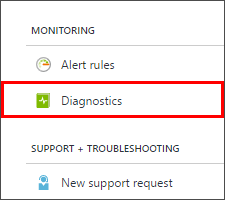
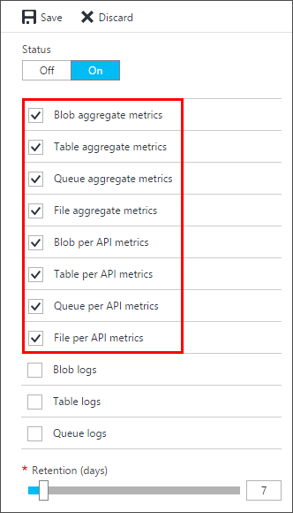
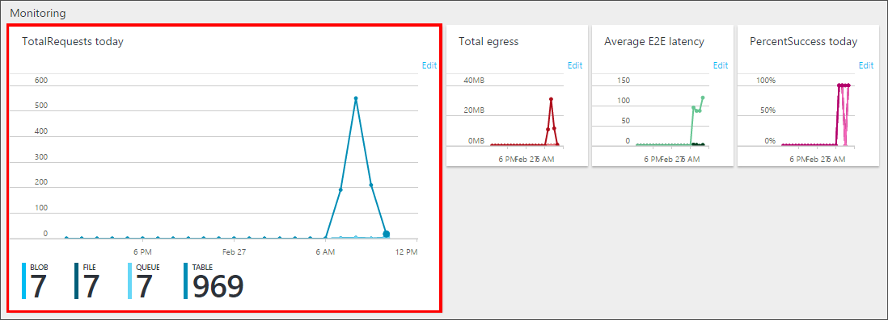
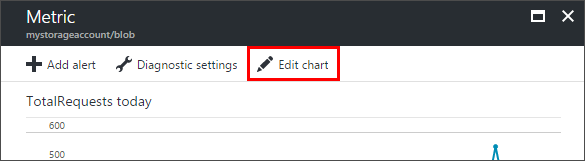
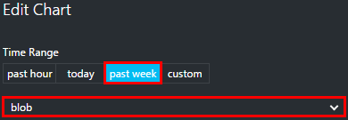
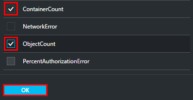
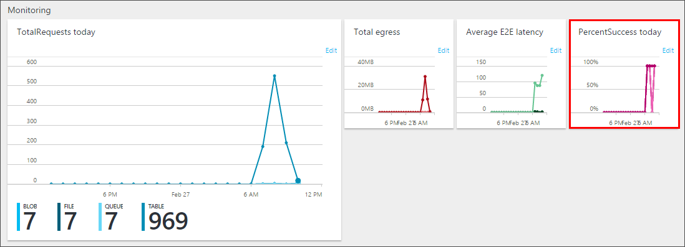
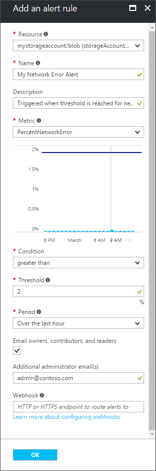
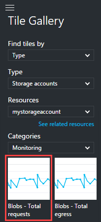
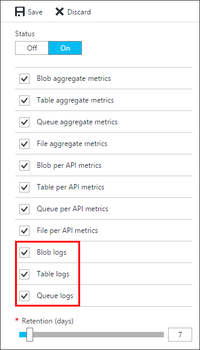

<properties
    pageTitle="如何监视存储帐户 | Azure"
    description="了解如何使用 Azure 门户预览在 Azure 中监视存储帐户。"
    services="storage"
    documentationcenter=""
    author="mmacy"
    manager="timlt"
    editor="tysonn" />
<tags
    ms.assetid="b83cba7b-4627-4ba7-b5d0-f1039fe30e78"
    ms.service="storage"
    ms.workload="storage"
    ms.tgt_pltfrm="na"
    ms.devlang="na"
    ms.topic="article"
    ms.date="03/14/2017"
    wacn.date="03/28/2017"
    ms.author="marsma" />

# 监视 Azure 门户预览中的存储帐户

[Azure 存储分析](/documentation/articles/storage-analytics/)提供所有存储服务的指标，以及 Blob、队列和表的日志。可以使用 [Azure 门户预览](https://portal.azure.cn)来配置要为帐户记录哪些指标和日志，并配置图表来提供指标数据的可视表示形式。

> [AZURE.NOTE]
>
在 Azure 门户预览中检查监视数据会产生相关的费用。有关详细信息，请参阅[存储分析和计费](https://docs.microsoft.com/rest/api/storageservices/fileservices/Storage-Analytics-and-Billing)。
Azure 文件存储目前支持存储分析指标，但尚不支持日志记录。
> 有关使用存储分析及其他工具来识别、诊断和排查 Azure 存储相关问题的深入指导，请参阅[监视、诊断和排查 Azure 存储问题](/documentation/articles/storage-monitoring-diagnosing-troubleshooting/)。
>

## 为存储帐户配置监视

1. 在 [Azure 门户预览](https://portal.azure.cn)中选择“存储帐户”，然后单击存储帐户名称打开帐户仪表板。
1. 在菜单边栏选项卡的“监视”部分选择“诊断”。

      

1. 选择要监视的每个**服务**的指标数据**类型**，以及数据的**保留策略**。还可以通过将“状态”设置为“关闭”来禁用监视。

      

   可为每个服务启用两种类型的指标，新存储帐户默认已启用这两种指标：

   * **聚合**：收集入口/出口、可用性、延迟和成功百分比等指标。系统将聚合 Blob、队列、表和文件服务的这些指标。
   * **按 API**：除了聚合指标以外，还在 Azure 存储服务 API 中为每项存储操作收集一组相同的指标。

   若要设置数据保留策略，请移动“保留期(天)”滑块，或输入数据的保留天数（1 到 365 天）。新存储帐户的默认保留期为 7 天。如果不需要设置保留策略，请输入零。如果没有保留策略，则由用户自行决定是否删除监视数据。

   > [AZURE.WARNING] 
   手动删除指标数据会产生费用。陈旧的分析数据（超过保留策略的数据）将被系统删除，不会产生费用。建议根据要将帐户的存储分析数据保留多长时间来设置保留策略。有关详细信息，请参阅[启用存储指标时需要支付多少费用？](/documentation/articles/storage-enable-and-view-metrics/#what-charges-do-you-incur-when-you-enable-storage-metrics)
   >

1. 完成监视配置后，选择“保存”。

随后，一组默认的指标将显示在存储帐户边栏选项卡上的图表中，以及各个服务边栏选项卡（Blob、队列、表和文件）中。启用服务的指标后，最长可能需要一小时，数据才会显示在其图表中。可以在任一指标图表中选择“编辑”，[配置](#how-to-customize-metrics-charts)要在图表中显示哪些指标。

将“状态”设置为“关闭”可以禁用指标收集和日志记录。

> [AZURE.NOTE] 
Azure 存储使用[表存储](/documentation/articles/storage-introduction/#table-storage)来存储存储帐户的指标，将指标存储在帐户中的表内。有关详细信息，请参阅：[指标的存储方式](/documentation/articles/storage-analytics/#how-metrics-are-stored)
>

## 自定义指标图表

使用以下过程选择要在指标图表中查看哪些存储指标。

1. 首先在 Azure 门户预览中显示存储指标图表。可以在**存储帐户边栏选项卡**以及各个服务（Blob、队列、表和文件）的“指标”边栏选项卡中找到图表。

   本示例使用**存储帐户边栏选项卡**中显示的以下图表：

     

1. 接下来，单击图表中的任意位置打开“指标”边栏选项卡。选择“编辑图表”打开“编辑图表”边栏选项卡。

     

1. 在“编辑图表”边栏选项卡中，选择要在图表中显示的指标“时间范围”，以及要显示其指标的**服务**（Blob、队列、表或文件）。此处，我们已选择要显示 Blob 服务在过去一周的指标：

     

1. 选择要在图表中显示的各个**指标**，然后单击“确定”。例如，此处我们已选择显示 *ContainerCount* 和 *ObjectCount* 指标：

     

图表设置不会影响存储帐户中监视数据的收集、聚合或存储，而只会影响指标数据的显示。

### 图表中可用的指标

可用指标列表根据在下拉列表中选择的服务，以及要编辑的图表单位类型而异。例如，仅当所要编辑的图表显示百分比单位时，才能选择 *PercentNetworkError* 和 *PercentThrottlingError* 等百分比指标：

  

### 指标解析

在“诊断”中选择的指标决定了可用于帐户的指标的解析：

* “聚合”监视提供入口/出口、可用性、延迟和成功百分比等指标。系统将从 Blob、表、文件和队列服务聚合这些指标。
* “按 API”除了提供服务级别的聚合外，还提供更精细的解析，包括可用于单个存储操作的指标。

## 配置指标警报

可以创建警报，以便在达到存储资源指标的阈值时收到通知。

1. 若要打开“警报规则”边栏选项卡，请向下滚动到“菜单”边栏选项卡的“监视”部分，然后选择“警报规则”。
1. 选择“添加警报”打开“添加警报规则”边栏选项卡
1. 从下拉列表中选择一个**资源**（Blob、文件、队列或表），然后输入新警报规则的**名称**和**说明**。
1. 选择要为其添加警报的**指标**，以及警报**条件**和**阈值**。阈值单位类型根据所选的指标而异。例如，“计数”是 *ContainerCount* 的单位类型，而 *PercentNetworkError* 指标的单位是百分比。
1. 选择“时间段”。在该时间段内达到或超过阈值的指标将触发警报。
1. （可选）配置“电子邮件”和“Webhook”通知。有关 Webhook 的详细信息，请参阅[针对 Azure 指标警报配置 Webhook](/documentation/articles/insights-webhooks-alerts/)。如果未配置电子邮件或 Webhook 通知，警报只会显示在 Azure 门户预览中。

  

## 将指标图表添加到门户仪表板

可将任何存储帐户的 Azure 存储指标图表添加到门户仪表板。

1. 在 [Azure 门户预览](https://portal.azure.cn)中查看仪表板的同时单击“编辑仪表板”。
1. 在“磁贴库”中，选择“查找磁贴，依据”>“类型”。
1. 选择“类型”>“存储帐户”。
1. 在“资源”中，选择要将其指标添加到仪表板的存储帐户。
1. 选择“类别”>“监视”。
1. 将图表磁贴拖放到要显示的指标所在的仪表板中。针对要在仪表板上显示的所有指标重复上述步骤。在下图中，为了方便演示，已突出显示“Blob - 请求总数”图表，但可将所有图表放置在仪表板上。

     

1. 添加完图表后，请选择仪表板顶部附近的“完成自定义”。

将图表添加到仪表板后，可以根据[自定义指标图表](#how-to-customize-metrics-charts)中所述进一步自定义这些图表。

## 配置日志记录

可以指示 Azure 存储保存针对 Blob、表和队列服务发出的读取、写入和删除请求的诊断日志。设置的数据保留策略也适用于这些日志。

> [AZURE.NOTE] Azure 文件存储目前支持存储分析指标，但尚不支持日志记录。
>

1. 在 [Azure 门户预览](https://portal.azure.cn)中选择“存储帐户”，然后单击存储帐户的名称打开存储帐户边栏选项卡。
1. 在菜单边栏选项卡的“监视”部分选择“诊断”。

      

    
1. 确保“状态”设置为“打开”，选择要为其启用日志记录的**服务**。

      

1. 单击“保存”。

诊断日志保存在存储帐户下名为 $logs 的 Blob 容器中。可以使用 [Microsoft 存储资源管理器](http://storageexplorer.com)等存储资源管理器，或者使用存储客户端库或 PowerShell 以编程方式来查看日志数据。

有关访问 $logs 容器的信息，请参阅[启用存储日志记录和访问日志数据](https://docs.microsoft.com/rest/api/storageservices/fileservices/enabling-storage-logging-and-accessing-log-data)。

## 后续步骤

* 了解有关存储分析的[指标、日志记录和计费](/documentation/articles/storage-analytics/)的详细信息。
* 使用 PowerShell 以及通过 C# 以编程方式[启用 Azure 存储指标和查看指标数据](/documentation/articles/storage-enable-and-view-metrics/)。

<!---HONumber=Mooncake_0327_2017-->
<!--Update_Description: whole content update to Ibizal portal-->