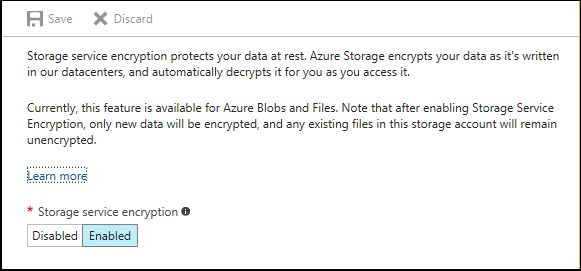

<properties
	pageTitle="静态数据的 Azure 存储空间服务加密（预览版）| Azure"
	description="使用 Azure 存储空间服务加密功能可在存储数据时在服务端加密 Azure Blob 存储，并在检索数据时解密数据。"
	services="storage"
	documentationCenter=".net"
	authors="robinsh"
	manager="carmonm"
	editor="tysonn"/>

<tags
	ms.service="storage"
	ms.date="08/03/2016"
	wacn.date="09/12/2016"/>

# 静态数据的 Azure 存储空间服务加密（预览版）

静态数据的 Azure 存储空间服务加密 (SSE) 可帮助你保护数据，使你的组织能够信守在安全性与合规性方面所做的承诺。使用此功能，Azure 存储空间可以先自动加密数据，再将数据保存到存储空间，并在检索之前解密数据。加密、解密和密钥管理对于用户而言是完全透明的。

以下部分提供有关如何使用存储服务加密功能的详细指导，以及支持的方案和用户体验。

## 概述

Azure 存储空间提供配套的安全性功能，这些功能相辅相成，可让开发人员共同构建安全的应用程序。在应用程序和 Azure 之间传输数据时，可以使用[客户端加密](/documentation/articles/storage-client-side-encryption/)、HTTPS 或 SMB 3.0 来保护数据。存储服务加密是 Azure 存储空间的新功能，在数据写入到 Azure 存储空间（支持块 Blob、页 Blob 和追加 Blob）时加密数据。可以针对使用 Azure Resource Manager 部署模型的新存储帐户启用此功能，并且此功能适用于所有冗余级别（LRS、GRS、RA-GRS）。存储服务加密适用于标准和高级存储，以完全透明的方式处理加密、解密和密钥管理。采用 256 位 [AES 加密](https://en.wikipedia.org/wiki/Advanced_Encryption_Standard)所有数据，它是现在最强有力的分组密码之一。以下“预览”部分详细说明了如何登记存储服务加密的预览程序。

此屏幕截图显示如何使用 [Azure 门户预览](https://portal.azure.cn)查找存储服务加密设置。在此屏幕上，单击“加密”以继续。

单击“加密”设置后，可以启用或禁用存储服务加密。

##可用性

对于标准存储，此功能当前可用于中国东部和中国北部。

对于高级存储，此功能当前可用于中国东部和中国北部。

##加密方案

可以在存储帐户级别启用存储服务加密。它支持以下客户方案：

-   块 Blob、追加 Blob 和页 Blob 的加密。

-   从本地移到 Azure 的存档 VHD 和模板的加密。

-   使用 VHD 创建的 IaaS VM 基础 OS 和数据磁盘的加密。

公开预览版具有以下限制：

-   不支持经典存储帐户的加密。

-   不支持迁移到 Resource Manager 存储帐户的经典存储帐户的加密。

-   现有数据 - SSE 只将加密启用加密之后新建的数据。例如，如果你创建新的 Resource Manager 存储帐户但未打开加密，然后将 blob 或存档 VHD 上传到该存储帐户，然后打开 SSE，则那些 Blob 不会被加密，除非重新写入或复制。

-   应用商店支持 - 针对使用（Azure 门户预览）[https://portal.azure.cn)、PowerShell 和 Azure CLI 从应用商店创建的 VM 启用加密。VHD 基本映像将保持未加密状态；但是，在 VM 启动之后完成的任何写入将会加密。

-   表、队列和文件数据将不会加密。

##预览

仅新创建的 Resource Manager 存储帐户支持此功能，经典存储帐户不支持。若要使用此新功能，必须使用 PowerShell cmdlet 注册你的订阅。批准你的订阅后，可以对已批准订阅下面的存储帐户启用 SSE。与大多数预览版一样，此功能在正式推出之前不应该用于生产工作负荷。你可以加入我们在 Yammer 上设立的存储服务加密预览组，提供有关体验的任何反馈。

### 注册预览版

-   [安装 Azure PowerShell cmdlet](/documentation/articles/powershell-install-configure/)。

-   在 Windows 10 中以管理员的身份打开 PowerShell。

-   注册存储资源提供程序命名空间。只需针对尚未注册到 SRP 的订阅执行此操作。

    `PS E:\> Register-AzureRmResourceProvider -ProviderNamespace "Microsoft.Storage" `

-   若要注册该功能，可以使用 Register-AzureRmProviderFeature PowerShell cmdlet。

    `Register-AzureRmProviderFeature -FeatureName "EncryptionAtRest" -ProviderNamespace "Microsoft.Storage"`

-   若要查询注册状态以查看订阅是否已批准，可以使用 Get-AzureRmProviderFeature PowerShell cmdlet。

    `Get-AzureRmProviderFeature -FeatureName "EncryptionAtRest" -ProviderNamespace "Microsoft.Storage"`

如果返回的注册状态为“Registered”，则表示你的订阅已批准。另请访问我们在 Yammer 上设立的 Azure 存储空间服务加密预览组。

##入门

###步骤 1：[注册预览版](#registering-for-preview)。

###步骤 2：[创建新存储帐户](/documentation/articles/storage-create-storage-account/)。

###步骤 3：启用加密。

可以使用 [Azure 门户预览](https://portal.azure.cn)启用加密。

> [AZURE.NOTE] 如果想要以编程方式启用或禁用存储帐户上的存储服务加密，可以使用 [Azure 存储空间资源提供程序 REST API](https://msdn.microsoft.com/zh-cn/library/azure/mt163683.aspx)。我们会在不久之后将此功能添加到[适用于 .NET 的存储空间资源提供程序客户端库](https://msdn.microsoft.com/zh-cn/library/azure/mt131037.aspx)、Azure PowerShell 和 Azure CLI。

###步骤 4：将数据复制到存储帐户

#### 使用 AzCopy

AzCopy 是一个 Windows 命令行实用工具，专用于将数据复制到 Azure Blob、文件和表存储以及从这些位置复制数据。你可以使用此实用工具，将数据从现有 Blob 存储帐户复制到已启用加密功能的新存储帐户。

有关详细信息，请参阅[使用 AzCopy 命令行实用工具传输数据](/documentation/articles/storage-use-azcopy/)。

#### 使用存储客户端库

可以使用我们丰富的存储客户端库集，包括 .NET、C++、Java、Android、Node.js、PHP、Python 和 Ruby，将数据上载到 Blob 存储或从中下载数据。

有关详细信息，请访问[使用 .NET 的 Azure Blob 存储入门](/documentation/articles/storage-dotnet-how-to-use-blobs/)。

#### 使用存储空间资源管理器

存储空间资源管理器可用于创建存储帐户、上载和下载数据、查看 Blob 内容，以及浏览目录。许多功能同时支持经典和 Resource Manager 存储帐户。

可以使用其中一个存储空间资源管理器将 Blob 上载到已启用加密的存储帐户。使用某些存储空间资源管理器，还可以从现有存储帐户将数据复制到已启用 SSE 的新存储帐户。

有关详细信息，请访问 [Azure 存储空间资源管理器](/documentation/articles/storage-explorers/)。

###步骤 5：查询加密数据的状态

SSE 普及之后，我们将部署存储客户端库的更高版本，可让你查询对象的状态，以判断它是否已加密。

在此同时，你可以调用“[获取帐户属性](https://msdn.microsoft.com/zh-cn/library/azure/mt163553.aspx)”来验证存储帐户是否已启用加密，或者在 Azure 门户预览中查看存储帐户属性。

##加密和解密工作流

下面是加密/解密工作流的简要描述：

-   客户对存储帐户启用加密。

-   当客户将新数据（PUT Blob、PUT 块、PUT 页等等）写入 Blob 存储时，每个写入将使用 256 位 [AES 加密](https://en.wikipedia.org/wiki/Advanced_Encryption_Standard)（可用的最强块加密法之一）进行加密。

-   当客户需要访问数据（GET Blob 等）时，数据将在返回给用户之前自动解密。

-   如果已禁用加密，将不会再加密新的写入，现有加密数据在用户重新写入之前将保持加密。启用加密时，向 Blob 存储的写入将会加密。数据状态在用户启用/禁用存储帐户的加密之间切换时不会更改。

-   所有加密密钥将由 Azure 存储、加密和管理。

##有关静态数据存储服务加密的常见问题

**问：我有一个现有的经典存储帐户。可以在其上启用 SSE 吗？**

答：不可以，在预览版中，只有新建的 Resource Manager 存储帐户支持 SSE。

**问：如何在经典存储帐户中加密数据？**

答：可以创建新的 Resource Manager 存储帐户，并使用 [AzCopy](/documentation/articles/storage-use-azcopy/) 将数据从现有经典存储帐户复制到新建的 Resource Manager 存储帐户。

**问：我有一个现有的 Resource Manager 存储帐户。可以在其上启用 SSE 吗？**

答：在 SSE 预览期，必须创建新帐户才能访问新的 SSE 功能。

**问：如何加密现有 Resource Manager 存储帐户中的当前数据？**

答：如果你的现有 Resource Manager 存储帐户是在此预览版宣布之前创建的，则可以创建新的 Resource Manager 存储帐户并启用加密。然后可从以前的存储帐户复制数据，数据将自动加密。但是，如果你的 Resource Manager 存储帐户是在预览版宣布之后创建的，后来你决定启用加密，则你可以使用 Azure 门户预览对此存储帐户启用加密，然后将未加密的数据重新写回到存储帐户。

**问：我使用高级存储，可以使用 SSE 吗？**

答：可以，SSE 支持标准存储和高级存储。

**问：如果我创建新的存储帐户并启用 SSE，然后使用该存储帐户创建新的 VM，是否表示我的 VM 已加密？**

答：是的。使用新存储帐户创建的任何磁盘将会加密，只要它们是在启用 SSE 之后创建的。如果 VM 是使用 Azure 应用商店创建的，VHD 基本映像将保持未加密状态；但是，在 VM 启动之后完成的任何写入将会加密。

**问：是否可以使用 Azure PowerShell 和 Azure CLI 创建新的存储帐户并启用 SSE？**

答：我们会在即将推出的 Azure PowerShell 和 Azure CLI 中发布此功能，发布日期预定在 4 月底。

**问：如果已启用 SSE，Azure 存储空间的费用将会高多少？**

答：没有任何额外费用。

**问：如何注册预览版？**

答：可以使用 PowerShell 注册预览版的访问权限。批准你的订阅使用该功能后，你可以使用 PowerShell 来启用静态加密。

**问：当我使用 PowerShell 注册预览版时，需要注册的功能名称是什么？**

答：EncryptionAtRest。

**问：加密密钥由谁管理？**

答：密钥由 Azure 管理。

**问：我可以使用自己的加密密钥吗？**

答：我们正在努力提供相应的功能让客户使用他们自己的加密密钥。

**问：是否可以吊销加密密钥的访问权限？**

答：暂时不可以。密钥完全由 Azure 管理。

**问：创建新的存储帐户时是否会按默认启用 SSE？**

答：默认情况下不启用 SSE；你可以使用 Azure 门户预览来启用。也可以编程方式使用存储资源提供程序 REST API 来启用此功能。

**问：此功能与 Azure 驱动器加密有何不同？**

答：此功能用于加密 Azure Blob 存储中的数据。Azure 磁盘加密用于加密IaaS VM 中的 OS 和数据磁盘。有关详细信息，请访问我们的[存储安全指南](/documentation/articles/storage-security-guide/)。

**问：如果我启用 SSE，然后在磁盘上启用 Azure 磁盘加密，会发生什么情况？**

答：不会有任何问题。这两种方法都会加密数据。

**问：我的存储帐户设置为异地冗余复制。如果启用 SSE，我的冗余副本是否也会加密？**

答：是的，将加密存储帐户的所有副本，并且支持所有冗余选项 – 本地冗余存储 (LRS)、异地冗余存储 (GRS) 和读取访问异地冗余存储 (RA-GRS)。

**问：我无法对我的存储帐户启用加密。**

答：你的存储帐户是何时创建的？ 在预览期，需要注册订阅并创建新存储帐户才能使用 SSE；无法对预览期之前创建的存储帐户启用 SSE。

##后续步骤

Azure 存储空间提供配套的安全性功能，这些功能相辅相成，可让开发人员共同构建安全的应用程序。有关详细信息，请访问[存储安全指南](/documentation/articles/storage-security-guide/)。

<!---HONumber=Mooncake_0905_2016-->