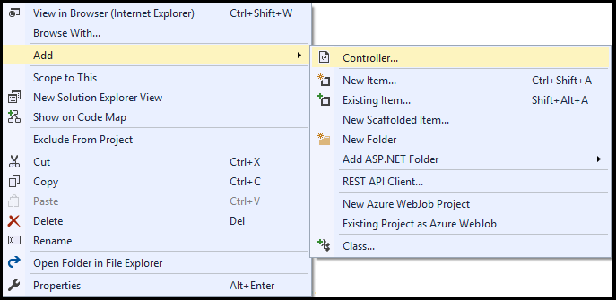
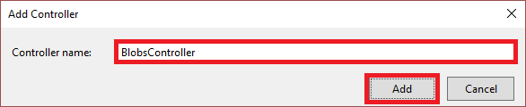
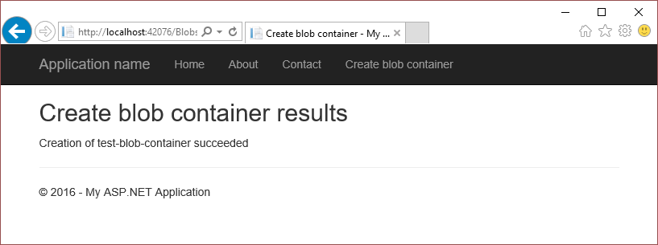
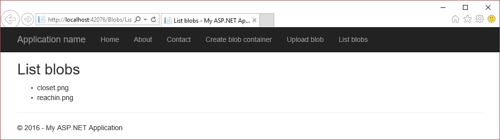

<properties
    pageTitle="开始使用 Azure Blob 存储和 Visual Studio 连接服务 (ASP.NET) | Azure"
    description="在使用 Visual Studio 连接服务连接到存储帐户后，如何开始在 Visual Studio 的 ASP.NET 项目中使用 Azure Blob 存储"
    services="storage"
    documentationcenter=""
    author="TomArcher"
    manager="douge"
    editor="" />
<tags
    ms.assetid="b3497055-bef8-4c95-8567-181556b50d95"
    ms.service="storage"
    ms.workload="web"
    ms.tgt_pltfrm="vs-getting-started"
    ms.devlang="na"
    ms.topic="article"
    ms.date="12/21/2016"
    wacn.date="02/24/2017"
    ms.author="tarcher" />  

# 开始使用 Azure Blob 存储和 Visual Studio 连接服务 (ASP.NET)

## 概述

Azure Blob 存储是一种将非结构化数据作为对象/Blob 存储在云中的服务。Blob 存储可以存储任何类型的文本或二进制数据，例如文档、媒体文件或应用程序安装程序。Blob 存储也称为对象存储。

本教程介绍如何针对 Azure Blob 存储的一些常见使用方案编写 ASP.NET 代码。方案包括创建 Blob 容器，以及上载、列出、下载和删除 Blob。

##先决条件

* [Microsoft Visual Studio](https://www.visualstudio.com/visual-studio-homepage-vs.aspx)
* [Azure 存储帐户](/documentation/articles/storage-create-storage-account/#create-a-storage-account)

[AZURE.INCLUDE [storage-blob-concepts-include](../../includes/storage-blob-concepts-include.md)]

[AZURE.INCLUDE [storage-create-account-include](../../includes/vs-storage-aspnet-getting-started-create-azure-account.md)]

[AZURE.INCLUDE [storage-development-environment-include](../../includes/vs-storage-aspnet-getting-started-setup-dev-env.md)]

### 创建 MVC 控制器 

1. 在“解决方案资源管理器”中右键单击“控制器”，然后从上下文菜单中选择“添加”->“控制器”。

	  

1. 在“添加基架”对话框中选择“MVC 5 控制器 - 空”，然后选择“添加”。

	  

1. 在“添加控制器”对话框中，将控制器命名为“BlobsController”，然后选择“添加”。

	  

1. 将以下 *using* 指令添加到 `BlobsController.cs` 文件。

		using Microsoft.Azure;
		using Microsoft.WindowsAzure.Storage;
		using Microsoft.WindowsAzure.Storage.Auth;
		using Microsoft.WindowsAzure.Storage.Blob;

## 创建 Blob 容器

Blob 容器是由 Blob 和文件夹组成的嵌套式层次结构。以下步骤演示了如何创建 Blob 容器：

> [AZURE.NOTE]
> 
> 本部分中的代码假定你已完成[设置开发环境](#set-up-the-development-environment)部分中的步骤。

1. 打开 `BlobsController.cs` 文件。

1. 添加名为 **CreateBlobContainer** 的方法，以便返回 **ActionResult**。

	    public ActionResult CreateBlobContainer()
	    {
			// The code in this section goes here.

	        return View();
	    }

 
1. 在 **CreateBlobContainer** 方法中，获取表示存储帐户信息的 **CloudStorageAccount** 对象。使用下面的代码获取存储连接字符串和 Azure 服务配置中的存储帐户信息。（将 *&lt;storage-account-name>* 更改为要访问的 Azure 存储帐户的名称。）
   

	    CloudStorageAccount storageAccount = CloudStorageAccount.Parse(
	       CloudConfigurationManager.GetSetting("<storage-account-name>_AzureStorageConnectionString"));

   
1. 获取表示 Blob 服务客户端的 **CloudBlobClient** 对象。
   

    	CloudBlobClient blobClient = storageAccount.CreateCloudBlobClient();

1. 获取表示所需 Blob 容器名称引用的 **CloudBlobContainer** 对象。**CloudBlobClient.GetContainerReference** 方法并不针对 Blob 存储发出请求。不管 Blob 容器是否存在，都会返回引用。
   

    	CloudBlobContainer container = blobClient.GetContainerReference("test-blob-container");

1. 如果容器不存在，则调用 **CloudBlobContainer.CreateIfNotExists** 方法来创建容器。如果没有容器但已成功创建，则 **CloudBlobContainer.CreateIfNotExists** 方法返回 **true**。否则返回 **false**。

		ViewBag.Success = container.CreateIfNotExists();

1. 将 **ViewBag** 更新为 Blob 容器的名称。

		ViewBag.BlobContainerName = container.Name;

1. 在“解决方案资源管理器”中展开“Views”文件夹，右键单击“Blob”，然后从上下文菜单中选择“添加”->“视图”。

1. 在“添加视图”对话框中，输入 **CreateBlobContainer** 作为视图名称，然后选择“添加”。

1. 打开 `CreateBlobContainer.cshtml` 并对其进行修改，使其看起来如以下代码片段所示：

		@{
		    ViewBag.Title = "Create blob container";
		}
	
		<h2>Create blob container results</h2>

		Creation of @ViewBag.BlobContainerName @(ViewBag.Success == true ? "succeeded" : "failed")

1. 在“解决方案资源管理器”中，展开“Views”->“Shared”文件夹，然后打开 `_Layout.cshtml`。

1. 在最后一个 **Html.ActionLink** 的后面，添加以下 **Html.ActionLink**：

		<li>@Html.ActionLink("Create blob container", "CreateBlobContainer", "Blobs")</li>

1. 运行该应用程序，并选择“创建 Blob 容器”查看类似于以下屏幕截图所示的结果：
  
	  

	如前所述，**CloudBlobContainer.CreateIfNotExists** 方法返回 **true** 的前提是容器原本不存在，是新建的。因此，如果在容器存在的情况下运行该应用，此方法会返回 **false**。若要多次运行应用，必须在再次运行应用之前删除容器。可通过 **CloudBlobContainer.Delete** 方法删除容器。也可通过 [Azure 门户](http://go.microsoft.com/fwlink/p/?LinkID=525040)删除容器。

## 将 Blob 上传到 Blob 容器中

[创建 Blob 容器](#create-a-blob-container)以后，即可将文件上载到该容器中。本部分介绍如何将本地文件上传到 Blob 容器。相关步骤假定用户已创建名为 *test-blob-container* 的 Blob 容器。

> [AZURE.NOTE]
> 
> 本部分中的代码假定你已完成[设置开发环境](#set-up-the-development-environment)部分中的步骤。

1. 打开 `BlobsController.cs` 文件。

1. 添加名为 **UploadBlob** 的方法，以便返回 **EmptyResult**。

	    public EmptyResult UploadBlob()
	    {
			// The code in this section goes here.

	        return new EmptyResult();
	    }

 
1. 在 **UploadBlob** 方法中，获取表示存储帐户信息的 **CloudStorageAccount** 对象。使用以下代码从 Azure 服务配置中获取存储连接字符串和存储帐户信息：（将 *&lt;storage-account-name\>* 更改为要访问的 Azure 存储帐户的名称。）
   

	    CloudStorageAccount storageAccount = CloudStorageAccount.Parse(
	       CloudConfigurationManager.GetSetting("<storage-account-name>_AzureStorageConnectionString"));

   
1. 获取表示 Blob 服务客户端的 **CloudBlobClient** 对象。
   

    	CloudBlobClient blobClient = storageAccount.CreateCloudBlobClient();

1. 获取表示 Blob 容器名称引用的 **CloudBlobContainer** 对象。
   

    	CloudBlobContainer container = blobClient.GetContainerReference("test-blob-container");

1. 如前所述，Azure 存储支持不同的 Blob 类型。若要检索页 Blob 引用，请调用 **CloudBlobContainer.GetPageBlobReference** 方法。若要检索块 Blob 引用，请调用 **CloudBlobContainer.GetBlockBlobReference** 方法。通常情况下，推荐使用块 Blob 类型。（将 \<blob-name\>\* 更改为上传后要提供给 Blob 的名称。）

    	CloudBlockBlob blob = container.GetBlockBlobReference(<blob-name>);

1. 有了 Blob 引用以后，即可通过调用 Blob 引用对象的 **UploadFromStream** 方法，将任何数据流上载到该引用。**UploadFromStream** 方法会根据 Blob 是否存在来覆盖或创建 Blob。（将 *&lt;file-to-upload\>* 更改为需上载文件的完全限定路径。）

	    using (var fileStream = System.IO.File.OpenRead(<file-to-upload>))
	    {
	        blob.UploadFromStream(fileStream);
	    }

1. 在“解决方案资源管理器”中展开“Views”文件夹，右键单击“Blob”，然后从上下文菜单中选择“添加”-\>“视图”。

1. 在“解决方案资源管理器”中，展开“Views”-\>“Shared”文件夹，然后打开 `_Layout.cshtml`。

1. 在最后一个 **Html.ActionLink** 的后面，添加以下 **Html.ActionLink**：

		<li>@Html.ActionLink("Upload blob", "UploadBlob", "Blobs")</li>

1. 运行该应用程序，然后选择“上载 Blob”。
  
[列出 Blob 容器中的 Blob](#list-the-blobs-in-a-blob-container) 部分说明了如何列出 Blob 容器中的 Blob。

## 列出 Blob 容器中的 Blob

本部分说明如何列出 Blob 容器中的 Blob。示例代码引用在[创建 Blob 容器](#create-a-blob-container)部分创建的 *test-blob-container*。

> [AZURE.NOTE]
> 
> 本部分中的代码假定你已完成[设置开发环境](#set-up-the-development-environment)部分中的步骤。

1. 打开 `BlobsController.cs` 文件。

1. 添加名为 **ListBlobs** 的方法，以便返回 **ActionResult**。

	    public ActionResult ListBlobs()
	    {
			// The code in this section goes here.

	        return View();
	    }

 
1. 在 **ListBlobs** 方法中，获取表示存储帐户信息的 **CloudStorageAccount** 对象。使用以下代码从 Azure 服务配置中获取存储连接字符串和存储帐户信息：（将 *&lt;storage-account-name\>* 更改为要访问的 Azure 存储帐户的名称。）
   

	    CloudStorageAccount storageAccount = CloudStorageAccount.Parse(
	       CloudConfigurationManager.GetSetting("<storage-account-name>_AzureStorageConnectionString"));

   
1. 获取表示 Blob 服务客户端的 **CloudBlobClient** 对象。
   

    	CloudBlobClient blobClient = storageAccount.CreateCloudBlobClient();

1. 获取表示 Blob 容器名称引用的 **CloudBlobContainer** 对象。
   

    	CloudBlobContainer container = blobClient.GetContainerReference("test-blob-container");

1. 若要列出 Blob 容器中的 Blob，请使用 **CloudBlobContainer.ListBlobs** 方法。**CloudBlobContainer.ListBlobs** 方法返回 **IListBlobItem** 对象，该对象可强制转换为 **CloudBlockBlob**、**CloudPageBlob** 或 **CloudBlobDirectory** 对象。以下代码片段将枚举 Blob 容器中的所有 Blob。每个 Blob 都将按照其类型强制转换为适当的对象，并将其名称（**CloudBlobDirectory** 的情况下是 URI）添加到列表中。

	    List<string> blobs = new List<string>();

	    foreach (IListBlobItem item in container.ListBlobs(null, false))
	    {
	        if (item.GetType() == typeof(CloudBlockBlob))
	        {
	            CloudBlockBlob blob = (CloudBlockBlob)item;
	            blobs.Add(blob.Name);
	        }
	        else if (item.GetType() == typeof(CloudPageBlob))
	        {
	            CloudPageBlob blob = (CloudPageBlob)item;
	            blobs.Add(blob.Name);
	        }
	        else if (item.GetType() == typeof(CloudBlobDirectory))
	        {
	            CloudBlobDirectory dir = (CloudBlobDirectory)item;
	            blobs.Add(dir.Uri.ToString());
	        }
	    }

		return View(blobs);

	除了 Blob，Blob 容器还可以包含目录。假设用户的名为 *test-blob-container* 的 Blob 容器具有以下层次结构：

		foo.png
		dir1/bar.png
		dir2/baz.png

	**blob** 字符串列表包含的值如下所示（使用前面的代码示例）：

		foo.png
		<storage-account-url>/test-blob-container/dir1
		<storage-account-url>/test-blob-container/dir2

	可以看到，该列表仅包含顶级实体，而不包含嵌套实体（*bar.png* 和 *baz.png*）。若要列出 Blob 容器中的所有实体，必须调用 **CloudBlobContainer.ListBlobs** 方法，并为 **useFlatBlobListing** 参数传递 **true**。

	    ...
		foreach (IListBlobItem item in container.ListBlobs(useFlatBlobListing:true))
		...

	将 **useFlatBlobListing** 参数设置为 **true** 会返回一个平面列表，其中包含 Blob 容器中的所有实体，并会生成以下结果：

		foo.png
		dir1/bar.png
		dir2/baz.png

1. 在“解决方案资源管理器”中展开“Views”文件夹，右键单击“Blob”，然后从上下文菜单中选择“添加”->“视图”。

1. 在“添加视图”对话框中，输入 **ListBlobs** 作为视图名称，然后选择“添加”。

1. 打开 `ListBlobs.cshtml` 并对其进行修改，使其看起来如以下代码片段所示：

		@model List<string>
		@{
		    ViewBag.Title = "List blobs";
		}
	
		<h2>List blobs</h2>
	
		<ul>
		    @foreach (var item in Model)
		    {
		    <li>@item</li>
		    }
		</ul>

1. 在“解决方案资源管理器”中，展开“Views”->“Shared”文件夹，然后打开 `_Layout.cshtml`。

1. 在最后一个 **Html.ActionLink** 的后面，添加以下 **Html.ActionLink**：

		<li>@Html.ActionLink("List blobs", "ListBlobs", "Blobs")</li>

1. 运行该应用程序，并选择“列出 Blob”来查看类似于以下屏幕截图所示的结果：
  
	  

## 下载 Blob

本部分演示了如何下载 Blob，以及如何将其保存到本地存储或将内容读入字符串中。示例代码引用在[创建 Blob 容器](#create-a-blob-container)部分创建的 *test-blob-container*。

1. 打开 `BlobsController.cs` 文件。

1. 添加名为 **DownloadBlob** 的方法，以便返回 **ActionResult**。

	    public EmptyResult DownloadBlob()
	    {
			// The code in this section goes here.

	        return new EmptyResult();
	    }

 
1. 在 **DownloadBlob** 方法中，获取表示存储帐户信息的 **CloudStorageAccount** 对象。使用以下代码从 Azure 服务配置中获取存储连接字符串和存储帐户信息：（将 *&lt;storage-account-name\>* 更改为要访问的 Azure 存储帐户的名称。）
   

	    CloudStorageAccount storageAccount = CloudStorageAccount.Parse(
	       CloudConfigurationManager.GetSetting("<storage-account-name>_AzureStorageConnectionString"));

   
1. 获取表示 Blob 服务客户端的 **CloudBlobClient** 对象。
   

    	CloudBlobClient blobClient = storageAccount.CreateCloudBlobClient();

1. 获取表示 Blob 容器名称引用的 **CloudBlobContainer** 对象。
   

    	CloudBlobContainer container = blobClient.GetContainerReference("test-blob-container");

1. 通过调用 **CloudBlobContainer.GetBlockBlobReference** 或 **CloudBlobContainer.GetPageBlobReference** 方法获取 Blob 引用对象。（将 *&lt;blob-name>* 更改为要下载的 Blob 的名称。）

    	CloudBlockBlob blob = container.GetBlockBlobReference(<blob-name>);

1. 若要下载 Blob，请使用 **CloudBlockBlob.DownloadToStream** 或 **CloudPageBlob.DownloadToStream** 方法，具体取决于 Blob 类型。以下代码片段使用 **CloudBlockBlob.DownloadToStream** 方法将 Blob 的内容传输到流对象，该对象随后保存到本地文件：（将 *&lt;local-file-name\>* 更改为完全限定文件名，表示 Blob 要下载到的位置。）

	    using (var fileStream = System.IO.File.OpenWrite(<local-file-name>))
	    {
	        blob.DownloadToStream(fileStream);
	    }

1. 在“解决方案资源管理器”中，展开“Views”->“Shared”文件夹，然后打开 `_Layout.cshtml`。

1. 在最后一个 **Html.ActionLink** 的后面，添加以下 **Html.ActionLink**：

		<li>@Html.ActionLink("Download blob", "DownloadBlob", "Blobs")</li>

1. 运行该应用程序，然后选择“下载 Blob”下载 Blob。将 **CloudBlobContainer.GetBlockBlobReference** 方法调用中指定的 Blob 下载到 **File.OpenWrite** 方法调用中指定的位置。

## 删除 Blob

以下步骤演示了如何删除 Blob：

> [AZURE.NOTE]
> 
> 本部分中的代码假定你已完成[设置开发环境](#set-up-the-development-environment)部分中的步骤。

1. 打开 `BlobsController.cs` 文件。

1. 添加名为 **DeleteBlob** 的方法，以便返回 **ActionResult**。

	    public EmptyResult DeleteBlob()
	    {
			// The code in this section goes here.

	        return new EmptyResult();
	    }

1. 获取表示存储帐户信息的 **CloudStorageAccount** 对象。使用以下代码从 Azure 服务配置中获取存储连接字符串和存储帐户信息：（将 *&lt;storage-account-name\>* 更改为要访问的 Azure 存储帐户的名称。）
   

	    CloudStorageAccount storageAccount = CloudStorageAccount.Parse(
	       CloudConfigurationManager.GetSetting("<storage-account-name>_AzureStorageConnectionString"));

   
1. 获取表示 Blob 服务客户端的 **CloudBlobClient** 对象。
   

    	CloudBlobClient blobClient = storageAccount.CreateCloudBlobClient();

1. 获取表示 Blob 容器名称引用的 **CloudBlobContainer** 对象。
   

    	CloudBlobContainer container = blobClient.GetContainerReference("test-blob-container");

1. 通过调用 **CloudBlobContainer.GetBlockBlobReference** 或 **CloudBlobContainer.GetPageBlobReference** 方法获取 Blob 引用对象。（将 *&lt;blob-name>* 更改为要删除的 Blob 的名称。）

    	CloudBlockBlob blob = container.GetBlockBlobReference(<blob-name>);

1. 若要删除 Blob，请使用 **Delete** 方法。

    	blob.Delete();

1. 在“解决方案资源管理器”中，展开“Views”->“Shared”文件夹，然后打开 `_Layout.cshtml`。

1. 在最后一个 **Html.ActionLink** 的后面，添加以下 **Html.ActionLink**：

		<li>@Html.ActionLink("Delete blob", "DeleteBlob", "Blobs")</li>

1. 运行该应用程序，然后选择“删除 Blob”删除 **CloudBlobContainer.GetBlockBlobReference** 方法调用中指定的 Blob。

## 后续步骤
查看更多功能指南，以了解在 Azure 中存储数据的其他方式。

  * [开始使用 Azure 表存储和 Visual Studio 连接服务 (ASP.NET)](/documentation/articles/vs-storage-aspnet-getting-started-tables/)
  * [开始使用 Azure 队列存储和 Visual Studio 连接服务 (ASP.NET)](/documentation/articles/vs-storage-aspnet-getting-started-queues/)

<!---HONumber=Mooncake_0220_2017-->
<!--Update_Description: wording update-->