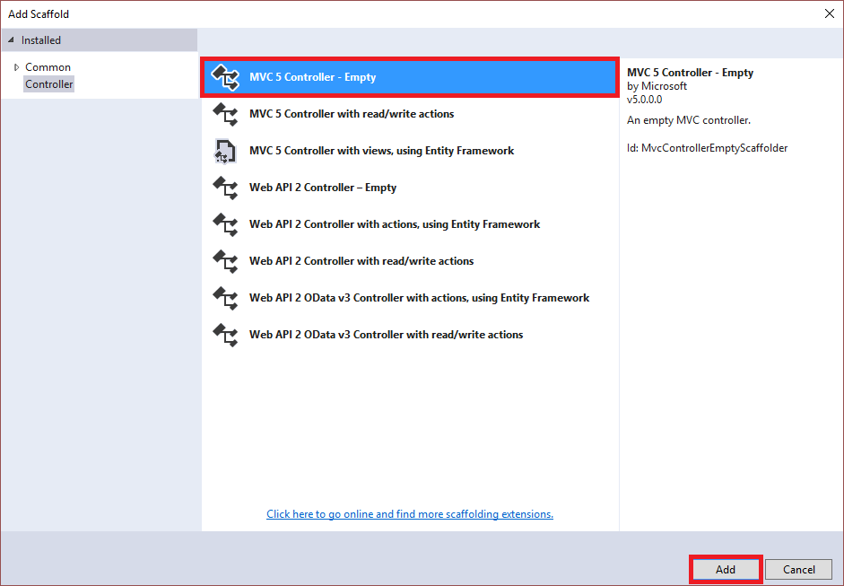

<properties
    pageTitle="开始使用 Azure 队列存储和 Visual Studio 连接服务 (ASP.NET) | Azure"
    description="在使用 Visual Studio 连接服务连接到存储帐户后，如何开始在 Visual Studio 的 ASP.NET 项目中使用 Azure 队列存储"
    services="storage"
    documentationcenter=""
    author="TomArcher"
    manager="douge"
    editor="" />
<tags
    ms.assetid="94ca3413-5497-433f-abbe-836f83a9de72"
    ms.service="storage"
    ms.workload="web"
    ms.tgt_pltfrm="vs-getting-started"
    ms.devlang="na"
    ms.topic="article"
    ms.date="12/23/2016"
    wacn.date="02/24/2017"
    ms.author="tarcher" />  

# 开始使用 Azure 队列存储和 Visual Studio 连接服务 (ASP.NET)

## 概述

Azure 队列存储用于在应用程序组件之间进行云消息传送。在设计应用程序以实现可伸缩性时，通常要将各个应用程序组件分离，使其可以独立地进行伸缩。队列存储提供的异步消息传送适用于在应用程序组件之间进行通信，无论这些应用程序组件是运行在云中、桌面上、本地服务器上还是移动设备上。队列存储还支持管理异步任务以及构建过程工作流。

本教程演示如何针对一些常见的 Azure 队列存储实体使用方案编写 ASP.NET 代码。这些方案包括创建 Azure 队列，添加、修改、读取和删除队列消息等常见任务。

##先决条件

* [Microsoft Visual Studio](https://www.visualstudio.com/visual-studio-homepage-vs.aspx)
* [Azure 存储帐户](/documentation/articles/storage-create-storage-account/#create-a-storage-account)

[AZURE.INCLUDE [storage-queue-concepts-include](../../includes/storage-queue-concepts-include.md)]

[AZURE.INCLUDE [storage-create-account-include](../../includes/vs-storage-aspnet-getting-started-create-azure-account.md)]

[AZURE.INCLUDE [storage-development-environment-include](../../includes/vs-storage-aspnet-getting-started-setup-dev-env.md)]

### 创建 MVC 控制器 

1. 在“解决方案资源管理器”中右键单击“控制器”，然后从上下文菜单中选择“添加”-\>“控制器”。

	  

1. 在“添加基架”对话框中选择“MVC 5 控制器 - 空”，然后选择“添加”。

	  

1. 在“添加控制器”对话框中，将控制器命名为“QueuesController”，然后选择“添加”。

	  

1. 将以下 *using* 指令添加到 `QueuesController.cs` 文件：

 
		using Microsoft.Azure;
	    using Microsoft.WindowsAzure.Storage;
	    using Microsoft.WindowsAzure.Storage.Auth;
	    using Microsoft.WindowsAzure.Storage.Queue;

## 创建队列

以下步骤演示了如何创建队列：

> [AZURE.NOTE]
> 
> 本部分假定你已完成[设置开发环境](#set-up-the-development-environment)中的步骤。

1. 打开 `QueuesController.cs` 文件。

1. 添加会返回 **ActionResult** 的 **CreateQueue** 方法。

	    public ActionResult CreateQueue()
	    {
			// The code in this section goes here.

	        return View();
	    }

1. 在 **CreateQueue** 方法中，获取表示存储帐户信息的 **CloudStorageAccount** 对象。使用以下代码从 Azure 服务配置中获取存储连接字符串和存储帐户信息：（将 *&lt;storage-account-name\>* 更改为要访问的 Azure 存储帐户的名称。）
   

	    CloudStorageAccount storageAccount = CloudStorageAccount.Parse(
	       CloudConfigurationManager.GetSetting("<storage-account-name>_AzureStorageConnectionString"));

1. 获取表示队列服务客户端的 **CloudQueueClient** 对象。
   

	    CloudQueueClient queueClient = storageAccount.CreateCloudQueueClient();

1. 获取表示所需队列名称引用的 **CloudQueue** 对象。**CloudQueueClient.GetQueueReference** 方法并不针对队列存储发出请求。不管队列是否存在，都会返回引用。
   

	    CloudQueue queue = queueClient.GetQueueReference("test-queue");

1. 如果队列不存在，则调用 **CloudQueue.CreateIfNotExists** 方法来创建队列。如果没有队列但已成功创建，则 **CloudQueue.CreateIfNotExists** 方法返回 **true**。否则返回 **false**。

		ViewBag.Success = queue.CreateIfNotExists();

1. 将 **ViewBag** 更新为队列的名称。

		ViewBag.QueueName = queue.Name;

1. 在“解决方案资源管理器”中展开“视图”文件夹，右键单击“队列”，然后从上下文菜单中选择“添加”-\>“视图”。

1. 在“添加视图”对话框中，输入 **CreateQueue** 作为视图名称，然后选择“添加”。

1. 打开 `CreateQueue.cshtml` 并对其进行修改，使其看起来如以下代码片段所示：

		@{
		    ViewBag.Title = "Create Queue";
		}
	
		<h2>Create Queue results</h2>

		Creation of @ViewBag.QueueName @(ViewBag.Success == true ? "succeeded" : "failed")

1. 在“解决方案资源管理器”中，展开“Views”-\>“Shared”文件夹，然后打开 `_Layout.cshtml`。

1. 在最后一个 **Html.ActionLink** 的后面，添加以下 **Html.ActionLink**：

		<li>@Html.ActionLink("Create queue", "CreateQueue", "Queues")</li>

1. 运行该应用程序，并选择“创建队列”以查看类似于以下屏幕截图所示的结果：
  
	  

	如前所述，仅当队列不存在但已新建时，**CloudQueue.CreateIfNotExists** 方法才会返回 **true**。因此，如果在队列存在的情况下运行该应用，此方法会返回 **false**。若要多次运行应用，必须在重新运行应用前删除队列。可通过**CloudQueue.Delete**方法完成队列的删除。也可通过 [Azure 门户](https://portal.azure.cn/)或 [Azure 存储资源管理器](/documentation/articles/vs-azure-tools-storage-manage-with-storage-explorer/)删除队列。

## 向队列添加消息

[创建队列](#create-a-queue)后，即可向该队列添加消息。本部分介绍了如何将消息添加到 *test-queue* 队列。

> [AZURE.NOTE]
> 
> 本部分假定你已完成[设置开发环境](#set-up-the-development-environment)中的步骤。

1. 打开 `QueuesController.cs` 文件。

1. 添加会返回 **ActionResult** 的 **AddMessage** 方法。

	    public ActionResult AddMessage()
	    {
			// The code in this section goes here.

	        return View();
	    }

 
1. 在 **AddMessage** 方法中，获取表示存储帐户信息的 **CloudStorageAccount** 对象。使用以下代码从 Azure 服务配置中获取存储连接字符串和存储帐户信息：（将 *&lt;storage-account-name\>* 更改为要访问的 Azure 存储帐户的名称。）
   

	    CloudStorageAccount storageAccount = CloudStorageAccount.Parse(
	       CloudConfigurationManager.GetSetting("<storage-account-name>_AzureStorageConnectionString"));

   
1. 获取表示队列服务客户端的 **CloudQueueClient** 对象。
   

	    CloudQueueClient queueClient = storageAccount.CreateCloudQueueClient();

1. 获取表示队列引用的 **CloudQueueContainer** 对象。
   

	    CloudQueue queue = queueClient.GetQueueReference("test-queue");

1. 创建表示要添加到队列的消息的 **CloudQueueMessage** 对象。可从字符串（UTF-8 格式）或字节数组创建 **CloudQueueMessage** 对象。CloudQueueMessage message = new CloudQueueMessage\("Hello, Azure Queue Storage"\);

1. 调用向队列添加消息的 **CloudQueue.AddMessage** 方法。

		queue.AddMessage(message);

1. 创建并设置几个在视图中显示的 **ViewBag** 属性。

	    ViewBag.QueueName = queue.Name;
	    ViewBag.Message = message.AsString;

1. 在“解决方案资源管理器”中展开“视图”文件夹，右键单击“队列”，然后从上下文菜单中选择“添加”-\>“视图”。

1. 在“添加视图”对话框中，输入 **AddMessage** 作为视图名称，然后选择“添加”。

1. 打开 `AddMessage.cshtml` 并对其进行修改，使其看起来如以下代码片段所示：

		@{
		    ViewBag.Title = "Add Message";
		}
	
		<h2>Add Message results</h2>
	
		The message '@ViewBag.Message' was added to the queue '@ViewBag.QueueName'.

1. 在“解决方案资源管理器”中，展开“Views”-\>“Shared”文件夹，然后打开 `_Layout.cshtml`。

1. 在最后一个 **Html.ActionLink** 的后面，添加以下 **Html.ActionLink**：

		<li>@Html.ActionLink("Add message", "AddMessage", "Queues")</li>

1. 运行该应用程序，并选择“添加消息”以查看类似于以下屏幕截图所示的结果：
  
	  

这两部分 - [从队列中读取消息但不删除它](#read-a-message-from-a-queue-without-removing-it)和[读取和删除队列中的消息](#read-and-remove-a-message-from-a-queue) - 演示了如何读取队列中的消息。

## 从队列中读取一条消息，不删除它

本部分演示了如何查看排队的消息（读取第一条消息但不删除它）。

> [AZURE.NOTE]
> 
> 本部分假定你已完成[设置开发环境](#set-up-the-development-environment)中的步骤。

1. 打开 `QueuesController.cs` 文件。

1. 添加会返回 **ActionResult** 的 **PeekMessage** 方法。

	    public ActionResult PeekMessage()
	    {
			// The code in this section goes here.

	        return View();
	    }

 
1. 在 **PeekMessage** 方法中，获取表示存储帐户信息的 **CloudStorageAccount** 对象。使用以下代码从 Azure 服务配置中获取存储连接字符串和存储帐户信息：（将 *&lt;storage-account-name\>* 更改为要访问的 Azure 存储帐户的名称。）
   

	    CloudStorageAccount storageAccount = CloudStorageAccount.Parse(
	       CloudConfigurationManager.GetSetting("<storage-account-name>_AzureStorageConnectionString"));

   
1. 获取表示队列服务客户端的 **CloudQueueClient** 对象。
   

	    CloudQueueClient queueClient = storageAccount.CreateCloudQueueClient();

1. 获取表示队列引用的 **CloudQueueContainer** 对象。
   

	    CloudQueue queue = queueClient.GetQueueReference("test-queue");

1. 调用 **CloudQueue.PeekMessage** 方法读取队列中的第一条消息，不从队列中删除它。

		CloudQueueMessage message = queue.PeekMessage();

1. 更新 **ViewBag** 的两个值：队列名称和已读消息。**CloudQueueMessage** 对象公开以下两个属性来获取该对象的值：**CloudQueueMessage.AsBytes** 和 **CloudQueueMessage.AsString**。**AsString**（本例中所用）返回字符串，而 **AsBytes** 返回字节数组。

	    ViewBag.QueueName = queue.Name;	
		ViewBag.Message = (message != null ? message.AsString : "");

1. 在“解决方案资源管理器”中展开“视图”文件夹，右键单击“队列”，然后从上下文菜单中选择“添加”-\>“视图”。

1. 在“添加视图”对话框中，输入 **PeekMessage** 作为视图名称，然后选择“添加”。

1. 打开 `PeekMessage.cshtml` 并对其进行修改，使其看起来如以下代码片段所示：

		@{
		    ViewBag.Title = "PeekMessage";
		}
	
		<h2>Peek Message results</h2>
	
		<table border="1">
		    <tr><th>Queue</th><th>Peeked Message</th></tr>
		    <tr><td>@ViewBag.QueueName</td><td>@ViewBag.Message</td></tr>
		</table>	

1. 在“解决方案资源管理器”中，展开“Views”-\>“Shared”文件夹，然后打开 `_Layout.cshtml`。

1. 在最后一个 **Html.ActionLink** 的后面，添加以下 **Html.ActionLink**：

		<li>@Html.ActionLink("Peek message", "PeekMessage", "Queues")</li>

1. 运行该应用程序，并选择“速览消息”以查看类似于以下屏幕截图所示的结果：
  
	  

## 读取和删除队列中的消息

本部分介绍了如何读取和删除队列中的消息。

> [AZURE.NOTE]
> 
> 本部分假定你已完成[设置开发环境](#set-up-the-development-environment)中的步骤。

1. 打开 `QueuesController.cs` 文件。

1. 添加会返回 **ActionResult** 的 **ReadMessage** 方法。

	    public ActionResult ReadMessage()
	    {
			// The code in this section goes here.

	        return View();
	    }

 
1. 在 **ReadMessage** 方法中，获取表示存储帐户信息的 **CloudStorageAccount** 对象。使用以下代码从 Azure 服务配置中获取存储连接字符串和存储帐户信息：（将 *&lt;storage-account-name\>* 更改为要访问的 Azure 存储帐户的名称。）
   

	    CloudStorageAccount storageAccount = CloudStorageAccount.Parse(
	       CloudConfigurationManager.GetSetting("<storage-account-name>_AzureStorageConnectionString"));

   
1. 获取表示队列服务客户端的 **CloudQueueClient** 对象。
   

	    CloudQueueClient queueClient = storageAccount.CreateCloudQueueClient();

1. 获取表示队列引用的 **CloudQueueContainer** 对象。

    	CloudQueue queue = queueClient.GetQueueReference("test-queue");

1. 调用 **CloudQueue.GetMessage** 方法读取队列中的第一条消息。**CloudQueue.GetMessage** 方法可以让消息对任何其他读取消息的代码不可见 30 秒（默认），因此当用户正在处理消息时，其他代码无法修改或删除该消息。若要更改消息不可见的时间，请修改传递给 **CloudQueue.GetMessage** 方法的 **visibilityTimeout** 参数。

		// This message will be invisible to other code for 30 seconds.
		CloudQueueMessage message = queue.GetMessage();     

1. 调用从队列中删除消息的 **CloudQueueMessage.Delete** 方法。

	    queue.DeleteMessage(message);

1. 将 **ViewBag** 更新为队列名称和已删除的消息。

	    ViewBag.QueueName = queue.Name;
	    ViewBag.Message = message.AsString;

 
1. 在“解决方案资源管理器”中展开“视图”文件夹，右键单击“队列”，然后从上下文菜单中选择“添加”-\>“视图”。

1. 在“添加视图”对话框中，输入 **ReadMessage** 作为视图名称，然后选择“添加”。

1. 打开 `ReadMessage.cshtml` 并对其进行修改，使其看起来如以下代码片段所示：

		@{
		    ViewBag.Title = "ReadMessage";
		}
	
		<h2>Read Message results</h2>
	
		<table border="1">
		    <tr><th>Queue</th><th>Read (and Deleted) Message</th></tr>
		    <tr><td>@ViewBag.QueueName</td><td>@ViewBag.Message</td></tr>
		</table>

1. 在“解决方案资源管理器”中，展开“Views”-\>“Shared”文件夹，然后打开 `_Layout.cshtml`。

1. 在最后一个 **Html.ActionLink** 的后面，添加以下 **Html.ActionLink**：

		<li>@Html.ActionLink("Read/Delete message", "ReadMessage", "Queues")</li>

1. 运行该应用程序，并选择“读取/删除消息”以查看类似于以下屏幕截图所示的结果：
  
	  

## 获取队列长度

本部分演示了如何获取队列长度（消息数）。

> [AZURE.NOTE]
> 
> 本部分假定你已完成[设置开发环境](#set-up-the-development-environment)中的步骤。

1. 打开 `QueuesController.cs` 文件。

1. 添加会返回 **ActionResult** 的 **GetQueueLength** 方法。

	    public ActionResult GetQueueLength()
	    {
			// The code in this section goes here.

	        return View();
	    }

 
1. 在 **ReadMessage** 方法中，获取表示存储帐户信息的 **CloudStorageAccount** 对象。使用以下代码从 Azure 服务配置中获取存储连接字符串和存储帐户信息：（将 *&lt;storage-account-name\>* 更改为要访问的 Azure 存储帐户的名称。）
   

	    CloudStorageAccount storageAccount = CloudStorageAccount.Parse(
	       CloudConfigurationManager.GetSetting("<storage-account-name>_AzureStorageConnectionString"));

   
1. 获取表示队列服务客户端的 **CloudQueueClient** 对象。
   

	    CloudQueueClient queueClient = storageAccount.CreateCloudQueueClient();

1. 获取表示队列引用的 **CloudQueueContainer** 对象。

    	CloudQueue queue = queueClient.GetQueueReference("test-queue");

1. 调用检索队列的属性（包括其长度）的 **CloudQueue.FetchAttributes** 方法。

		queue.FetchAttributes();

6. 访问 **CloudQueue.ApproximateMessageCount** 属性以获取队列的长度。
 
		int? nMessages = queue.ApproximateMessageCount;

1. 将 **ViewBag** 更新为队列名称及其长度。

	    ViewBag.QueueName = queue.Name;
	    ViewBag.Length = nMessages;

 
1. 在“解决方案资源管理器”中展开“视图”文件夹，右键单击“队列”，然后从上下文菜单中选择“添加”-\>“视图”。

1. 在“添加视图”对话框中，输入 **GetQueueLength** 作为视图名称，然后选择“添加”。

1. 打开 `GetQueueLengthMessage.cshtml` 并对其进行修改，使其看起来如以下代码片段所示：

		@{
		    ViewBag.Title = "GetQueueLength";
		}
	
		<h2>Get Queue Length results</h2>
	
		The queue '@ViewBag.QueueName' has a length of (number of messages): @ViewBag.Length

1. 在“解决方案资源管理器”中，展开“Views”-\>“Shared”文件夹，然后打开 `_Layout.cshtml`。

1. 在最后一个 **Html.ActionLink** 的后面，添加以下 **Html.ActionLink**：

		<li>@Html.ActionLink("Get queue length", "GetQueueLength", "Queues")</li>

1. 运行该应用程序，并选择“获取队列长度”以查看类似于以下屏幕截图所示的结果：
  
	  

## 删除队列
本部分演示了如何删除队列。

> [AZURE.NOTE]
> 
> 本部分假定你已完成[设置开发环境](#set-up-the-development-environment)中的步骤。

1. 打开 `QueuesController.cs` 文件。

1. 添加会返回 **ActionResult** 的 **DeleteQueue** 方法。

	    public ActionResult DeleteQueue()
	    {
			// The code in this section goes here.

	        return View();
	    }

 
1. 在 **DeleteQueue** 方法中，获取表示存储帐户信息的 **CloudStorageAccount** 对象。使用以下代码从 Azure 服务配置中获取存储连接字符串和存储帐户信息：（将 *&lt;storage-account-name\>* 更改为要访问的 Azure 存储帐户的名称。）
   

	    CloudStorageAccount storageAccount = CloudStorageAccount.Parse(
	       CloudConfigurationManager.GetSetting("<storage-account-name>_AzureStorageConnectionString"));

   
1. 获取表示队列服务客户端的 **CloudQueueClient** 对象。
   

	    CloudQueueClient queueClient = storageAccount.CreateCloudQueueClient();

1. 获取表示队列引用的 **CloudQueueContainer** 对象。

    	CloudQueue queue = queueClient.GetQueueReference("test-queue");

1. 调用 **CloudQueue.Delete** 方法，删除 **CloudQueue** 对象代表的队列。

    	queue.Delete();

1. 将 **ViewBag** 更新为队列名称及其长度。

    	ViewBag.QueueName = queue.Name;

 
1. 在“解决方案资源管理器”中展开“视图”文件夹，右键单击“队列”，然后从上下文菜单中选择“添加”-\>“视图”。

1. 在“添加视图”对话框中，输入 **DeleteQueue** 作为视图名称，然后选择“添加”。

1. 打开 `DeleteQueue.cshtml` 并对其进行修改，使其看起来如以下代码片段所示：

		@{
		    ViewBag.Title = "DeleteQueue";
		}
	
		<h2>Delete Queue results</h2>
	
		@ViewBag.QueueName deleted.

1. 在“解决方案资源管理器”中，展开“Views”-\>“Shared”文件夹，然后打开 `_Layout.cshtml`。

1. 在最后一个 **Html.ActionLink** 的后面，添加以下 **Html.ActionLink**：

		<li>@Html.ActionLink("Delete queue", "DeleteQueue", "Queues")</li>

1. 运行该应用程序，并选择“获取队列长度”以查看类似于以下屏幕截图所示的结果：
  
	  

## 后续步骤
查看更多功能指南，以了解在 Azure 中存储数据的其他方式。

  * [开始使用 Azure Blob 存储和 Visual Studio 连接服务 \(ASP.NET\)](/documentation/articles/vs-storage-aspnet-getting-started-blobs/)
  * [开始使用 Azure 表存储和 Visual Studio 连接服务 \(ASP.NET\)](/documentation/articles/vs-storage-aspnet-getting-started-tables/)

<!---HONumber=Mooncake_0220_2017-->
<!--Update_Description: whole content update, new steps, new code samples-->