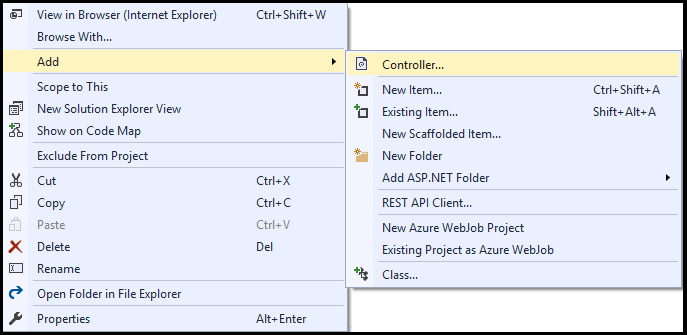

<properties
    pageTitle="开始使用 Azure 表存储和 Visual Studio 连接服务 (ASP.NET) | Azure"
    description="在使用 Visual Studio 连接服务连接到存储帐户后，如何开始在 Visual Studio 的 ASP.NET 项目中使用 Azure 表存储"
    services="storage"
    documentationcenter=""
    author="TomArcher"
    manager="douge"
    editor="" />
<tags
    ms.assetid="af81a326-18f4-4449-bc0d-e96fba27c1f8"
    ms.service="storage"
    ms.workload="web"
    ms.tgt_pltfrm="vs-getting-started"
    ms.devlang="na"
    ms.topic="article"
    ms.date="12/21/2016"
    wacn.date="04/06/2017"
    ms.author="tarcher" />  

# 开始使用 Azure 表存储和 Visual Studio 连接服务 \(ASP.NET\)

## 概述

Azure 表存储使用户可以存储大量结构化数据。该服务是一个 NoSQL 数据存储，接受来自 Azure 云内部和外部的通过验证的呼叫。Azure 表最适合存储结构化非关系型数据。

本教程演示如何针对一些常见的 Azure 表存储实体使用方案编写 ASP.NET 代码。这些方案包括创建表，以及添加、查询和删除表实体。

##先决条件

* [Microsoft Visual Studio](https://www.visualstudio.com/visual-studio-homepage-vs.aspx)
* [Azure 存储帐户](/documentation/articles/storage-create-storage-account/#create-a-storage-account)

[AZURE.INCLUDE [storage-table-concepts-include](../../includes/storage-table-concepts-include.md)]

[AZURE.INCLUDE [storage-create-account-include](../../includes/vs-storage-aspnet-getting-started-create-azure-account.md)]

[AZURE.INCLUDE [storage-development-environment-include](../../includes/vs-storage-aspnet-getting-started-setup-dev-env.md)]

### 创建 MVC 控制器 

1. 在“解决方案资源管理器”中右键单击“控制器”，然后从上下文菜单中选择“添加”-\>“控制器”。

	  

1. 在“添加基架”对话框中选择“MVC 5 控制器 - 空”，然后选择“添加”。

	  

1. 在“添加控制器”对话框中，将控制器命名为“TablesController”，然后选择“添加”。

	  

1. 将以下 *using* 指令添加到 `TablesController.cs` 文件：

         using Microsoft.Azure;
         using Microsoft.WindowsAzure.Storage;
         using Microsoft.WindowsAzure.Storage.Auth;
         using Microsoft.WindowsAzure.Storage.Table;

### 创建模型类

本文中的许多示例使用了名为 **CustomerEntity** 的 **TableEntity** 派生类。以下步骤会引导你将此类声明为模型类：

1. 在“解决方案资源管理器”中右键单击“模型”，然后从上下文菜单中选择“添加”-\>“类”。

1. 在“添加新项”对话框中，将类命名为“CustomerEntity”。

1. 打开 `CustomerEntity.cs` 文件并添加以下 **using** 指令：

		using Microsoft.WindowsAzure.Storage.Table;

1. 修改类，使其完成后按下述代码中进行声明。该类声明了一个 **CustomerEntity** 实体类，后者将客户的名字和姓氏分别用作行健和分区键。

	    public class CustomerEntity : TableEntity
	    {
	        public CustomerEntity(string lastName, string firstName)
	        {
	            this.PartitionKey = lastName;
	            this.RowKey = firstName;
	        }
	
	        public CustomerEntity() { }
	
	        public string Email { get; set; }
	    }

## 创建表

以下步骤演示了如何创建表：

> [AZURE.NOTE]
> 本部分假定你已完成[设置开发环境](#set-up-the-development-environment)中的步骤。

1. 打开 `TablesController.cs` 文件。

1. 添加会返回 **ActionResult** 的 **CreateTable** 方法。

	    public ActionResult CreateTable()
	    {
			// The code in this section goes here.

	        return View();
	    }

1. 在 **CreateTable** 方法中，获取表示存储帐户信息的 **CloudStorageAccount** 对象。使用以下代码从 Azure 服务配置中获取存储连接字符串和存储帐户信息：（将 *&lt;storage-account-name\>* 更改为要访问的 Azure 存储帐户的名称。）
   

	    CloudStorageAccount storageAccount = CloudStorageAccount.Parse(
	       CloudConfigurationManager.GetSetting("<storage-account-name>_AzureStorageConnectionString"));

1. 获取表示表服务客户端的 **CloudTableClient** 对象。
   

	   CloudTableClient tableClient = storageAccount.CreateCloudTableClient\(\);

1. 获取表示所需表名称引用的 **CloudTable** 对象。**CloudTableClient.GetTableReference** 方法并不针对表存储发出请求。不管表是否存在，都会返回引用。
   

	    CloudTable table = tableClient.GetTableReference("TestTable");

1. 如果表不存在，则调用 **CloudTable.CreateIfNotExists** 方法来创建表。如果没有表但已成功创建，则 **CloudTable.CreateIfNotExists** 方法返回 **true**。否则返回 **false**。

		ViewBag.Success = table.CreateIfNotExists();

1. 将 **ViewBag** 更新为表的名称。

		ViewBag.TableName = table.Name;

1. 在“解决方案资源管理器”中展开“视图”文件夹，右键单击“表格”，然后从上下文菜单中选择“添加”-\>“视图”。

1. 在“添加视图”对话框中，输入 **CreateTable** 作为视图名称，然后选择“添加”。

1. 打开 `CreateTable.cshtml` 并对其进行修改，使其看起来如以下代码片段所示：

		@{
		    ViewBag.Title = "Create Table";
		}
	
		<h2>Create Table results</h2>

		Creation of @ViewBag.TableName @(ViewBag.Success == true ? "succeeded" : "failed")

1. 在“解决方案资源管理器”中，展开“Views”-\>“Shared”文件夹，然后打开 `_Layout.cshtml`。

1. 在最后一个 **Html.ActionLink** 的后面，添加以下 **Html.ActionLink**：

		<li>@Html.ActionLink("Create table", "CreateTable", "Tables")</li>

1. 运行该应用程序，并选择“创建表”以查看类似于以下屏幕截图所示的结果：
  
	  

	如前所述，仅当表不存在但已新建时，**CloudTable.CreateIfNotExists** 方法才会返回 **true**。因此，如果在表存在的情况下运行该应用，此方法会返回 **false**。若要多次运行应用，必须在重新运行应用前删除表格。可通过**CloudTable.Delete** 方法完成表的删除。也可通过 [Azure 门户](https://portal.azure.cn/)删除表。

## 向表中添加条目

*实体*通过派生自 **TableEntity** 的自定义类映射到 C\# 对象。若要将实体添加到表，请创建用于定义实体的属性的类。在本部分中，将介绍如何定义将客户的名字和姓氏分别用作行键和分区键的实体类。实体的分区键和行键共同唯一地标识表中的实体。相对于查询分区键不同的实体，分区键相同的实体的查询速度更快，但使用不同的分区键能够增加并行操作的可伸缩性。对于应在表服务中存储的所有属性，该属性必须是受支持类型的公共属性且公开设置和检索值。实体类*必须*声明不带参数的公共构造函数。

> [AZURE.NOTE]
> 本部分假定你已完成[设置开发环境](#set-up-the-development-environment)中的步骤。

1. 打开 `TablesController.cs` 文件。

1. 添加以下指令，使 `TablesController.cs` 文件中的代码能够访问 **CustomerEntity** 类：

		using StorageAspnet.Models;

1. 添加会返回 **ActionResult** 的 **AddEntity** 方法。

	    public ActionResult AddEntity()
	    {
			// The code in this section goes here.

	        return View();
	    }

1. 在 **AddEntity** 方法中，获取表示存储帐户信息的 **CloudStorageAccount** 对象。使用以下代码从 Azure 服务配置中获取存储连接字符串和存储帐户信息：（将 *&lt;storage-account-name\>* 更改为要访问的 Azure 存储帐户的名称。）
   

	    CloudStorageAccount storageAccount = CloudStorageAccount.Parse(
	       CloudConfigurationManager.GetSetting("<storage-account-name>_AzureStorageConnectionString"));

1. 获取表示表服务客户端的 **CloudTableClient** 对象。
   

	    CloudTableClient tableClient = storageAccount.CreateCloudTableClient();

1. 获取 **CloudTable** 对象，该对象在将添加新实体的表中表示引用。
   

	    CloudTable table = tableClient.GetTableReference("TestTable");

1. 实例化和初始化 **CustomerEntity** 类。

	    CustomerEntity customer1 = new CustomerEntity("Harp", "Walter");
	    customer1.Email = "Walter@contoso.com";

1. 创建会插入客户实体的 **TableOperation** 对象。

	    TableOperation insertOperation = TableOperation.Insert(customer1);

1. 通过调用 **CloudTable.Execute** 方法执行插入操作。可以通过检查 **TableResult.HttpStatusCode** 属性验证操作的结果。状态代码为 2xx 指示客户端请求的操作已成功处理。例如，成功插入新的实体会生成 HTTP 状态代码 204，这意味着操作已成功处理，服务器没有返回任何内容。

    	TableResult result = table.Execute(insertOperation);

1. 更新 **ViewBag** 的表名称和插入操作的结果。

		ViewBag.TableName = table.Name;
		ViewBag.Result = result.HttpStatusCode;

1. 在“解决方案资源管理器”中展开“视图”文件夹，右键单击“表格”，然后从上下文菜单中选择“添加”-\>“视图”。

1. 在“添加视图”对话框中，输入 **AddEntity** 作为视图名称，然后选择“添加”。

1. 打开 `AddEntity.cshtml` 并对其进行修改，使其看起来如以下代码片段所示：

		@{
		    ViewBag.Title = "Add entity";
		}
	
		<h2>Add entity results</h2>

		Insert of entity into @ViewBag.TableName @(ViewBag.Result == 204 ? "succeeded" : "failed")

1. 在“解决方案资源管理器”中，展开“Views”-\>“Shared”文件夹，然后打开 `_Layout.cshtml`。

1. 在最后一个 **Html.ActionLink** 的后面，添加以下 **Html.ActionLink**：

		<li>@Html.ActionLink("Add entity", "AddEntity", "Tables")</li>

1. 运行该应用程序，并选择“添加实体”以查看类似于以下屏幕截图所示的结果：
  
	  

	可按照[获取单个实体](#get-a-single-entity)部分中的步骤验证已添加该实体。

## 向表添加一批实体

除了可向表[逐个添加实体](#add-an-entity-to-a-table)，还可成批添加实体。成批添加实体可减少代码与 Azure 表服务之间的重复操作次数。以下步骤演示了如何通过单个插入操作向表添加多个实体：

> [AZURE.NOTE]
> 本部分假定你已完成[设置开发环境](#set-up-the-development-environment)中的步骤。

1. 打开 `TablesController.cs` 文件。

1. 添加会返回 **ActionResult** 的 **AddEntities** 方法。

	    public ActionResult AddEntities()
	    {
			// The code in this section goes here.

	        return View();
	    }

1. 在 **AddEntities** 方法中，获取表示存储帐户信息的 **CloudStorageAccount** 对象。使用以下代码从 Azure 服务配置中获取存储连接字符串和存储帐户信息：（将 *&lt;storage-account-name\>* 更改为要访问的 Azure 存储帐户的名称。）

         CloudStorageAccount storageAccount = CloudStorageAccount.Parse(
           CloudConfigurationManager.GetSetting("<storage-account-name>_AzureStorageConnectionString"));

1. 获取表示表服务客户端的 **CloudTableClient** 对象。

        CloudTableClient tableClient = storageAccount.CreateCloudTableClient();

1. 获取 **CloudTable** 对象，该对象在将添加新实体的表中表示引用。

	    CloudTable table = tableClient.GetTableReference("TestTable");

1. 根据[向表中添加实体](#add-an-entity-to-a-table)部分所述的 **CustomerEntity** 模型类实例化某些客户对象。

	    CustomerEntity customer1 = new CustomerEntity("Smith", "Jeff");
	    customer1.Email = "Jeff@contoso.com";
	
	    CustomerEntity customer2 = new CustomerEntity("Smith", "Ben");
	    customer2.Email = "Ben@contoso.com";

1. 获取 **TableBatchOperation** 对象。

	    TableBatchOperation batchOperation = new TableBatchOperation();

1. 向批量插入操作对象添加实体。

	    batchOperation.Insert(customer1);
	    batchOperation.Insert(customer2);

1. 通过调用 **CloudTable.ExecuteBatch** 方法执行批量插入操作。

		IList<TableResult> results = table.ExecuteBatch(batchOperation);

1. **CloudTable.ExecuteBatch** 方法返回 **TableResult** 对象列表，可在列表中查看 **TableResult** 对象来确定每个单独操作是否成功。在本示例中，将列表传递给视图并让视图显示每个操作的结果。
 

		return View(results);

1. 在“解决方案资源管理器”中展开“视图”文件夹，右键单击“表格”，然后从上下文菜单中选择“添加”-\>“视图”。

1. 在“添加视图”对话框中，输入 **AddEntities** 作为视图名称，然后选择“添加”。

1. 打开 `AddEntities.cshtml` 并对其进行修改，使之看起来如下所示。

		@model IEnumerable<Microsoft.WindowsAzure.Storage.Table.TableResult>
		@{
		    ViewBag.Title = "AddEntities";
		}
	
		<h2>Add-entities results</h2>
	
		<table border="1">
		    <tr>
		        <th>First name</th>
		        <th>Last name</th>
		        <th>HTTP result</th>
		    </tr>
		    @foreach (var result in Model)
		    {
		    <tr>
		        <td>@((result.Result as StorageAspnet.Models.CustomerEntity).RowKey)</td>
		        <td>@((result.Result as StorageAspnet.Models.CustomerEntity).PartitionKey)</td>
		        <td>@result.HttpStatusCode</td>
		    </tr>
		    }
		</table>

1. 在“解决方案资源管理器”中，展开“Views”-\>“Shared”文件夹，然后打开 `_Layout.cshtml`。

1. 在最后一个 **Html.ActionLink** 的后面，添加以下 **Html.ActionLink**：

		<li>@Html.ActionLink("Add entities", "AddEntities", "Tables")</li>

1. 运行该应用程序，并选择“添加多个实体”以查看类似于以下屏幕截图所示的结果：
  
	  

	可按照[获取单个实体](#get-a-single-entity)部分中的步骤验证已添加该实体。

## 获取单个实体

本部分演示了如何使用实体的行键和分区键获取表中的单个实体。

> [AZURE.NOTE]
> 本部分假定你已完成[设置开发环境](#set-up-the-development-environment)中的步骤且使用[向表添加一批实体](#add-a-batch-of-entities-to-a-table)中的数据。

1. 打开 `TablesController.cs` 文件。

1. 添加会返回 **ActionResult** 的 **GetSingle** 方法。

	    public ActionResult GetSingle()
	    {
			// The code in this section goes here.

	        return View();
	    }

1. 在 **GetSingle** 方法中，获取表示存储帐户信息的 **CloudStorageAccount** 对象。使用以下代码从 Azure 服务配置中获取存储连接字符串和存储帐户信息：（将 *&lt;storage-account-name\>* 更改为要访问的 Azure 存储帐户的名称。）

         CloudStorageAccount storageAccount = CloudStorageAccount.Parse(
           CloudConfigurationManager.GetSetting("<storage-account-name>_AzureStorageConnectionString"));

1. 获取表示表服务客户端的 **CloudTableClient** 对象。

        CloudTableClient tableClient = storageAccount.CreateCloudTableClient();

1. 获取 **CloudTable** 对象，该对象在从中检索实体的表中表示引用。

	    CloudTable table = tableClient.GetTableReference("TestTable");

1. 创建检索操作对象，该对象采用派生自 **TableEntity** 的实体对象。第一个参数是 *partitionKey*，第二个参数是 *rowKey*。以下代码片段使用[向表添加一批实体](#add-a-batch-of-entities-to-a-table)部分提供的 **CustomerEntity** 类和数据，通过 *partitionKey* 值“Smith”和 *rowKey* 值“Ben”查询表中的 **CustomerEntity** 实体：

        TableOperation retrieveOperation = TableOperation.Retrieve<CustomerEntity>("Smith", "Ben");

1. 执行检索操作。

	    TableResult result = table.Execute(retrieveOperation);

1. 将结果传递到视图进行显示。

	    return View(result);

1. 在“解决方案资源管理器”中展开“视图”文件夹，右键单击“表格”，然后从上下文菜单中选择“添加”-\>“视图”。

1. 在“添加视图”对话框中，输入 **GetSingle** 作为视图名称，然后选择“添加”。

1. 打开 `GetSingle.cshtml` 并对其进行修改，使其看起来如以下代码片段所示：

		@model Microsoft.WindowsAzure.Storage.Table.TableResult
		@{
		    ViewBag.Title = "GetSingle";
		}
	
		<h2>Get Single results</h2>
	
		<table border="1">
		    <tr>
		        <th>HTTP result</th>
		        <th>First name</th>
		        <th>Last name</th>
		        <th>Email</th>
		    </tr>
		    <tr>
		        <td>@Model.HttpStatusCode</td>
		        <td>@((Model.Result as StorageAspnet.Models.CustomerEntity).RowKey)</td>
		        <td>@((Model.Result as StorageAspnet.Models.CustomerEntity).PartitionKey)</td>
		        <td>@((Model.Result as StorageAspnet.Models.CustomerEntity).Email)</td>
		    </tr>
		</table>

1. 在“解决方案资源管理器”中，展开“Views”-\>“Shared”文件夹，然后打开 `_Layout.cshtml`。

1. 在最后一个 **Html.ActionLink** 的后面，添加以下 **Html.ActionLink**：

		<li>@Html.ActionLink("Get single", "GetSingle", "Tables")</li>

1. 运行该应用程序，并选择“获取单个”以查看类似于以下屏幕截图所示的结果：
  
	  

## 获取分区中的所有实体

如[向表中添加实体](#add-an-entity-to-a-table)部分所述，分区键和行键结合使用可唯一标识表中的实体。相比于查询分区键不同的实体，分区键相同的实体的查询速度更快。本部分演示了如何查询表中指定分区的所有实体。

> [AZURE.NOTE]
> 本部分假定你已完成[设置开发环境](#set-up-the-development-environment)中的步骤且使用[向表添加一批实体](#add-a-batch-of-entities-to-a-table)中的数据。

1. 打开 `TablesController.cs` 文件。

1. 添加会返回 **ActionResult** 的 **GetPartition** 方法。

	    public ActionResult GetPartition()
	    {
			// The code in this section goes here.

	        return View();
	    }

1. 在 **GetPartition** 方法中，获取表示存储帐户信息的 **CloudStorageAccount** 对象。使用以下代码从 Azure 服务配置中获取存储连接字符串和存储帐户信息：（将 *&lt;storage-account-name\>* 更改为要访问的 Azure 存储帐户的名称。）

         CloudStorageAccount storageAccount = CloudStorageAccount.Parse(
           CloudConfigurationManager.GetSetting("<storage-account-name>_AzureStorageConnectionString"));

1. 获取表示表服务客户端的 **CloudTableClient** 对象。

        CloudTableClient tableClient = storageAccount.CreateCloudTableClient();

1. 获取 **CloudTable** 对象，该对象在从中检索实体的表中表示引用。

	    CloudTable table = tableClient.GetTableReference("TestTable");

1. 实例化 **TableQuery** 对象，指定 **Where** 子句中的查询。以下代码片段使用[向表添加一批实体](#add-a-batch-of-entities-to-a-table)部分提供的 **CustomerEntity** 类和数据，通过 **PartitionKey**（客户的姓氏）值“Smith”查询表中的所有实体：

	    TableQuery<CustomerEntity> query = 
			new TableQuery<CustomerEntity>()
			.Where(TableQuery.GenerateFilterCondition("PartitionKey", QueryComparisons.Equal, "Smith"));

1. 在循环中调用 **CloudTable.ExecuteQuerySegmented** 方法，传递在上一步实例化的查询对象。**CloudTable.ExecuteQuerySegmented** 方法返回 **TableContinuationToken** 对象，该对象为 **null** 时指示没有更多可检索的实体。在循环中，使用另一个循环来循环访问返回的实体。在以下代码示例中，返回的值均添加到列表中。循环结束后，列表将传递给视图进行显示：

    	List<CustomerEntity> customers = new List<CustomerEntity>();
        TableContinuationToken token = null;
        do
        {
            TableQuerySegment<CustomerEntity>resultSegment = table.ExecuteQuerySegmented(query, token);
            token = resultSegment.ContinuationToken;

            foreach (CustomerEntity customer in resultSegment.Results)
            {
            	customers.Add(customer);
            }
        } while (token != null);

    	return View(customers);

1. 在“解决方案资源管理器”中展开“视图”文件夹，右键单击“表格”，然后从上下文菜单中选择“添加”-\>“视图”。

1. 在“添加视图”对话框中，输入 **GetPartition** 作为视图名称，然后选择“添加”。

1. 打开 `GetPartition.cshtml` 并对其进行修改，使其看起来如以下代码片段所示：

		@model IEnumerable<StorageAspnet.Models.CustomerEntity>
		@{
		    ViewBag.Title = "GetPartition";
		}
	
		<h2>Get Partition results</h2>
	
		<table border="1">
		    <tr>
		        <th>First name</th>
		        <th>Last name</th>
		        <th>Email</th>
		    </tr>
		    @foreach (var customer in Model)
		    {
		    <tr>
		        <td>@(customer.RowKey)</td>
		        <td>@(customer.PartitionKey)</td>
		        <td>@(customer.Email)</td>
		    </tr>
		    }
		</table>

1. 在“解决方案资源管理器”中，展开“Views”-\>“Shared”文件夹，然后打开 `_Layout.cshtml`。

1. 在最后一个 **Html.ActionLink** 的后面，添加以下 **Html.ActionLink**：

		<li>@Html.ActionLink("Get partition", "GetPartition", "Tables")</li>

1. 运行该应用程序，并选择“获取分区”以查看类似于以下屏幕截图所示的结果：
  
	  

## 删除条目

本部分演示了如何删除表中的实体。

> [AZURE.NOTE]
> 本部分假定你已完成[设置开发环境](#set-up-the-development-environment)中的步骤且使用[向表添加一批实体](#add-a-batch-of-entities-to-a-table)中的数据。

1. 打开 `TablesController.cs` 文件。

1. 添加会返回 **ActionResult** 的 **DeleteEntity** 方法。

	    public ActionResult DeleteEntity()
	    {
			// The code in this section goes here.

	        return View();
	    }

1. 在 **DeleteEntity** 方法中，获取表示存储帐户信息的 **CloudStorageAccount** 对象。使用以下代码从 Azure 服务配置中获取存储连接字符串和存储帐户信息：（将 *&lt;storage-account-name\>* 更改为要访问的 Azure 存储帐户的名称。）

         CloudStorageAccount storageAccount = CloudStorageAccount.Parse(
           CloudConfigurationManager.GetSetting("<storage-account-name>_AzureStorageConnectionString"));

1. 获取表示表服务客户端的 **CloudTableClient** 对象。

        CloudTableClient tableClient = storageAccount.CreateCloudTableClient();

1. 获取 **CloudTable** 对象，该对象在从中删除实体的表中表示引用。

	    CloudTable table = tableClient.GetTableReference("TestTable");

1. 创建删除操作对象，该对象采用派生自 **TableEntity** 的实体对象。本示例中使用[向表添加一批实体](#add-a-batch-of-entities-to-a-table)部分提供的 **CustomerEntity** 类和数据。实体的 **ETag** 必须设置为有效值。

	    TableOperation deleteOperation = 
		    TableOperation.Delete(new CustomerEntity("Smith", "Ben") { ETag = "*" } );

1. 执行删除操作。

    	TableResult result = table.Execute(deleteOperation);

1. 将结果传递到视图进行显示。

	    return View(result);

1. 在“解决方案资源管理器”中展开“视图”文件夹，右键单击“表格”，然后从上下文菜单中选择“添加”-\>“视图”。

1. 在“添加视图”对话框中，输入 **DeleteEntity** 作为视图名称，然后选择“添加”。

1. 打开 `DeleteEntity.cshtml` 并对其进行修改，使其看起来如以下代码片段所示：

		@model Microsoft.WindowsAzure.Storage.Table.TableResult
		@{
		    ViewBag.Title = "DeleteEntity";
		}
	
		<h2>Delete Entity results</h2>
	
		<table border="1">
		    <tr>
		        <th>First name</th>
		        <th>Last name</th>
		        <th>HTTP result</th>
		    </tr>
		    <tr>
		        <td>@((Model.Result as StorageAspnet.Models.CustomerEntity).RowKey)</td>
		        <td>@((Model.Result as StorageAspnet.Models.CustomerEntity).PartitionKey)</td>
		        <td>@Model.HttpStatusCode</td>
		    </tr>
		</table>

1. 在“解决方案资源管理器”中，展开“Views”-\>“Shared”文件夹，然后打开 `_Layout.cshtml`。

1. 在最后一个 **Html.ActionLink** 的后面，添加以下 **Html.ActionLink**：

		<li>@Html.ActionLink("Delete entity", "DeleteEntity", "Tables")</li>

1. 运行该应用程序，并选择“删除实体”以查看类似于以下屏幕截图所示的结果：
  
	  

## 后续步骤
查看更多功能指南，以了解在 Azure 中存储数据的其他方式。

  * [开始使用 Azure Blob 存储和 Visual Studio 连接服务 \(ASP.NET\)](/documentation/articles/vs-storage-aspnet-getting-started-blobs/)
  * [开始使用 Azure 队列存储和 Visual Studio 连接服务 \(ASP.NET\)](/documentation/articles/vs-storage-aspnet-getting-started-queues/)

<!---HONumber=Mooncake_0220_2017-->
<!--Update_Description: whole content update, new steps, new code samples-->