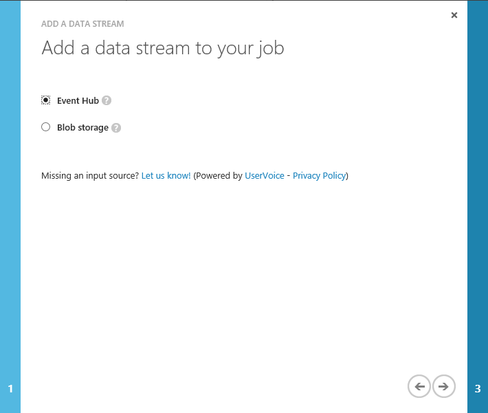

<properties
	pageTitle="向你的流分析作业添加数据输入 | Azure"
	description="了解如何通过事件中心将数据源作为流数据挂接到流分析作业，或者通过 Blob 存储挂接引用数据。"
	keywords="数据输入、流式数据"
	documentationCenter=""
	services="stream-analytics"
	authors="jeffstokes72"
	manager="paulettm"
	editor="cgronlun"
/>

<tags
	ms.service="stream-analytics"
	ms.date="05/03/2016"
	wacn.date="06/20/2016"/>

# 向流分析作业添加流数据输入或引用数据

了解如何通过事件中心将数据源作为流数据挂接到流分析作业，或者通过 Blob 存储挂接引用数据。

Azure 流分析作业可以连接到一个或多个数据输入，每个数据输入都定义了一个到现有数据源的连接。将数据发送到数据源时，流分析作业会使用该数据并将其作为流数据进行实时处理。流分析在作业订阅内外都与 [Azure 事件中心](/services/event-hubs/)和 [Azure Blob 存储](/documentation/articles/storage-dotnet-how-to-use-blobs/)进行高级集成

## 数据输入：流数据和引用数据

流分析中有两种不同类型的输入：数据流和引用数据。

- **数据流**：流分析作业须至少包含一种可供作业使用和转换的数据流输入。Azure Blob 存储和 Azure 事件中心均可作为数据流输入源。Azure 事件中心用于从连接的设备、服务和应用程序收集事件流。Azure Blob 存储可用作按流的形式引入大量数据的输入源。  
- **引用数据**：流分析支持辅助输入的另一种类型，称为引用数据。与运动的数据相反，该数据是静态的或变化缓慢。它通常用于执行查找以及与数据流关联创建更丰富的数据集。目前只支持使用 Azure Blob 存储作为引用数据的输入源。  

若要向你的流分析作业添加输入：

1. 在 Azure 门户中，单击“输入”，然后在流分析作业中单击“添加输入”。

    

2. 指定输入的类型：“数据流”或“引用数据”。

    

3. 如果创建一个数据流输入，则为该输入指定源类型。由于目前只支持 Blob 存储，在引用数据创建过程中将会跳过此步骤。

    

4. 在输入别名框中为该输入提供一个友好的名称。此名称以后会用于你的作业查询以引用该输入。

    填充所需连接属性的其余部分以连接到你的数据源。这些字段根据输入类型和源类型而变化，[此处](/documentation/articles/stream-analytics-create-a-job/)进行了详细定义。

    

5. 指定输入数据的序列化设置：
	- 要确保查询按你期望的方式进行，请指定传入数据的**事件序列化格式**。支持的序列化格式为 JSON、CSV 和 Avro。
	- 验证数据的**编码**。目前只支持 UTF-8 这种编码格式。

    

6. 输入创建完成后，流分析会验证是否可以连接到输入源。你可以在通知中心查看测试连接操作的状态。

    

## 获取有关流数据输入的帮助
如需进一步的帮助，请尝试我们的 [Azure 流分析论坛](https://social.msdn.microsoft.com/Forums/zh-cn/home?forum=AzureStreamAnalytics)

## 后续步骤

- [Azure 流分析简介](/documentation/articles/stream-analytics-introduction/)
- [Azure 流分析入门](/documentation/articles/stream-analytics-get-started/)
- [缩放 Azure 流分析作业](/documentation/articles/stream-analytics-scale-jobs/)
- [Azure 流分析查询语言参考](https://msdn.microsoft.com/zh-cn/library/azure/dn834998.aspx)
- [Azure 流分析管理 REST API 参考](https://msdn.microsoft.com/zh-cn/library/azure/dn835031.aspx)

<!---HONumber=Mooncake_0328_2016-->